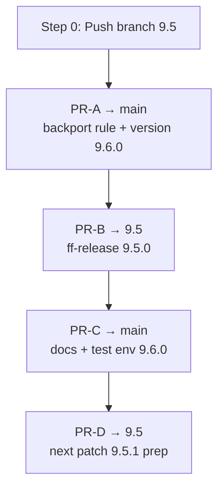

# Mage release: feature-freeze implementation plan (grouped PRs)

This document describes how to complete the Beats minor-release Mage/Go workflow
(`dev-tools/mage/release/`) so it replaces the former ingest-dev `release_scripts`
outputs **#2–#8**, with PRs **grouped by merge order** (4 PRs instead of 7).

Execute from the beats repo root. Prerequisites: Go, mage, `GITHUB_TOKEN` with
`repo` scope for non-dry-run runs.

---

## Goal

Extend `mage release:runMajorMinor` to run the **full feature-freeze minor workflow**,
producing:

- **1** release branch push
- **4** pull requests (one per merge-order step)

Example: `CURRENT_RELEASE=9.5.0`, `LATEST_RELEASE=9.4.3`, release branch `9.5`.

---

## Current state vs target

| Former output | ingest-dev | Mage today | Target |
|---------------|------------|------------|--------|
| #1 Branch push | ✅ | ✅ | ✅ |
| #2 ff-release → release branch | ✅ | ❌ | **PR-B** |
| #3 backport rule → main | ✅ | ❌ (stub) | **PR-A** |
| #4 version next minor → main | ✅ | ❌ | **PR-A** |
| #5 docs next minor → main | ✅ | ❌ | **PR-C** |
| #6 test env next minor → main | ✅ | ❌ | **PR-C** |
| #7 next patch version → release branch | ✅ | ✅ | **PR-D** |
| #8 next patch test env → release branch | ✅ | ✅ | **PR-D** |

`RunMajorMinorRelease` today only implements former #7/#8 (as two separate PRs).
This plan merges #7+#8 into **PR-D** and adds **PR-A**, **PR-B**, **PR-C**.

---

## Consolidated merge order

| Step | When | Target branch | Former outputs | Single PR |
|------|------|---------------|----------------|-----------|
| **0** | FF day | — | #1 push `9.5` | Direct push (not a PR) |
| **1** | First on `main` | `main` | #3 + #4 | **PR-A** |
| **2** | ASAP after branch | `9.5` | #2 | **PR-B** |
| **3** | After branch + images | `main` | #5 + #6 | **PR-C** |
| **4** | After release day | `9.5` | #7 + #8 | **PR-D** |



**RM merge order:**

1. Push branch `9.5`, merge **PR-A** on `main`
2. Merge **PR-B** on `9.5`
3. Merge **PR-C** on `main` (CI may stay red until Docker images exist)
4. Merge **PR-D** on `9.5` after release day

---

## PR specifications

### PR-A → `main` (merge first)

**Former:** #3 + #4  
**Branch:** `ff-prep-main-9.5.0`

| Change | Function |
|--------|----------|
| `.mergify.yml` — add `backport-9.5` rule | `UpdateMergify` |
| `libbeat/version/version.go` → `9.6.0` | `UpdateVersion` |

**Does NOT include:** docs, test env, `make update`.

| Field | Value |
|-------|-------|
| Title | `[Release] Prepare main for 9.5.0 (backport + version 9.6.0)` |
| Labels | `release`, `impact:critical`, `backport-9.5`, `skip-changelog`, `Team:Automation`, `merge:1-ff-day` |
| Body | Merge before release branch work is finalized. Creates `backport-9.5` label. |

**Note:** observability-dev label PR may still be needed separately (out of scope).

---

### PR-B → `9.5` (merge ASAP after branch push)

**Former:** #2  
**Branch:** `ff-release-9.5.0`

| Change | Function |
|--------|----------|
| `libbeat/version/version.go` → `9.5.0` | `UpdateVersion` |
| Docs metadata, K8s manifests, README | `UpdateDocsWithOptions` (`DocBranch=main`) |
| Test env for current release | `UpdateTestEnv(LATEST_RELEASE, 9.5.0)` |
| Generated files | `RunMakeUpdate` |

| Field | Value |
|-------|-------|
| Title | `ff-release: update versions 9.5.0` |
| Labels | `release`, `docs`, `in progress`, `skip-changelog`, `Team:Automation`, `merge:2-after-branch` |
| Body | Merge as soon as `9.5` branch exists. |

Use a single squash commit.

---

### PR-C → `main` (merge after branch exists)

**Former:** #5 + #6  
**Branch:** `ff-prep-main-docs-env-9.6.0`

| Change | Function |
|--------|----------|
| `libbeat/docs/version.asciidoc`, metricbeat/filebeat/auditbeat K8s | `UpdateDocsWithOptions` (`Current=9.6.0`, `Base=main`, `Release=main`, `DocBranch=main`) |
| `testing/environments/latest.yml`, compose files | `UpdateTestEnv(LATEST_RELEASE, 9.6.0)` |

**Does NOT include:** `version.go` (already in PR-A), README (RELEASE=main → no-op), heartbeat, `make update`.

| Field | Value |
|-------|-------|
| Title | `[Release] Update docs and test env for 9.6.0` |
| Labels | `release`, `docs`, `in progress`, `backport-9.5`, `skip-changelog`, `Team:Automation`, `merge:3-after-images` |
| Body | Merge after `9.5` branch is created. CI may stay red until Docker images exist. |

---

### PR-D → `9.5` (merge after release day)

**Former:** #7 + #8  
**Branch:** `ff-prep-next-patch-9.5.1`

| Change | Function |
|--------|----------|
| `libbeat/version/version.go` → `9.5.1` | `UpdateVersion` |
| Generated files (usually no-op) | `RunMakeUpdate` |
| Test env for next patch | `UpdateTestEnv(9.5.0, 9.5.1)` |

**Does NOT include:** `UpdateStackVersion` / docs (matches prepare-next-release + elasticmachine PRs).

| Field | Value |
|-------|-------|
| Title | `[Release] Prepare 9.5 for 9.5.1 (version + test env)` |
| Labels | `release`, `skip-changelog`, `Team:Automation`, `merge:4-after-release` |
| Body | Merge after release of `9.5.0`. |

---

## Config changes

**File:** `dev-tools/mage/release/config.go`

Add to `ReleaseConfig`:

| Field | Example (`CURRENT=9.5.0`) | Formula |
|-------|---------------------------|---------|
| `NextRelease` | `9.5.1` | patch + 1 (exists) |
| `NextProjectMinorVersion` | `9.6.0` | `major.(minor+1).0` **(new)** |
| `NextProjectMinorBranch` | `9.6` | for Mergify label naming |

```go
func inferNextProjectMinorVersion(current string) (string, error)
func inferNextProjectMinorBranch(current string) string
```

Env overrides: `NEXT_PROJECT_MINOR_VERSION`, `LATEST_RELEASE`, `NEXT_RELEASE`.

**Validation for minor FF (`patch == 0`):**

- `LATEST_RELEASE` is **required**
- Block 6.x / 7.x / 8.x minor releases (existing `checkRequirements`)

---

## Fix `UpdateDocsWithOptions` (blocks PR-B and PR-C)

**File:** `dev-tools/mage/release/release.go`

**Problem:** Go remaps `BaseBranch=main` to `DocBranch=ReleaseBranch`. ingest-dev
`update-docs` sets `:doc-branch:` to `BASE` (`main`) for 9.x cumulative docs.

**Change:** add explicit `DocBranch` to `DocsUpdateOptions`:

```go
type DocsUpdateOptions struct {
    BaseBranch     string
    CurrentVersion string
    ReleaseBranch  string
    DocBranch      string // if empty, infer per workflow
}
```

| PR | DocBranch |
|----|-----------|
| PR-B | `main` |
| PR-C | `main` |

Optionally add doc URL rewrites (`# Docs: https://www.elastic.co/guide/...`) only if
grep shows remaining references in the repo.

---

## Implement `UpdateMergify` (PR-A)

**File:** `dev-tools/mage/release/mergify.go`

Replace stub with logic mirroring ingest-dev `update-mergify`:

1. Parse `.mergify.yml` (prefer `yaml.Node` for round-trip if needed)
2. Append rule:

```yaml
- name: backport patches to 9.5 branch
  conditions:
    - merged
    - label=backport-9.5
  actions:
    backport:
      branches:
        - "9.5"
```

3. Idempotent: skip if rule for `backport-{releaseBranch}` already exists

**Tests:** `mergify_test.go` with fixture YAML.

---

## Orchestrator refactor

**File:** `dev-tools/mage/release/workflows.go`

Replace current 2-PR `RunMajorMinorRelease` with:

```go
func RunMajorMinorRelease(cfg *ReleaseConfig) error {
    // Phase 0: create release branch from main
    repo.EnsureBranchFrom(cfg.BaseBranch, cfg.ReleaseBranch)

    // Phase 1: prepare 4 local branches (order independent; each from correct base)
    prepMainBackportAndVersion(cfg)   // PR-A: base main
    prepFFRelease(cfg)                // PR-B: base release branch
    prepMainDocsAndTestEnv(cfg)       // PR-C: base main
    prepNextPatchOnReleaseBranch(cfg) // PR-D: base release branch

    // Phase 2: push release branch, finalize 4 PRs (unless DRY_RUN)
    repo.CheckoutBranch(cfg.ReleaseBranch)
    repo.Push("origin")
    finalizePR(...) × 4
}
```

Each `prep*` function:

1. `EnsureBranchFrom(base, branchName)` — **main-targeting branches must branch from
   current `main` HEAD**, not from the release branch
2. Run all updates for that group
3. Single `CommitAll` with descriptive message

Reuse existing `finalizePR` for idempotent push + PR creation.

Remove the old separate `update-version-next-*` and `update-testing-env-next-*`
two-PR flow; fold into **PR-D**.

---

## Mage targets

**File:** `magefile.go`

| Target | Scope |
|--------|-------|
| `release:runMajorMinor` | Full FF: push branch + 4 PRs |
| `release:runPatch` | Patch: 2 PRs (before-build version+docs+env, next-patch) |
| `release:runChangelog` | Unchanged |

Update `dev-tools/mage/release/README.md` with the 4-PR merge-order table and
correct description (not "prepare-next-release only").

---

## Tests

| File | Cases |
|------|-------|
| `config_test.go` | `9.5.0` → `NextProjectMinor=9.6.0`, `NextRelease=9.5.1`; `LATEST_RELEASE` required for minors |
| `mergify_test.go` | append rule, idempotent re-run |
| `release_test.go` | `DocBranch` for PR-B vs PR-C |
| `workflows_test.go` | DRY_RUN creates exactly 4 prep branches + release branch |

Target: >60% package coverage; orchestrator branch naming ≥80%.

---

## File change summary

| File | Changes |
|------|---------|
| `config.go` | `NextProjectMinorVersion`, validation |
| `release.go` | `DocBranch` in `DocsUpdateOptions` |
| `mergify.go` | full `UpdateMergify` |
| `workflows.go` | 4 `prep*` functions + orchestrator; remove old 2-PR major/minor |
| `mergify_test.go` | new |
| `workflows_test.go` | new / extend |
| `README.md` | 4-PR merge order, `LATEST_RELEASE` requirement |
| `magefile.go` | comment updates |

Estimated scope: ~500–700 LOC including tests.

---

## Implementation order

1. `inferNextProjectMinorVersion` + `LATEST_RELEASE` validation (`config.go`)
2. `DocBranch` fix (`release.go` + tests)
3. `UpdateMergify` + `mergify_test.go`
4. `prepMainBackportAndVersion` → PR-A
5. `prepFFRelease` → PR-B
6. `prepMainDocsAndTestEnv` → PR-C
7. `prepNextPatchOnReleaseBranch` → PR-D (refactor from existing #7/#8 logic)
8. Wire `RunMajorMinorRelease` orchestrator
9. Update README; dry-run on fork: `PROJECT_OWNER=<user> DRY_RUN=true mage release:runMajorMinor`

---

## Risks

| Risk | Mitigation |
|------|------------|
| Larger PRs harder to review | Clear title/body listing merged former outputs |
| `main` already at next minor when FF runs | Document FF timing; optional version skew warning |
| `make update` slow/flaky | Only in PR-B and PR-D (match ingest-dev) |
| Mergify YAML round-trip | Use `yaml.Node` or append-as-text if parser loses formatting |
| PR-C red until images exist | Document in PR body (same as before) |
| observability-dev labels | Manual step; document in README |

---

## Dry-run example

```bash
export CURRENT_RELEASE="9.5.0"
export LATEST_RELEASE="9.4.3"
export GITHUB_TOKEN="ghp_..."   # optional in DRY_RUN
export DRY_RUN=true

mage release:runMajorMinor
```

Verify locally:

```bash
git branch | grep -E 'ff-prep|ff-release|9\.5'
git log --oneline -5   # per branch after checkout
```

---

## Comparison: ingest-dev vs grouped Mage plan

| Merge step | ingest-dev PRs | Grouped Mage |
|------------|----------------|--------------|
| 1 — `main` first | #3 + #4 (2) | **PR-A** (1) |
| 2 — release branch ff | #2 (1) | **PR-B** (1) |
| 3 — `main` docs/env | #5 + #6 (2) | **PR-C** (1) |
| 4 — release branch patch prep | #7 + #8 (2) | **PR-D** (1) |
| **Total PRs** | **7** | **4** |

---

## Reference: ingest-dev sources

- `elastic/ingest-dev/release_scripts/beats.mak` — `prepare-major-minor-release`,
  `prepare-next-dev-minor`, `prepare-backport-next`, `prepare-next-release`
- Former mapping doc: conversation context (outputs #1–#11)

---

## Out of scope

- ingest-dev checklist issue / Slack notifications
- `beats-version-bump` Buildkite pipeline
- `release-notes.yml` / `elastic-agent-changelog-tool` (use `release:runChangelog` or GH workflow separately)
- DRA packaging (`beats-packaging-pipeline`)
- Kerberos Dockerfile in `UpdateTestEnv` (Makefile listed it, but former elasticmachine PRs never changed it)
