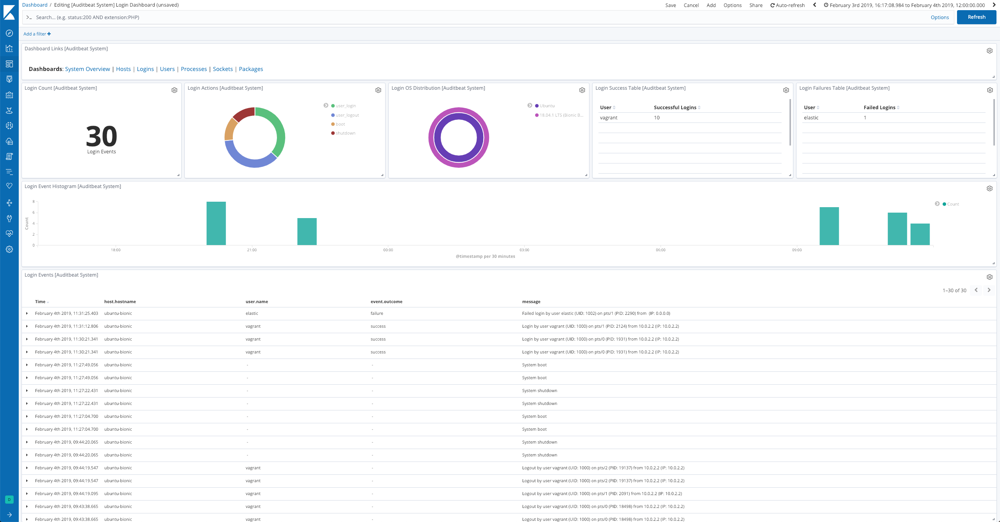

---
mapped_pages:
  - https://www.elastic.co/guide/en/beats/auditbeat/current/auditbeat-dataset-system-login.html
---

# System login dataset [auditbeat-dataset-system-login]

::::{warning}
This functionality is in beta and is subject to change. The design and code is less mature than official GA features and is being provided as-is with no warranties. Beta features are not subject to the support SLA of official GA features.
::::


This is the `login` dataset of the system module.


## Implementation [_implementation]

The `login` dataset is implemented for Linux only.

On Linux, the dataset reads the [utmp](https://en.wikipedia.org/wiki/Utmp) files that keep track of logins and logouts to the system. They are usually located at `/var/log/wtmp` (successful logins) and `/var/log/btmp` (failed logins).

The file patterns used to locate the files can be configured using `login.wtmp_file_pattern` and `login.btmp_file_pattern`. By default, both the current files and any rotated files (e.g. `wtmp.1`, `wtmp.2`) are read.

utmp files are binary, but you can display their contents using the `utmpdump` utility.


### Example dashboard [_example_dashboard_3]

The dataset comes with a sample dashboard:

% TO DO: Use `:class: screenshot`


## Fields [_fields_4]

For a description of each field in the dataset, see the [exported fields](/reference/auditbeat/exported-fields-system.md) section.

Here is an example document generated by this dataset:

```json
{
    "@timestamp": "2017-10-12T08:05:34.853Z",
    "event": {
        "action": "user_login",
        "category": "authentication",
        "dataset": "login",
        "kind": "event",
        "module": "system",
        "origin": "/var/log/wtmp",
        "outcome": "success",
        "type": "authentication_success"
    },
    "message": "Login by user vagrant (UID: 1000) on pts/2 (PID: 14962) from 10.0.2.2 (IP: 10.0.2.2)",
    "process": {
        "pid": 14962
    },
    "service": {
        "type": "system"
    },
    "source": {
        "ip": "10.0.2.2"
    },
    "user": {
        "id": 1000,
        "name": "vagrant",
        "terminal": "pts/2"
    }
}
```


