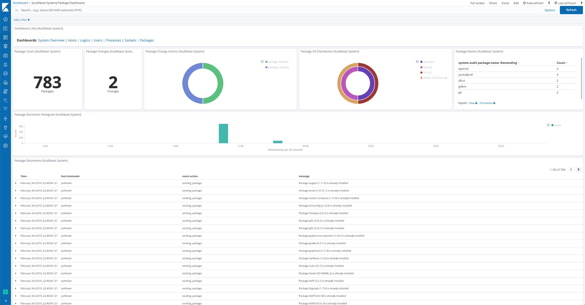

---
mapped_pages:
  - https://www.elastic.co/guide/en/beats/auditbeat/current/auditbeat-dataset-system-package.html
applies_to:
  stack: beta
  serverless: beta
---

% This file is generated! See auditbeat/scripts/mage/docs.go

# System package dataset [auditbeat-dataset-system-package]

This is the `package` dataset of the system module.

It is implemented for Linux distributions using dpkg or rpm as their package manager, and for Homebrew on macOS (Darwin).


## Required privileges [_required_privileges_package]

Privilege requirements depend on the package manager in use.

**dpkg (Debian/Ubuntu)**
:   No elevated privileges are required. The dpkg database at `/var/lib/dpkg` is world-readable.

**RPM (RHEL/CentOS/SUSE)**
:   The RPM library may attempt to write lock files to the RPM database, which typically requires root. To avoid this, configure `package.rpm_drop_to_uid` with a non-root UID. Auditbeat will use `setreuid` to switch to that UID before querying the RPM database, preventing unintended writes.

    ```yaml
    - module: system
      datasets: [package]
      package.rpm_drop_to_uid: 1000  # UID to drop to before RPM queries
    ```

**Homebrew (macOS)**
:   No elevated privileges are required. Homebrew metadata is readable by the current user.

**Docker**
:   To report packages installed on the host rather than inside the container, mount the relevant package database paths from the host:

    ```sh
    # dpkg
    docker run -v /var/lib/dpkg:/var/lib/dpkg:ro ...

    # RPM
    docker run -v /var/lib/rpm:/var/lib/rpm:ro ...
    ```


### Example dashboard [_example_dashboard_4]

The dataset comes with a sample dashboard:

% TO DO: Use `:class: screenshot`


## Fields [_fields]

For a description of each field in the dataset, see the [exported fields](/reference/auditbeat/exported-fields-system.md) section.

Here is an example document generated by this dataset:

```json
{
    "@timestamp": "2017-10-12T08:05:34.853Z",
    "event": {
        "action": "existing_package",
        "category": [
            "package"
        ],
        "dataset": "package",
        "id": "6bed65c5-9797-4fb7-9ec7-2d1873c54371",
        "kind": "state",
        "module": "system",
        "type": [
            "info"
        ]
    },
    "message": "Package zstd (1.5.4) is already installed",
    "package": {
        "description": "Zstandard is a real-time compression algorithm",
        "installed": "2023-02-15T20:40:24.390086982-05:00",
        "name": "zstd",
        "reference": "https://facebook.github.io/zstd/",
        "type": "brew",
        "version": "1.5.4"
    },
    "service": {
        "type": "system"
    },
    "system": {
        "audit": {
            "package": {
                "entity_id": "SxYD3ZMh/Ym0lBIk",
                "installtime": "2023-02-15T20:40:24.390086982-05:00",
                "name": "zstd",
                "summary": "Zstandard is a real-time compression algorithm",
                "url": "https://facebook.github.io/zstd/",
                "version": "1.5.4"
            }
        }
    }
}
```
