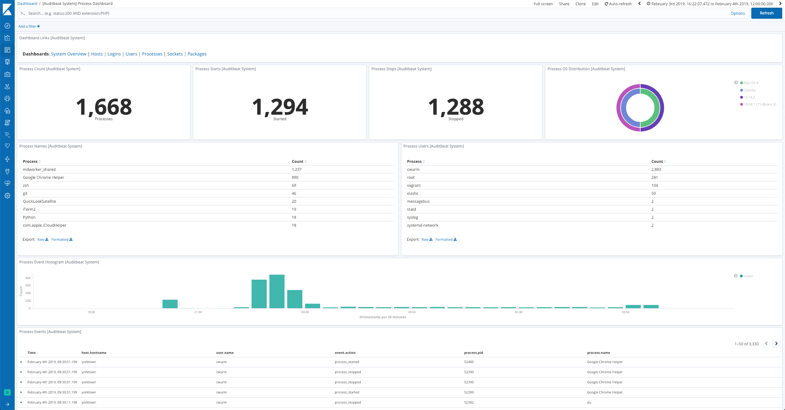

---
mapped_pages:
  - https://www.elastic.co/guide/en/beats/auditbeat/current/auditbeat-dataset-system-process.html
---

# System process dataset [auditbeat-dataset-system-process]

::::{warning}
This functionality is in beta and is subject to change. The design and code is less mature than official GA features and is being provided as-is with no warranties. Beta features are not subject to the support SLA of official GA features.
::::


This is the `process` dataset of the system module. It generates an event when a process starts and stops.

It is implemented for Linux, macOS (Darwin), and Windows.


## Configuration options [_configuration_options_20]

**`process.state.period`**
:   The interval at which the dataset sends full state information. If set this will take precedence over `state.period`. The default value is `12h`.

**`process.hash.max_file_size`**
:   The maximum size of a file in bytes for which Auditbeat will compute hashes. Files larger than this size will not be hashed. The default value is 100 MiB. For convenience units can be specified as a suffix to the value. The supported units are `b` (default), `kib`, `kb`, `mib`, `mb`, `gib`, `gb`, `tib`, `tb`, `pib`, `pb`, `eib`, and `eb`.

**`process.hash.hash_types`**
:   A list of hash types to compute when the file changes. The supported hash types are `blake2b_256`, `blake2b_384`, `blake2b_512`, `md5`, `sha1`, `sha224`, `sha256`, `sha384`, `sha512`, `sha512_224`, `sha512_256`, `sha3_224`, `sha3_256`, `sha3_384`, `sha3_512`, and `xxh64`. The default value is `sha1`.


### Example dashboard [_example_dashboard_5]

The dataset comes with a sample dashboard:

% TO DO: Use `:class: screenshot`


## Fields [_fields_6]

For a description of each field in the dataset, see the [exported fields](/reference/auditbeat/exported-fields-system.md) section.

Here is an example document generated by this dataset:

```json
{
    "@timestamp": "2017-10-12T08:05:34.853Z",
    "event": {
        "action": "process_stopped",
        "dataset": "process",
        "kind": "event",
        "module": "system"
    },
    "message": "Process zsh (PID: 9086) by user elastic STOPPED",
    "process": {
        "args": [
            "zsh"
        ],
        "entity_id": "+fYshazplsMYlr0y",
        "executable": "/bin/zsh",
        "hash": {
            "sha1": "33646536613061316366353134643135613631643363383733653261373130393737633131303364"
        },
        "name": "zsh",
        "pid": 9086,
        "ppid": 9085,
        "start": "2019-01-01T00:00:01Z",
        "working_directory": "/home/elastic"
    },
    "service": {
        "type": "system"
    },
    "user": {
        "effective": {
            "group": {
                "id": "1000"
            },
            "id": "1000"
        },
        "group": {
            "id": "1000",
            "name": "elastic"
        },
        "id": "1000",
        "name": "elastic",
        "saved": {
            "group": {
                "id": "1000"
            },
            "id": "1000"
        }
    }
}
```


