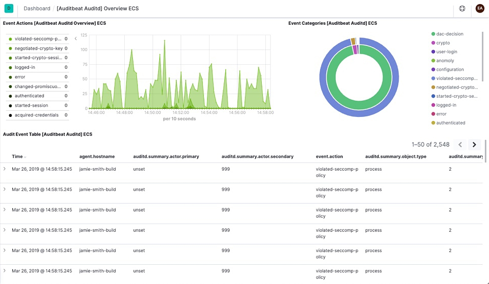

# Auditbeat quick start: installation and configuration [auditbeat-installation-configuration]


This guide describes how to get started quickly with audit data collection. You’ll learn how to:

* install Auditbeat on each system you want to monitor
* specify the location of your audit data
* parse log data into fields and send it to {{es}}
* visualize the log data in {{kib}}

% TO DO: Update `:class: screenshot`


## Before you begin [_before_you_begin]

You need {{es}} for storing and searching your data, and {{kib}} for visualizing and managing it.

:::::::{tab-set}
:group: deployment

::::::{tab-item} {{ech}}
:sync: hosted
To get started quickly, spin up an [{{ech}}](https://www.elastic.co/cloud?page=docs&placement=docs-body) deployment. {{ech}} is available on AWS, GCP, and Azure. [Try it out for free](https://cloud.elastic.co/registration?page=docs&placement=docs-body).
::::::

::::::{tab-item} Self-managed
:sync: self
To install and run {{es}} and {{kib}}, see [Installing the {{stack}}](docs-content://deploy-manage/deploy/self-managed/installing-elasticsearch.md).
::::::

:::::::

## Step 1: Install Auditbeat [install]

Install Auditbeat on all the servers you want to monitor.

To download and install Auditbeat, use the commands that work with your system:

:::::::{tab-set}
:group: platform

::::::{tab-item} DEB
:sync: deb
```shell subs=true
curl -L -O https://artifacts.elastic.co/downloads/beats/auditbeat/auditbeat-{{stack-version}}-amd64.deb
sudo dpkg -i auditbeat-{{stack-version}}-amd64.deb
```
::::::

::::::{tab-item} RPM
:sync: rpm
```shell subs=true
curl -L -O https://artifacts.elastic.co/downloads/beats/auditbeat/auditbeat-{{stack-version}}-x86_64.rpm
sudo rpm -vi auditbeat-{{stack-version}}-x86_64.rpm
```
::::::

::::::{tab-item} MacOS
:sync: macos
```shell subs=true
curl -L -O https://artifacts.elastic.co/downloads/beats/auditbeat/auditbeat-{{stack-version}}-darwin-x86_64.tar.gz
tar xzvf auditbeat-{{stack-version}}-darwin-x86_64.tar.gz
```
::::::

::::::{tab-item} Linux
:sync: linux
```shell subs=true
curl -L -O https://artifacts.elastic.co/downloads/beats/auditbeat/auditbeat-{{stack-version}}-linux-x86_64.tar.gz
tar xzvf auditbeat-{{stack-version}}-linux-x86_64.tar.gz
```
::::::

::::::{tab-item} Windows
:sync: windows
1. Download the [Auditbeat Windows zip file](https://artifacts.elastic.co/downloads/beats/auditbeat/auditbeat-{{stack-version}}-windows-x86_64.zip).

2. Extract the contents of the zip file into `C:\Program Files`.

3. Rename the `auditbeat-[version]-windows-x86_64` directory to `Auditbeat`.

4. Open a PowerShell prompt as an Administrator (right-click the PowerShell icon and select *Run As Administrator*).

5. From the PowerShell prompt, run the following commands to install Auditbeat as a Windows service:

  ```shell subs=true
  PS > cd 'C:\Program Files\Auditbeat'
  PS C:\Program Files\Auditbeat> .\install-service-auditbeat.ps1
  ```

:::{note}
If script execution is disabled on your system, you need to set the execution policy for the current session to allow the script to run. For example: `PowerShell.exe -ExecutionPolicy UnRestricted -File .\install-service-auditbeat.ps1`.
:::
::::::
:::::::

The commands shown are for AMD platforms, but ARM packages are also available. Refer to the [download page](https://www.elastic.co/downloads/beats/auditbeat) for the full list of available packages.


### Other installation options [other-installation-options]

* [APT or YUM](/reference/auditbeat/setup-repositories.md)
* [Download page](https://www.elastic.co/downloads/beats/auditbeat)
* [Docker](/reference/auditbeat/running-on-docker.md)
* [Kubernetes](/reference/auditbeat/running-on-kubernetes.md)


## Step 2: Connect to the {{stack}} [set-connection]

Connections to {{es}} and {{kib}} are required to set up Auditbeat.

Set the connection information in `auditbeat.yml`. To locate this configuration file, see [Directory layout](/reference/auditbeat/directory-layout.md).

:::::::{tab-set}
:group: deployment

::::::{tab-item} {{ech}}
:sync: hosted
Specify the [cloud.id](/reference/auditbeat/configure-cloud-id.md) of your {{ech}} deployment, and set [cloud.auth](/reference/auditbeat/configure-cloud-id.md) to a user who is authorized to set up Auditbeat. For example:

```yaml
cloud.id: "staging:dXMtZWFzdC0xLmF3cy5mb3VuZC5pbyRjZWM2ZjI2MWE3NGJmMjRjZTMzYmI4ODExYjg0Mjk0ZiRjNmMyY2E2ZDA0MjI0OWFmMGNjN2Q3YTllOTYyNTc0Mw=="
cloud.auth: "auditbeat_setup:YOUR_PASSWORD" <1>
```

1. This examples shows a hard-coded password, but you should store sensitive values in the [secrets keystore](/reference/auditbeat/keystore.md).
::::::

::::::{tab-item} Self-managed
:sync: self
1. Set the host and port where Auditbeat can find the {{es}} installation, and set the username and password of a user who is authorized to set up Auditbeat. For example:

    ```yaml
    output.elasticsearch:
      hosts: ["https://myEShost:9200"]
      username: "auditbeat_internal"
      password: "YOUR_PASSWORD" <1>
      ssl:
        enabled: true
        ca_trusted_fingerprint: "b9a10bbe64ee9826abeda6546fc988c8bf798b41957c33d05db736716513dc9c" <2>
    ```

    1. This example shows a hard-coded password, but you should store sensitive values in the [secrets keystore](/reference/auditbeat/keystore.md).
    2. This example shows a hard-coded fingerprint, but you should store sensitive values in the [secrets keystore](/reference/auditbeat/keystore.md). The fingerprint is a HEX encoded SHA-256 of a CA certificate, when you start {{es}} for the first time, security features such as network encryption (TLS) for {{es}} are enabled by default. If you are using the self-signed certificate generated by {{es}} when it is started for the first time, you will need to add its fingerprint here. The fingerprint is printed on {{es}} start up logs, or you can refer to [connect clients to {{es}} documentation](docs-content://deploy-manage/security/security-certificates-keys.md#_connect_clients_to_es_5) for other options on retrieving it. If you are providing your own SSL certificate to {{es}} refer to [Auditbeat documentation on how to setup SSL](/reference/auditbeat/configuration-ssl.md#ssl-client-config).

2. If you plan to use our pre-built {{kib}} dashboards, configure the {{kib}} endpoint. Skip this step if {{kib}} is running on the same host as {{es}}.

    ```yaml
      setup.kibana:
        host: "mykibanahost:5601" <1>
        username: "my_kibana_user" <2> <3>
        password: "YOUR_PASSWORD"
    ```

    1. The hostname and port of the machine where {{kib}} is running, for example, `mykibanahost:5601`. If you specify a path after the port number, include the scheme and port: `http://mykibanahost:5601/path`.
    2. The `username` and `password` settings for {{kib}} are optional. If you don’t specify credentials for {{kib}}, Auditbeat uses the `username` and `password` specified for the {{es}} output.
    3. To use the pre-built {{kib}} dashboards, this user must be authorized to view dashboards or have the `kibana_admin` [built-in role](elasticsearch://reference/elasticsearch/roles.md).

::::::
:::::::

To learn more about required roles and privileges, see [*Grant users access to secured resources*](/reference/auditbeat/feature-roles.md).

::::{note}
You can send data to other [outputs](/reference/auditbeat/configuring-output.md), such as {{ls}}, but that requires additional configuration and setup.
::::

## Step 3: Configure data collection modules [enable-modules]

Auditbeat uses [modules](/reference/auditbeat/auditbeat-modules.md) to collect audit information.

By default, Auditbeat uses a configuration that’s tailored to the operating system where Auditbeat is running.

To use a different configuration, change the module settings in `auditbeat.yml`.

The following example shows the `file_integrity` module configured to generate events whenever a file in one of the specified paths changes on disk:

```sh
auditbeat.modules:

- module: file_integrity
  paths:
  - /bin
  - /usr/bin
  - /sbin
  - /usr/sbin
  - /etc
```

::::{tip}
To test your configuration file, change to the directory where the Auditbeat binary is installed, and run Auditbeat in the foreground with the following options specified: `./auditbeat test config -e`. Make sure your config files are in the path expected by Auditbeat (see [Directory layout](/reference/auditbeat/directory-layout.md)), or use the `-c` flag to specify the path to the config file.
::::


For more information about configuring Auditbeat, also see:

* [Configure Auditbeat](/reference/auditbeat/configuring-howto-auditbeat.md)
* [Config file format](/reference/libbeat/config-file-format.md)
* [`auditbeat.reference.yml`](/reference/auditbeat/auditbeat-reference-yml.md): This reference configuration file shows all non-deprecated options. You’ll find it in the same location as `auditbeat.yml`.


## Step 4: Set up assets [setup-assets]

Auditbeat comes with predefined assets for parsing, indexing, and visualizing your data. To load these assets:

1. Make sure the user specified in `auditbeat.yml` is [authorized to set up Auditbeat](/reference/auditbeat/privileges-to-setup-beats.md).
2. From the installation directory, run:

    :::::::{tab-set}
    :group: platform

    ::::::{tab-item} DEB
    :sync: deb
    ```sh
    auditbeat setup -e
    ```
    ::::::

    ::::::{tab-item} RPM
    :sync: rpm
    ```sh
    auditbeat setup -e
    ```
    ::::::

    ::::::{tab-item} MacOS
    :sync: macos
    ```sh
    ./auditbeat setup -e
    ```
    ::::::

    ::::::{tab-item} Linux
    :sync: linux
    ```sh
    ./auditbeat setup -e
    ```
    ::::::

    ::::::{tab-item} Windows
    :sync: windows
    ```sh
    PS > .\auditbeat.exe setup -e
    ```
    ::::::
    :::::::

    `-e` is optional and sends output to standard error instead of the configured log output.

This step loads the recommended [index template](docs-content://manage-data/data-store/templates.md) for writing to {{es}} and deploys the sample dashboards for visualizing the data in {{kib}}.

:::{tip}
A connection to {{es}} (or {{ech}}) is required to set up the initial environment. If you're using a different output, such as {{ls}}, see [](/reference/auditbeat/auditbeat-template.md#load-template-manually) and [](/reference/auditbeat/load-kibana-dashboards.md).
:::

## Step 5: Start Auditbeat [start]

Before starting Auditbeat, modify the user credentials in `auditbeat.yml` and specify a user who is [authorized to publish events](/reference/auditbeat/privileges-to-publish-events.md).

To start Auditbeat, run:

:::::::{tab-set}
:group: platform

::::::{tab-item} DEB
:sync: deb
```sh
sudo service auditbeat start
```

:::{note}
If you use an `init.d` script to start Auditbeat, you can’t specify command line flags (see [Command reference](/reference/filebeat/command-line-options.md)). To specify flags, start Auditbeat in the foreground.
:::

Also see [Auditbeat and systemd](/reference/auditbeat/running-with-systemd.md).
::::::

::::::{tab-item} RPM
:sync: rpm
```sh
sudo service auditbeat start
```

:::{note}
If you use an `init.d` script to start Auditbeat, you can’t specify command line flags (see [Command reference](/reference/filebeat/command-line-options.md)). To specify flags, start Auditbeat in the foreground.
:::

Also see [Auditbeat and systemd](/reference/auditbeat/running-with-systemd.md).
::::::

::::::{tab-item} MacOS
:sync: macos
```sh
sudo chown root auditbeat.yml <1>
sudo ./auditbeat -e
```

1. You’ll be running Auditbeat as root, so you need to change ownership of the configuration file, or run Auditbeat with `--strict.perms=false` specified. See [Config File Ownership and Permissions](/reference/libbeat/config-file-permissions.md).
::::::

::::::{tab-item} Linux
:sync: linux
```sh
sudo chown root auditbeat.yml <1>
sudo ./auditbeat -e
```

1. You’ll be running Auditbeat as root, so you need to change ownership of the configuration file, or run Auditbeat with `--strict.perms=false` specified. See [Config File Ownership and Permissions](/reference/libbeat/config-file-permissions.md).
::::::

::::::{tab-item} Windows
:sync: windows
```sh
PS C:\Program Files\auditbeat> Start-Service auditbeat
```

By default, Windows log files are stored in `C:\ProgramData\auditbeat\Logs`.
::::::

:::::::

Auditbeat should begin streaming events to {{es}}.

If you see a warning about too many open files, you need to increase the `ulimit`. See the [FAQ](/reference/auditbeat/ulimit.md) for more details.


## Step 6: View your data in {{kib}} [view-data]

To make it easier for you to start auditing the activities of users and processes on your system, Auditbeat comes with pre-built {{kib}} dashboards and UIs for visualizing your data.

To open the dashboards:

1. Launch {{kib}}:

    :::::::{tab-set}
    :group: deployment

    ::::::{tab-item} {{ech}}
    :sync: hosted
    1. [Log in](https://cloud.elastic.co/) to your {{ecloud}} account.
    2. Navigate to the {{kib}} endpoint in your deployment.
    ::::::

    ::::::{tab-item} Self-managed
    :sync: self
    Point your browser to [http://localhost:5601](http://localhost:5601), replacing `localhost` with the name of the {{kib}} host.
    ::::::

    :::::::

2. In the side navigation, click **Discover**. To see Auditbeat data, make sure the predefined `auditbeat-*` data view is selected.

    ::::{tip}
    If you don’t see data in {{kib}}, try changing the time filter to a larger range. By default, {{kib}} shows the last 15 minutes.
    ::::

3. In the side navigation, click **Dashboard**, then select the dashboard that you want to open.

The dashboards are provided as examples. We recommend that you [customize](docs-content://explore-analyze/dashboards.md) them to meet your needs.


## What’s next? [_whats_next]

Now that you have audit data streaming into {{es}}, learn how to unify your logs, metrics, uptime, and application performance data.

1. Ingest data from other sources by installing and configuring other Elastic {{beats}}:

    | Elastic {{beats}} | To capture |
    | --- | --- |
    | [{{metricbeat}}](/reference/metricbeat/metricbeat-installation-configuration.md) | Infrastructure metrics |
    | [{{filebeat}}](/reference/filebeat/filebeat-installation-configuration.md) | Logs |
    | [{{winlogbeat}}](/reference/winlogbeat/winlogbeat-installation-configuration.md) | Windows event logs |
    | [{{heartbeat}}](/reference/heartbeat/heartbeat-installation-configuration.md) | Uptime information |
    | [APM](docs-content://solutions/observability/apm/index.md) | Application performance metrics |

2. Use the Observability apps in {{kib}} to search across all your data:

    | Elastic apps | Use to |
    | --- | --- |
    | [{{metrics-app}}](docs-content://solutions/observability/infra-and-hosts/analyze-infrastructure-host-metrics.md) | Explore metrics about systems and services across your ecosystem |
    | [{{logs-app}}](docs-content://solutions/observability/logs/explore-logs.md) | Tail related log data in real time |
    | [{{uptime-app}}](docs-content://solutions/observability/synthetics/index.md#monitoring-uptime) | Monitor availability issues across your apps and services |
    | [APM app](docs-content://solutions/observability/apm/overviews.md) | Monitor application performance |
    | [{{siem-app}}](docs-content://solutions/security.md) | Analyze security events |


