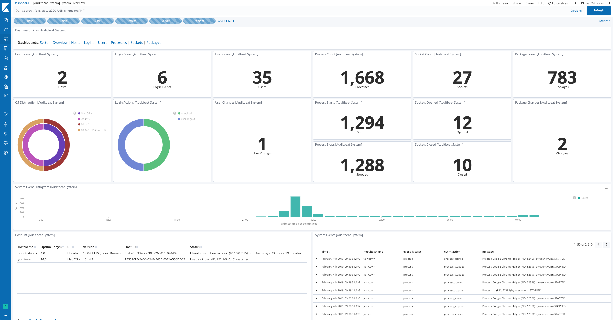

---
mapped_pages:
  - https://www.elastic.co/guide/en/beats/auditbeat/current/auditbeat-module-system.html
---

# System Module [auditbeat-module-system]

::::{warning}
This functionality is in beta and is subject to change. The design and code is less mature than official GA features and is being provided as-is with no warranties. Beta features are not subject to the support SLA of official GA features.
::::


The `system` module collects various security related information about a system. All datasets send both periodic state information (e.g. all currently running processes) and real-time changes (e.g. when a new process starts or stops).

The module is fully implemented for Linux on x86. Currently, the `socket` module is not available on ARM. Some datasets are also available for macOS (Darwin) and Windows.


## How it works [_how_it_works_3]

Each dataset sends two kinds of information: state and events.

State information is sent periodically and (for some datasets) on startup. A state update will consist of one event per object that is currently active on the system (e.g. a process). All events belonging to the same state update will share the same UUID in `event.id`.

The frequency of state updates can be controlled for all datasets using the `state.period` configuration option. Overrides are available per dataset. The default is `12h`.

Event information is sent as the events occur (e.g. a process starts or stops). All datasets are currently using a poll model to retrieve their data. The frequency of these polls is controlled by the `period` configuration parameter.


### Entity IDs [_entity_ids]

This module populates `entity_id` fields to uniquely identify entities (users, packages, processes…​) within a host. This requires Auditbeat to obtain a unique identifier for the host:

* Windows: Uses the `HKLM\Software\Microsoft\Cryptography\MachineGuid` registry key.
* macOS: Uses the value returned by `gethostuuid(2)` system call.
* Linux: Uses the content of one of the following files, created by either `systemd` or `dbus`:

    * /etc/machine-id
    * /var/lib/dbus/machine-id
    * /var/db/dbus/machine-id


::::{note}
Under CentOS 6.x, it’s possible that none of the files above exist. In that case, running `dbus-uuidgen --ensure` (provided by the `dbus` package) will generate one for you.
::::


### Example dashboard [_example_dashboard]

The module comes with a sample dashboard:

% TO DO: Use `:class: screenshot`



## Configuration options [_configuration_options_19]

This module has some configuration options for controlling its behavior. The following example shows all configuration options with their default values for Linux.

::::{note}
It is recommended to configure some datasets separately. See below for a sample suggested configuration.
::::


```yaml
- module: system
  datasets:
    - host
    - login
    - package
    - process
    - socket
    - user
  period: 10s
  state.period: 12h

  socket.include_localhost: false

  user.detect_password_changes: true
```

This module also supports the [standard configuration options](#module-standard-options-system) described later.

**`state.period`**
:   The interval at which the datasets send full state information. This option can be overridden per dataset using `{{dataset}}.state.period`.

**`user.detect_password_changes`**
:   If the `user` dataset is configured and this option is set to `true`, Auditbeat will read password information in `/etc/passwd` and `/etc/shadow` to detect password changes. A hash will be kept locally in the `beat.db` file to detect changes between Auditbeat restarts. The `beat.db` file should be readable only by the root user and be treated similar to the shadow file itself.


### Standard configuration options [module-standard-options-system]

You can specify the following options for any Auditbeat module.

**`module`**
:   The name of the module to run.

**`datasets`**
:   A list of datasets to execute.

**`enabled`**
:   A Boolean value that specifies whether the module is enabled.

**`period`**
:   The frequency at which the datasets check for changes. If a system is not reachable, Auditbeat returns an error for each period. This setting is required. For most datasets, especially `process` and `socket`, a shorter period is recommended.

**`fields`**
:   A dictionary of fields that will be sent with the dataset event. This setting is optional.

**`tags`**
:   A list of tags that will be sent with the dataset event. This setting is optional.

**`processors`**
:   A list of processors to apply to the data generated by the dataset.

    See [Processors](/reference/auditbeat/filtering-enhancing-data.md) for information about specifying processors in your config.


**`index`**
:   If present, this formatted string overrides the index for events from this module (for elasticsearch outputs), or sets the `raw_index` field of the event’s metadata (for other outputs). This string can only refer to the agent name and version and the event timestamp; for access to dynamic fields, use `output.elasticsearch.index` or a processor.

    Example value: `"%{[agent.name]}-myindex-%{+yyyy.MM.dd}"` might expand to `"auditbeat-myindex-2019.12.13"`.


**`keep_null`**
:   If this option is set to true, fields with `null` values will be published in the output document. By default, `keep_null` is set to `false`.

**`service.name`**
:   A name given by the user to the service the data is collected from. It can be used for example to identify information collected from nodes of different clusters with the same `service.type`.


## Suggested configuration [_suggested_configuration]

Processes and sockets can be short-lived, so the chance of missing an update increases if the polling interval is too large.

On the other hand, host and user information is unlikely to change frequently, so a longer polling interval can be used.

```yaml
- module: system
  datasets:
    - host
    - login
    - package
    - user
  period: 1m

  user.detect_password_changes: true

- module: system
  datasets:
    - process
    - socket
  period: 1s
```


## Example configuration [_example_configuration_3]

The System module supports the common configuration options that are described under [configuring Auditbeat](/reference/auditbeat/configuration-auditbeat.md). Here is an example configuration:

```yaml
auditbeat.modules:
- module: system
  datasets:
    - package # Installed, updated, and removed packages

  period: 2m # The frequency at which the datasets check for changes

- module: system
  datasets:
    - host    # General host information, e.g. uptime, IPs
    - login   # User logins, logouts, and system boots.
    - process # Started and stopped processes
    - socket  # Opened and closed sockets
    - user    # User information

  # How often datasets send state updates with the
  # current state of the system (e.g. all currently
  # running processes, all open sockets).
  state.period: 12h

  # Enabled by default. Auditbeat will read password fields in
  # /etc/passwd and /etc/shadow and store a hash locally to
  # detect any changes.
  user.detect_password_changes: true

  # File patterns of the login record files.
  login.wtmp_file_pattern: /var/log/wtmp*
  login.btmp_file_pattern: /var/log/btmp*
```


## Datasets [_datasets]

The following datasets are available:

* [host](/reference/auditbeat/auditbeat-dataset-system-host.md)
* [login](/reference/auditbeat/auditbeat-dataset-system-login.md)
* [package](/reference/auditbeat/auditbeat-dataset-system-package.md)
* [process](/reference/auditbeat/auditbeat-dataset-system-process.md)
* [socket](/reference/auditbeat/auditbeat-dataset-system-socket.md)
* [user](/reference/auditbeat/auditbeat-dataset-system-user.md)


