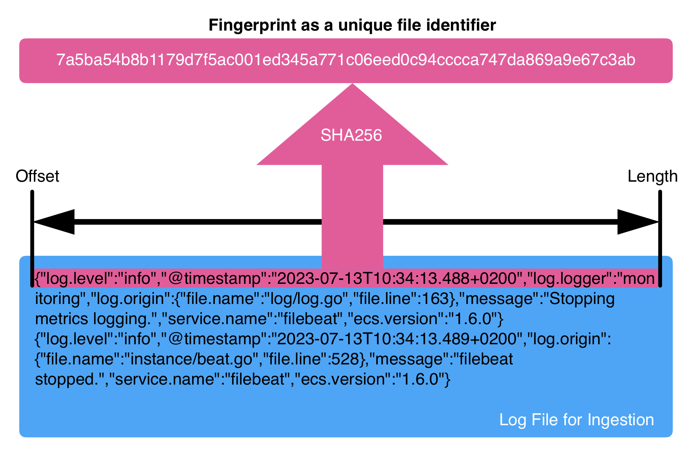

# How to choose file identity for filestream [file-identity]

## What is file identity?

File identity is how the [filestream input](/reference/filebeat/filebeat-input-filestream.md) differentiates one file from another in order to keep track of ingestion progress on each file.

Files can be renamed, moved, or replaced during ingestion and filestream must be able to handle these changes without data duplication or data loss. It's not as straightforward as it might seem.

One of the most common examples is log rotation:

* Let's assume that we just track files by their names or paths.
* Imagine that after reaching 10 MB in size, a log file `important.log` gets renamed to `important.log.old` and a new file is started in its place.
* This log rotation happens before we reach the end of file (EOF) on `important.log`.

Depending on your configuration two different things can happen:

1. If you configured to exclude `*.old` files from ingestion you would have data loss.
2. If you ingest from `*.old`, this would result in a large amount of data duplication.

Why would this happen? File names are not stable (non-changing) identifiers. This means that we cannot use names to track the progress of ingestion on each file also known as the offset. The offset on `important.log` was somewhere in the middle, for example `offset: 145400` but since the file was renamed to `important.log.old`, we detect this file as new and we start ingesting from the beginning, from `offset: 0`. Therefore we re-ingest the same data again.

Various file identities were introduced in Filebeat to remedy this problem, by using some additional file metadata to accurately track offsets in each file despite file operations applied to them.

### Why have multiple options?

File identity implementations have advantages over each other and they are optimized for a particular use-case or environment. The goal of this document is to provide a comprehensive overview to help you choose what best fits your  particular use case.

Some of the file identities are more stable but other file identities are more responsive for smaller files.

### How to change file identity?

File identity is controlled by the `file_identity` configuration [option](/reference/filebeat/filebeat-input-filestream.md#filebeat-input-filestream-file-identity) in filestream.

It's possible to try out multiple file identities during test runs and see how well each file identity works in your environment.

After changing the file identity configuration, on its next startup Filebeat tries to migrate all known file offsets from one file identity to another indicating this process in logs.

::::{important}
Filebeat supports switching only from `path` or `native` file identity to the `fingerprint` file identity. Any other switch would start ingesting files from the beginning, thereby causing data duplication.
::::

It's important to choose your file identity before the production deployment to avoid any risks related to the offset migration between file identities. For example, accidentally choosing to migrate from `fingerprint` to `native` which is not supported.

## Supported options

### Overview [file-identity-overview]

Here is the brief high-level comparison of all currently available options:

| Name | Use case | Pros | Cons |
|------|----------|------|------|
| path | Files are never moved or renamed, file names are never re-used. | Simple and fast. | The most unstable option, requires to maintain immutable file paths. |
| native (default in Filebeat < 9.0) | Stable file systems, files < 64 bytes in size, ingestion without delays. | Low CPU / memory overhead. | Might cause data duplication or data loss if the file system provides unstable `inode` or `device ID` values. No support for network shares, containers or VMs.
| inode_marker | Same as `native` but `device ID` is changing. | Same as `native` + no dependency on `device ID`. | Can still cause data duplication or data loss due to unstable `inode` values provided by the file system. Also, no support for network shares, containers or VMs. |
| fingerprint (default in Filebeat >= 9.0) | Files > 64 bytes in size (1 KB is a recommended default). Log files with unique content. | The most stable. Support for any OS, any file system, network shares, containers and VMs. | Slightly higher CPU / memory usage, does not start to ingest files before they reach the required size (1 KB by default). |

### `path`

This is the most basic file identity that uses file paths as their identifiers.

If you're completely certain that your environment does not have log rotation, that it does not ever rename or move files, then you might consider using paths as unique stable identifiers for each file. However, although this is the simplest solution, it's also the riskiest option and it's not recommended to use.

### `native`

This file identity implementation is using:

* For Unix-like systems: the `device ID` (`st_dev`, also known as a "device number") and [`inode`](https://www.man7.org/linux/man-pages/man7/inode.7.html) (`ino_t`) from the [`stat`](https://www.man7.org/linux/man-pages/man3/stat.3type.html) call. Can be viewed by using the `stat` command on any file.
* For Windows: `dwVolumeSerialNumber`, `nFileIndexLow` and `nFileIndexHigh` values from the [file handler](https://learn.microsoft.com/en-us/windows/win32/api/fileapi/ns-fileapi-by_handle_file_information).

It combines these values together into a unique file identifier.

This method is stable under normal circumstances. However, when used in some environments with uncommon file systems, on network shares, in containers or in virtualized environments, it might lead to data duplication. This happens due to the re-use of `inode` values by the file system or a change of device IDs after reboot or reconnected network.

This Bash script can demonstrate whether your file system is susceptible to the inode re-use problem:

```bash
#!/bin/bash

FILENAME=inode-test

touch $FILENAME
INODE=$(ls -i "$FILENAME")
echo "$FILENAME created with inode '$INODE'"

COPY_FILENAME="$FILENAME-copy"
cp -a $FILENAME $COPY_FILENAME
COPY_INODE=$(ls -i "$COPY_FILENAME")
echo "Copied $FILENAME->$COPY_FILENAME, the new inode for the copy '$COPY_INODE'"

rm $FILENAME
echo "$FILENAME has been deleted"

ls $FILENAME

cp -a $COPY_FILENAME $FILENAME
NEW_INODE=$(ls -i "$FILENAME")

echo "After copying $COPY_FILENAME back to $FILENAME the inode is '$NEW_INODE'"

rm $FILENAME $COPY_FILENAME
```

For example, for Mac OS on APFS you'll see something like:

```
inode-test created with inode '112076744 inode-test'
Copied inode-test->inode-test-copy, the new inode for the copy '112076745 inode-test-copy'
inode-test has been deleted
After copying inode-test-copy back to inode-test the inode is '112076746 inode-test'
```

As you can see, on APFS all three files have different inode values: 112076744, 112076745, and 112076746. So, this works as expected and creates stable identifiers.

However, if you run the same script in an Ubuntu Docker container:

```
inode-test created with inode '1715023 inode-test'
Copied inode-test->inode-test-copy, the new inode for the copy '1715026 inode-test-copy'
inode-test has been deleted
ls: cannot access 'inode-test': No such file or directory
After copying inode-test-copy back to inode-test the inode is '1715023 inode-test'
```

You can see that the file system cached the inode value from the first file, which we deleted, and reused the value for the second copy with the same filename: 1715023, 1715026, and 1715023.

Even worse, it does not even have to be the same filename; a different file can reuse the same inode:

```sh
# touch x
# ls -i x
1715023 x # inode value for the first file
# rm x
# touch y
# ls -i y
1715023 y # same inode value for the second file with a different name
```

As mentioned before, the problem of cached inode values is a common occurance in containerized environments and network shares. If you're planning to run Filebeat in such an environment, avoid using this file identity.

The `device ID` value used by this file identity can be unstable in some environments too: when using the Linux [LVM](https://en.wikipedia.org/wiki/Logical_Volume_Manager_%28Linux%29) (Logical Volume Manager), device numbers are allocated dynamically at module load (refer to [Persistent Device Numbers](https://access.redhat.com/documentation/en-us/red_hat_enterprise_linux/7/html/logical_volume_manager_administration/lv#persistent_numbers) in the Red Hat Enterprise Linux documentation).

However, this problem with device numbers (IDs) can be fixed by our next file identity option.

### `inode_marker`

Let's assume that you verified that your file system does not re-use `inode` values and it's safe to rely on them. But, you found out that the `device ID` was changing and caused Filebeat to re-ingest all the data from the beginning, causing data duplication.

This can be fixed by using a special marker file on your file system instead of asking the OS for a `device ID`.

Users specify a path by setting `file_identity.inode_marker.path`. This path leads to a file that has some short unique text that remains unchanged forever. The content of this file replaces the `device ID` in the `native` file identity. The rest remains the same as `native`.

### `fingerprint`

The most stable file identity implementation at the moment. This file identity is default since Filebeat version 9.0.

This file identity is using file fingerprints produced by the scanner component of the filestream input. Therefore, in order to activate this file identity, it's required to first activate fingerprint in the scanner by setting `prospector.scanner.fingerprint.enabled: true`.

In the context of the filestream input, fingerprint is a hash string computed from a part of the file content.



By default, the hashed part of the file is the first 1024 bytes (`offset: 0`, `length: 1024`). Most of the log files have timestamps and other unique segments on each line that make sure that the first 1024 bytes combined together constitute a unique set of characters. This makes sure that a produced fingerprint is a stable unique identifier for each file.

If necessary, it's possible to move this hashed byte range farther into the file by adjusting the `prospector.scanner.fingerprint.offset` setting. It's also possible to change the number of bytes used for hashing by adjusting `prospector.scanner.fingerprint.length` (minimum value is 64 bytes). Keep in mind that the smaller the range, the more likely it is to hit a collision, so the fingerprint (ID) is not unique anymore. If this happens, only the first file with a collided ID will be ingested.

This file identity covers most of the common use cases, it's OS-agnostic, it supports any file system including network shares, and it ensures that data duplication or data loss are avoided.

However, there is a trade off: using file identity delays ingesting data from files smaller than the required amount of bytes for computing the fingerprint.

For example, Filebeat is running a filestream input with this configuration:

```yaml
prospector.scanner.fingerprint:
  enabled: true
  offset: 32   # e.g. the first 32 bytes are always identical in every file, we skip them
  length: 1024 # strong guarantee of uniqueness
file_identity.fingerprint: ~
```

If a new log file appears, the filestream input would not "see" it until it grows to 1056 bytes (`offset`+`length`).

For some use cases, it might be a requirement to receive data as soon as possible without delays. For other use cases, files would not grow to such sizes at all and would never be ingested. It's important to consider these limitations accordingly.

The stability of this file identity makes it a recommended and default option.
