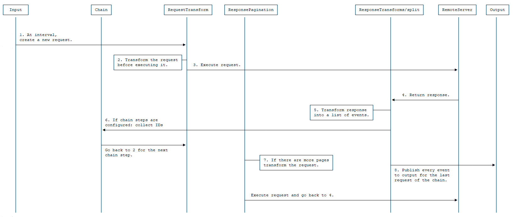
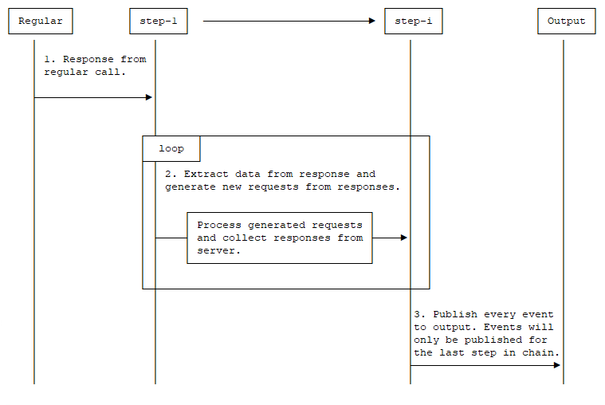

# HTTP JSON input [filebeat-input-httpjson]


Use the `httpjson` input to read messages from an HTTP API with JSON payloads.

If you are starting development of a new custom HTTP API input, we recommend that you use the [Common Expression Language input](/reference/filebeat/filebeat-input-cel.md) which provides greater flexibility and an improved developer experience.

This input supports:

* Auth

    * Basic
    * OAuth2

* Retrieval at a configurable interval
* Pagination
* Retries
* Rate limiting
* Proxying
* Request transformations
* Response transformations

Example configurations:

```yaml
filebeat.inputs:
# Fetch your public IP every minute.
- type: httpjson
  interval: 1m
  request.url: https://api.ipify.org/?format=json
  processors:
    - decode_json_fields:
        fields: ["message"]
        target: "json"
```

```yaml
filebeat.inputs:
- type: httpjson
  request.url: http://localhost:9200/_search?scroll=5m
  request.method: POST
  response.split:
    target: body.hits.hits
  response.pagination:
    - set:
        target: url.value
        value: http://localhost:9200/_search/scroll
    - set:
        target: url.params.scroll_id
        value: '[[.last_response.body._scroll_id]]'
    - set:
        target: body.scroll
        value: 5m
```

Additionally, it supports authentication via Basic auth, HTTP Headers or oauth2.

Example configurations with authentication:

```yaml
filebeat.inputs:
- type: httpjson
  request.url: http://localhost
  request.transforms:
    - set:
        target: header.Authorization
        value: 'Basic aGVsbG86d29ybGQ='
```

```yaml
filebeat.inputs:
- type: httpjson
  auth.oauth2:
    client.id: 12345678901234567890abcdef
    client.secret: abcdef12345678901234567890
    token_url: http://localhost/oauth2/token
  request.url: http://localhost
```

```yaml
filebeat.inputs:
- type: httpjson
  auth.oauth2:
    client.id: 12345678901234567890abcdef
    client.secret: abcdef12345678901234567890
    token_url: http://localhost/oauth2/token
    user: user@domain.tld
    password: P@$$W0₹D
  request.url: http://localhost
```

## Input state [input-state]

The `httpjson` input keeps a runtime state between requests. This state can be accessed by some configuration options and transforms.

The state has the following elements:

* `last_response.url.value`: The full URL with params and fragments from the last request with a successful response.
* `last_response.url.params`: A [`url.Values`](https://pkg.go.dev/net/url#Values) of the params from the URL in `last_response.url.value`.  Can be queried with the [`Get`](https://pkg.go.dev/net/url#Values.Get) function.
* `last_response.header`: A map containing the headers from the last successful response.
* `last_response.body`: A map containing the parsed JSON body from the last successful response. This is the response as it comes from the remote server.
* `last_response.page`: A number indicating the page number of the last response. It starts with the value `0` at every interval.
* `first_event`: A map representing the first event sent to the output (result from applying transforms to `last_response.body`).
* `last_event`: A map representing the last event of the current request in the requests chain (result from applying transforms to `last_response.body`).
* `url`: The last requested URL as a raw [`url.URL`](https://pkg.go.dev/net/url#URL) Go type.
* `header`: A map containing the headers. References the next request headers when used in [`request.rate_limit.early_limit`](#request-transforms-headers) or [`response.pagination`](#response-pagination) configuration sections, and to the last response headers when used in [`response.transforms`](#response-transforms), [`response.split`](#response-split), or [`request.rate_limit.limit`](#request-rate-limit) configuration sections.
* `body`: A map containing the body. References the next request body when used in [`request.rate_limit.early_limit`](#request-transforms-headers) or [`response.pagination`](#response-pagination) configuration sections, and to the last response body when used in [`response.transforms`](#response-transforms) or [`response.split`](#response-split) configuration sections.
* `cursor`: A map containing any data the user configured to be stored between restarts (See [`cursor`](#cursor)).

All of the mentioned objects are only stored at runtime during the execution of the periodic request, except `cursor`, which has values that are persisted between periodic request and restarts.


## Transforms [transforms]

A transform is an action that lets the user modify the [input state](#input-state). Depending on where the transform is defined, it will have access for reading or writing different elements of the [state](#input-state).

The access limitations are described in the corresponding configuration sections.


### `append` [_append]

Appends a value to an array. If the field does not exist, the first entry will create a new array. If the field exists, the value is appended to the existing field and converted to a list.

```yaml
- append:
    target: body.foo.bar
    value: '[[.cursor.baz]]'
    default: "a default value"
```

* `target` defines the destination field where the value is stored.
* `value` defines the value that will be stored and it is a [value template](#value-templates).
* `default` defines the fallback value whenever `value` is empty or the template parsing fails. Default templates do not have access to any state, only to functions.
* `value_type` defines the type of the resulting value. Possible values are: `string`, `json`, and `int`. Default is `string`.
* `fail_on_template_error` if set to `true` an error will be returned and the request will be aborted when the template evaluation fails. Default is `false`.
* `do_not_log_failure` if set to true a `fail_on_template_error` will not be logged except at DEBUG level. This should be used when template failure is expected in normal operation as control flow.


### `delete` [_delete]

Deletes the target field.

```yaml
- delete:
    target: body.foo.bar
```

* `target` defines the destination field to delete. If `target` is a list and not a single element, the complete list will be deleted.


### `set` [_set]

Sets a value.

```yaml
- set:
    target: body.foo.bar
    value: '[[.cursor.baz]]'
    default: "a default value"
```

* `target` defines the destination field where the value is stored.
* `value` defines the value that will be stored and it is a [value template](#value-templates).
* `default` defines the fallback value whenever `value` is empty or the template parsing fails. Default templates do not have access to any state, only to functions.
* `value_type` defines how the resulting value will be treated. Possible values are: `string`, `json`, and `int`. Default is `string`.
* `fail_on_template_error` if set to `true` an error will be returned and the request will be aborted when the template evaluation fails. Default is `false`.
* `do_not_log_failure` if set to true a `fail_on_template_error` will not be logged except at DEBUG level. This should be used when template failure is expected in normal operation as control flow.


## Value templates [value-templates]

Some configuration options and transforms can use value templates. Value templates are Go templates with access to the input state and to some built-in functions. Please note that delimiters are changed from the default `{{ }}` to `[[ ]]` to improve interoperability with other templating mechanisms.

To see which [state elements](#input-state) and operations are available, see the documentation for the option or [transform](#transforms) where you want to use a value template.

A value template looks like:

```yaml
- set:
    target: body.foo.bar
    value: '[[.cursor.baz]] more data'
    default: "a default value"
```

The content inside the brackets `[[` `]]` is evaluated. For more information on Go templates please refer to [the Go docs](https://golang.org/pkg/text/template).

Some built-in helper functions are provided to work with the input state inside value templates:

* `add`: adds a list of integers and returns their sum.
* `base64DecodeNoPad`: Decodes the base64 string without padding. Any binary output will be converted to a UTF8 string.
* `base64Decode`: Decodes the base64 string. Any binary output will be converted to a UTF8 string.
* `base64EncodeNoPad`: Joins and base64 encodes all supplied strings without padding. Example `[[base64EncodeNoPad "string1" "string2"]]`
* `base64Encode`: Joins and base64 encodes all supplied strings. Example `[[base64Encode "string1" "string2"]]`
* `beatInfo`: returns a map containing information about the Beat.  Available keys in the map are `goos` (running operating system), `goarch` (running system architecture), `commit` (git commit of current build), `buildtime` (compile time of current build), `version` (version of current build). Example: `[[ beatInfo.version ]]` returns `{{version}}`.
* `div`: does the integer division of two integer values.
* `formatDate`: formats a `time.Time`. By default the format layout is `RFC3339` but optionally can accept any of the Golang predefined layouts or a custom one. It will default to UTC timezone when formatting, but you can specify a different timezone. If the timezone is incorrect, it will default to UTC. Example: `[[ formatDate (now) "UnixDate" ]]`, `[[ formatDate (now) "UnixDate" "America/New_York" ]]`.
* `getRFC5988Link`: extracts a specific relation from a list of [RFC5988](https://tools.ietf.org/html/rfc5988) links. It is useful when parsing header values for pagination. Example: `[[ getRFC5988Link "next" .last_response.header.Link ]]`.
* `hashBase64`: calculates the hash of a list of strings concatenated together. Returns a base64 encoded hash. Supports sha1 or sha256. Example `[[hash "sha256" "string1" "string2" (formatDate (now) "RFC1123")]]`
* `hash`: calculates the hash of a list of strings concatenated together. Returns a hex encoded hash. Supports sha1 or sha256. Example `[[hash "sha256" "string1" "string2" (formatDate (now) "RFC1123")]]`
* `hexDecode`: Decodes the hexadecimal string. Any hexadecimal string will be converted to its bytes representation. Example `[[hexDecode "b0a92a08a9b4883aa3aa2d0957be12a678cbdbb32dc5db09fe68239a09872f96"]]`; Expected Output: `"\xb0\xa9*\b\xa9\xb4\x88:\xa3\xaa-\tW\xbe\x12\xa6x\xcb۳-\xc5\xdb\t\xfeh#\x9a\t\x87/\x96"`
* `hmacBase64`: calculates the hmac signature of a list of strings concatenated together. Returns a base64 encoded signature. Supports sha1 or sha256. Example `[[hmac "sha256" "secret" "string1" "string2" (formatDate (now) "RFC1123")]]`
* `hmac`: calculates the hmac signature of a list of strings concatenated together. Returns a hex encoded signature. Supports sha1 or sha256. Example `[[hmac "sha256" "secret" "string1" "string2" (formatDate (now) "RFC1123")]]`
* `join`: joins a list using the specified separator. Example: `[[join .body.arr ","]]`
* `max`: returns the maximum of two values.
* `min`: returns the minimum of two values.
* `mul`: multiplies two integers.
* `now`: returns the current `time.Time` object in UTC. Optionally, it can receive a `time.Duration` as a parameter. Example: `[[now (parseDuration "-1h")]]` returns the time at 1 hour before now.
* `parseDate`: parses a date string and returns a `time.Time` in UTC. By default the expected layout is `RFC3339` but optionally can accept any of the Golang predefined layouts or a custom one. Note: Parsing timezone abbreviations may cause ambiguities. Prefer `parseDateInTZ` for explicit timezone handling. Example: `[[ parseDate "2020-11-05T12:25:32Z" ]]`, `[[ parseDate "2020-11-05T12:25:32.1234567Z" "RFC3339Nano" ]]`, `[[ (parseDate "Thu Nov  5 12:25:32 +0000 2020" "Mon Jan _2 15:04:05 -0700 2006").UTC ]]`.
* `parseDateInTZ`: parses a date string within a specified timezone (TZ), returning a `time.Time` in UTC. Specified timezone overwrites implicit timezone from the input date. Accepts timezone offsets ("-07:00", "-0700", "-07") or IANA Time Zone names ("America/New_York"). If TZ is invalid, defaults to UTC. Optional layout argument as in parseDate. Example: `[[ parseDateInTZ "2020-11-05T12:25:32" "America/New_York" ]]`, `[[ parseDateInTZ "2020-11-05T12:25:32" "-07:00" "RFC3339" ]]`.
* `parseDuration`: parses duration strings and returns `time.Duration`. Example: `[[parseDuration "1h"]]`.
* `parseTimestampMilli`: parses a timestamp in milliseconds and returns a `time.Time` in UTC. Example: `[[parseTimestamp 1604582732000]]` returns `2020-11-05 13:25:32 +0000 UTC`.
* `parseTimestampNano`: parses a timestamp in nanoseconds and returns a `time.Time` in UTC. Example: `[[parseTimestamp 1604582732000000000]]` returns `2020-11-05 13:25:32 +0000 UTC`.
* `parseTimestamp`: parses a timestamp in seconds and returns a `time.Time` in UTC. Example: `[[parseTimestamp 1604582732]]` returns `2020-11-05 13:25:32 +0000 UTC`.
* `replaceAll(old, new, s)`: replaces all non-overlapping instances of `old` with `new` in `s`. Example: `[[ replaceAll "some" "my" "some value" ]]` returns `my value`.
* `sprintf`: formats according to a format specifier and returns the resulting string. Refer to [the Go docs](https://pkg.go.dev/fmt#Sprintf) for usage. Example: `[[sprintf "%d:%q" 34 "quote this"]]`
* `toInt`: converts a value of any type to an integer when possible. Returns 0 if the conversion fails.
* `toJSON`: converts a value to a JSON string. This can be used with `value_type: json` to create an object from a template. Example: `[[ toJSON .last_response.body.pagingIdentifiers ]]`.
* `urlEncode`: URL encodes the supplied string. Example `[[urlEncode "string1"]]`. Example `[[urlEncode "<string1>"]]` will return `%3Cstring1%3E`.
* `userAgent`: generates the User Agent with optional additional values. If no arguments are provided, it will generate the default User Agent that is added to all requests by default. It is recommended to delete the existing User-Agent header before setting a new one. Example: `[[ userAgent "integration/1.2.3" ]]` would generate `Elastic-Filebeat/8.1.0 (darwin; amd64; 9b893e88cfe109e64638d65c58fd75c2ff695402; 2021-12-15 13:20:00 +0000 UTC; integration_name/1.2.3)`
* `uuid`: returns a random UUID such as `a11e8780-e3e7-46d0-8e76-f66e75acf019`. Example: `[[ uuid ]]`

In addition to the provided functions, any of the native functions for [`time.Time`](https://golang.org/pkg/time/#Time), [`http.Header`](https://golang.org/pkg/net/http/#Header), and [`url.Values`](https://golang.org/pkg/net/url/#Values) types can be used on the corresponding objects. Examples: `[[(now).Day]]`, `[[.last_response.header.Get "key"]]`


## Configuration options [_configuration_options_11]

The `httpjson` input supports the following configuration options plus the [Common options](#filebeat-input-httpjson-common-options) described later.


### `interval` [_interval_2]

Duration between repeated requests. It may make additional pagination requests in response to the initial request if pagination is enabled. Default: `60s`.


### `auth.basic.enabled` [_auth_basic_enabled_2]

When set to `false`, disables the basic auth configuration. Default: `true`.

::::{note}
Basic auth settings are disabled if either `enabled` is set to `false` or the `auth.basic` section is missing.
::::


### `auth.basic.user` [_auth_basic_user_2]

The user to authenticate with.


### `auth.basic.password` [_auth_basic_password_2]

The password to use.


### `auth.oauth2.enabled` [_auth_oauth2_enabled_2]

When set to `false`, disables the oauth2 configuration. Default: `true`.

::::{note}
OAuth2 settings are disabled if either `enabled` is set to `false` or the `auth.oauth2` section is missing.
::::


### `auth.oauth2.provider` [_auth_oauth2_provider_2]

Used to configure supported oauth2 providers. Each supported provider will require specific settings. It is not set by default. Supported providers are: `azure`, `google`, `okta`.


### `auth.oauth2.client.id` [_auth_oauth2_client_id_3]

The client ID used as part of the authentication flow. It is always required except if using `google` as provider. Required for providers: `default`, `azure`, `okta`.


### `auth.oauth2.client.secret` [_auth_oauth2_client_secret_3]

The client secret used as part of the authentication flow. It is always required except if using `google` or `okta` as provider. Required for providers: `default`, `azure`.


### `auth.oauth2.user` [_auth_oauth2_user_3]

The user used as part of the authentication flow. It is required for authentication - grant type password. It is only available for provider `default`.


### `auth.oauth2.password` [_auth_oauth2_password_3]

The password used as part of the authentication flow. It is required for authentication - grant type password. It is only available for provider `default`.

::::{note}
user and password are required for grant_type password. If user and password is not used then it will automatically use the `token_url` and `client credential` method.
::::


### `auth.oauth2.scopes` [_auth_oauth2_scopes_2]

A list of scopes that will be requested during the oauth2 flow. It is optional for all providers.


### `auth.oauth2.token_url` [_auth_oauth2_token_url_3]

The endpoint that will be used to generate the tokens during the oauth2 flow. It is required if no provider is specified.

::::{note}
For `azure` provider either `token_url` or `azure.tenant_id` is required.
::::


### `auth.oauth2.endpoint_params` [_auth_oauth2_endpoint_params_2]

Set of values that will be sent on each request to the `token_url`. Each param key can have multiple values. Can be set for all providers except `google`.

```yaml
- type: httpjson
  auth.oauth2:
    endpoint_params:
      Param1:
        - ValueA
        - ValueB
      Param2:
        - Value
```


### `auth.oauth2.azure.tenant_id` [_auth_oauth2_azure_tenant_id_2]

Used for authentication when using `azure` provider. Since it is used in the process to generate the `token_url`, it can’t be used in combination with it. It is not required.

For information about where to find it, you can refer to [https://docs.microsoft.com/en-us/azure/active-directory/develop/howto-create-service-principal-portal](https://docs.microsoft.com/en-us/azure/active-directory/develop/howto-create-service-principal-portal).


### `auth.oauth2.azure.resource` [_auth_oauth2_azure_resource_2]

The accessed WebAPI resource when using `azure` provider. It is not required.


### `auth.oauth2.google.credentials_file` [_auth_oauth2_google_credentials_file_2]

The credentials file for Google.

::::{note}
Only one of the credentials settings can be set at once. If none is provided, loading default credentials from the environment will be attempted via ADC. For more information about how to provide Google credentials, please refer to [https://cloud.google.com/docs/authentication](https://cloud.google.com/docs/authentication).
::::


### `auth.oauth2.google.credentials_json` [_auth_oauth2_google_credentials_json_2]

Your credentials information as raw JSON.

::::{note}
Only one of the credentials settings can be set at once. If none is provided, loading default credentials from the environment will be attempted via ADC. For more information about how to provide Google credentials, please refer to [https://cloud.google.com/docs/authentication](https://cloud.google.com/docs/authentication).
::::


### `auth.oauth2.google.jwt_file` [_auth_oauth2_google_jwt_file_2]

The JWT Account Key file for Google.

::::{note}
Only one of the credentials settings can be set at once. If none is provided, loading default credentials from the environment will be attempted via ADC. For more information about how to provide Google credentials, please refer to [https://cloud.google.com/docs/authentication](https://cloud.google.com/docs/authentication).
::::


### `auth.oauth2.google.jwt_json` [_auth_oauth2_google_jwt_json_2]

The JWT Account Key file as raw JSON.

::::{note}
Only one of the credentials settings can be set at once. If none is provided, loading default credentials from the environment will be attempted via ADC. For more information about how to provide Google credentials, please refer to [https://cloud.google.com/docs/authentication](https://cloud.google.com/docs/authentication).
::::


### `auth.oauth2.okta.jwk_file` [_auth_oauth2_okta_jwk_file_2]

The RSA JWK Private Key file for your Okta Service App which is used for interacting with Okta Org Auth Server to mint tokens with okta.* scopes.

::::{note}
Only one of the credentials settings can be set at once. For more information please refer to [https://developer.okta.com/docs/guides/implement-oauth-for-okta-serviceapp/main/](https://developer.okta.com/docs/guides/implement-oauth-for-okta-serviceapp/main/)
::::


### `auth.oauth2.okta.jwk_json` [_auth_oauth2_okta_jwk_json_2]

The RSA JWK Private Key JSON for your Okta Service App which is used for interacting with Okta Org Auth Server to mint tokens with okta.* scopes.


### `auth.oauth2.okta.jwk_pem` [_auth_oauth2_okta_jwk_pem_2]

The RSA JWK private key PEM block for your Okta Service App which is used for interacting with Okta Org Auth Server to mint tokens with okta.* scopes.

::::{note}
Only one of the credentials settings can be set at once. For more information please refer to [https://developer.okta.com/docs/guides/implement-oauth-for-okta-serviceapp/main/](https://developer.okta.com/docs/guides/implement-oauth-for-okta-serviceapp/main/)
::::


### `auth.oauth2.google.delegated_account` [_auth_oauth2_google_delegated_account_2]

Email of the delegated account used to create the credentials (usually an admin). Used in combination with `auth.oauth2.google.jwt_file`, `auth.oauth2.google.jwt_json`, and when defaulting to use ADC.


### `request.url` [request-parameters]

The URL of the HTTP API. Required.

The API endpoint may be accessed via unix socket and Windows named pipes by adding  `+unix` or `+npipe` to the URL scheme, for example, `http+unix:///var/socket/`.


### `request.method` [_request_method]

HTTP method to use when making requests. `GET` or `POST` are the options. Default: `GET`.


### `request.encode_as` [_request_encode_as]

ContentType used for encoding the request body. If set it will force the encoding in the specified format regardless of the `Content-Type` header value, otherwise it will honor it if possible or fallback to `application/json`. By default the requests are sent with `Content-Type: application/json`. Supported values: `application/json` and `application/x-www-form-urlencoded`. `application/x-www-form-urlencoded` will url encode the `url.params` and set them as the body. It is not set by default.


### `request.body` [_request_body]

An optional HTTP POST body. The configuration value must be an object, and it will be encoded to JSON. This is only valid when `request.method` is `POST`. Defaults to `null` (no HTTP body).

```yaml
- type: httpjson
  request.method: POST
  request.body:
    query:
      bool:
        filter:
          term:
            type: authentication
```


### `request.timeout` [_request_timeout]

Duration before declaring that the HTTP client connection has timed out. Valid time units are `ns`, `us`, `ms`, `s`, `m`, `h`. Default: `30s`.


### `request.ssl` [_request_ssl]

This specifies SSL/TLS configuration. If the ssl section is missing, the host’s CAs are used for HTTPS connections. See [SSL](/reference/filebeat/configuration-ssl.md) for more information.


### `request.proxy_url` [_request_proxy_url]

This specifies proxy configuration in the form of `http[s]://<user>:<password>@<server name/ip>:<port>`

```yaml
filebeat.inputs:
# Fetch your public IP every minute.
- type: httpjson
  interval: 1m
  request.url: https://api.ipify.org/?format=json
  request.proxy_url: http://proxy.example:8080
```


### `request.keep_alive.disable` [_request_keep_alive_disable]

This specifies whether to disable keep-alives for HTTP end-points. Default: `true`.


### `request.keep_alive.max_idle_connections` [_request_keep_alive_max_idle_connections]

The maximum number of idle connections across all hosts. Zero means no limit. Default: `0`.


### `request.keep_alive.max_idle_connections_per_host` [_request_keep_alive_max_idle_connections_per_host]

The maximum idle connections to keep per-host. If zero, defaults to two. Default: `0`.


### `request.keep_alive.idle_connection_timeout` [_request_keep_alive_idle_connection_timeout]

The maximum amount of time an idle connection will remain idle before closing itself. Valid time units are `ns`, `us`, `ms`, `s`, `m`, `h`. Zero means no limit. Default: `0s`.


### `request.retry.max_attempts` [_request_retry_max_attempts]

The maximum number of retries for the HTTP client. Default: `5`.


### `request.retry.wait_min` [_request_retry_wait_min]

The minimum time to wait before a retry is attempted. Default: `1s`.


### `request.retry.wait_max` [_request_retry_wait_max]

The maximum time to wait before a retry is attempted. Default: `60s`.


### `request.redirect.forward_headers` [_request_redirect_forward_headers]

When set to `true` request headers are forwarded in case of a redirect. Default: `false`.


### `request.redirect.headers_ban_list` [_request_redirect_headers_ban_list]

When `redirect.forward_headers` is set to `true`, all headers *except* the ones defined in this list will be forwarded. Default: `[]`.


### `request.redirect.max_redirects` [_request_redirect_max_redirects]

The maximum number of redirects to follow for a request. Default: `10`.


### `request.rate_limit.limit` [request-rate-limit]

The value of the response that specifies the total limit. It is defined with a Go template value. Can read state from: [`.last_response.header`]


### `request.rate_limit.remaining` [_request_rate_limit_remaining]

The value of the response that specifies the remaining quota of the rate limit. It is defined with a Go template value. Can read state from: [`.last_response.header`] If the `remaining` header is missing from the Response, no rate-limiting will occur.


### `request.rate_limit.reset` [_request_rate_limit_reset]

The value of the response that specifies the epoch time when the rate limit will reset. It is defined with a Go template value. Can read state from: [`.last_response.header`]


### `request.rate_limit.early_limit` [request-transforms-headers]

Optionally start rate-limiting prior to the value specified in the Response.

Under the default behavior, Requests will continue while the `remaining` value is non-zero. Specifying an `early_limit` will mean that rate-limiting will occur prior to reaching `0`.

* If the value specified for `early_limit` is less than `1`, the value is treated as a percentage of the Response provided `limit`. e.g. specifying `0.9` will mean that Requests will continue until reaching 90% of the rate-limit — for a `limit` value of `120`, the rate-limit starts when the `remaining` reaches `12`. If the `limit` header is missing from the Response, default rate-limiting will occur (when `remaining` reaches `0`).
* If the value specified for `early_limit` is greater than or equal to `1`, the value is treated as the target value for `remaining`. e.g. instead of rate-limiting when `remaining` hits `0`, rate-limiting will occur when `remaining` hits the value specified.

It is not set by default (by default the rate-limiting as specified in the Response is followed).


### `request.transforms` [request-transforms]

List of transforms to apply to the request before each execution.

Available transforms for request: [`append`, `delete`, `set`].

Can read state from: [`.first_response.*`,`.last_response.*`, `.parent_last_response.*` `.last_event.*`, `.cursor.*`, `.header.*`, `.url.*`, `.body.*`].

Can write state to: [`body.*`, `header.*`, `url.*`].

```yaml
filebeat.inputs:
- type: httpjson
  request.url: http://localhost:9200/_search?scroll=5m
  request.method: POST
  request.transforms:
    - set:
        target: body.from
        value: '[[now (parseDuration "-1h")]]'
```

::::{note}
The clause `.parent_last_response.` should only be used from within chain steps and when pagination exists at the root request level. If pagination does not exist at the root level, please use the clause `.first_response.` to access parent response object from within chains. You can look at this **example** below for a better idea.
::::


**Example Config:**

```yaml
  filebeat.inputs:
  - type: httpjson
    enabled: true
    id: my-httpjson-id
    request.url: http://xyz.com/services/data/v1.0/export_ids/page
    request.method: POST
    interval: 1h
    request.retry.max_attempts: 2
    request.retry.wait_min: 5s
    request.transforms:
    - set:
        target: body.page
        value: 0
    response.request_body_on_pagination: true
    response.pagination:
      - set:
          target: body.page
          value: '[[ .last_response.body.page ]]'
          fail_on_template_error: true
          do_not_log_failure: true
    chain:
    - step:
          request.url: http://xyz.com/services/data/v1.0/$.exportId/export_ids/$.files[:].id/info
          request.method: POST
          request.transforms:
          - set:
              target: body.exportId
              value: '[[ .parent_last_response.body.exportId ]]'
          replace: $.files[:].id
          replace_with: '$.exportId,.parent_last_response.body.exportId'
```

Here we can see that the chain step uses `.parent_last_response.body.exportId` only because `response.pagination` is present for the parent (root) request. However if `response.pagination` was not present in the parent (root) request, `replace_with` clause should have used `.first_response.body.exportId`. This is because when pagination does not exist at the parent level `parent_last_response` object is not populated with required values for performance reasons, but the `first_response` object always stores the very first response in the process chain.

::::{note}
The `first_response` object at the moment can only store flat JSON structures (i.e. no support for JSONS having array at root level, NDJSON or Gzipped JSON), hence it should only be used in scenarios where the this is the case. Splits cannot be performed on `first_response`. It needs to be explicitly enabled by setting the flag `response.save_first_response` to `true` in the httpjson config.
::::


### `request.tracer.enable` [_request_tracer_enable]

It is possible to log HTTP requests and responses to a local file-system for debugging configurations. This option is enabled by setting `request.tracer.enabled` to true and setting the `request.tracer.filename` value. Additional options are available to tune log rotation behavior. To delete existing logs, set `request.tracer.enabled` to false without unsetting the filename option.

Enabling this option compromises security and should only be used for debugging.


## `request.tracer.filename` [_request_tracer_filename]

To differentiate the trace files generated from different input instances, a placeholder `*` can be added to the filename and will be replaced with the input instance id. For Example, `http-request-trace-*.ndjson`.


### `request.tracer.maxsize` [_request_tracer_maxsize]

This value sets the maximum size, in megabytes, the log file will reach before it is rotated. By default logs are allowed to reach 1MB before rotation. Individual request/response bodies will be truncated to 10% of this size.


### `request.tracer.maxage` [_request_tracer_maxage]

This specifies the number days to retain rotated log files. If it is not set, log files are retained indefinitely.


### `request.tracer.maxbackups` [_request_tracer_maxbackups]

The number of old logs to retain. If it is not set all old logs are retained subject to the `request.tracer.maxage` setting.


### `request.tracer.localtime` [_request_tracer_localtime]

Whether to use the host’s local time rather that UTC for timestamping rotated log file names.


### `request.tracer.compress` [_request_tracer_compress]

This determines whether rotated logs should be gzip compressed.


### `response.decode_as` [_response_decode_as]

ContentType used for decoding the response body. If set it will force the decoding in the specified format regardless of the `Content-Type` header value, otherwise it will honor it if possible or fallback to `application/json`. Supported values: `application/json, application/x-ndjson`, `text/csv`, `application/zip`, `application/xml` and `text/xml`. It is not set by default.

::::{note}
For `text/csv`, one event for each line will be created, using the header values as the object keys. For this reason is always assumed that a header exists.
::::


::::{note}
For `application/zip`, the `zip` file is expected to contain one or more `.json` or `.ndjson` files. The contents of all of them will be merged into a single list of `JSON` objects.
::::


::::{note}
For `application/xml` and `text/xml` type information for decoding the XML document can be provided via the `response.xsd` option.
::::


### `response.xsd` [_response_xsd]

XML documents may require additional type information to enable correct parsing and ingestion. This information can be provided as an XML Schema Definition (XSD) for the document using the `response.xsd` option.


### `response.transforms` [response-transforms]

List of transforms to apply to the response once it is received.

Available transforms for response: [`append`, `delete`, `set`].

Can read state from: [`.last_response.*`, `.last_event.*`, `.cursor.*`, `.header.*`, `.url.*`].

Can write state to: [`body.*`].

```yaml
filebeat.inputs:
- type: httpjson
  request.url: http://localhost:9200/_search?scroll=5m
  request.method: POST
  response.transforms:
    - delete:
        target: body.very_confidential
  response.split:
    target: body.hits.hits
  response.pagination:
    - set:
        target: url.value
        value: http://localhost:9200/_search/scroll
    - set:
        target: url.params.scroll_id
        value: '[[.last_response.body._scroll_id]]'
    - set:
        target: body.scroll
        value: 5m
```


### `response.split` [response-split]

Split operation to apply to the response once it is received. A split can convert a map, array, or string into multiple events. If the split target is empty the parent document will be kept. If documents with empty splits should be dropped, the `ignore_empty_value` option should be set to `true`.


### `response.split[].target` [_response_split_target]

Defines the target field upon the split operation will be performed.


### `response.split[].type` [_response_split_type]

Defines the field type of the target. Allowed values: `array`, `map`, `string`. `string` requires the use of the `delimiter` options to specify what characters to split the string on.  `delimiter` always behaves as if `keep_parent` is set to `true`. Default: `array`.


### `response.split[].transforms` [_response_split_transforms]

A set of transforms can be defined. This list will be applied after [response.transforms](#response-transforms) and after the object has been modified based on `response.split[].keep_parent` and `response.split[].key_field`.

Available transforms for response: [`append`, `delete`, `set`].

Can read state from: [`.last_response.*`, `.first_event.*`, `.last_event.*`, `.cursor.*`, `.header.*`, `.url.*`].

Can write state to: [`body.*`].

::::{note}
in this context, `body.*` will be the result of all the previous transformations.
::::


### `response.split[].keep_parent` [_response_split_keep_parent]

If set to true, the fields from the parent document (at the same level as `target`) will be kept. Otherwise a new document will be created using `target` as the root. Default: `false`.


### `response.split[].delimiter` [_response_split_delimiter]

Required if using split type of `string`.  This is the sub string used to split the string.  For example if `delimiter` was "\n" and the string was "line 1\nline 2", then the split would result in "line 1" and "line 2".


### `response.split[].key_field` [_response_split_key_field]

Valid when used with `type: map`. When not empty, defines a new field where the original key value will be stored.


### `response.split[].ignore_empty_value` [_response_split_ignore_empty_value]

If set to true, empty or missing value will be ignored and processing will pass on to the next nested split operation instead of failing with an error. Default: `false`.

Note that if `ignore_empty_value` is `true` and the final result is empty, no event will be published, and no cursor update will be made. If a cursor update must be made for all responses, this should be set to `false` and the ingest pipeline must be configured to tolerate empty event sets.


### `response.split[].split` [_response_split_split]

Nested split operation. Split operations can be nested at will. An event won’t be created until the deepest split operation is applied.


### `response.request_body_on_pagination` [_response_request_body_on_pagination]

If set to true, the values in `request.body` are sent for pagination requests. Default: `false`.


### `response.pagination` [response-pagination]

List of transforms that will be applied to the response to every new page request. All the transforms from `request.transform` will be executed and then `response.pagination` will be added to modify the next request as needed. For subsequent responses, the usual [response.transforms](#response-transforms) and [response.split](#response-split) will be executed normally.

Available transforms for pagination: [`append`, `delete`, `set`].

Can read state from: [`.last_response.*`, `.first_event.*`, `.last_event.*`, `.cursor.*`, `.header.*`, `.url.*`, `.body.*`].

Can write state to: [`body.*`, `header.*`, `url.*`].

Examples using split:

* We have a response with two nested arrays, and we want a document for each of the elements of the inner array:

    ```json
    {
      "this": "is kept",
      "alerts": [
        {
          "this_is": "also kept",
          "entities": [
            {
              "something": "something"
            },
            {
              "else": "else"
            }
          ]
        },
        {
          "this_is": "also kept 2",
          "entities": [
            {
              "something": "something 2"
            },
            {
              "else": "else 2"
            }
          ]
        }
      ]
    }
    ```

    The config will look like:

    ```yaml
    filebeat.inputs:
    - type: httpjson
      interval: 1m
      request.url: https://example.com
      response.split:
        target: body.alerts
        type: array
        keep_parent: true
        split:
          # paths in nested splits need to represent the state of body, not only their current level of nesting
          target: body.alerts.entities
          type: array
          keep_parent: true
    ```

    This will output:

    ```json
    [
      {
        "this": "is kept",
        "alerts": {
          "this_is": "also kept",
          "entities": {
            "something": "something"
          }
        }
      },
      {
        "this": "is kept",
        "alerts": {
          "this_is": "also kept",
          "entities": {
            "else": "else"
          }
        }
      },
      {
        "this": "is kept",
        "alerts": {
          "this_is": "also kept 2",
          "entities": {
            "something": "something 2"
          }
        }
      },
      {
        "this": "is kept",
        "alerts": {
          "this_is": "also kept 2",
          "entities": {
            "else": "else 2"
          }
        }
      }
    ]
    ```

* We have a response with an array with two objects, and we want a document for each of the object keys while keeping the keys values:

    ```json
    {
      "this": "is not kept",
      "alerts": [
        {
          "this_is": "kept",
          "entities": {
            "id1": {
              "something": "something"
            }
          }
        },
        {
          "this_is": "kept 2",
          "entities": {
            "id2": {
              "something": "something 2"
            }
          }
        }
      ]
    }
    ```

    The config will look like:

    ```yaml
    filebeat.inputs:
    - type: httpjson
      interval: 1m
      request.url: https://example.com
      response.split:
        target: body.alerts
        type: array
        keep_parent: false
        split:
          # this time alerts will not exist because previous keep_parent is false
          target: body.entities
          type: map
          keep_parent: true
          key_field: id
    ```

    This will output:

    ```json
    [
      {
        "this_is": "kept",
        "entities": {
          "id": "id1",
          "something": "something"
        }
      },
      {
        "this_is": "kept 2",
        "entities": {
          "id": "id2",
          "something": "something 2"
        }
      }
    ]
    ```

* We have a response with an array with two objects, and we want a document for each of the object keys while applying a transform to each:

    ```json
    {
      "this": "is not kept",
      "alerts": [
        {
          "this_is": "also not kept",
          "entities": {
            "id1": {
              "something": "something"
            }
          }
        },
        {
          "this_is": "also not kept",
          "entities": {
            "id2": {
              "something": "something 2"
            }
          }
        }
      ]
    }
    ```

    The config will look like:

    ```yaml
    filebeat.inputs:
    - type: httpjson
      interval: 1m
      request.url: https://example.com
      response.split:
        target: body.alerts
        type: array
        split:
          transforms:
            - set:
                target: body.new
                value: will be added to each
          target: body.entities
          type: map
    ```

    This will output:

    ```json
    [
      {
        "something": "something",
        "new": "will be added for each"
      },
      {
        "something": "something 2",
        "new": "will be added for each"
      }
    ]
    ```

* We have a response with a keys whose value is a string.  We want the string to be split on a delimiter and a document for each sub strings.

    ```json
    {
      "this": "is kept",
      "lines": "Line 1\nLine 2\nLine 3"
    }
    ```

    The config will look like:

    ```yaml
    filebeat.inputs:
    - type: httpjson
      interval: 1m
      request.url: https://example.com
      response.split:
        target: body.lines
        type: string
        delimiter: "\n"
    ```

    This will output:

    ```json
    [
      {
        "this": "is kept",
        "lines": "Line 1"
      },
      {
        "this": "is kept",
        "lines": "Line 2"
      },
      {
        "this": "is kept",
        "lines": "Line 3"
      }
    ]
    ```


## `chain` [chain]

A chain is a list of requests to be made after the first one.


### `chain[].step` [_chain_step]

Contains basic request and response configuration for chained calls.


### `chain[].step.request` [_chain_step_request]

See [request parameters](#request-parameters). Required.

Example:

First call: https://example.com/services/data/v1.0/

Second call: https://example.com/services/data/v1.0/1/export_ids

Third call: https://example.com/services/data/v1.0/export_ids/file_1/info


### `chain[].step.response.split` [_chain_step_response_split]

See [response split parameter](#response-split).

+


### `chain[].step.replace` [chain-step-replace]

A [JSONPath](https://goessner.net/articles/JsonPath/index.html#e2) string to parse values from responses JSON, collected from previous chain steps. Place same replace string in url where collected values from previous call should be placed. Required.

Example:

* First call: https://example.com/services/data/v1.0/

    [response](#response-json1)

* Second call: https://example.com/services/data/v1.0/`$.records[:].id`/export_ids

    [response](#response-json2)

* Third call: https://example.com/services/data/v1.0/export_ids/`$.file_name`/info

```yaml
filebeat.inputs:
- type: httpjson
  enabled: true
  # first call
  request.url: https://example.com/services/data/v1.0/records
  interval: 1h
  chain:
    # second call
    - step:
        request.url: https://example.com/services/data/v1.0/$.records[:].id/export_ids
        request.method: GET
        replace: $.records[:].id
    # third call
    - step:
        request.url: https://example.com/services/data/v1.0/export_ids/$.file_name/info
        request.method: GET
        replace: $.file_name
```

Example:

* First call to collect record ids

    request_url: https://example.com/services/data/v1.0/records

    response_json:

    $$$response-json1$$$

    ```json
    {
        "records": [
            {
                "id": 1,
            },
            {
                "id": 2,
            },
            {
                "id": 3,
            },
        ]
    }
    ```

* Second call to collect `file_name` using collected ids from first call.

    request_url using id as *1*: https://example.com/services/data/v1.0/1/export_ids

    response_json using id as *1*:

    $$$response-json2$$$

    ```json
    {
        "file_name": "file_1"
    }
    ```

    request_url using id as *2*: https://example.com/services/data/v1.0/2/export_ids

    response_json using id as *2*:

    ```json
    {
        "file_name": "file_2"
    }
    ```

* Third call to collect `files` using collected `file_name` from second call.

    request_url using file_name as *file_1*: https://example.com/services/data/v1.0/export_ids/file_1/info

    request_url using file_name as *file_2*: https://example.com/services/data/v1.0/export_ids/file_2/info

    Collect and make events from response in any format supported by httpjson for all calls.

    Note that since `request.url` must be a valid URL, if an API returns complete URLs in place of an identifier as in the example above, it would not be possible to use the JSON Path syntax. To achieve the desired result in this case an opaque URI syntax can be used. An opaque URI has an arbitrary scheme and opaque text separated by a colon. When the replacement is done, the scheme and colon are stripped from the URI prior to the replacement and the remaining opaque text is used as the replacement target. In the following example, the scheme is "placeholder".


```yaml
filebeat.inputs:
- type: httpjson
  enabled: true
  # first call
  request.url: https://example.com/services/data/v1.0/records
  interval: 1h
  chain:
    # second call
    - step:
        request.url: placeholder:$.records[:]
        request.method: GET
        replace: $.records[:]
    # third call
    - step:
        request.url: placeholder:$.file_name
        request.method: GET
        replace: $.file_name
```

+


### `chain[].step.replace_with` [chain-step-replace_with]

The `replace_with: "pattern,value"` clause is used to replace a fixed pattern string defined in `request.url` with the given value. The fixed pattern must have a `$.` prefix, for example: `$.xyz`. The `value` may be hard coded or extracted from context variables like [`.last_response.*`, `.first_response.*`, `.parent_last_response.*`] etc. The `replace_with` clause can be used in combination with the `replace` clause thus providing a lot of flexibility in the logic of chain requests.

Example:

* First call: https://example.com/services/data/v1.0/exports

    [response](#response-json1-replace_with)

* Second call: https://example.com/services/data/v1.0/$.exportId/files

    [response](#response-json2-replace_with)


```yaml
filebeat.inputs:
- type: httpjson
  enabled: true
  # first call
  request.url: https://example.com/services/data/v1.0/exports
  interval: 1h
  chain:
    # second call
    - step:
        request.url: https://example.com/services/data/v1.0/$.exportId/files
        request.method: GET
        replace_with: '$.exportId,.first_response.body.exportId'
```

Example:

* First call to fetch exportId

    request_url: https://example.com/services/data/v1.0/exports

    response_json:

    $$$response-json1-replace_with$$$

    ```json
    {
        "exportId" : "2212"
    }
    ```

* Second call to fetch `file ids` using exportId from first call.

    request_url using exportId as *2212*: https://example.com/services/data/v1.0/2212/files

    response_json using exportId as *2212*:

    $$$response-json2-replace_with$$$

    ```json
    {
        "files": [
            {
                "id": 1,
            },
            {
                "id": 2,
            },
            {
                "id": 3,
            },
        ]
    }
    ```

    This behaviour of targeted fixed pattern replacement in the url helps solve various use cases.


**Some useful points to remember:- **

1. If you want the `value` to be treated as an expression to be evaluated for data extraction from context variables, it should always have a **single *.* (dot) prefix**. Example: `replace_with: '$.exportId,.first_response.body.exportId'`. Anything more or less will have the internal processor treat it as a hard coded value, `replace_with: '$.exportId,..first_response.body.exportId'` (more than one *.* (dot) as prefix) or `replace_with:'$.exportId,first_response.body.exportId'` (no *.* dot as prefix)
2. Incomplete `value expressions` will cause an error while processing. Example: `replace_with: '$.exportId,.first_response.'`, `replace_with: '$.exportId,.last_response.'` etc. These expressions are incomplete because they do not evaluate down to a valid key that can be extracted from the context variables. The value expression: `.first_response.`, on processing, will result in an array `[first_response ""]` where the key to be extrated becomes `"" (an empty string)`, which has no definition within any context variable.

::::{note}
Fixed patterns must not contain commas in their definition. String replacement patterns are matched by the `replace_with` processor with exact string matching. The `first_response` object at the moment can only store flat JSON structures (i.e. no support for JSONS having array at root level, NDJSON or Gzipped JSON), hence it should only be used in scenarios where the this is the case. Splits cannot be performed on `first_response`. It needs to be explicitly enabled by setting the flag `response.save_first_response` to `true` in the httpjson config.
::::


### `chain[].while` [_chain_while]

Contains basic request and response configuration for chained while calls. Chained while calls will keep making the requests for a given number of times until a condition is met or the maximum number of attempts gets exhausted. While chain has an attribute `until` which holds the expression to be evaluated. Ideally the `until` field should always be used together with the attributes `request.retry.max_attempts` and `request.retry.wait_min` which specifies the maximum number of attempts to evaluate `until` before giving up and the maximum wait time in between such requests. If `request.retry.max_attempts` is not specified, it will only try to evaluate the expression once and give up if it fails. If `request.retry.wait_min` is not specified the default wait time will always be `0` as in successive calls will be made immediately.


### `chain[].while.request` [_chain_while_request]

See  [request parameters](#request-parameters) .

Example:

First call: http://example.com/services/data/v1.0/exports

Second call: http://example.com/services/data/v1.0/9ef0e6a5/export_ids/status

Third call: http://example.com/services/data/v1.0/export_ids/1/info


### `chain[].while.response.split` [_chain_while_response_split]

See  [response split parameter](#response-split) .


### `chain[].while.replace` [_chain_while_replace]

See  [chain[].step.replace](#chain-step-replace) .

Example:

* First call: http://example.com/services/data/v1.0/exports

    [response](#response-json1-while)

* Second call: http://example.com/services/data/v1.0/`$.exportId`/export_ids/status

    [response](#response-json2-while)

* Third call: http://example.com/services/data/v1.0/export_ids/`$.files[:].id`/info

    [response 1](#response-json3-while), [response 2](#response-json4-while)


```yaml
filebeat.inputs:
- type: httpjson
  enabled: true
  # first call
  id: my-httpjson-id
  request.url: http://example.com/services/data/v1.0/exports
  interval: 1h
  chain:
    # second call
    - while:
        request.url: http://example.com/services/data/v1.0/$.exportId/export_ids/status
        request.method: GET
        replace: $.exportId
        until: '[[ eq .last_response.body.status "completed" ]]'
        request.retry.max_attempts: 5
        request.retry.wait_min: 5s
    # third call
    - step:
        request.url: http://example.com/services/data/v1.0/export_ids/$.files[:].id/info
        request.method: GET
        replace: $.files[:].id
```

Example:

* First call to collect export ids

    request_url: https://example.com/services/data/v1.0/exports

    response_json:

    $$$response-json1-while$$$

    ```json
    {
        "exportId": "9ef0e6a5"
    }
    ```

* Second call to collect `file_ids` using collected id from first call when `response.body.sataus == "completed"`. This call continues until the condition is satisfied or the maximum number of attempts gets exhausted.

    request_url using id as *9ef0e6a5*: https://example.com/services/data/v1.0/9ef0e6a5/export_ids/status

    response_json using id as *9ef0e6a5*:

    $$$response-json2-while$$$

    ```json
    {
        "status": "completed",
        "files": [
          {
            "id": 1
          },
          {
            "id": 2
          },
          {
            "id": 3
          }
        ]
    }
    ```

* Third call to collect `files` using collected `file_id` from second call.

    request_url using file_id as *1*: https://example.com/services/data/v1.0/export_ids/1/info

    request_url using file_id as *2*: https://example.com/services/data/v1.0/export_ids/2/info

    response_json using id as *1*:

    $$$response-json3-while$$$

    ```json
    {
        "file_name": "file_1",
        "file_data": "some data"
    }
    ```

    response_json using id as *2*:

    $$$response-json4-while$$$

    ```json
    {
        "file_name": "file_2",
        "file_data": "some data"
    }
    ```

    Collect and make events from response in any format supported by httpjson for all calls.

    Note that since `request.url` must be a valid URL, if an API returns complete URLs in place of an identifier as in the example above, it would not be possible to use the JSON Path syntax. To achieve the desired result in this case an opaque URI syntax can be used. An opaque URI has an arbitrary scheme and opaque text separated by a colon. When the replacement is done, the scheme and colon are stripped from the URI prior to the replacement and the remaining opaque text is used as the replacement target. In the following example, the scheme is "placeholder".


```yaml
filebeat.inputs:
- type: httpjson
  enabled: true
  # first call
  id: my-httpjson-id
  request.url: http://example.com/services/data/v1.0/exports
  interval: 1h
  chain:
    # second call
    - while:
        request.url: placeholder:$.exportId
        request.method: GET
        replace: $.exportId
        until: '[[ eq .last_response.body.status "completed" ]]'
        request.retry.max_attempts: 5
        request.retry.wait_min: 5s
    # third call
    - step:
        request.url: placeholder:$.files[:]
        request.method: GET
        replace: $.files[:]
```

::::{note}
httpjson chain will only create and ingest events from last call on chained configurations. Also, the current chain only supports the following: all [request parameters](#request-parameters), [response.transforms](#response-transforms) and [response.split](#response-split).
::::


### `chain[].while.replace_with` [_chain_while_replace_with]

See  [chain[].step.replace_with](#chain-step-replace_with) .


### `cursor` [cursor]

Cursor is a list of key value objects where arbitrary values are defined. The values are interpreted as  [value templates](#value-templates) and a default template can be set. Cursor state is kept between input restarts and updated once all the events for a request are published.

If no event is published, no cursor update is made. This can have implications on how cursor updates should be performed when the target API returns empty response sets.

Each cursor entry is formed by:

* A `value` template, which will define the value to store when evaluated.
* A `default` template, which will define the value to store when the value template fails or is empty.
* An `ignore_empty_value` flag. When set to `true`, will not store empty values, preserving the previous one, if any. Default: `true`.

Can read state from: [`.last_response.*`, `.first_event.*`, `.last_event.*`].

::::{note}
Default templates do not have access to any state, only to functions.
::::


```yaml
filebeat.inputs:
- type: httpjson
  interval: 1m
  request.url: https://api.ipify.org/?format=json
  response.transforms:
    - set:
        target: body.last_requested_at
        value: '[[.cursor.last_requested_at]]'
        default: "[[now]]"
  cursor:
    last_requested_at:
      value: '[[now]]'
  processors:
    - decode_json_fields:
        fields: ["message"]
        target: "json"
```


## Request life cycle [_request_life_cycle]



1. At every defined interval a new request is created.
2. The request is transformed using the configured [request.transforms](#request-transforms).
3. The resulting transformed request is executed.
4. The server responds (here is where any retry or rate limit policy takes place when configured).
5. The response is transformed using the configured [response.transforms](#response-transforms) and [response.split](#response-split).
6. If a chain step is configured. Each step will generate new requests based on collected IDs from responses. The requests will be transformed using configured [request.transforms](#request-transforms) and the resulting generated transformed requests will be executed. This process will happen for all the steps mentioned in the chain.
7. Each resulting event is published to the output.
8. If a `response.pagination` is configured and there are more pages, a new request is created using it, otherwise the process ends until the next interval.



1. Response from regular call will be processed.
2. Extract data from response and generate new requests from responses.
3. Process generated requests and collect responses from server.
4. Go back to step-2 for the next step.
5. Publish collected responses from the last chain step.


## Metrics [_metrics_12]

This input exposes metrics under the [HTTP monitoring endpoint](/reference/filebeat/http-endpoint.md). These metrics are exposed under the `/inputs` path. They can be used to observe the activity of the input.

| Metric | Description |
| --- | --- |
| `events_published_total` | Total number of events published.
| `pages_published_total` | Total number of pages of event published.
| `http_request_total` | Total number of processed requests. |
| `http_request_errors_total` | Total number of request errors. |
| `http_request_delete_total` | Total number of `DELETE` requests. |
| `http_request_get_total` | Total number of `GET` requests. |
| `http_request_head_total` | Total number of `HEAD` requests. |
| `http_request_options_total` | Total number of `OPTIONS` requests. |
| `http_request_patch_total` | Total number of `PATCH` requests. |
| `http_request_post_total` | Total number of `POST` requests. |
| `http_request_put_total` | Total number of `PUT` requests. |
| `http_request_body_bytes_total` | Total of the requests body size. |
| `http_request_body_bytes` | Histogram of the requests body size. |
| `http_response_total` | Total number of responses received. |
| `http_response_errors_total` | Total number of response errors. |
| `http_response_1xx_total` | Total number of `1xx` responses. |
| `http_response_2xx_total` | Total number of `2xx` responses. |
| `http_response_3xx_total` | Total number of `3xx` responses. |
| `http_response_4xx_total` | Total number of `4xx` responses. |
| `http_response_5xx_total` | Total number of `5xx` responses. |
| `http_response_body_bytes_total` | Total of the responses body size. |
| `http_response_body_bytes` | Histogram of the responses body size. |
| `http_round_trip_time` | Histogram of the round trip time. |
| `httpjson_interval_total` | Total number of intervals executed. |
| `httpjson_interval_errors_total` | Total number of interval errors. |
| `httpjson_interval_execution_time` | Histogram of the interval execution time. |
| `httpjson_interval_pages` | Histogram of the total number of pages per interval. |
| `httpjson_interval_pages_execution_time` | Histogram of the interval pages execution time. |


## Common options [filebeat-input-httpjson-common-options]

The following configuration options are supported by all inputs.


#### `enabled` [_enabled_13]

Use the `enabled` option to enable and disable inputs. By default, enabled is set to true.


#### `tags` [_tags_13]

A list of tags that Filebeat includes in the `tags` field of each published event. Tags make it easy to select specific events in Kibana or apply conditional filtering in Logstash. These tags will be appended to the list of tags specified in the general configuration.

Example:

```yaml
filebeat.inputs:
- type: httpjson
  . . .
  tags: ["json"]
```


#### `fields` [filebeat-input-httpjson-fields]

Optional fields that you can specify to add additional information to the output. For example, you might add fields that you can use for filtering log data. Fields can be scalar values, arrays, dictionaries, or any nested combination of these. By default, the fields that you specify here will be grouped under a `fields` sub-dictionary in the output document. To store the custom fields as top-level fields, set the `fields_under_root` option to true. If a duplicate field is declared in the general configuration, then its value will be overwritten by the value declared here.

```yaml
filebeat.inputs:
- type: httpjson
  . . .
  fields:
    app_id: query_engine_12
```


#### `fields_under_root` [fields-under-root-httpjson]

If this option is set to true, the custom [fields](#filebeat-input-httpjson-fields) are stored as top-level fields in the output document instead of being grouped under a `fields` sub-dictionary. If the custom field names conflict with other field names added by Filebeat, then the custom fields overwrite the other fields.


#### `processors` [_processors_13]

A list of processors to apply to the input data.

See [Processors](/reference/filebeat/filtering-enhancing-data.md) for information about specifying processors in your config.


#### `pipeline` [_pipeline_13]

The ingest pipeline ID to set for the events generated by this input.

::::{note}
The pipeline ID can also be configured in the Elasticsearch output, but this option usually results in simpler configuration files. If the pipeline is configured both in the input and output, the option from the input is used.
::::


::::{important}
The `pipeline` is always lowercased. If `pipeline: Foo-Bar`, then the pipeline name in {{es}} needs to be defined as `foo-bar`.
::::


#### `keep_null` [_keep_null_13]

If this option is set to true, fields with `null` values will be published in the output document. By default, `keep_null` is set to `false`.


#### `index` [_index_13]

If present, this formatted string overrides the index for events from this input (for elasticsearch outputs), or sets the `raw_index` field of the event’s metadata (for other outputs). This string can only refer to the agent name and version and the event timestamp; for access to dynamic fields, use `output.elasticsearch.index` or a processor.

Example value: `"%{[agent.name]}-myindex-%{+yyyy.MM.dd}"` might expand to `"filebeat-myindex-2019.11.01"`.


#### `publisher_pipeline.disable_host` [_publisher_pipeline_disable_host_13]

By default, all events contain `host.name`. This option can be set to `true` to disable the addition of this field to all events. The default value is `false`.
