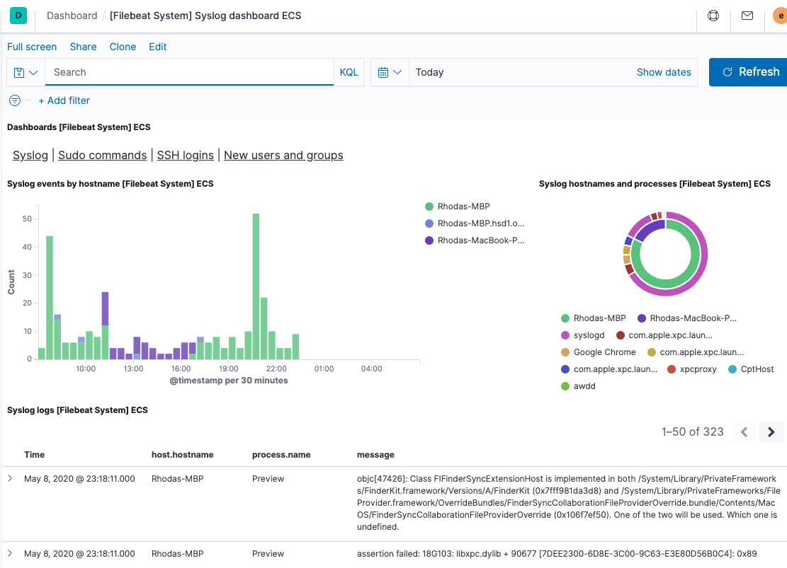

# Filebeat quick start: installation and configuration [filebeat-installation-configuration]


This guide describes how to get started quickly with log collection. You’ll learn how to:

* install Filebeat on each system you want to monitor
* specify the location of your log files
* parse log data into fields and send it to {{es}}
* visualize the log data in {{kib}}

% TO DO: Use `:class: screenshot`


## Before you begin [_before_you_begin]

You need {{es}} for storing and searching your data, and {{kib}} for visualizing and managing it.

:::::::{tab-set}
:group: deployment

::::::{tab-item} {{ech}}
:sync: hosted
To get started quickly, spin up an [{{ech}}](https://www.elastic.co/cloud?page=docs&placement=docs-body) deployment. {{ech}} is available on AWS, GCP, and Azure. [Try it out for free](https://cloud.elastic.co/registration?page=docs&placement=docs-body).
::::::

::::::{tab-item} Self-managed
:sync: self
To install and run {{es}} and {{kib}}, see [Installing the {{stack}}](docs-content://deploy-manage/deploy/self-managed/installing-elasticsearch.md).
::::::

:::::::

## Step 1: Install Filebeat [installation]

Install Filebeat on all the servers you want to monitor.

To download and install Filebeat, use the commands that work with your system:

:::::::{tab-set}
:group: platform
::::::{tab-item} DEB
:sync: deb
```shell subs=true
curl -L -O https://artifacts.elastic.co/downloads/beats/filebeat/filebeat-{{stack-version}}-amd64.deb
sudo dpkg -i filebeat-{{stack-version}}-amd64.deb
```
::::::

::::::{tab-item} RPM
:sync: rpm
```shell subs=true
curl -L -O https://artifacts.elastic.co/downloads/beats/filebeat/filebeat-{{stack-version}}-x86_64.rpm
sudo rpm -vi filebeat-{{stack-version}}-x86_64.rpm
```
::::::

::::::{tab-item} MacOS
:sync: macos
```shell subs=true
curl -L -O https://artifacts.elastic.co/downloads/beats/filebeat/filebeat-{{stack-version}}-darwin-x86_64.tar.gz
tar xzvf filebeat-{{stack-version}}-darwin-x86_64.tar.gz
```
::::::

::::::{tab-item} Linux
:sync: linux
```shell subs=true
curl -L -O https://artifacts.elastic.co/downloads/beats/filebeat/filebeat-{{stack-version}}-linux-x86_64.tar.gz
tar xzvf filebeat-{{stack-version}}-linux-x86_64.tar.gz
```
::::::

::::::{tab-item} Windows
:sync: windows
1. Download the [Filebeat Windows zip file](https://artifacts.elastic.co/downloads/beats/filebeat/filebeat-{{stack-version}}-windows-x86_64.zip).

2. Extract the contents of the zip file into `C:\Program Files`.

3. Rename the `filebeat-[version]-windows-x86_64` directory to `Filebeat`.

4. Open a PowerShell prompt as an Administrator (right-click the PowerShell icon and select *Run As Administrator*).

5. From the PowerShell prompt, run the following commands to install Filebeat as a Windows service:

  ```shell subs=true
  PS > cd 'C:\Program Files\Filebeat'
  PS C:\Program Files\Filebeat> .\install-service-filebeat.ps1
  ```

:::{note}
If script execution is disabled on your system, you need to set the execution policy for the current session to allow the script to run. For example: `PowerShell.exe -ExecutionPolicy UnRestricted -File .\install-service-filebeat.ps1`.
:::
::::::

:::::::
The commands shown are for AMD platforms, but ARM packages are also available. Refer to the [download page](https://www.elastic.co/downloads/beats/filebeat) for the full list of available packages.


### Other installation options [other-installation-options]

* [APT or YUM](/reference/filebeat/setup-repositories.md)
* [Download page](https://www.elastic.co/downloads/beats/filebeat)
* [Docker](/reference/filebeat/running-on-docker.md)
* [Kubernetes](/reference/filebeat/running-on-kubernetes.md)
* [Cloud Foundry](/reference/filebeat/running-on-cloudfoundry.md)


## Step 2: Connect to the {{stack}} [set-connection]

Connections to {{es}} and {{kib}} are required to set up Filebeat.

Set the connection information in `filebeat.yml`. To locate this configuration file, see [Directory layout](/reference/filebeat/directory-layout.md).

:::::::{tab-set}
:group: deployment

::::::{tab-item} {{ech}}
:sync: hosted
Specify the [cloud.id](/reference/filebeat/configure-cloud-id.md) of your {{ech}} deployment, and set [cloud.auth](/reference/filebeat/configure-cloud-id.md) to a user who is authorized to set up Filebeat. For example:

```yaml
cloud.id: "staging:dXMtZWFzdC0xLmF3cy5mb3VuZC5pbyRjZWM2ZjI2MWE3NGJmMjRjZTMzYmI4ODExYjg0Mjk0ZiRjNmMyY2E2ZDA0MjI0OWFmMGNjN2Q3YTllOTYyNTc0Mw=="
cloud.auth: "filebeat_setup:YOUR_PASSWORD" <1>
```

1. This examples shows a hard-coded password, but you should store sensitive values in the [secrets keystore](/reference/filebeat/keystore.md).
::::::

::::::{tab-item} Self-managed
:sync: self
1. Set the host and port where Filebeat can find the {{es}} installation, and set the username and password of a user who is authorized to set up Filebeat. For example:

    ```yaml
    output.elasticsearch:
      hosts: ["https://myEShost:9200"]
      username: "filebeat_internal"
      password: "YOUR_PASSWORD" <1>
      ssl:
        enabled: true
        ca_trusted_fingerprint: "b9a10bbe64ee9826abeda6546fc988c8bf798b41957c33d05db736716513dc9c" <2>
    ```

    1. This example shows a hard-coded password, but you should store sensitive values in the [secrets keystore](/reference/filebeat/keystore.md).
    2. This example shows a hard-coded fingerprint, but you should store sensitive values in the [secrets keystore](/reference/filebeat/keystore.md). The fingerprint is a HEX encoded SHA-256 of a CA certificate, when you start {{es}} for the first time, security features such as network encryption (TLS) for {{es}} are enabled by default. If you are using the self-signed certificate generated by {{es}} when it is started for the first time, you will need to add its fingerprint here. The fingerprint is printed on {{es}} start up logs, or you can refer to [connect clients to {{es}} documentation](docs-content://deploy-manage/security/security-certificates-keys.md#_connect_clients_to_es_5) for other options on retrieving it. If you are providing your own SSL certificate to {{es}} refer to [Filebeat documentation on how to setup SSL](/reference/filebeat/configuration-ssl.md#ssl-client-config).

2. If you plan to use our pre-built {{kib}} dashboards, configure the {{kib}} endpoint. Skip this step if {{kib}} is running on the same host as {{es}}.

    ```yaml
      setup.kibana:
        host: "mykibanahost:5601" <1>
        username: "my_kibana_user" <2> <3>
        password: "YOUR_PASSWORD"
    ```

    1. The hostname and port of the machine where {{kib}} is running, for example, `mykibanahost:5601`. If you specify a path after the port number, include the scheme and port: `http://mykibanahost:5601/path`.
    2. The `username` and `password` settings for {{kib}} are optional. If you don’t specify credentials for {{kib}}, Filebeat uses the `username` and `password` specified for the {{es}} output.
    3. To use the pre-built {{kib}} dashboards, this user must be authorized to view dashboards or have the `kibana_admin` [built-in role](elasticsearch://reference/elasticsearch/roles.md).
::::::

:::::::
To learn more about required roles and privileges, see [*Grant users access to secured resources*](/reference/filebeat/feature-roles.md).

::::{note}
You can send data to other [outputs](/reference/filebeat/configuring-output.md), such as {{ls}}, but that requires additional configuration and setup.
::::


## Step 3: Collect log data [collect-log-data]

There are several ways to collect log data with Filebeat:

* Data collection modules — simplify the collection, parsing, and visualization of common log formats
* ECS loggers — structure and format application logs into ECS-compatible JSON
* Manual Filebeat configuration


### Enable and configure data collection modules [enable-modules]

1. Identify the modules you need to enable. To see a list of available [modules](/reference/filebeat/filebeat-modules.md), run:

    :::::::{tab-set}
    :group: platform

    ::::::{tab-item} DEB
    :sync: deb
    ```sh
    filebeat modules list
    ```
    ::::::

    ::::::{tab-item} RPM
    :sync: rpm
    ```sh
    filebeat modules list
    ```
    ::::::

    ::::::{tab-item} MacOS
    :sync: macos
    ```sh
    ./filebeat modules list
    ```
    ::::::

    ::::::{tab-item} Linux
    :sync: linux
    ```sh
    ./filebeat modules list
    ```
    ::::::

    ::::::{tab-item} Windows
    :sync: windows
    ```sh
    PS > .\filebeat.exe modules list
    ```
    ::::::

    :::::::

2. From the installation directory, enable one or more modules. For example, the following command enables the `nginx` module config:

    :::::::{tab-set}
    :group: platform

    ::::::{tab-item} DEB
    :sync: deb
    ```sh
    filebeat modules enable nginx
    ```
    ::::::

    ::::::{tab-item} RPM
    :sync: rpm
    ```sh
    filebeat modules enable nginx
    ```
    ::::::

    ::::::{tab-item} MacOS
    :sync: macos
    ```sh
    ./filebeat modules enable nginx
    ```
    ::::::

    ::::::{tab-item} Linux
    :sync: linux
    ```sh
    ./filebeat modules enable nginx
    ```
    ::::::

    ::::::{tab-item} Windows
    :sync: windows
    ```sh
    PS > .\filebeat.exe modules enable nginx
    ```
    ::::::

3. In the module config under modules.d, change the module settings to match your environment. You must enable at least one fileset in the module. Filesets are disabled by default.

    For example, log locations are set based on the OS. If your logs aren’t in default locations, set the paths variable:

    ```yaml
    - module: nginx
      access:
        enabled: true
        var.paths: ["/var/log/nginx/access.log*"]
    ```

To see the full list of variables for a module, see the documentation under [](/reference/filebeat/filebeat-modules.md).

:::{tip}
To test your configuration file, change to the directory where the Filebeat binary is installed, and run Filebeat in the foreground with the following options specified: `./filebeat test config -e`. Make sure your config files are in the path expected by Filebeat (see [](/reference/filebeat/directory-layout.md)), or use the `-c` flag to specify the path to the config file.
:::

For more information about configuring Filebeat, also see:

* [Configure Filebeat](/reference/filebeat/configuring-howto-filebeat.md)
* [Config file format](/reference/libbeat/config-file-format.md)
* [`filebeat.reference.yml`](/reference/filebeat/filebeat-reference-yml.md): This reference configuration file shows all non-deprecated options. You'll find it in the same location as `filebeat.yml`.

### Enable and configure ECS loggers for application log collection [collect-application-logs]

While Filebeat can be used to ingest raw, plain-text application logs,
we recommend structuring your logs at ingest time. This lets you extract fields,
like log level and exception stack traces.

Elastic simplifies this process by providing application log formatters in a variety
of popular programming languages. These plugins format your logs into ECS-compatible JSON,
which removes the need to manually parse logs.

See [ECS loggers](ecs-logging://reference/intro.md) to get started.

### Configure Filebeat manually [manual-configuration]

If you're unable to find a module for your file type, or can't change your application's
log output, see [configure the input](/reference/filebeat/configuration-filebeat-options.md) manually.

## Step 4: Set up assets [setup-assets]

Filebeat comes with predefined assets for parsing, indexing, and
visualizing your data. To load these assets:

1. Make sure the user specified in `filebeat.yml` is [authorized to set up Filebeat](/reference/filebeat/privileges-to-setup-beats.md).

1. From the installation directory, run:

    :::::::{tab-set}
    :group: platform
    ::::::{tab-item} DEB
    :sync: deb
    ```sh
    filebeat setup -e
    ```
    ::::::

    ::::::{tab-item} RPM
    :sync: rpm
    ```sh
    filebeat setup -e
    ```
    ::::::

    ::::::{tab-item} MacOS
    :sync: macos
    ```sh
    ./filebeat setup -e
    ```
    ::::::

    ::::::{tab-item} Linux
    :sync: linux
    ```sh
    ./filebeat setup -e
    ```
    ::::::

    ::::::{tab-item} Windows
    :sync: windows
    ```sh
    PS > .\filebeat.exe setup -e
    ```
    ::::::
    :::::::

    `-e` is optional and sends output to standard error instead of the configured log output.

This step loads the recommended [index template](docs-content://manage-data/data-store/templates.md) for writing to {{es}} and deploys the sample dashboards for visualizing the data in {{kib}}.

This step does not load the ingest pipelines used to parse log lines. By default, ingest pipelines are set up automatically the first time you run the module and connect to {{es}}.

:::{tip}
A connection to {{es}} (or {{ech}}) is required to set up the initial environment. If you're using a different output, such as {{ls}}, see:

* [](/reference/filebeat/filebeat-template.md#load-template-manually)
* [](/reference/filebeat/load-kibana-dashboards.md)
* [](/reference/filebeat/load-ingest-pipelines.md)
:::

:::{note}
Filebeat should not be used to ingest its own log as this may lead to an infinite loop.
:::

## Step 5: Start Filebeat [start]

Before starting Filebeat, modify the user credentials in `filebeat.yml` and specify a user who is [authorized to publish events](/reference/filebeat/privileges-to-publish-events.md).

To start Filebeat, run:

:::::::{tab-set}
:group: platform
::::::{tab-item} DEB
:sync: deb
```sh
sudo service filebeat start
```

::::{note}
If you use an `init.d` script to start Filebeat, you can’t specify command line flags (see [Command reference](/reference/filebeat/command-line-options.md)). To specify flags, start Filebeat in the foreground.
::::


Also see [Filebeat and systemd](/reference/filebeat/running-with-systemd.md).
::::::

::::::{tab-item} RPM
:sync: rpm
```sh
sudo service filebeat start
```

::::{note}
If you use an `init.d` script to start Filebeat, you can’t specify command line flags (see [Command reference](/reference/filebeat/command-line-options.md)). To specify flags, start Filebeat in the foreground.
::::


Also see [Filebeat and systemd](/reference/filebeat/running-with-systemd.md).
::::::

::::::{tab-item} MacOS
:sync: macos
```sh
sudo chown root filebeat.yml <1>
sudo chown root modules.d/nginx.yml <1>
sudo ./filebeat -e
```

1. You’ll be running Filebeat as root, so you need to change ownership of the configuration file and any configurations enabled in the `modules.d` directory, or run Filebeat with `--strict.perms=false` specified. See [Config File Ownership and Permissions](/reference/libbeat/config-file-permissions.md).
::::::

::::::{tab-item} Linux
:sync: linux
```sh
sudo chown root filebeat.yml <1>
sudo chown root modules.d/nginx.yml <1>
sudo ./filebeat -e
```

1. You’ll be running Filebeat as root, so you need to change ownership of the configuration file and any configurations enabled in the `modules.d` directory, or run Filebeat with `--strict.perms=false` specified. See [Config File Ownership and Permissions](/reference/libbeat/config-file-permissions.md).
::::::

::::::{tab-item} Windows
:sync: windows
```sh
PS C:\Program Files\filebeat> Start-Service filebeat
```

By default, Windows log files are stored in `C:\ProgramData\filebeat\Logs`.
::::::

:::::::

Filebeat should begin streaming events to {{es}}.

## Step 6: View your data in {{kib}} [view-data]

Filebeat comes with pre-built {{kib}} dashboards and UIs for visualizing log data. You loaded the dashboards earlier when you ran the `setup` command.

To open the dashboards:

1. Launch {{kib}}:

    :::::::{tab-set}
    :group: deployment
    ::::::{tab-item} {{ech}}
    :sync: hosted
    1. [Log in](https://cloud.elastic.co/) to your {{ecloud}} account.
    2. Navigate to the {{kib}} endpoint in your deployment.
    ::::::
    ::::::{tab-item} Self-managed
    :sync: self
    Point your browser to [http://localhost:5601](http://localhost:5601), replacing `localhost` with the name of the {{kib}} host.
    ::::::
    :::::::

2. In the side navigation, click **Discover**. To see Filebeat data, make sure the predefined `filebeat-*` data view is selected.

    ::::{tip}
    If you don’t see data in {{kib}}, try changing the time filter to a larger range. By default, {{kib}} shows the last 15 minutes.
    ::::

3. In the side navigation, click **Dashboard**, then select the dashboard that you want to open.

The dashboards are provided as examples. We recommend that you [customize](docs-content://explore-analyze/dashboards.md) them to meet your needs.


## What’s next? [_whats_next]

Now that you have your logs streaming into {{es}}, learn how to unify your logs, metrics, uptime, and application performance data.

1. Ingest data from other sources by installing and configuring other Elastic {{beats}}:

    | Elastic {{beats}} | To capture |
    | --- | --- |
    | [{{metricbeat}}](/reference/metricbeat/metricbeat-installation-configuration.md) | Infrastructure metrics |
    | [{{winlogbeat}}](/reference/winlogbeat/winlogbeat-installation-configuration.md) | Windows event logs |
    | [{{heartbeat}}](/reference/heartbeat/heartbeat-installation-configuration.md) | Uptime information |
    | [APM](docs-content://solutions/observability/apm/index.md) | Application performance metrics |
    | [{{auditbeat}}](/reference/auditbeat/auditbeat-installation-configuration.md) | Audit events |

2. Use the Observability apps in {{kib}} to search across all your data:

    | Elastic apps | Use to |
    | --- | --- |
    | [{{metrics-app}}](docs-content://solutions/observability/infra-and-hosts/analyze-infrastructure-host-metrics.md) | Explore metrics about systems and services across your ecosystem |
    | [{{logs-app}}](docs-content://solutions/observability/logs/explore-logs.md) | Tail related log data in real time |
    | [{{uptime-app}}](docs-content://solutions/observability/synthetics/index.md#monitoring-uptime) | Monitor availability issues across your apps and services |
    | [APM app](docs-content://solutions/observability/apm/overviews.md) | Monitor application performance |
    | [{{siem-app}}](docs-content://solutions/security.md) | Analyze security events |


