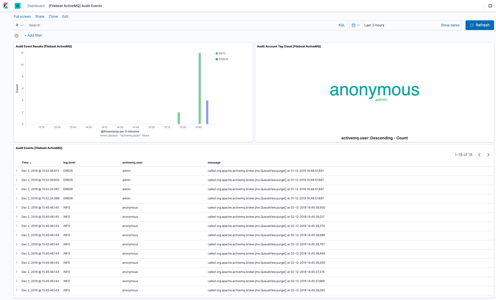

---
mapped_pages:
  - https://www.elastic.co/guide/en/beats/filebeat/current/filebeat-module-activemq.html
---

# ActiveMQ module [filebeat-module-activemq]

:::::{admonition} Prefer to use {{agent}} for this use case?
Refer to the [Elastic Integrations documentation](integration-docs://reference/activemq/index.md).

::::{dropdown} Learn more
{{agent}} is a single, unified way to add monitoring for logs, metrics, and other types of data to a host. It can also protect hosts from security threats, query data from operating systems, forward data from remote services or hardware, and more. Refer to the documentation for a detailed [comparison of {{beats}} and {{agent}}](docs-content://reference/fleet/index.md).

::::


:::::


This module parses Apache ActiveMQ logs. It supports application and audit logs.

When you run the module, it performs a few tasks under the hood:

* Sets the default paths to the log files (but don’t worry, you can override the defaults)
* Makes sure each multiline log event gets sent as a single event
* Uses an {{es}} ingest pipeline to parse and process the log lines, shaping the data into a structure suitable for visualizing in Kibana
* Deploys dashboards for visualizing the log data

::::{tip}
Read the [quick start](/reference/filebeat/filebeat-installation-configuration.md) to learn how to configure and run modules.
::::


## Compatibility [_compatibility_4]

The module has been tested with ActiveMQ 5.13.0 and 5.15.9. Other versions are expected to work.


## Configure the module [configuring-activemq-module]

You can further refine the behavior of the `activemq` module by specifying [variable settings](#activemq-settings) in the `modules.d/activemq.yml` file, or overriding settings at the command line.

You must enable at least one fileset in the module. **Filesets are disabled by default.**


### Variable settings [activemq-settings]

Each fileset has separate variable settings for configuring the behavior of the module. If you don’t specify variable settings, the `activemq` module uses the defaults.

For advanced use cases, you can also override input settings. See [Override input settings](/reference/filebeat/advanced-settings.md).

::::{tip}
When you specify a setting at the command line, remember to prefix the setting with the module name, for example, `activemq.log.var.paths` instead of `log.var.paths`.
::::


The following example shows how to set paths in the `modules.d/activemq.yml` file to override the default paths for ActiveMQ logs:

```yaml
- module: activemq
  audit:
    enabled: true
    var.paths: ["/path/to/log/activemq/data/audit.log*"]
  log:
    enabled: true
    var.paths: ["/path/to/log/activemq/data/activemq.log*"]
```

To specify the same settings at the command line, you use:

```sh
-M "activemq.audit.var.paths=[/path/to/log/activemq/data/audit.log*]"
-M "activemq.log.var.paths=[/path/to/log/activemq/data/activemq.log*]"
```


### `audit` log fileset settings [_audit_log_fileset_settings]

**`var.paths`**
:   An array of glob-based paths that specify where to look for the log files. All patterns supported by [Go Glob](https://golang.org/pkg/path/filepath/#Glob) are also supported here. For example, you can use wildcards to fetch all files from a predefined level of subdirectories: `/path/to/log/*/*.log`. This fetches all `.log` files from the subfolders of `/path/to/log`. It does not fetch log files from the `/path/to/log` folder itself. If this setting is left empty, Filebeat will choose log paths based on your operating system.


### `log` log fileset settings [_log_log_fileset_settings]

**`var.paths`**
:   An array of glob-based paths that specify where to look for the log files. All patterns supported by [Go Glob](https://golang.org/pkg/path/filepath/#Glob) are also supported here. For example, you can use wildcards to fetch all files from a predefined level of subdirectories: `/path/to/log/*/*.log`. This fetches all `.log` files from the subfolders of `/path/to/log`. It does not fetch log files from the `/path/to/log` folder itself. If this setting is left empty, Filebeat will choose log paths based on your operating system.


### Time zone support [_time_zone_support]

This module parses logs that don’t contain time zone information. For these logs, Filebeat reads the local time zone and uses it when parsing to convert the timestamp to UTC. The time zone to be used for parsing is included in the event in the `event.timezone` field.

To disable this conversion, the `event.timezone` field can be removed with the `drop_fields` processor.

If logs are originated from systems or applications with a different time zone to the local one, the `event.timezone` field can be overwritten with the original time zone using the `add_fields` processor.

See [Processors](/reference/filebeat/filtering-enhancing-data.md) for information about specifying processors in your config.


## Dashboards [_dashboards]

The ActiveMQ module comes with several predefined dashboards for application and audit logs. For example:





## Fields [_fields_3]

For a description of each field in the module, see the [exported fields](/reference/filebeat/exported-fields-activemq.md) section.
