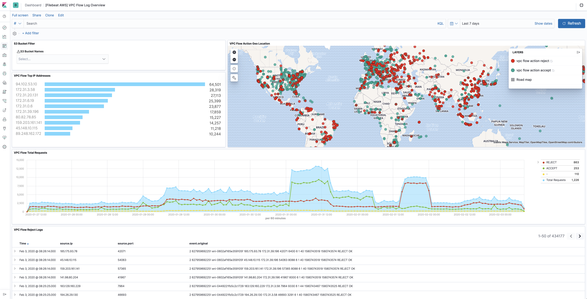

---
mapped_pages:
  - https://www.elastic.co/guide/en/beats/filebeat/current/filebeat-module-aws.html
---

# AWS module [filebeat-module-aws]

:::::{admonition} Prefer to use {{agent}} for this use case?
Refer to the [Elastic Integrations documentation](integration-docs://reference/aws/index.md).

::::{dropdown} Learn more
{{agent}} is a single, unified way to add monitoring for logs, metrics, and other types of data to a host. It can also protect hosts from security threats, query data from operating systems, forward data from remote services or hardware, and more. Refer to the documentation for a detailed [comparison of {{beats}} and {{agent}}](docs-content://reference/fleet/index.md).

::::


:::::


This is a module for aws logs. It uses filebeat s3 input to get log files from AWS S3 buckets with SQS notification or directly polling list of S3 objects in an S3 bucket. The use of SQS notification is preferred: polling list of S3 objects is expensive in terms of performance and costs, and cannot scale horizontally without ingestion duplication, and should be preferably used only when no SQS notification can be attached to the S3 buckets.

This module supports reading S3 server access logs with `s3access` fileset, ELB access logs with `elb` fileset, VPC flow logs with `vpcflow` fileset, and CloudTrail logs with `cloudtrail` fileset.

Access logs contain detailed information about the requests made to these services. VPC flow logs captures information about the IP traffic going to and from network interfaces in AWS VPC. ELB access logs captures detailed information about requests sent to the load balancer. CloudTrail logs contain events that represent actions taken by a user, role or AWS service.

The `aws` module requires AWS credentials configuration in order to make AWS API calls. Users can either use `access_key_id`, `secret_access_key` and/or `session_token`, or use `role_arn` AWS IAM role, or use shared AWS credentials file.

Users may use `external_id` to support assuming a role in another account, see [the AWS documentation for use of external IDs](https://docs.aws.amazon.com/IAM/latest/UserGuide/id_roles_create_for-user_externalid.html).

Please see [AWS credentials options](#aws-credentials-options) for more details.

::::{tip}
Read the [quick start](/reference/filebeat/filebeat-installation-configuration.md) to learn how to configure and run modules.
::::


## Module configuration [_module_configuration]

Example config:

```yaml
- module: aws
  cloudtrail:
    enabled: false
    #var.queue_url: https://sqs.myregion.amazonaws.com/123456/myqueue
    #var.bucket_arn: 'arn:aws:s3:::mybucket'
    #var.bucket_list_prefix: 'prefix'
    #var.bucket_list_interval: 300s
    #var.number_of_workers: 5
    #var.shared_credential_file: /etc/filebeat/aws_credentials
    #var.credential_profile_name: fb-aws
    #var.access_key_id: access_key_id
    #var.secret_access_key: secret_access_key
    #var.session_token: session_token
    #var.visibility_timeout: 300s
    #var.api_timeout: 120s
    #var.endpoint: amazonaws.com
    #var.default_region: us-east-1
    #var.role_arn: arn:aws:iam::123456789012:role/test-mb
    #var.proxy_url: http://proxy:8080

  cloudwatch:
    enabled: false
    #var.queue_url: https://sqs.myregion.amazonaws.com/123456/myqueue
    #var.bucket_arn: 'arn:aws:s3:::mybucket'
    #var.bucket_list_prefix: 'prefix'
    #var.bucket_list_interval: 300s
    #var.number_of_workers: 5
    #var.shared_credential_file: /etc/filebeat/aws_credentials
    #var.credential_profile_name: fb-aws
    #var.access_key_id: access_key_id
    #var.secret_access_key: secret_access_key
    #var.session_token: session_token
    #var.visibility_timeout: 300s
    #var.api_timeout: 120s
    #var.endpoint: amazonaws.com
    #var.default_region: us-east-1
    #var.role_arn: arn:aws:iam::123456789012:role/test-mb
    #var.proxy_url: http://proxy:8080

  ec2:
    enabled: false
    #var.queue_url: https://sqs.myregion.amazonaws.com/123456/myqueue
    #var.bucket_arn: 'arn:aws:s3:::mybucket'
    #var.bucket_list_prefix: 'prefix'
    #var.bucket_list_interval: 300s
    #var.number_of_workers: 5
    #var.shared_credential_file: /etc/filebeat/aws_credentials
    #var.credential_profile_name: fb-aws
    #var.access_key_id: access_key_id
    #var.secret_access_key: secret_access_key
    #var.session_token: session_token
    #var.visibility_timeout: 300s
    #var.api_timeout: 120s
    #var.endpoint: amazonaws.com
    #var.default_region: us-east-1
    #var.role_arn: arn:aws:iam::123456789012:role/test-mb
    #var.proxy_url: http://proxy:8080

  elb:
    enabled: false
    #var.queue_url: https://sqs.myregion.amazonaws.com/123456/myqueue
    #var.bucket_arn: 'arn:aws:s3:::mybucket'
    #var.bucket_list_prefix: 'prefix'
    #var.bucket_list_interval: 300s
    #var.number_of_workers: 5
    #var.shared_credential_file: /etc/filebeat/aws_credentials
    #var.credential_profile_name: fb-aws
    #var.access_key_id: access_key_id
    #var.secret_access_key: secret_access_key
    #var.session_token: session_token
    #var.visibility_timeout: 300s
    #var.api_timeout: 120s
    #var.endpoint: amazonaws.com
    #var.default_region: us-east-1
    #var.role_arn: arn:aws:iam::123456789012:role/test-mb
    #var.proxy_url: http://proxy:8080

  s3access:
    enabled: false
    #var.queue_url: https://sqs.myregion.amazonaws.com/123456/myqueue
    #var.bucket_arn: 'arn:aws:s3:::mybucket'
    #var.bucket_list_prefix: 'prefix'
    #var.bucket_list_interval: 300s
    #var.number_of_workers: 5
    #var.shared_credential_file: /etc/filebeat/aws_credentials
    #var.credential_profile_name: fb-aws
    #var.access_key_id: access_key_id
    #var.secret_access_key: secret_access_key
    #var.session_token: session_token
    #var.visibility_timeout: 300s
    #var.api_timeout: 120s
    #var.endpoint: amazonaws.com
    #var.default_region: us-east-1
    #var.role_arn: arn:aws:iam::123456789012:role/test-mb
    #var.proxy_url: http://proxy:8080

  vpcflow:
    enabled: false
    #var.queue_url: https://sqs.myregion.amazonaws.com/123456/myqueue
    #var.bucket_arn: 'arn:aws:s3:::mybucket'
    #var.bucket_list_prefix: 'prefix'
    #var.bucket_list_interval: 300s
    #var.number_of_workers: 5
    #var.shared_credential_file: /etc/filebeat/aws_credentials
    #var.credential_profile_name: fb-aws
    #var.access_key_id: access_key_id
    #var.secret_access_key: secret_access_key
    #var.session_token: session_token
    #var.visibility_timeout: 300s
    #var.api_timeout: 120s
    #var.endpoint: amazonaws.com
    #var.default_region: us-east-1
    #var.role_arn: arn:aws:iam::123456789012:role/test-mb
    #var.proxy_url: http://proxy:8080
```

**`var.queue_url`**
:   AWS SQS queue url (Required when `var.bucket_arn` is not set).

**`var.visibility_timeout`**
:   The duration that the received messages are hidden from ReceiveMessage request. Default to be 300 seconds.

**`var.api_timeout`**
:   The maximum duration of the AWS API call. If it exceeds the timeout, the AWS API call will be interrupted. The default AWS API timeout is `120s`.

The API timeout must be longer than the `sqs.wait_time` value.

**`var.bucket_arn`**
:   AWS S3 bucket ARN (Required when `var.queue_url` is not set).

**`var.number_of_workers`**
:   Number of workers that will process the S3 objects listed (Required when `var.bucket_arn` is set). Use to vertically scale the input.

**`var.bucket_list_interval`**
:   Wait interval between completion of a list request to the S3 bucket and beginning of the next one. Default to be 120 seconds.

**`var.bucket_list_prefix`**
:   Prefix to apply for the list request to the S3 bucket. Default empty.

**`var.endpoint`**
:   Custom endpoint used to access AWS APIs.

**`var.default_region`**
:   Default region to query if no other region is set.

**`var.shared_credential_file`**
:   Filename of AWS credential file.

**`var.credential_profile_name`**
:   AWS credential profile name.

**`var.access_key_id`**
:   First part of access key.

**`var.secret_access_key`**
:   Second part of access key.

**`var.session_token`**
:   Required when using temporary security credentials.

**`var.role_arn`**
:   AWS IAM Role to assume.


## config behaviour [_config_behaviour]

Beware that in case both `var.queue_url` and `var.bucket_arn` are not set instead of failing to start Filebeat with a config validation error, only the specific fileset input will be stopped and a warning printed:

```
2021-08-26T14:33:03.661-0600 WARN [aws-s3] awss3/config.go:54 neither queue_url nor bucket_arn were provided, input aws-s3 will stop
2021-08-26T14:33:10.668-0600 INFO [input.aws-s3] compat/compat.go:111 Input aws-s3 starting {"id": "29F3565F5B2A7070"}
2021-08-26T14:33:10.668-0600 INFO [input.aws-s3] compat/compat.go:124 Input 'aws-s3' stopped {"id": "29F3565F5B2A7070"}
```

This behaviour is required in order to reduce destruction of existing Filebeat setup where not all AWS module’s filesets are defined and will change in next major release.

Setting `enabled: false` in the unused fileset will silence the warning and it is the suggested setup. For example (assuming `cloudtrail` as unused fileset):

```
- module: aws
  cloudtrail:
    enabled: false
```


## cloudtrail fileset [_cloudtrail_fileset]

CloudTrail monitors events for the account. If user creates a trail, it delivers those events as log files to a specific Amazon S3 bucket. The `cloudtrail` fileset does not read the CloudTrail Digest files that are delivered to the S3 bucket when Log File Integrity is turned on, it only reads the CloudTrail logs.

% TO DO: Use `:class: screenshot`


## cloudwatch fileset [_cloudwatch_fileset]

Users can use Amazon CloudWatch Logs to monitor, store, and access log files from different sources. Export logs from log groups to an Amazon S3 bucket which has SQS notification setup already. This fileset will parse these logs into `timestamp` and `message` field.


## ec2 fileset [_ec2_fileset]

This fileset is specifically for EC2 logs stored in AWS CloudWatch. Export logs from log groups to Amazon S3 bucket which has SQS notification setup already. With this fileset, EC2 logs will be parsed into fields like  `ip` and `program_name`. For logs from other services, please use `cloudwatch` fileset.


## elb fileset [_elb_fileset]

Elastic Load Balancing provides access logs that capture detailed information about requests sent to the load balancer. Each log contains information such as the time the request was received, the client’s IP address, latencies, request paths, and server responses. Users can use these access logs to analyze traffic patterns and to troubleshoot issues.

Please follow [enable access logs for classic load balancer](https://docs.aws.amazon.com/elasticloadbalancing/latest/classic/enable-access-logs.html) for sending Classic ELB access logs to S3 bucket. For application load balancer, please follow [enable access log for application load balancer](https://docs.aws.amazon.com/elasticloadbalancing/latest/application/load-balancer-access-logs.html#enable-access-logging). For network load balancer, please follow [enable access log for network load balancer](https://docs.aws.amazon.com/elasticloadbalancing/latest//network/load-balancer-access-logs.html).

This fileset comes with a predefined dashboard:

% TO DO: Use `:class: screenshot`


## s3access fileset [_s3access_fileset]

Server access logging provides detailed records for the requests that are made to a bucket. Server access logs are useful for many applications. For example, access log information can be useful in security and access audits. It can also help you learn about customer base and understand Amazon S3 bill.

Please follow [how to enable server access logging](https://docs.aws.amazon.com/AmazonS3/latest/dev/ServerLogs.html#server-access-logging-overview) for sending server access logs to S3 bucket.

This fileset comes with a predefined dashboard:

% TO DO: Use `:class: screenshot`


## vpcflow fileset [_vpcflow_fileset]

VPC Flow Logs is a feature in AWS that enables users to capture information about the IP traffic going to and from network interfaces in VPC. Flow log data needs to be published to Amazon S3 in order for `vpcflow` fileset to retrieve. Flow logs can help users to monitor traffic that is reaching each instance and determine the direction of the traffic to and from the network interfaces.

This fileset comes with a predefined dashboard:

% TO DO: Use `:class: screenshot`



## AWS Credentials Configuration [aws-credentials-options]

To configure AWS credentials, either put the credentials into the Filebeat configuration, or use a shared credentials file, as shown in the following examples.


### Configuration parameters [_configuration_parameters_2]

* **access_key_id**: first part of access key.
* **secret_access_key**: second part of access key.
* **session_token**: required when using temporary security credentials.
* **credential_profile_name**: profile name in shared credentials file.
* **shared_credential_file**: directory of the shared credentials file.
* **role_arn**: AWS IAM Role to assume.
* **external_id**: external ID to use when assuming a role in another account, see [the AWS documentation for use of external IDs](https://docs.aws.amazon.com/IAM/latest/UserGuide/id_roles_create_for-user_externalid.html).
* **proxy_url**: URL of the proxy to use to connect to AWS web services. The syntax is `http(s)://<IP/Hostname>:<port>`
* **fips_enabled**: Enabling this option instructs Filebeat to use the FIPS endpoint of a service. All services used by Filebeat are FIPS compatible except for `tagging` but only certain regions are FIPS compatible. See [https://aws.amazon.com/compliance/fips/](https://aws.amazon.com/compliance/fips/) or the appropriate service page, [https://docs.aws.amazon.com/general/latest/gr/aws-service-information.html](https://docs.aws.amazon.com/general/latest/gr/aws-service-information.html), for a full list of FIPS endpoints and regions.
* **ssl**: This specifies SSL/TLS configuration. If the ssl section is missing, the host’s CAs are used for HTTPS connections. See [SSL](/reference/filebeat/configuration-ssl.md) for more information.
* **default_region**: Default region to query if no other region is set. Most AWS services offer a regional endpoint that can be used to make requests. Some services, such as IAM, do not support regions. If a region is not provided by any other way (environment variable, credential or instance profile), the value set here will be used.
* **assume_role.duration**: The duration of the requested assume role session. Defaults to 15m when not set. AWS allows a maximum session duration between 1h and 12h depending on your maximum session duration policies.
* **assume_role.expiry_window**: The expiry_window will allow refreshing the session prior to its expiration. This is beneficial to prevent expiring tokens from causing requests to fail with an ExpiredTokenException.


### Supported Formats [_supported_formats_2]

::::{note}
The examples in this section refer to Metricbeat, but the credential options for authentication with AWS are the same no matter which Beat is being used.
::::


* Use `access_key_id`, `secret_access_key`, and/or `session_token`

Users can either put the credentials into the Metricbeat module configuration or use environment variable `AWS_ACCESS_KEY_ID`, `AWS_SECRET_ACCESS_KEY` and/or `AWS_SESSION_TOKEN` instead.

If running on Docker, these environment variables should be added as a part of the docker command. For example, with Metricbeat:

```bash
$ docker run -e AWS_ACCESS_KEY_ID=abcd -e AWS_SECRET_ACCESS_KEY=abcd -d --name=metricbeat --user=root --volume="$(pwd)/metricbeat.aws.yml:/usr/share/metricbeat/metricbeat.yml:ro" docker.elastic.co/beats/metricbeat:7.11.1 metricbeat -e -E cloud.auth=elastic:1234 -E cloud.id=test-aws:1234
```

Sample `metricbeat.aws.yml` looks like:

```yaml
metricbeat.modules:
- module: aws
  period: 5m
  access_key_id: ${AWS_ACCESS_KEY_ID}
  secret_access_key: ${AWS_SECRET_ACCESS_KEY}
  session_token: ${AWS_SESSION_TOKEN}
  metricsets:
    - ec2
```

Environment variables can also be added through a file. For example:

```bash
$ cat env.list
AWS_ACCESS_KEY_ID=abcd
AWS_SECRET_ACCESS_KEY=abcd

$ docker run --env-file env.list -d --name=metricbeat --user=root --volume="$(pwd)/metricbeat.aws.yml:/usr/share/metricbeat/metricbeat.yml:ro" docker.elastic.co/beats/metricbeat:7.11.1 metricbeat -e -E cloud.auth=elastic:1234 -E cloud.id=test-aws:1234
```

* Use `credential_profile_name` and/or `shared_credential_file`

If `access_key_id`, `secret_access_key` and `role_arn` are all not given, then filebeat will check for `credential_profile_name`. If you use different credentials for different tools or applications, you can use profiles to configure multiple access keys in the same configuration file. If there is no `credential_profile_name` given, the default profile will be used.

`shared_credential_file` is optional to specify the directory of your shared credentials file. If it’s empty, the default directory will be used. In Windows, shared credentials file is at `C:\Users\<yourUserName>\.aws\credentials`. For Linux, macOS or Unix, the file is located at `~/.aws/credentials`. When running as a service, the home path depends on the user that manages the service, so the `shared_credential_file` parameter can be used to avoid ambiguity. Please see [Create Shared Credentials File](https://docs.aws.amazon.com/ses/latest/DeveloperGuide/create-shared-credentials-file.md) for more details.

* Use `role_arn`

`role_arn` is used to specify which AWS IAM role to assume for generating temporary credentials. If `role_arn` is given, filebeat will check if access keys are given. If not, filebeat will check for credential profile name. If neither is given, default credential profile will be used. Please make sure credentials are given under either a credential profile or access keys.

If running on Docker, the credential file needs to be provided via a volume mount. For example, with Metricbeat:

```bash
docker run -d --name=metricbeat --user=root --volume="$(pwd)/metricbeat.aws.yml:/usr/share/metricbeat/metricbeat.yml:ro" --volume="/Users/foo/.aws/credentials:/usr/share/metricbeat/credentials:ro" docker.elastic.co/beats/metricbeat:7.11.1 metricbeat -e -E cloud.auth=elastic:1234 -E cloud.id=test-aws:1234
```

Sample `metricbeat.aws.yml` looks like:

```yaml
metricbeat.modules:
- module: aws
  period: 5m
  credential_profile_name: elastic-beats
  shared_credential_file: /usr/share/metricbeat/credentials
  metricsets:
    - ec2
```

* Use AWS credentials in Filebeat configuration

    ```yaml
    filebeat.inputs:
    - type: aws-s3
      queue_url: https://sqs.us-east-1.amazonaws.com/123/test-queue
      access_key_id: '<access_key_id>'
      secret_access_key: '<secret_access_key>'
      session_token: '<session_token>'
    ```

    or

    ```yaml
    filebeat.inputs:
    - type: aws-s3
      queue_url: https://sqs.us-east-1.amazonaws.com/123/test-queue
      access_key_id: '${AWS_ACCESS_KEY_ID:""}'
      secret_access_key: '${AWS_SECRET_ACCESS_KEY:""}'
      session_token: '${AWS_SESSION_TOKEN:""}'
    ```

* Use IAM role ARN

    ```yaml
    filebeat.inputs:
    - type: aws-s3
      queue_url: https://sqs.us-east-1.amazonaws.com/123/test-queue
      role_arn: arn:aws:iam::123456789012:role/test-mb
    ```

* Use shared AWS credentials file

    ```yaml
    filebeat.inputs:
    - type: aws-s3
      queue_url: https://sqs.us-east-1.amazonaws.com/123/test-queue
      credential_profile_name: test-fb
    ```


### AWS Credentials Types [_aws_credentials_types_2]

There are two different types of AWS credentials can be used: access keys and temporary security credentials.

* Access keys

`AWS_ACCESS_KEY_ID` and `AWS_SECRET_ACCESS_KEY` are the two parts of access keys. They are long-term credentials for an IAM user or the AWS account root user. Please see [AWS Access Keys and Secret Access Keys](https://docs.aws.amazon.com/general/latest/gr/aws-sec-cred-types.html#access-keys-and-secret-access-keys) for more details.

* IAM role ARN

An IAM role is an IAM identity that you can create in your account that has specific permissions that determine what the identity can and cannot do in AWS. A role does not have standard long-term credentials such as a password or access keys associated with it. Instead, when you assume a role, it provides you with temporary security credentials for your role session. IAM role Amazon Resource Name (ARN) can be used to specify which AWS IAM role to assume to generate temporary credentials. Please see [AssumeRole API documentation](https://docs.aws.amazon.com/STS/latest/APIReference/API_AssumeRole.html) for more details.

Here are the steps to set up IAM role using AWS CLI for Metricbeat. Please replace `123456789012` with your own account ID.

Step 1. Create `example-policy.json` file to include all permissions:

```yaml
{
    "Version": "2012-10-17",
    "Statement": [
        {
            "Sid": "VisualEditor0",
            "Effect": "Allow",
            "Action": [
                "s3:GetObject",
                "sqs:ReceiveMessage"
            ],
            "Resource": "*"
        },
        {
            "Sid": "VisualEditor1",
            "Effect": "Allow",
            "Action": "sqs:ChangeMessageVisibility",
            "Resource": "arn:aws:sqs:us-east-1:123456789012:test-fb-ks"
        },
        {
            "Sid": "VisualEditor2",
            "Effect": "Allow",
            "Action": "sqs:DeleteMessage",
            "Resource": "arn:aws:sqs:us-east-1:123456789012:test-fb-ks"
        },
        {
            "Sid": "VisualEditor3",
            "Effect": "Allow",
            "Action": [
                "sts:AssumeRole",
                "sqs:ListQueues",
                "tag:GetResources",
                "ec2:DescribeInstances",
                "cloudwatch:GetMetricData",
                "ec2:DescribeRegions",
                "iam:ListAccountAliases",
                "sts:GetCallerIdentity",
                "cloudwatch:ListMetrics"
            ],
            "Resource": "*"
        }
    ]
}
```

Step 2. Create IAM policy using the `aws iam create-policy` command:

```bash
$ aws iam create-policy --policy-name example-policy --policy-document file://example-policy.json
```

Step 3. Create the JSON file `example-role-trust-policy.json` that defines the trust relationship of the IAM role

```yaml
{
    "Version": "2012-10-17",
    "Statement": {
        "Effect": "Allow",
        "Principal": { "AWS": "arn:aws:iam::123456789012:root" },
        "Action": "sts:AssumeRole"
    }
}
```

Step 4. Create the IAM role and attach the policy:

```bash
$ aws iam create-role --role-name example-role --assume-role-policy-document file://example-role-trust-policy.json
$ aws iam attach-role-policy --role-name example-role --policy-arn "arn:aws:iam::123456789012:policy/example-policy"
```

After these steps are done, IAM role ARN can be used for authentication in Metricbeat `aws` module.

* Temporary security credentials

Temporary security credentials has a limited lifetime and consists of an access key ID, a secret access key, and a security token which typically returned from `GetSessionToken`. MFA-enabled IAM users would need to submit an MFA code while calling `GetSessionToken`. Please see [Temporary Security Credentials](https://docs.aws.amazon.com/IAM/latest/UserGuide/id_credentials_temp.html) for more details. `sts get-session-token` AWS CLI can be used to generate temporary credentials. For example. with MFA-enabled:

```bash
aws> sts get-session-token --serial-number arn:aws:iam::1234:mfa/your-email@example.com --token-code 456789 --duration-seconds 129600
```

Because temporary security credentials are short term, after they expire, the user needs to generate new ones and modify the aws.yml config file with the new credentials. Unless [live reloading](/reference/metricbeat/_live_reloading.md) feature is enabled for Metricbeat, the user needs to manually restart Metricbeat after updating the config file in order to continue collecting Cloudwatch metrics. This will cause data loss if the config file is not updated with new credentials before the old ones expire. For Metricbeat, we recommend users to use access keys in config file to enable aws module making AWS api calls without have to generate new temporary credentials and update the config frequently.

IAM policy is an entity that defines permissions to an object within your AWS environment. Specific permissions needs to be added into the IAM user’s policy to authorize Metricbeat to collect AWS monitoring metrics. Please see documentation under each metricset for required permissions.


## Fields [_fields_6]

For a description of each field in the module, see the [exported fields](/reference/filebeat/exported-fields-aws.md) section.

