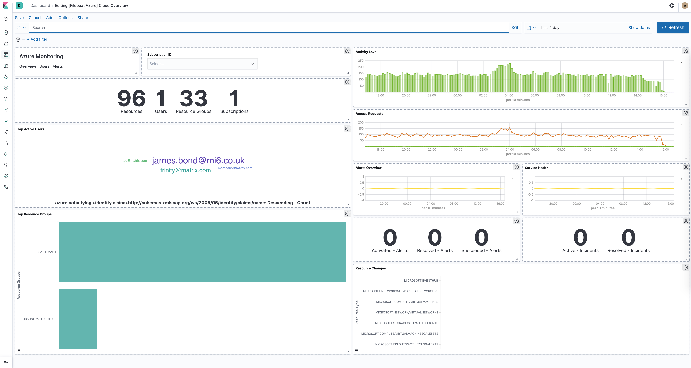

---
mapped_pages:
  - https://www.elastic.co/guide/en/beats/filebeat/current/filebeat-module-azure.html
---

# Azure module [filebeat-module-azure]

:::::{admonition} Prefer to use {{agent}} for this use case?
Refer to the [Elastic Integrations documentation](integration-docs://reference/azure/index.md).

::::{dropdown} Learn more
{{agent}} is a single, unified way to add monitoring for logs, metrics, and other types of data to a host. It can also protect hosts from security threats, query data from operating systems, forward data from remote services or hardware, and more. Refer to the documentation for a detailed [comparison of {{beats}} and {{agent}}](docs-content://reference/fleet/index.md).

::::


:::::


The azure module retrieves different types of log data from Azure. There are several requirements before using the module since the logs will actually be read from azure event hubs.

* the logs have to be exported first to the event hubs [https://docs.microsoft.com/en-us/azure/event-hubs/event-hubs-create-kafka-enabled](https://docs.microsoft.com/en-us/azure/event-hubs/event-hubs-create-kafka-enabled)
* to export activity logs to event hubs users can follow the steps here [https://docs.microsoft.com/en-us/azure/azure-monitor/platform/activity-log-export](https://docs.microsoft.com/en-us/azure/azure-monitor/platform/activity-log-export)
* to export audit and sign-in logs to event hubs users can follow the steps here [https://docs.microsoft.com/en-us/azure/active-directory/reports-monitoring/tutorial-azure-monitor-stream-logs-to-event-hub](https://docs.microsoft.com/en-us/azure/active-directory/reports-monitoring/tutorial-azure-monitor-stream-logs-to-event-hub)

The module contains the following filesets:

`activitylogs`
:   Will retrieve azure activity logs. Control-plane events on Azure Resource Manager resources. Activity logs provide insight into the operations that were performed on resources in your subscription. To learn more, refer to the [Azure Activity log](https://docs.microsoft.com/en-us/azure/azure-monitor/essentials/activity-log) documentation.

`platformlogs`
:   Will retrieve azure platform logs. Platform logs provide detailed diagnostic and auditing information for Azure resources and the Azure platform they depend on. To learn more, refer to the [Azure platform logs](https://docs.microsoft.com/en-us/azure/azure-monitor/essentials/platform-logs-overview) documentation.

`signinlogs`
:   Will retrieve azure Active Directory sign-in logs. The sign-ins report provides information about the usage of managed applications and user sign-in activities. To learn more, refer to the [Azure sign-in logs](https://docs.microsoft.com/en-us/azure/active-directory/reports-monitoring/concept-sign-ins) documentation.

`auditlogs`
:   Will retrieve azure Active Directory audit logs. The audit logs provide traceability through logs for all changes done by various features within Azure AD. Examples of audit logs include changes made to any resources within Azure AD like adding or removing users, apps, groups, roles and policies. To learn more, refer to the [Azure audit logs](https://docs.microsoft.com/en-us/azure/active-directory/reports-monitoring/concept-audit-logs) documentation.


## Module configuration [_module_configuration_3]

```yaml
- module: azure
  activitylogs:
    enabled: true
    var:
      eventhub: "insights-operational-logs"
      consumer_group: "$Default"
      connection_string: ""
      storage_account: ""
      storage_account_key: ""
      resource_manager_endpoint: ""

  platformlogs:
    enabled: false
    var:
      eventhub: ""
      consumer_group: "$Default"
      connection_string: ""
      storage_account: ""
      storage_account_key: ""
      resource_manager_endpoint: ""

  auditlogs:
    enabled: false
    var:
      eventhub: "insights-logs-auditlogs"
      consumer_group: "$Default"
      connection_string: ""
      storage_account: ""
      storage_account_key: ""
      resource_manager_endpoint: ""

  signinlogs:
    enabled: false
    var:
      eventhub: "insights-logs-signinlogs"
      consumer_group: "$Default"
      connection_string: ""
      storage_account: ""
      storage_account_key: ""
      resource_manager_endpoint: ""
```

`eventhub`
:   *string* Is the fully managed, real-time data ingestion service. Default value of `insights-operational-logs` for activitylogs, `insights-logs-auditlogs` for auditlogs, and `insights-logs-signinlogs` for signinlogs. It is recommended to use a separate eventhub for each log type as the field mappings of each log type are different.

`consumer_group`
:   *string* The publish/subscribe mechanism of Event Hubs is enabled through consumer groups. A consumer group is a view (state, position, or offset) of an entire event hub. Consumer groups enable multiple consuming applications to each have a separate view of the event stream, and to read the stream independently at their own pace and with their own offsets. Default value: `$Default`

`connection_string`
:   *string* The connection string required to communicate with Event Hubs, steps here [https://docs.microsoft.com/en-us/azure/event-hubs/event-hubs-get-connection-string](https://docs.microsoft.com/en-us/azure/event-hubs/event-hubs-get-connection-string).

A Blob Storage account is required in order to store/retrieve/update the offset or state of the eventhub messages. This means that after stopping the filebeat azure module it can start back up at the spot that it stopped processing messages.

`storage_account`
:   *string* The name of the storage account the state/offsets will be stored and updated.

`storage_account_key`
:   *string* The storage account key, this key will be used to authorize access to data in your storage account.

`resource_manager_endpoint`
:   *string* Optional, by default we are using the azure public environment, to override, users can provide a specific resource manager endpoint in order to use a different azure environment. Ex: [https://management.chinacloudapi.cn/](https://management.chinacloudapi.cn/) for azure ChinaCloud [https://management.microsoftazure.de/](https://management.microsoftazure.de/) for azure GermanCloud [https://management.azure.com/](https://management.azure.com/) for azure PublicCloud [https://management.usgovcloudapi.net/](https://management.usgovcloudapi.net/) for azure USGovernmentCloud Users can also use this in case of a Hybrid Cloud model, where one may define their own endpoints.

When you run the module, it performs a few tasks under the hood:

* Sets the default paths to the log files (but don’t worry, you can override the defaults)
* Makes sure each multiline log event gets sent as a single event
* Uses an {{es}} ingest pipeline to parse and process the log lines, shaping the data into a structure suitable for visualizing in Kibana

::::{tip}
Read the [quick start](/reference/filebeat/filebeat-installation-configuration.md) to learn how to configure and run modules.
::::


## Dashboards [_dashboards_2]

The azure module comes with several predefined dashboards for general cloud overview, user activity and alerts. For example:




## Fields [_fields_8]

For a description of each field in the module, see the [exported fields](/reference/filebeat/exported-fields-azure.md) section.

