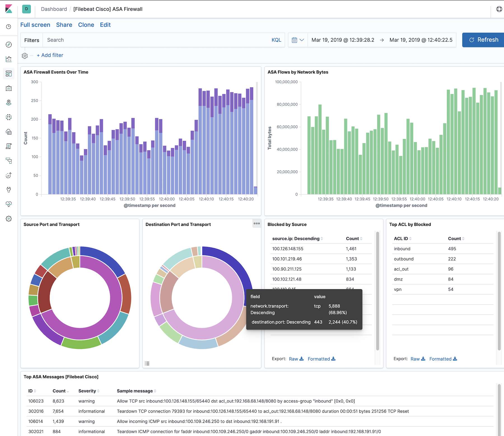

---
mapped_pages:
  - https://www.elastic.co/guide/en/beats/filebeat/current/filebeat-module-cisco.html
---

# Cisco module [filebeat-module-cisco]

:::::{admonition} Prefer to use {{agent}} for this use case?
Refer to the [Elastic Integrations documentation](integration-docs://reference/cisco_asa/index.md).

::::{dropdown} Learn more
{{agent}} is a single, unified way to add monitoring for logs, metrics, and other types of data to a host. It can also protect hosts from security threats, query data from operating systems, forward data from remote services or hardware, and more. Refer to the documentation for a detailed [comparison of {{beats}} and {{agent}}](docs-content://reference/fleet/index.md).

::::


:::::


This is a module for Cisco network device’s logs and Cisco Umbrella. It includes the following filesets for receiving logs over syslog or read from a file:

* `asa` fileset: supports Cisco ASA firewall logs.
* `amp` fileset: supports Cisco AMP API logs.
* `ftd` fileset: supports Cisco Firepower Threat Defense logs.
* `ios` fileset: supports Cisco IOS router and switch logs.
* `umbrella` fileset: supports Cisco Umbrella logs.

Cisco ASA devices also support exporting flow records using NetFlow, which is supported by the [netflow module](/reference/filebeat/filebeat-module-netflow.md) in Filebeat.

When you run the module, it performs a few tasks under the hood:

* Sets the default paths to the log files (but don’t worry, you can override the defaults)
* Makes sure each multiline log event gets sent as a single event
* Uses an {{es}} ingest pipeline to parse and process the log lines, shaping the data into a structure suitable for visualizing in Kibana
* Deploys dashboards for visualizing the log data

::::{tip}
Read the [quick start](/reference/filebeat/filebeat-installation-configuration.md) to learn how to configure and run modules.
::::


## Configure the module [configuring-cisco-module]

You can further refine the behavior of the `cisco` module by specifying [variable settings](#cisco-settings) in the `modules.d/cisco.yml` file, or overriding settings at the command line.

You must enable at least one fileset in the module. **Filesets are disabled by default.**

The module is by default configured to run via syslog on port 9001 for ASA and port 9002 for IOS. However it can also be configured to read from a file path. See the following example.

Cisco Umbrella publishes its logs in a compressed CSV format to a S3 bucket.

```yaml
- module: cisco
  asa:
    enabled: true
    var.paths: ["/var/log/cisco-asa.log"]
    var.input: "file"
```


### Variable settings [cisco-settings]

Each fileset has separate variable settings for configuring the behavior of the module. If you don’t specify variable settings, the `cisco` module uses the defaults.

For advanced use cases, you can also override input settings. See [Override input settings](/reference/filebeat/advanced-settings.md).

::::{tip}
When you specify a setting at the command line, remember to prefix the setting with the module name, for example, `cisco.asa.var.paths` instead of `asa.var.paths`.
::::


### `asa` fileset settings [_asa_fileset_settings]

Example config:

```yaml
- module: cisco
  asa:
    var.syslog_host: 0.0.0.0
    var.syslog_port: 9001
    var.log_level: 5
```

**`var.paths`**
:   An array of glob-based paths that specify where to look for the log files. All patterns supported by [Go Glob](https://golang.org/pkg/path/filepath/#Glob) are also supported here. For example, you can use wildcards to fetch all files from a predefined level of subdirectories: `/path/to/log/*/*.log`. This fetches all `.log` files from the subfolders of `/path/to/log`. It does not fetch log files from the `/path/to/log` folder itself. If this setting is left empty, Filebeat will choose log paths based on your operating system.

**`var.log_level`**
:   An integer between 1 and 7 that allows filtering messages based on the severity level. The different severity levels supported by the Cisco ASA are:

| log_level | severity |
| --- | --- |
| 1 | Alert |
| 2 | Critical |
| 3 | Error |
| 4 | Warning |
| 5 | Notification |
| 6 | Informational |
| 7 | Debugging |

A value of 7 (default) will not filter any messages. A lower value will drop any messages with a severity level higher than the specified value. For example, `var.log_level: 3` will allow messages of level 1 (Alert), 2 (Critical) and 3 (Error). All other messages will be dropped.

::::{note}
The filtering is done in the ingest pipeline, if this setting is changed, the ingest pipeline need to be reloaded manually. To reload the ingest pipeline, set `filebeat.overwrite_pipelines: true` and manually [*Load ingest pipelines*](/reference/filebeat/load-ingest-pipelines.md).
::::


**`var.syslog_host`**
:   The interface to listen to UDP based syslog traffic. Defaults to localhost. Set to 0.0.0.0 to bind to all available interfaces.

**`var.syslog_port`**
:   The UDP port to listen for syslog traffic. Defaults to 9001.

**`var.timezone_offset`**
:   IANA time zone or time offset (e.g. `+0200`) to use when interpreting syslog timestamps without a time zone. Defaults to UTC.

**`var.tags`**
:   A list of tags to include in events. Including `forwarded` indicates that the events did not originate on this host and causes `host.name` to not be added to events. Defaults to `[cisco-asa, forwarded]`.


### `ftd` fileset settings [_ftd_fileset_settings]

The Cisco FTD fileset primarily supports parsing IPv4 and IPv6 access list log messages similar to that of ASA devices as well as Security Event Syslog Messages for Intrusion, Connection, File and Malware events.

**Field mappings**

The `ftd` fileset maps Security Event Syslog Messages to the Elastic Common Schema (ECS) format. The following table illustrates the mapping from Security Event fields to ECS. The `cisco.ftd` prefix is used when there is no corresponding ECS field available.

Mappings for Intrusion events fields:

| FTD Field | Mapped fields |
| --- | --- |
| ApplicationProtocol | network.protocol |
| DstIP | destination.address |
| DstPort | destination.port |
| EgressInterface | cisco.ftd.destination_interface |
| GID | service.id |
| HTTPResponse | http.response.status_code |
| IngressInterface | cisco.ftd.source_interface |
| InlineResult | event.outcome |
| IntrusionPolicy | cisco.ftd.rule_name |
| Message | message |
| Protocol | network.transport |
| SrcIP | source.address |
| SrcPort | source.port |
| User | user.id, user.name |
| WebApplication | network.application |

Mappings for Connection and Security Intelligence events fields:

| FTD Field | Mapped fields |
| --- | --- |
| ACPolicy | cisco.ftd.rule_name |
| AccessControlRuleAction | event.outcome |
| AccessControlRuleName | cisco.ftd.rule_name |
| ApplicationProtocol | network.protocol |
| ConnectionDuration | event.duration |
| DNSQuery | dns.question.name |
| DNSRecordType | dns.question.type |
| DNSResponseType | dns.response_code |
| DstIP | destination.address |
| DstPort | destination.port |
| EgressInterface | cisco.ftd.destination_interface |
| HTTPReferer | http.request.referrer |
| HTTPResponse | http.response.status_code |
| IngressInterface | cisco.ftd.source_interface |
| InitiatorBytes | source.bytes |
| InitiatorPackets | source.packets |
| NetBIOSDomain | host.hostname |
| Protocol | network.transport |
| ReferencedHost | url.domain |
| ResponderBytes | destination.bytes |
| ResponderPackets | destination.packets |
| SSLActualAction | event.outcome |
| SSLServerName | server.domain |
| SrcIP | source.address |
| SrcPort | source.port |
| URL | url.original |
| User | user.name |
| UserAgent | user_agent.original |
| WebApplication | network.application |
| originalClientSrcIP | client.address |

Mappings for File and Malware events fields:

| FTD Field | Mapped fields |
| --- | --- |
| ApplicationProtocol | network.protocol |
| ArchiveFileName | file.name |
| ArchiveSHA256 | file.hash.sha256 |
| Client | network.application |
| DstIP | destination.address |
| DstPort | destination.port |
| FileName | file.name |
| FilePolicy | cisco.ftd.rule_name |
| FileSHA256 | file.hash.sha256 |
| FileSize | file.size |
| FirstPacketSecond | event.start |
| Protocol | network.transport |
| SrcIP | source.address |
| SrcPort | source.port |
| URI | url.original |
| User | user.name |
| WebApplication | network.application |

**Example configuration:**

```yaml
- module: cisco
  ftd:
    var.syslog_host: 0.0.0.0
    var.syslog_port: 9003
    var.log_level: 5
```

**`var.paths`**
:   An array of glob-based paths that specify where to look for the log files. All patterns supported by [Go Glob](https://golang.org/pkg/path/filepath/#Glob) are also supported here. For example, you can use wildcards to fetch all files from a predefined level of subdirectories: `/path/to/log/*/*.log`. This fetches all `.log` files from the subfolders of `/path/to/log`. It does not fetch log files from the `/path/to/log` folder itself. If this setting is left empty, Filebeat will choose log paths based on your operating system.

**`var.log_level`**
:   An integer between 1 and 7 that allows filtering messages based on the severity level. The different severity levels supported by the Cisco ASA are:

| log_level | severity |
| --- | --- |
| 1 | Alert |
| 2 | Critical |
| 3 | Error |
| 4 | Warning |
| 5 | Notification |
| 6 | Informational |
| 7 | Debugging |

A value of 7 (default) will not filter any messages. A lower value will drop any messages with a severity level higher than the specified value. For example, `var.log_level: 3` will allow messages of level 1 (Alert), 2 (Critical) and 3 (Error). All other messages will be dropped.

::::{note}
The filtering is done in the ingest pipeline, if this setting is changed, the ingest pipeline need to be reloaded manually. To reload the ingest pipeline, set `filebeat.overwrite_pipelines: true` and manually [*Load ingest pipelines*](/reference/filebeat/load-ingest-pipelines.md).
::::


**`var.syslog_host`**
:   The interface to listen to UDP based syslog traffic. Defaults to localhost. Set to 0.0.0.0 to bind to all available interfaces.

**`var.syslog_port`**
:   The UDP port to listen for syslog traffic. Defaults to 9003.

**`var.timezone_offset`**
:   IANA time zone or time offset (e.g. `+0200`) to use when interpreting syslog timestamps without a time zone. Defaults to UTC.

**`var.tags`**
:   A list of tags to include in events. Including `forwarded` indicates that the events did not originate on this host and causes `host.name` to not be added to events. Defaults to `[cisco-ftd, forwarded]`.


### `ios` fileset settings [_ios_fileset_settings]

The Cisco IOS fileset primarily supports parsing IPv4 and IPv6 access list log messages.

Example config:

```yaml
- module: cisco
  ios:
    var.syslog_host: 0.0.0.0
    var.syslog_port: 9002
```

**`var.paths`**
:   An array of glob-based paths that specify where to look for the log files. All patterns supported by [Go Glob](https://golang.org/pkg/path/filepath/#Glob) are also supported here. For example, you can use wildcards to fetch all files from a predefined level of subdirectories: `/path/to/log/*/*.log`. This fetches all `.log` files from the subfolders of `/path/to/log`. It does not fetch log files from the `/path/to/log` folder itself. If this setting is left empty, Filebeat will choose log paths based on your operating system.

**`var.syslog_host`**
:   The interface to listen to UDP based syslog traffic. Defaults to localhost. Set to 0.0.0.0 to bind to all available interfaces.

**`var.syslog_port`**
:   The UDP port to listen for syslog traffic. Defaults to 9002.

**`var.tags`**
:   A list of tags to include in events. Including `forwarded` indicates that the events did not originate on this host and causes `host.name` to not be added to events. Defaults to `[cisco-ios, forwarded]`.


### Time zone support [_time_zone_support_3]

This module parses logs that don’t contain time zone information. For these logs, Filebeat reads the local time zone and uses it when parsing to convert the timestamp to UTC. The time zone to be used for parsing is included in the event in the `event.timezone` field.

To disable this conversion, the `event.timezone` field can be removed with the `drop_fields` processor.

If logs are originated from systems or applications with a different time zone to the local one, the `event.timezone` field can be overwritten with the original time zone using the `add_fields` processor.

See [Processors](/reference/filebeat/filtering-enhancing-data.md) for information about specifying processors in your config.


### `umbrella` fileset settings [_umbrella_fileset_settings]

The Cisco Umbrella fileset primarily focuses on reading CSV files from an S3 bucket using the filebeat S3 input.

To configure Cisco Umbrella to log to a self-managed S3 bucket please follow the [Cisco Umbrella User Guide](https://docs.umbrella.com/deployment-umbrella/docs/log-management), and the [AWS S3 input documentation](/reference/filebeat/filebeat-input-aws-s3.md) to setup the necessary Amazon SQS queue.  Retrieving logs from a Cisco-managed S3 bucket is not currently supported.

This fileset supports all 4 log types: - Proxy - Cloud Firewall - IP Logs - DNS logs

The Cisco Umbrella fileset depends on the original file path structure being followed. This structure is documented [Umbrella Log Formats and Versioning](https://docs.umbrella.com/deployment-umbrella/docs/log-formats-and-versioning):

<subfolder>/<YYYY>-<MM>-<DD>/<YYYY>-<MM>-<DD>-<hh>-<mm>-<xxxx>.csv.gz dnslogs/<year>-<month>-<day>/<year>-<month>-<day>-<hour>-<minute>.csv.gz

Example config:

```yaml
- module: cisco
  umbrella:
    enabled: true
    var.input: aws-s3
    var.queue_url: https://sqs.us-east-1.amazonaws.com/ID/CiscoQueue
    var.access_key_id: 123456
    var.secret_access_key: PASSWORD
```

**`var.input`**
:   The input from which messages are read. Can be S3 or file.

**`var.queue_url`**
:   The URL to the SQS queue if the input type is S3.

**`var.access_key_id`**
:   The ID for the access key used to read from the SQS queue.

**`var.secret_access_key`**
:   The secret token used for authenticating to the SQS queue.

**`var.visibility_timeout`**
:   The duration that the received messages are hidden from ReceiveMessage request. Default to be 300 seconds.

**`var.api_timeout`**
:   Maximum duration before AWS API request will be interrupted. Default to be 120 seconds.


### `amp` fileset settings [_amp_fileset_settings]

The Cisco AMP fileset focuses on collecting events from your Cisco AMP/Cisco Secure Endpoint API.

To configure the Cisco AMP fileset you will need to retrieve your `client_id` and `api_key` from the AMP dashboard. For more information on how to retrieve these credentials, please reference the [Cisco AMP API documentation](https://api-docs.amp.cisco.com/api_resources?api_host=api.amp.cisco.com&api_version=v1).

The URL configured for the API depends on which region your AMP is located, currently there are three choices: - api.amp.cisco.com - api.apjc.amp.cisco.com - api.eu.amp.cisco.com

If new endpoints are added by Cisco in the future, please reference the API URL list located at the [Cisco AMP API Docs](https://api-docs.amp.cisco.com/).

Example config:

```yaml
- module: cisco
  amp:
    enabled: true
    var.input: httpjson
    var.url: https://api.amp.cisco.com/v1/events
    var.client_id: 123456
    var.api_key: sfda987gdf90s0df0
```

When starting up the Filebeat module for the first time, you are able to configure how far back you want Filebeat to collect existing events from. It is also possible to select how often Filebeat will check the Cisco AMP API. Another example below which looks back 200 hours and have a custom timeout:

```yaml
- module: cisco
  amp:
    enabled: true
    var.input: httpjson
    var.url: https://api.amp.cisco.com/v1/events
    var.client_id: 123456
    var.api_key: sfda987gdf90s0df0
    var.first_interval: 200h
    var.interval: 60m
    var.request_timeout: 120s
    var.limit: 100
```

**`var.input`**
:   The input from which messages are read. Supports httpjson.

**`var.url`**
:   The URL to the Cisco AMP API endpoint, this url value depends on your region. It will be the same region as your Cisco AMP Dashboard URL.

**`var.client_id`**
:   The ID for the user account used to access the API.

**`var.api_key`**
:   The API secret used together with the related client_id.

**`var.request_timeout`**
:   When handling large influxes of events, especially for large enterprises, the API might take longer to respond. This value is to set a custom timeout value for each request sent by Filebeat.

**`var.first_interval`**
:   How far back you would want to collect events the first time the Filebeat module starts up. Supports amount in hours(example: 24h), minutes(example: 10m) and seconds(example: 50s).

**`var.limit`**
:   This value controls how many events are returned by the Cisco AMP API per page.


## Example dashboard [_example_dashboard_3]

This module comes with a sample dashboard for ASA:

% TO DO: Use `:class: screenshot`



## Fields [_fields_11]

For a description of each field in the module, see the [exported fields](/reference/filebeat/exported-fields-cisco.md) section.
