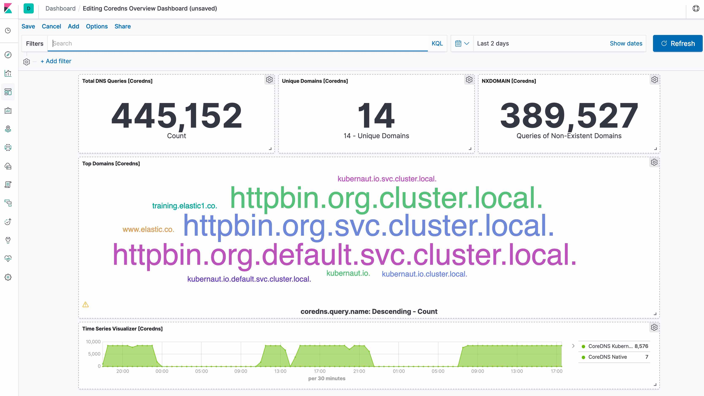

---
mapped_pages:
  - https://www.elastic.co/guide/en/beats/filebeat/current/filebeat-module-coredns.html
---

# CoreDNS module [filebeat-module-coredns]

This is a filebeat module for CoreDNS. It supports both standalone CoreDNS deployment and CoreDNS deployment in Kubernetes.

::::{tip}
Read the [quick start](/reference/filebeat/filebeat-installation-configuration.md) to learn how to configure and run modules.
::::


## Compatibility [_compatibility_8]

Although this module has been developed against Kubernetes v1.13.x, it is expected to work with other versions of Kubernetes.


## Configure the module [configuring-coredns-module]

You can further refine the behavior of the `coredns` module by specifying [variable settings](#coredns-settings) in the `modules.d/coredns.yml` file, or overriding settings at the command line.

You must enable at least one fileset in the module. **Filesets are disabled by default.**


### Variable settings [coredns-settings]

Each fileset has separate variable settings for configuring the behavior of the module. If you don’t specify variable settings, the `coredns` module uses the defaults.

For advanced use cases, you can also override input settings. See [Override input settings](/reference/filebeat/advanced-settings.md).

::::{tip}
When you specify a setting at the command line, remember to prefix the setting with the module name, for example, `coredns.log.var.paths` instead of `log.var.paths`.
::::


### `log` fileset settings [_log_fileset_settings_3]

Example config:

```yaml
- module: coredns
  log:
    enabled: true
    var.paths: ["/var/log/coredns.log"]
    var.tags: ["coredns", "staging"]
```

**`var.paths`**
:   An array of glob-based paths that specify where to look for the log files. All patterns supported by [Go Glob](https://golang.org/pkg/path/filepath/#Glob) are also supported here. For example, you can use wildcards to fetch all files from a predefined level of subdirectories: `/path/to/log/*/*.log`. This fetches all `.log` files from the subfolders of `/path/to/log`. It does not fetch log files from the `/path/to/log` folder itself. If this setting is left empty, Filebeat will choose log paths based on your operating system.

**`var.tags`**
:   An array of tags describing the monitored CoreDNS setup.


## Example dashboard [_example_dashboard_4]

This module comes with a sample dashboard.

% TO DO: Use `:class: screenshot`



## Fields [_fields_12]

For a description of each field in the module, see the [exported fields](/reference/filebeat/exported-fields-coredns.md) section.
