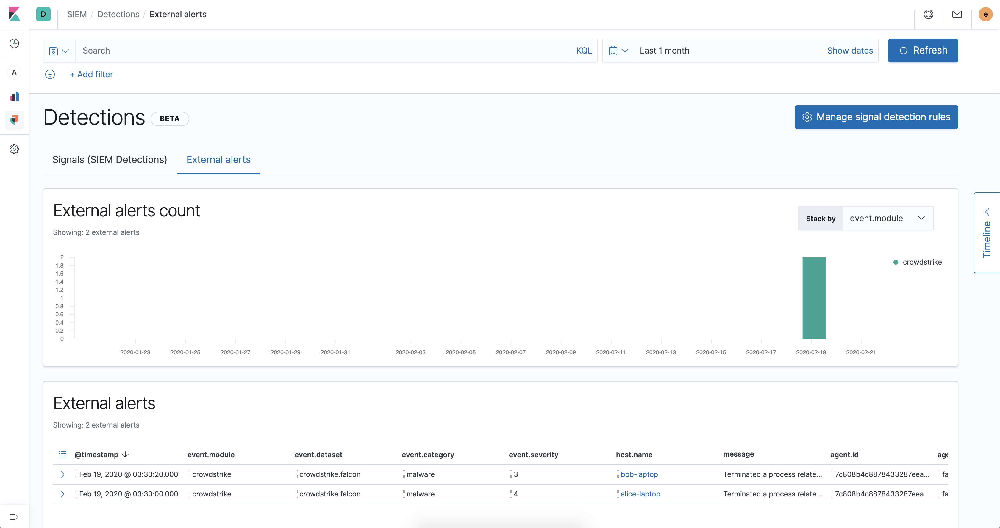

---
mapped_pages:
  - https://www.elastic.co/guide/en/beats/filebeat/current/filebeat-module-crowdstrike.html
---

# CrowdStrike module [filebeat-module-crowdstrike]

:::::{admonition} Prefer to use {{agent}} for this use case?
Refer to the [Elastic Integrations documentation](integration-docs://reference/crowdstrike/index.md).

::::{dropdown} Learn more
{{agent}} is a single, unified way to add monitoring for logs, metrics, and other types of data to a host. It can also protect hosts from security threats, query data from operating systems, forward data from remote services or hardware, and more. Refer to the documentation for a detailed [comparison of {{beats}} and {{agent}}](docs-content://reference/fleet/index.md).

::::


:::::


This is the Filebeat module for CrowdStrike Falcon using the Falcon [SIEM Connector](https://www.crowdstrike.com/blog/tech-center/integrate-with-your-siem). This module collects this data, converts it to ECS, and ingests it to view in the SIEM. By default, the Falcon SIEM connector outputs JSON formatted Falcon Streaming API event data.

This module segments events forwarded by the Falcon SIEM connector into two datasets for endpoint data and Falcon platform audit data.

When you run the module, it performs a few tasks under the hood:

* Sets the default paths to the log files (but don’t worry, you can override the defaults)
* Makes sure each multiline log event gets sent as a single event
* Uses an {{es}} ingest pipeline to parse and process the log lines, shaping the data into a structure suitable for visualizing in Kibana
* Deploys dashboards for visualizing the log data

::::{tip}
Read the [quick start](/reference/filebeat/filebeat-installation-configuration.md) to learn how to configure and run modules.
::::


## Compatibility [_compatibility_9]

This input supports CrowdStrike Falcon SIEM-Connector-v2.0.


## Configure the module [configuring-crowdstrike-module]

You can further refine the behavior of the `crowdstrike` module by specifying [variable settings](#crowdstrike-settings) in the `modules.d/crowdstrike.yml` file, or overriding settings at the command line.

You must enable at least one fileset in the module. **Filesets are disabled by default.**


### Variable settings [crowdstrike-settings]

Each fileset has separate variable settings for configuring the behavior of the module. If you don’t specify variable settings, the `crowdstrike` module uses the defaults.

For advanced use cases, you can also override input settings. See [Override input settings](/reference/filebeat/advanced-settings.md).

::::{tip}
When you specify a setting at the command line, remember to prefix the setting with the module name, for example, `crowdstrike.falcon_endpoint.var.paths` instead of `falcon_endpoint.var.paths`.
::::


### `falcon` fileset settings [_falcon_fileset_settings]

The fileset is by default configured to collect JSON formated event data from `/var/log/crowdstrike/falconhoseclient/output`. It forwards DetectionSummaryEvent and IncidentSummaryEvent events.

```yaml
var:
  - name: paths
    default:
      - /var/log/crowdstrike/falconhoseclient/output
```

**`var.paths`**
:   An array of glob-based paths that specify where to look for the log files. All patterns supported by [Go Glob](https://golang.org/pkg/path/filepath/#Glob) are also supported here. For example, you can use wildcards to fetch all files from a predefined level of subdirectories: `/path/to/log/*/*.log`. This fetches all `.log` files from the subfolders of `/path/to/log`. It does not fetch log files from the `/path/to/log` folder itself. If this setting is left empty, Filebeat will choose log paths based on your operating system.


## Dashboards [_dashboards_3]

The best way to view CrowdStrike events and alert data is in the SIEM.

% TO DO: Use `:class: screenshot`


For alerts, go to Detections → External alerts.

% TO DO: Use `:class: screenshot`


And for all over event CrowdStrike Falcon event types, go to Host → Events.


## Fields [_fields_13]

For a description of each field in the module, see the [exported fields](/reference/filebeat/exported-fields-crowdstrike.md) section.
