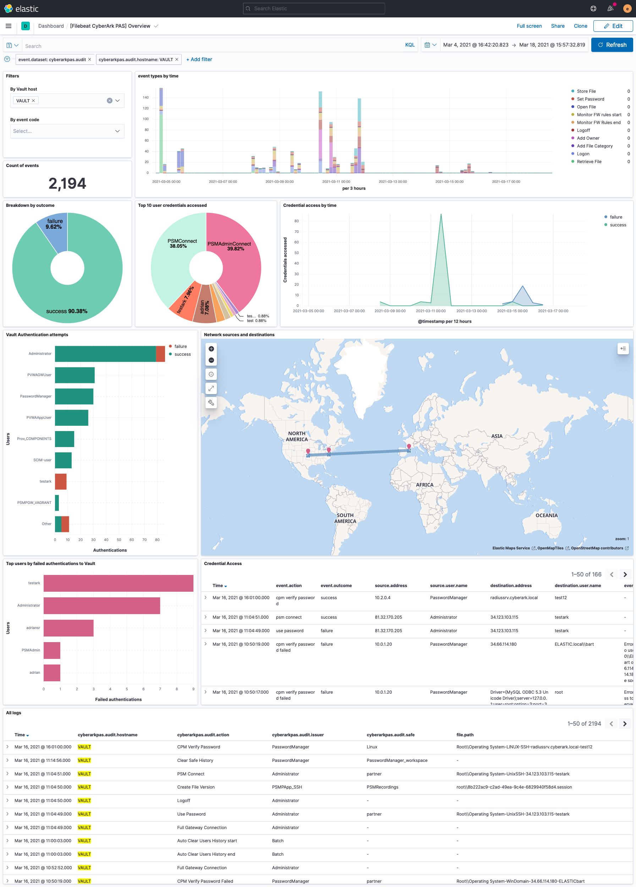

---
mapped_pages:
  - https://www.elastic.co/guide/en/beats/filebeat/current/filebeat-module-cyberarkpas.html
---

# Cyberark PAS module [filebeat-module-cyberarkpas]

::::{warning}
This functionality is in beta and is subject to change. The design and code is less mature than official GA features and is being provided as-is with no warranties. Beta features are not subject to the support SLA of official GA features.
::::


:::::{admonition} Prefer to use {{agent}} for this use case?
Refer to the [Elastic Integrations documentation](integration-docs://reference/cyberarkpas/index.md).

::::{dropdown} Learn more
{{agent}} is a single, unified way to add monitoring for logs, metrics, and other types of data to a host. It can also protect hosts from security threats, query data from operating systems, forward data from remote services or hardware, and more. Refer to the documentation for a detailed [comparison of {{beats}} and {{agent}}](docs-content://reference/fleet/index.md).

::::


:::::


This is a module for receiving CyberArk Privileged Account Security (PAS) logs over Syslog or a file.

The [ingest-geoip](elasticsearch://reference/enrich-processor/geoip-processor.md) Elasticsearch plugin is required to run this module.

::::{tip}
Read the [quick start](/reference/filebeat/filebeat-installation-configuration.md) to learn how to configure and run modules.
::::


## Configure the module [configuring-cyberarkpas-module]

You can further refine the behavior of the `cyberarkpas` module by specifying [variable settings](#cyberarkpas-settings) in the `modules.d/cyberarkpas.yml` file, or overriding settings at the command line.

You must enable at least one fileset in the module. **Filesets are disabled by default.**


### `audit` fileset settings [_audit_fileset_settings]

The `audit` fileset receives Vault Audit logs for User and Safe activities over the syslog protocol.


#### Vault configuration [_vault_configuration]

Follow the steps under [Security Information and Event Management (SIEM) Applications](https://docs.cyberark.com/Product-Doc/OnlineHelp/PAS/Latest/en/Content/PASIMP/DV-Integrating-with-SIEM-Applications.htm) documentation to setup the integration:

* Copy the [elastic-json-v1.0.xsl](https://raw.githubusercontent.com/elastic/beats/master/x-pack/filebeat/module/cyberarkpas/_meta/assets/elastic-json-v1.0.xsl) XSL Translator file to the `Server\Syslog` folder.
* Sample syslog configuration for `DBPARM.ini`:

```ini
[SYSLOG]
UseLegacySyslogFormat=No
SyslogTranslatorFile=Syslog\elastic-json-v1.0.xsl
SyslogServerIP=<INSERT FILEBEAT IP HERE>
SyslogServerPort=<INSERT FILEBEAT PORT HERE>
SyslogServerProtocol=TCP
```

For proper timestamping of events, it’s recommended to use the newer RFC5424 Syslog format (`UseLegacySyslogFormat=No`). To avoid event loss, use `TCP` or `TLS` protocols instead of `UDP`.


#### Filebeat configuration [_filebeat_configuration]

Edit the `cyberarkpas.yml` configuration. The following sample configuration will accept `TCP` protocol connections from all interfaces:

```yaml
- module: cyberarkpas
  audit:
    enabled: true

    # Set which input to use between tcp (default), udp, or file.
    #
    var.input: tcp
    var.syslog_host: 0.0.0.0
    var.syslog_port: 9301

    # With tcp input, set the optional tls configuration:
    #var.ssl:
    #  enabled: true
    #  certificate: /path/to/cert.pem
    #  key: /path/to/privatekey.pem
    #  key_passphrase: 'password for my key'

    # Uncoment to keep the original syslog event under event.original.
    # var.preserve_original_event: true

    # Set paths for the log files when file input is used.
    # var.paths:
```

For encrypted communications, follow the [CyberArk documentation](https://docs.cyberark.com/Product-Doc/OnlineHelp/PAS/Latest/en/Content/PASIMP/DV-Integrating-with-SIEM-Applications.htm#ConfigureSIEMintegration) to configure encrypted protocol in the Vault server and use `tcp` input with `var.ssl` settings in Filebeat:

```yaml
- module: cyberarkpas
  audit:
    enabled: true

    # Set which input to use between tcp (default), udp, or file.
    #
    var.input: tcp
    var.syslog_host: 0.0.0.0
    var.syslog_port: 9301

    # With tcp input, set the optional tls configuration:
    var.ssl:
      enabled: true
      certificate: /path/to/cert.pem
      key: /path/to/privatekey.pem
      key_passphrase: 'password for my key'

    # Uncoment to keep the original syslog event under event.original.
    # var.preserve_original_event: true

    # Set paths for the log files when file input is used.
    # var.paths:
```


#### Configuration options [_configuration_options_41]


### Variable settings [cyberarkpas-settings]

Each fileset has separate variable settings for configuring the behavior of the module. If you don’t specify variable settings, the `cyberarkpas` module uses the defaults.

For advanced use cases, you can also override input settings. See [Override input settings](/reference/filebeat/advanced-settings.md).

::::{tip}
When you specify a setting at the command line, remember to prefix the setting with the module name, for example, `cyberarkpas.audit.var.paths` instead of `audit.var.paths`.
::::


**`var.input`**
:   The input to use. One of `tcp` (default), `udp` or `file`.

**`var.syslog_host`**
:   The address to listen to UDP or TCP based syslog traffic. Defaults to `localhost`. Set to `0.0.0.0` to bind to all available interfaces.

**`var.syslog_port`**
:   The port to listen for syslog traffic. Defaults to `9301`.

::::{note}
Ports below 1024 require Filebeat to run as root.
::::


**`var.ssl`**
:   Configuration options for SSL parameters to use when acting as a server for `TLS` protocol. See [SSL server configuration options.](/reference/filebeat/configuration-ssl.md#ssl-server-config) for a description of the available sub-options.

**`var.preserve_original_event`**
:   Set to `true` to store the original syslog message under the `event.original` field. Defaults to `false`.

**`var.paths`**
:   An array of glob-based paths that specify where to look for the log files. All patterns supported by [Go Glob](https://golang.org/pkg/path/filepath/#Glob) are also supported here. For example, you can use wildcards to fetch all files from a predefined level of subdirectories: `/path/to/log/*/*.log`. This fetches all `.log` files from the subfolders of `/path/to/log`. It does not fetch log files from the `/path/to/log` folder itself.

This setting is only applicable when `file` input is configured.


## Example dashboard [_example_dashboard_5]

This module comes with a sample dashboard:

% TO DO: Use `:class: screenshot`



## Fields [_fields_14]

For a description of each field in the module, see the [exported fields](/reference/filebeat/exported-fields-cyberarkpas.md) section.
