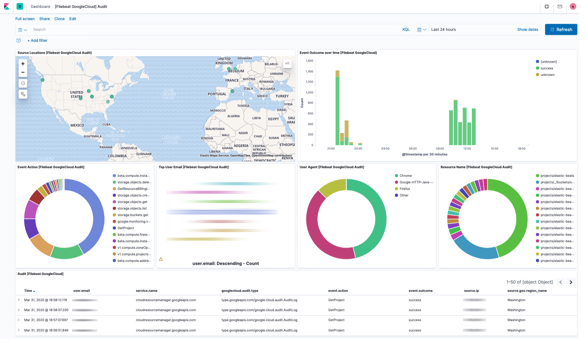

---
mapped_pages:
  - https://www.elastic.co/guide/en/beats/filebeat/current/filebeat-module-gcp.html
---

# Google Cloud module [filebeat-module-gcp]

:::::{admonition} Prefer to use {{agent}} for this use case?
Refer to the [Elastic Integrations documentation](integration-docs://reference/gcp/index.md).

::::{dropdown} Learn more
{{agent}} is a single, unified way to add monitoring for logs, metrics, and other types of data to a host. It can also protect hosts from security threats, query data from operating systems, forward data from remote services or hardware, and more. Refer to the documentation for a detailed [comparison of {{beats}} and {{agent}}](docs-content://reference/fleet/index.md).

::::


:::::


This is a module for Google Cloud logs. It supports reading audit, VPC flow, and firewall logs that have been exported from Stackdriver to a Google Pub/Sub topic sink.

When you run the module, it performs a few tasks under the hood:

* Sets the default paths to the log files (but don’t worry, you can override the defaults)
* Makes sure each multiline log event gets sent as a single event
* Uses an {{es}} ingest pipeline to parse and process the log lines, shaping the data into a structure suitable for visualizing in Kibana

::::{tip}
Read the [quick start](/reference/filebeat/filebeat-installation-configuration.md) to learn how to configure and run modules.
::::


## Configure the module [configuring-gcp-module]

You can further refine the behavior of the `gcp` module by specifying [variable settings](#gcp-settings) in the `modules.d/gcp.yml` file, or overriding settings at the command line.

You must enable at least one fileset in the module. **Filesets are disabled by default.**


### Variable settings [gcp-settings]

Each fileset has separate variable settings for configuring the behavior of the module. If you don’t specify variable settings, the `gcp` module uses the defaults.

For advanced use cases, you can also override input settings. See [Override input settings](/reference/filebeat/advanced-settings.md).

::::{tip}
When you specify a setting at the command line, remember to prefix the setting with the module name, for example, `gcp.audit.var.paths` instead of `audit.var.paths`.
::::


### `audit` fileset settings [_audit_fileset_settings_2]

% TO DO: Use `:class: screenshot`


Example config:

```yaml
- module: gcp
  audit:
    enabled: true
    var.project_id: my-gcp-project-id
    var.topic: gcp-vpc-audit
    var.subscription_name: filebeat-gcp-audit-sub
    var.credentials_file: ${path.config}/gcp-service-account-xyz.json
    var.keep_original_message: false
```

**`var.paths`**
:   An array of glob-based paths that specify where to look for the log files. All patterns supported by [Go Glob](https://golang.org/pkg/path/filepath/#Glob) are also supported here. For example, you can use wildcards to fetch all files from a predefined level of subdirectories: `/path/to/log/*/*.log`. This fetches all `.log` files from the subfolders of `/path/to/log`. It does not fetch log files from the `/path/to/log` folder itself. If this setting is left empty, Filebeat will choose log paths based on your operating system.

**`var.project_id`**
:   Google Cloud project ID.

**`var.topic`**
:   Google Cloud Pub/Sub topic name.

**`var.subscription_name`**
:   Google Cloud Pub/Sub topic subscription name. If the subscription does not exist it will be created.

**`var.credentials_file`**
:   Path to a JSON file containing the credentials and key used to subscribe.

**`var.keep_original_message`**
:   Flag to control whether the original message is stored in the `log.original` field. Defaults to `false`, meaning the original message is not saved.


### `vpcflow` fileset settings [_vpcflow_fileset_settings]

Example config:

```yaml
- module: gcp
  vpcflow:
    enabled: true
    var.project_id: my-gcp-project-id
    var.topic: gcp-vpc-flowlogs
    var.subscription_name: filebeat-gcp-vpc-flowlogs-sub
    var.credentials_file: ${path.config}/gcp-service-account-xyz.json
    var.keep_original_message: false
```

**`var.paths`**
:   An array of glob-based paths that specify where to look for the log files. All patterns supported by [Go Glob](https://golang.org/pkg/path/filepath/#Glob) are also supported here. For example, you can use wildcards to fetch all files from a predefined level of subdirectories: `/path/to/log/*/*.log`. This fetches all `.log` files from the subfolders of `/path/to/log`. It does not fetch log files from the `/path/to/log` folder itself. If this setting is left empty, Filebeat will choose log paths based on your operating system.

**`var.project_id`**
:   Google Cloud project ID.

**`var.topic`**
:   Google Cloud Pub/Sub topic name.

**`var.subscription_name`**
:   Google Cloud Pub/Sub topic subscription name. If the subscription does not exist it will be created.

**`var.credentials_file`**
:   Path to a JSON file containing the credentials and key used to subscribe.

**`var.keep_original_message`**
:   Flag to control whether the original message is stored in the `log.original` field. Defaults to `false`, meaning the original message is not saved.


### `firewall` fileset settings [_firewall_fileset_settings_3]

Example config:

```yaml
- module: gcp
  firewall:
    enabled: true
    var.project_id: my-gcp-project-id
    var.topic: gcp-vpc-firewall
    var.subscription_name: filebeat-gcp-vpc-firewall-sub
    var.credentials_file: ${path.config}/gcp-service-account-xyz.json
    var.keep_original_message: false
```

**`var.paths`**
:   An array of glob-based paths that specify where to look for the log files. All patterns supported by [Go Glob](https://golang.org/pkg/path/filepath/#Glob) are also supported here. For example, you can use wildcards to fetch all files from a predefined level of subdirectories: `/path/to/log/*/*.log`. This fetches all `.log` files from the subfolders of `/path/to/log`. It does not fetch log files from the `/path/to/log` folder itself. If this setting is left empty, Filebeat will choose log paths based on your operating system.

**`var.project_id`**
:   Google Cloud project ID.

**`var.topic`**
:   Google Cloud Pub/Sub topic name.

**`var.subscription_name`**
:   Google Cloud Pub/Sub topic subscription name. If the subscription does not exist it will be created.

**`var.credentials_file`**
:   Path to a JSON file containing the credentials and key used to subscribe.

**`var.keep_original_message`**
:   Flag to control whether the original message is stored in the `log.original` field. Defaults to `false`, meaning the original message is not saved.


## Fields [_fields_18]

For a description of each field in the module, see the [exported fields](/reference/filebeat/exported-fields-gcp.md) section.
