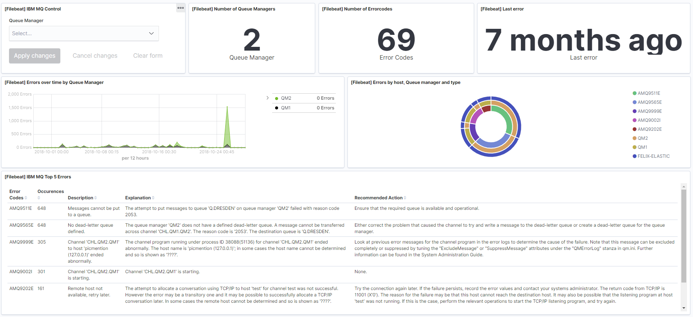

---
mapped_pages:
  - https://www.elastic.co/guide/en/beats/filebeat/current/filebeat-module-ibmmq.html
---

# IBM MQ module [filebeat-module-ibmmq]

The `ibmmq` module collects and parses the queue manager error logs from IBM MQ in the standard format.

When you run the module, it performs a few tasks under the hood:

* Sets the default paths to the log files (but don’t worry, you can override the defaults)
* Makes sure each multiline log event gets sent as a single event
* Uses an {{es}} ingest pipeline to parse and process the log lines, shaping the data into a structure suitable for visualizing in Kibana

::::{tip}
Read the [quick start](/reference/filebeat/filebeat-installation-configuration.md) to learn how to configure and run modules.
::::


## Compatibility [_compatibility_15]

This module has been tested with IBM MQ v9.1.0.0, but it should be compatible with older versions.


## Configure the module [configuring-ibmmq-module]

You can further refine the behavior of the `ibmmq` module by specifying [variable settings](#ibmmq-settings) in the `modules.d/ibmmq.yml` file, or overriding settings at the command line.

You must enable at least one fileset in the module. **Filesets are disabled by default.**

The following example shows how to set paths in the `modules.d/ibmmq.yml` file to override the default paths for IBM MQ errorlog:

```yaml
- module: ibmmq
  errorlog:
    enabled: true
    var.paths: ["C:/ibmmq/logs/*.log"]
```


### Variable settings [ibmmq-settings]

Each fileset has separate variable settings for configuring the behavior of the module. If you don’t specify variable settings, the `ibmmq` module uses the defaults.

For advanced use cases, you can also override input settings. See [Override input settings](/reference/filebeat/advanced-settings.md).

::::{tip}
When you specify a setting at the command line, remember to prefix the setting with the module name, for example, `ibmmq.errorlog.var.paths` instead of `errorlog.var.paths`.
::::


### `errorlog` fileset settings [_errorlog_fileset_settings]

**`var.paths`**
:   An array of glob-based paths that specify where to look for the log files. All patterns supported by [Go Glob](https://golang.org/pkg/path/filepath/#Glob) are also supported here. For example, you can use wildcards to fetch all files from a predefined level of subdirectories: `/path/to/log/*/*.log`. This fetches all `.log` files from the subfolders of `/path/to/log`. It does not fetch log files from the `/path/to/log` folder itself. If this setting is left empty, Filebeat will choose log paths based on your operating system.


## Example dashboard [_example_dashboard_8]

This module comes with a sample dashboard. For example:

% TO DO: Use `:class: screenshot`



## Fields [_fields_21]

For a description of each field in the module, see the [exported fields](/reference/filebeat/exported-fields-ibmmq.md) section.
