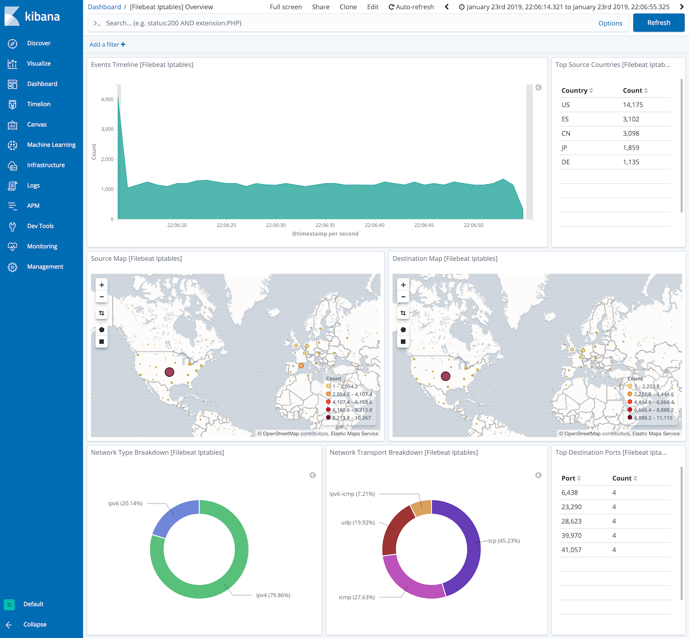
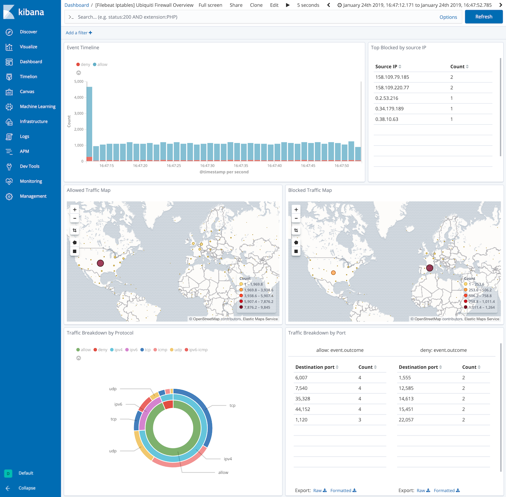

---
mapped_pages:
  - https://www.elastic.co/guide/en/beats/filebeat/current/filebeat-module-iptables.html
---

# Iptables module [filebeat-module-iptables]

:::::{admonition} Prefer to use {{agent}} for this use case?
Refer to the [Elastic Integrations documentation](integration-docs://reference/iptables/index.md).

::::{dropdown} Learn more
{{agent}} is a single, unified way to add monitoring for logs, metrics, and other types of data to a host. It can also protect hosts from security threats, query data from operating systems, forward data from remote services or hardware, and more. Refer to the documentation for a detailed [comparison of {{beats}} and {{agent}}](docs-content://reference/fleet/index.md).

::::


:::::


This is a module for iptables and ip6tables logs. It parses logs received over the network via syslog or from a file. Also, it understands the prefix added by some Ubiquiti firewalls, which includes the rule set name, rule number and the action performed on the traffic (allow/deny).

When you run the module, it performs a few tasks under the hood:

* Sets the default input to `syslog` and binds to `localhost` port `9001` (but don’t worry, you can override the defaults).
* Uses an ingest pipeline to parse and process the log lines, shaping the data into a structure suitable for visualizing in Kibana.
* Deploys dashboards for visualizing the log data.

::::{tip}
Read the [quick start](/reference/filebeat/filebeat-installation-configuration.md) to learn how to configure and run modules.
::::


## Configure the module [configuring-iptables-module]

You can further refine the behavior of the `iptables` module by specifying [variable settings](#iptables-settings) in the `modules.d/iptables.yml` file, or overriding settings at the command line.

You must enable at least one fileset in the module. **Filesets are disabled by default.**

The module is by default configured to run via syslog on port 9001. However it can also be configured to read from a file path. See the following example.

```yaml
- module: iptables
  log:
    enabled: true
    var.paths: ["/var/log/iptables.log"]
    var.input: "file"
```


### Variable settings [iptables-settings]

Each fileset has separate variable settings for configuring the behavior of the module. If you don’t specify variable settings, the `iptables` module uses the defaults.

For advanced use cases, you can also override input settings. See [Override input settings](/reference/filebeat/advanced-settings.md).

::::{tip}
When you specify a setting at the command line, remember to prefix the setting with the module name, for example, `iptables.log.var.paths` instead of `log.var.paths`.
::::


### `log` log fileset settings [_log_log_fileset_settings_2]

**`var.paths`**
:   An array of glob-based paths that specify where to look for the log files. All patterns supported by [Go Glob](https://golang.org/pkg/path/filepath/#Glob) are also supported here. For example, you can use wildcards to fetch all files from a predefined level of subdirectories: `/path/to/log/*/*.log`. This fetches all `.log` files from the subfolders of `/path/to/log`. It does not fetch log files from the `/path/to/log` folder itself. If this setting is left empty, Filebeat will choose log paths based on your operating system.

**`var.syslog_host`**
:   The interface to listen to UDP based syslog traffic. Defaults to `localhost`. Set to `0.0.0.0` to bind to all available interfaces.

**`var.syslog_port`**
:   The UDP port to listen for syslog traffic. Defaults to `9001`

::::{note}
Ports below 1024 require Filebeat to run as root.
::::


**`var.tags`**
:   A list of tags to include in events. Including `forwarded` indicates that the events did not originate on this host and causes `host.name` to not be added to events. Defaults to `[iptables, forwarded]`.


### Time zone support [_time_zone_support_7]

This module parses logs that don’t contain time zone information. For these logs, Filebeat reads the local time zone and uses it when parsing to convert the timestamp to UTC. The time zone to be used for parsing is included in the event in the `event.timezone` field.

To disable this conversion, the `event.timezone` field can be removed with the `drop_fields` processor.

If logs are originated from systems or applications with a different time zone to the local one, the `event.timezone` field can be overwritten with the original time zone using the `add_fields` processor.

See [Processors](/reference/filebeat/filtering-enhancing-data.md) for information about specifying processors in your config.


## Example dashboard [_example_dashboard_11]

This module comes with sample dashboards showing geolocation and network protocols used. One for all iptables logs:

% TO DO: Use `:class: screenshot`


and one specific for Ubiquiti Firewall logs:

% TO DO: Use `:class: screenshot`



## Fields [_fields_24]

For a description of each field in the module, see the [exported fields](/reference/filebeat/exported-fields-iptables.md) section.
