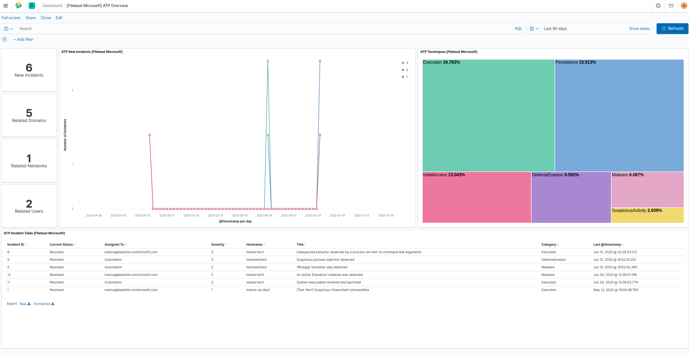
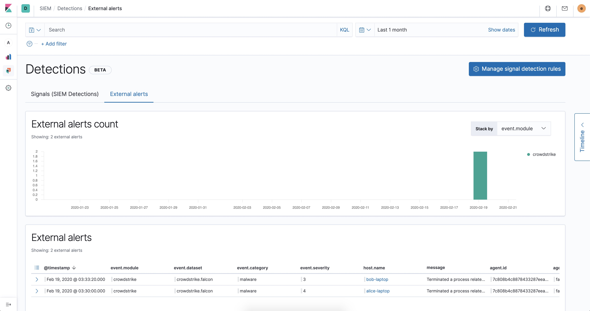
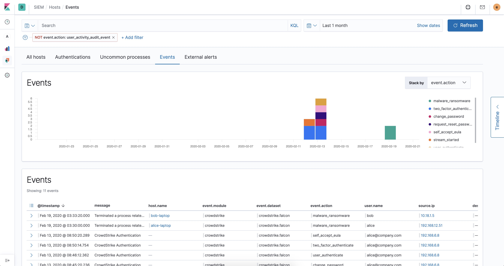

---
mapped_pages:
  - https://www.elastic.co/guide/en/beats/filebeat/current/filebeat-module-microsoft.html
---

# Microsoft module [filebeat-module-microsoft]

:::::{admonition} Prefer to use {{agent}} for this use case?
Refer to the [Elastic Integrations documentation](integration-docs://reference/m365_defender/index.md).

::::{dropdown} Learn more
{{agent}} is a single, unified way to add monitoring for logs, metrics, and other types of data to a host. It can also protect hosts from security threats, query data from operating systems, forward data from remote services or hardware, and more. Refer to the documentation for a detailed [comparison of {{beats}} and {{agent}}](docs-content://reference/fleet/index.md).

::::


:::::


This is a module for ingesting data from the different Microsoft Products. Currently supports these filesets:

* `defender_atp` fileset: Supports Microsoft Defender for Endpoint (Microsoft Defender ATP)
* `m365_defender` fileset: Supports Microsoft 365 Defender (Microsoft Threat Protection)

When you run the module, it performs a few tasks under the hood:

* Sets the default paths to the log files (but don’t worry, you can override the defaults)
* Makes sure each multiline log event gets sent as a single event
* Uses an {{es}} ingest pipeline to parse and process the log lines, shaping the data into a structure suitable for visualizing in Kibana
* Deploys dashboards for visualizing the log data

::::{tip}
Read the [quick start](/reference/filebeat/filebeat-installation-configuration.md) to learn how to configure and run modules.
::::


## Configure the module [configuring-microsoft-module]

You can further refine the behavior of the `microsoft` module by specifying [variable settings](#microsoft-settings) in the `modules.d/microsoft.yml` file, or overriding settings at the command line.

You must enable at least one fileset in the module. **Filesets are disabled by default.**


### Variable settings [microsoft-settings]

Each fileset has separate variable settings for configuring the behavior of the module. If you don’t specify variable settings, the `microsoft` module uses the defaults.

For advanced use cases, you can also override input settings. See [Override input settings](/reference/filebeat/advanced-settings.md).

::::{tip}
When you specify a setting at the command line, remember to prefix the setting with the module name, for example, `microsoft.defender_atp.var.paths` instead of `defender_atp.var.paths`.
::::


### `m365_defender` fileset settings [_m365_defender_fileset_settings]

To configure access for Filebeat to Microsoft 365 Defender you will have to create a new Azure Application registration, this will again return Oauth tokens with access to the Microsoft 365 Defender API

The procedure to create an application is found on the below link:

[Create a new Azure Application](https://docs.microsoft.com/en-us/microsoft-365/security/mtp/api-create-app-web?view=o365-worldwide#create-an-app)

When giving the application the API permissions described in the documentation (Incident.Read.All) it will only grant access to read Incidents from 365 Defender and nothing else in the Azure Domain.

After the application has been created, it should contain 3 values that you need to apply to the module configuration.

These values are:

* Client ID
* Client Secret
* Tenant ID

Example config:

```yaml
- module: microsoft
  m365_defender:
    enabled: true
    var.oauth2.client.id: "123abc-879546asd-349587-ad64508"
    var.oauth2.client.secret: "980453~-Sg99gedf"
    var.oauth2.token_url: "https://login.microsoftonline.com/INSERT-TENANT-ID/oauth2/v2.0/token"
    var.oauth2.scopes:
      - "https://api.security.microsoft.com/.default"
```

**`var.oauth2.client.id`**
:   This is the client ID related to creating a new application on Azure.

**`var.oauth2.client.secret`**
:   The secret related to the client ID.

**`var.oauth2.token_url`**
:   A predefined URL towards the Oauth2 service for Microsoft. The URL should always be the same with the exception of the Tenant ID that needs to be added to the full URL.

**`var.oauth2.scopes`**
:   A list of included scopes, should use .default unless different is specified.


### 365 Defender ECS fields [_365_defender_ecs_fields]

This is a list of 365 Defender fields that are mapped to ECS.

| 365 Defender Fields | ECS Fields |  |
| --- | --- | --- |
| lastUpdateTime | @timestamp |  |
| severity | event.severity |  |
| createdTime | event.created |  |
| alerts.category | threat.technique.name |  |
| alerts.description | rule.description |  |
| alerts.serviceSource | event.provider |  |
| alerts.alertId | event.id |  |
| alerts.firstActivity | event.start |  |
| alerts.lastActivity | event.end |  |
| alerts.title | message |  |
| entities.processId | process.pid |  |
| entities.processCommandLine | process.command_line |  |
| entities.processCreationTime | process.start |  |
| entities.parentProcessId | process.parent.pid |  |
| entities.parentProcessCreationTime | process.parent.start |  |
| entities.sha1 | file.hash.sha1 |  |
| entities.sha256 | file.hash.sha256 |  |
| entities.url | url.full |  |
| entities.filePath | file.path |  |
| entities.fileName | file.name |  |
| entities.userPrincipalName | host.user.name |  |
| entities.domainName | host.user.domain |  |
| entities.aadUserId | host.user.id |  |


### `defender_atp` fileset settings [_defender_atp_fileset_settings]

To allow the filebeat module to ingest data from the Microsoft Defender API, you would need to create a new application on your Azure domain.

The procedure to create an application is found on the below link:

[Create a new Azure Application](https://docs.microsoft.com/en-us/windows/security/threat-protection/microsoft-defender-atp/exposed-apis-create-app-webapp)

When giving the application the API permissions described in the documentation (Windows Defender ATP Alert.Read.All) it will only grant access to read alerts from ATP and nothing else in the Azure Domain.

After the application has been created, it should contain 3 values that you need to apply to the module configuration.

These values are:

* Client ID
* Client Secret
* Tenant ID

Example config:

```yaml
- module: microsoft
  defender_atp:
    enabled: true
    var.oauth2.client.id: "123abc-879546asd-349587-ad64508"
    var.oauth2.client.secret: "980453~-Sg99gedf"
    var.oauth2.token_url: "https://login.microsoftonline.com/INSERT-TENANT-ID/oauth2/token"
```

**`var.oauth2.client.id`**
:   This is the client ID related to creating a new application on Azure.

**`var.oauth2.client.secret`**
:   The secret related to the client ID.

**`var.oauth2.token_url`**
:   A predefined URL towards the Oauth2 service for Microsoft. The URL should always be the same with the exception of the Tenant ID that needs to be added to the full URL.


### Defender ATP ECS fields [_defender_atp_ecs_fields]

This is a list of Defender ATP fields that are mapped to ECS.

| Defender ATP Fields | ECS Fields |  |
| --- | --- | --- |
| alertCreationTime | @timestamp |  |
| aadTenantId | cloud.account.id |  |
| category | threat.technique.name |  |
| computerDnsName | host.hostname |  |
| description | rule.description |  |
| detectionSource | observer.name |  |
| evidence.fileName | file.name |  |
| evidence.filePath | file.path |  |
| evidence.processId | process.pid |  |
| evidence.processCommandLine | process.command_line |  |
| evidence.processCreationTime | process.start |  |
| evidence.parentProcessId | process.parent.pid |  |
| evidence.parentProcessCreationTime | process.parent.start |  |
| evidence.sha1 | file.hash.sha1 |  |
| evidence.sha256 | file.hash.sha256 |  |
| evidence.url | url.full |  |
| firstEventTime | event.start |  |
| id | event.id |  |
| lastEventTime | event.end |  |
| machineId | cloud.instance.id |  |
| relatedUser.userName | host.user.name |  |
| relatedUser.domainName | host.user.domain |  |
| title | message |  |
| severity | event.severity |  |


## Dashboards [_dashboards_4]

This module comes with a sample dashboard for Defender ATP.

% TO DO: Use `:class: screenshot`


The best way to view Defender ATP events and alert data is in the SIEM.

% TO DO: Use `:class: screenshot`


For alerts, go to Detections → External alerts.

% TO DO: Use `:class: screenshot`


And for all other Defender ATP event types, go to Host → Events.


## Fields [_fields_29]

For a description of each field in the module, see the [exported fields](/reference/filebeat/exported-fields-microsoft.md) section.
