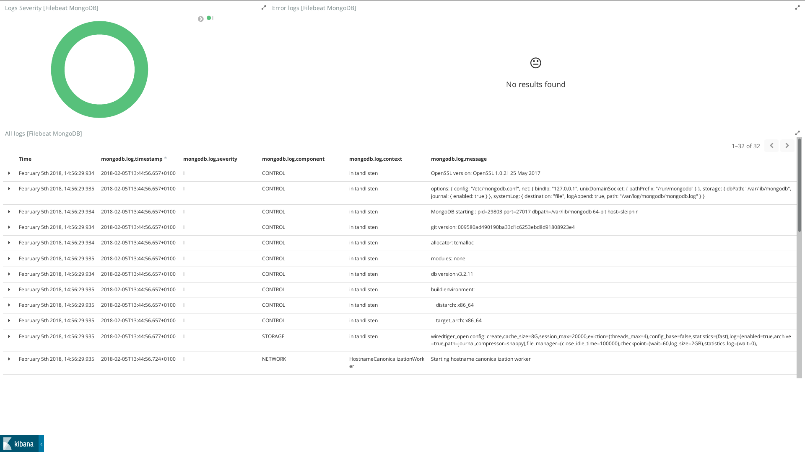

---
mapped_pages:
  - https://www.elastic.co/guide/en/beats/filebeat/current/filebeat-module-mongodb.html
---

% This file is generated! See scripts/docs_collector.py

# MongoDB module [filebeat-module-mongodb]

:::::{admonition} Prefer to use {{agent}} for this use case?
Refer to the [Elastic Integrations documentation](integration-docs://reference/mongodb/index.md).

::::{dropdown} Learn more
{{agent}} is a single, unified way to add monitoring for logs, metrics, and other types of data to a host. It can also protect hosts from security threats, query data from operating systems, forward data from remote services or hardware, and more. Refer to the documentation for a detailed [comparison of {{beats}} and {{agent}}](docs-content://reference/fleet/index.md).

::::


:::::


The `mongodb` module collects and parses logs created by [MongoDB](https://www.mongodb.com/).

When you run the module, it performs a few tasks under the hood:

* Sets the default paths to the log files (but don’t worry, you can override the defaults)
* Makes sure each multiline log event gets sent as a single event
* Uses an {{es}} ingest pipeline to parse and process the log lines, shaping the data into a structure suitable for visualizing in Kibana
* Deploys dashboards for visualizing the log data

::::{tip}
Read the [quick start](/reference/filebeat/filebeat-installation-configuration.md) to learn how to configure and run modules.
::::


## Compatibility [_compatibility_22]

The `mongodb` module was tested with plaintext logs from version v3.2.11 on Debian and json logs from version v4.4.4 on Ubuntu.


## Configure the module [configuring-mongodb-module]

You can further refine the behavior of the `mongodb` module by specifying [variable settings](#mongodb-settings) in the `modules.d/mongodb.yml` file, or overriding settings at the command line.

You must enable at least one fileset in the module. **Filesets are disabled by default.**

The following example shows how to set paths in the `modules.d/mongodb.yml` file to override the default paths for MongoDB logs:

```yaml
- module: mongodb
  log:
    enabled: true
    var.paths: ["/path/to/log/mongodb/*.log*"]
```

To specify the same settings at the command line, you use:

```sh
-M "mongodb.log.var.paths=[/path/to/log/mongodb/*.log*]"
```


### Variable settings [mongodb-settings]

Each fileset has separate variable settings for configuring the behavior of the module. If you don’t specify variable settings, the `mongodb` module uses the defaults.

For advanced use cases, you can also override input settings. See [Override input settings](/reference/filebeat/advanced-settings.md).

::::{tip}
When you specify a setting at the command line, remember to prefix the setting with the module name, for example, `mongodb.log.var.paths` instead of `log.var.paths`.
::::


### `log` log fileset settings [_log_log_fileset_settings_3]

**`var.paths`**
:   An array of glob-based paths that specify where to look for the log files. All patterns supported by [Go Glob](https://golang.org/pkg/path/filepath/#Glob) are also supported here. For example, you can use wildcards to fetch all files from a predefined level of subdirectories: `/path/to/log/*/*.log`. This fetches all `.log` files from the subfolders of `/path/to/log`. It does not fetch log files from the `/path/to/log` folder itself. If this setting is left empty, Filebeat will choose log paths based on your operating system.


## Example dashboard [_example_dashboard_14]

This module comes with one sample dashboard including error and regular logs.

% TO DO: Use `:class: screenshot`


## Fields [_fields]

For a description of each field in the module, see the [exported fields](/reference/filebeat/exported-fields-mongodb.md) section.
