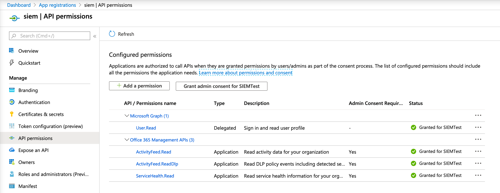
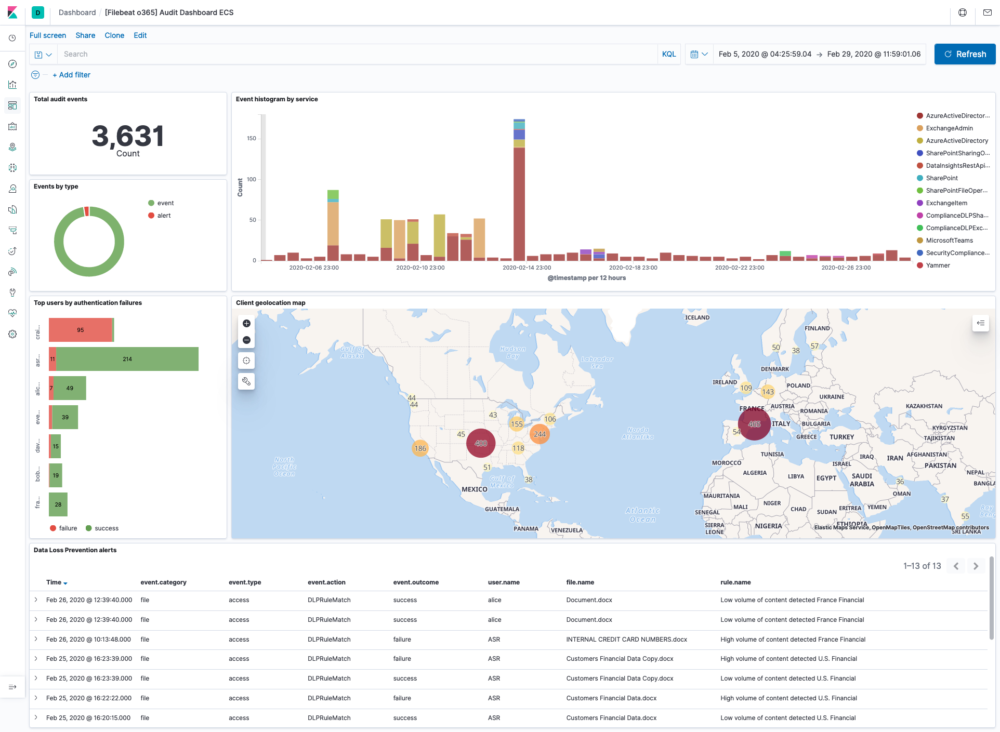

---
mapped_pages:
  - https://www.elastic.co/guide/en/beats/filebeat/current/filebeat-module-o365.html
---

# Office 365 module [filebeat-module-o365]

::::{warning}
This functionality is in beta and is subject to change. The design and code is less mature than official GA features and is being provided as-is with no warranties. Beta features are not subject to the support SLA of official GA features.
::::


:::::{admonition} Prefer to use {{agent}} for this use case?
Refer to the [Elastic Integrations documentation](integration-docs://reference/o365/index.md).

::::{dropdown} Learn more
{{agent}} is a single, unified way to add monitoring for logs, metrics, and other types of data to a host. It can also protect hosts from security threats, query data from operating systems, forward data from remote services or hardware, and more. Refer to the documentation for a detailed [comparison of {{beats}} and {{agent}}](docs-content://reference/fleet/index.md).

::::


:::::


This is a module for Office 365 logs received via one of the Office 365 API endpoints. It currently supports user, admin, system, and policy actions and events from Office 365 and Azure AD activity logs exposed by the Office 365 Management Activity API.

The [ingest-geoip](elasticsearch://reference/enrich-processor/geoip-processor.md) and [ingest-user_agent](elasticsearch://reference/enrich-processor/user-agent-processor.md) Elasticsearch plugins are required to run this module.

::::{tip}
Read the [quick start](/reference/filebeat/filebeat-installation-configuration.md) to learn how to configure and run modules.
::::


## Configure the module [configuring-o365-module]

You can further refine the behavior of the `o365` module by specifying [variable settings](#o365-settings) in the `modules.d/o365.yml` file, or overriding settings at the command line.

You must enable at least one fileset in the module. **Filesets are disabled by default.**


### Variable settings [o365-settings]

Each fileset has separate variable settings for configuring the behavior of the module. If you don’t specify variable settings, the `o365` module uses the defaults.

For advanced use cases, you can also override input settings. See [Override input settings](/reference/filebeat/advanced-settings.md).

::::{tip}
When you specify a setting at the command line, remember to prefix the setting with the module name, for example, `o365.audit.var.paths` instead of `audit.var.paths`.
::::


### `audit` fileset settings [_audit_fileset_settings_5]

The `audit` fileset uses the Office 365 Management Activity API to retrieve audit messages from Office 365 and Azure AD activity logs. These are the same logs that are available under *Audit* *Log* *Search* in the *Security* *and* *Compliance* *Center.*


#### Setup [_setup_4]

To use this fileset you need to [enable Audit Log Search](https://docs.microsoft.com/en-us/microsoft-365/compliance/turn-audit-log-search-on-or-off?view=o365-worldwide#turn-on-audit-log-search) and [register an application in Azure AD.](https://docs.microsoft.com/en-us/office/office-365-management-api/get-started-with-office-365-management-apis#register-your-application-in-azure-ad)

Once this application is registered note the *Application (client) ID* and the *Directory (tenant) ID.* Then configure the authentication in the *Certificates & Secrets* section.

Example configuration `o365.yml` using client-secret authentication:

```yaml
  audit:
    enabled: true
    var.application_id: "<My Azure AD Application ID>"
    var.tenants:
      - id: "<My Tenant ID>"
        name: "mytenant.onmicrosoft.com"
    var.client_secret: "<My client secret>"
```

Certificate-based authentication is specially useful when monitoring multiple tenants. Example configuration:

```yaml
  audit:
    enabled: true
    var.application_id: "<My Azure AD Application ID>"
    var.tenants:
      - id: "<Tenant A ID>"
        name: "tenantA.onmicrosoft.com"
      - id: "<Tenant B ID>"
        name: "tenantB.onmicrosoft.com"
    var.certificate: "/path/to/certificate.pem"
    var.key: "/path/to/private_key.pem"
    var.key_passphrase: "my_passphrase" # (optional) for encrypted keys
```

Finally you need to add permissions in the *API permissions* section and grant it admin consent. Click on *Add permission* and select *Office 365 Management APIs.* The needed permissions are:

* User.Read
* ActivityFeed.Read
* ActivityFeed.ReadDlp
* ServiceHealth.Read

% TO DO: Use `:class: screenshot`


Once the required permissions are added, click the *Grant admin consent* button. Note that it can take a while for the required permissions to be in effect, so it’s possible that you observe some permission errors when running Filebeat right away.


#### Alternative endpoints [_alternative_endpoints]

This module supports custom endpoints for on-prem deployments as well as alternative endpoints (GCC High endponts, U.S. DoD, European Union, etc). In order to point the module to an alternative endpoint, you need to adjust the `authentication_endpoint` and `resource` variables accordingly. For example:

```yaml
    var.api:
      # default is https://login.microsoftonline.com/
      authentication_endpoint: https://login.microsoftonline.us/
      # default is https://manage.office.com
      resource: https://manage.office365.us
```


#### Configuration options [_configuration_options_43]

**`var.application_id`**
:   The Application ID (also known as client ID) of the Azure application.

**`var.tenants`**
:   A list of one or more tenant IDs and name pairs. Set the `id` field to the tenant ID (also known as Directory ID). Set the name to the host name for the tenant, that is, the Office 365 domain for your organization.

**`var.client_secret`**
:   The client-secret (api_key) used to authenticate your Azure AD application. This option cannot be specified at the same time as the `var.certificate` option.

**`var.certificate`**
:   Path to the certificate file used for client authentication. This option cannot be specified at the same time as the `var.client_secret` option.

**`var.key`**
:   Path to the private key file used for client authentication.

**`var.key_passphrase`**
:   The passphrase used to decrypt an encrypted key stored in the configured `var.key` file. Only set this option when the key is encrypted.

**`var.content_type`**
:   The list of content-types to subscribe to. By default, it subscribes to all known content-types:

    * Audit.AzureActiveDirectory
    * Audit.Exchange
    * Audit.SharePoint
    * Audit.General
    * DLP.All


#### Advanced configuration options [_advanced_configuration_options]

The following configuration options are only recomended in case of problems. They must be nested under a single `var.api` key, like this:

```yaml
    var.api:
      authentication_endpoint: https://login.microsoftonline.com/
      resource: https://manage.office.com
      max_retention: 168h
      poll_interval: 3m
      max_requests_per_minute: 2000
      max_query_size: 24h
```

**`var.api.authentication_endpoint`**
:   The authentication endpoint used to authorize the Azure app. This is `https://login.microsoftonline.com/` by default, and can be changed to access alternative endpoints.

**`var.api.resource`**
:   The API resource to retrieve information from. This is `https://manage.office.com` by default, and can be changed to access alternative endpoints.

**`var.api.max_retention`**
:   The maximum data retention period to support. `168h` by default. Filebeat will fetch all retained data for a tenant when run for the first time. The default is 7 days, which matches the standard period that Microsoft will keep the logs before deleting them. Only increase it if your tenant has a longer retention period.

**`var.api.poll_interval`**
:   The interval to wait before polling the API server for new events. Default `3m`.

**`var.api.max_requests_per_minute`**
:   The maximum number of requests to perform per minute, for each tenant. The default is `2000`, as this is the server-side limit per tenant.

**`var.api.max_query_size`**
:   The maximum time window that API allows in a single query. Defaults to `24h` to match Microsoft’s documented limit.


## Example dashboard [_example_dashboard_17]

This module comes with a sample dashboard:

% TO DO: Use `:class: screenshot`



## Fields [_fields_38]

For a description of each field in the module, see the [exported fields](/reference/filebeat/exported-fields-o365.md) section.
