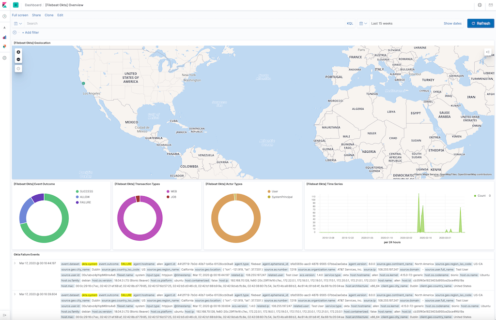

---
mapped_pages:
  - https://www.elastic.co/guide/en/beats/filebeat/current/filebeat-module-okta.html
---

# Okta module [filebeat-module-okta]

:::::{admonition} Prefer to use {{agent}} for this use case?
Refer to the [Elastic Integrations documentation](integration-docs://reference/okta/index.md).

::::{dropdown} Learn more
{{agent}} is a single, unified way to add monitoring for logs, metrics, and other types of data to a host. It can also protect hosts from security threats, query data from operating systems, forward data from remote services or hardware, and more. Refer to the documentation for a detailed [comparison of {{beats}} and {{agent}}](docs-content://reference/fleet/index.md).

::::


:::::


The Okta module collects events from the [Okta API](https://developer.okta.com/docs/reference/). Specifically this supports reading from the [Okta System Log API](https://developer.okta.com/docs/reference/api/system-log/).


### Variable settings [okta-settings]

Each fileset has separate variable settings for configuring the behavior of the module. If you don’t specify variable settings, the `okta` module uses the defaults.

For advanced use cases, you can also override input settings. See [Override input settings](/reference/filebeat/advanced-settings.md).

::::{tip}
When you specify a setting at the command line, remember to prefix the setting with the module name, for example, `okta.system.var.paths` instead of `system.var.paths`.
::::


### `system` fileset settings [_system_fileset_settings]

The Okta System Log records system events related to your organization in order to provide an audit trail that can be used to understand platform activity and to diagnose problems. This module is implemented using the [httpjson](/reference/filebeat/filebeat-input-httpjson.md) input and is configured to paginate through the logs while honoring any [rate-limiting](https://developer.okta.com/docs/reference/rate-limits/) headers sent by Okta.

This is an example configuration for the module.

```yaml
- module: okta
  system:
    var.url: https://yourOktaDomain/api/v1/logs
    var.api_key: '00QCjAl4MlV-WPXM...0HmjFx-vbGua'
```


#### Configuration options [_configuration_options_44]

**`var.url`**
:   Specifies the URL to the Okta System Log API. Required.

    ```yaml
        var.url: https://mycompany.okta.com/api/v1/logs
    ```


**`var.api_key`**
:   Specifies the Okta API token to use in requests to the API. Required. The token is used in an HTTP `Authorization` header with the `SSWS` scheme. See [ Create an API token](https://developer.okta.com/docs/guides/create-an-api-token/create-the-token/) for information on how to obtain a token.

    ```yaml
        var.api_key: '00QCjAl4MlV-WPXM...0HmjFx-vbGua'
    ```


**`var.http_client_timeout`**
:   Duration of the time limit on HTTP requests made by the module. Defaults to `60s`.

**`var.interval`**
:   Duration between requests to the API. Defaults to `60s`.

**`var.keep_original_message`**
:   Boolean flag indicating if the original JSON event string should be included in the `event.original` field. Defaults to `true`.

**`var.ssl`**
:   Configuration options for SSL parameters like the certificate authority to use for HTTPS-based connections. If the `ssl` section is missing, the host CAs are used for HTTPS connections to Okta. See [SSL](/reference/filebeat/configuration-ssl.md) for more information.

    ```yaml
        var.ssl:
          supported_protocols: [TLSv1.2]
    ```


**`var.initial_interval`**
:   An initial interval can be defined. The first time the module starts, will fetch events from the current moment minus the initial interval value. Following restarts will fetch events starting from the last event read. It defaults to `24h`.

    ```yaml
        var.initial_interval: 24h # will fetch events starting 24h ago.
    ```


**`input.request.rate_limit.early_limit`**
:   You can override the default rate-limiting behavior in [HTTP JSON](/reference/filebeat/filebeat-input-httpjson.md). The default for the Okta module is to use up to 89% of the Okta rate-limit, which should avoid Okta Warnings on rate-limit usage.

    ```
        input.request.rate_limit.early_limit: 0.89
    ```


## Example dashboard [_example_dashboard_18]

This module comes with a sample dashboard:

% TO DO: Use `:class: screenshot`



## Fields [_fields_39]

For a description of each field in the module, see the [exported fields](/reference/filebeat/exported-fields-okta.md) section.

