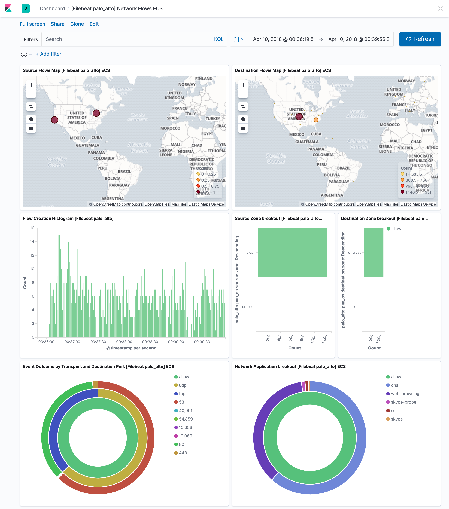
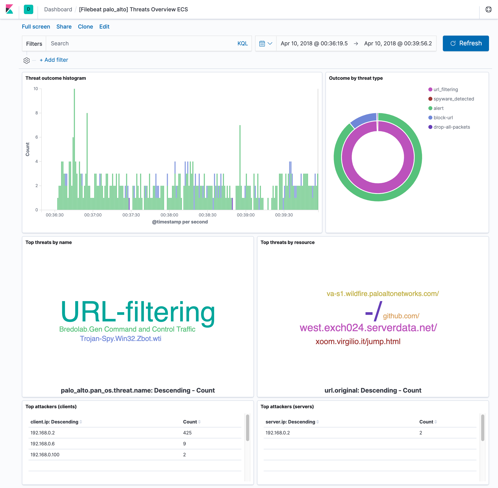

---
mapped_pages:
  - https://www.elastic.co/guide/en/beats/filebeat/current/filebeat-module-panw.html
---

# Palo Alto Networks module [filebeat-module-panw]

:::::{admonition} Prefer to use {{agent}} for this use case?
Refer to the [Elastic Integrations documentation](integration-docs://reference/panw/index.md).

::::{dropdown} Learn more
{{agent}} is a single, unified way to add monitoring for logs, metrics, and other types of data to a host. It can also protect hosts from security threats, query data from operating systems, forward data from remote services or hardware, and more. Refer to the documentation for a detailed [comparison of {{beats}} and {{agent}}](docs-content://reference/fleet/index.md).

::::


:::::


This is a module for Palo Alto Networks PAN-OS firewall monitoring logs received over Syslog or read from a file. It currently supports messages of Traffic and Threat types.

::::{tip}
Read the [quick start](/reference/filebeat/filebeat-installation-configuration.md) to learn how to configure and run modules.
::::


## Compatibility [_compatibility_29]

This module has been tested with logs generated by devices running PAN-OS versions 7.1 to 9.0 but limited compatibility is expected for earlier versions.

The [ingest-geoip](elasticsearch://reference/enrich-processor/geoip-processor.md) Elasticsearch plugin is required to run this module.


## Configure the module [configuring-panw-module]

You can further refine the behavior of the `panw` module by specifying [variable settings](#panw-settings) in the `modules.d/panw.yml` file, or overriding settings at the command line.

You must enable at least one fileset in the module. **Filesets are disabled by default.**

The module is by default configured to run via syslog on port 9001. However it can also be configured to read logs from a file. See the following example.

```yaml
- module: panw
  panos:
    enabled: true
    var.paths: ["/var/log/pan-os.log"]
    var.input: "file"
```


### Variable settings [panw-settings]

Each fileset has separate variable settings for configuring the behavior of the module. If you don’t specify variable settings, the `panw` module uses the defaults.

For advanced use cases, you can also override input settings. See [Override input settings](/reference/filebeat/advanced-settings.md).

::::{tip}
When you specify a setting at the command line, remember to prefix the setting with the module name, for example, `panw.panos.var.paths` instead of `panos.var.paths`.
::::


### `panos` fileset settings [_panos_fileset_settings]

Example config:

```yaml
  panos:
    var.syslog_host: 0.0.0.0
    var.syslog_port: 514
```

**`var.paths`**
:   An array of glob-based paths that specify where to look for the log files. All patterns supported by [Go Glob](https://golang.org/pkg/path/filepath/#Glob) are also supported here. For example, you can use wildcards to fetch all files from a predefined level of subdirectories: `/path/to/log/*/*.log`. This fetches all `.log` files from the subfolders of `/path/to/log`. It does not fetch log files from the `/path/to/log` folder itself. If this setting is left empty, Filebeat will choose log paths based on your operating system.

**`var.syslog_host`**
:   The interface to listen to UDP based syslog traffic. Defaults to `localhost`. Set to `0.0.0.0` to bind to all available interfaces.

**`var.syslog_port`**
:   The UDP port to listen for syslog traffic. Defaults to `9001`

::::{note}
Ports below 1024 require Filebeat to run as root.
::::


### Time zone support [_time_zone_support_12]

This module parses logs that don’t contain time zone information. For these logs, Filebeat reads the local time zone and uses it when parsing to convert the timestamp to UTC. The time zone to be used for parsing is included in the event in the `event.timezone` field.

To disable this conversion, the `event.timezone` field can be removed with the `drop_fields` processor.

If logs are originated from systems or applications with a different time zone to the local one, the `event.timezone` field can be overwritten with the original time zone using the `add_fields` processor.

See [Processors](/reference/filebeat/filtering-enhancing-data.md) for information about specifying processors in your config.


## ECS field mappings [_ecs_field_mappings]

These are the PAN-OS to ECS field mappings as well as those fields still not in ECS that are added under the `panw.panos` prefix:

| PAN-OS Field | ECS Field | Non-standard field |
| --- | --- | --- |
| Receive Time | event.created |  |
| Serial Number | observer.serial_number |  |
| Type | event.category |  |
| Subtype | event.action |  |
| Generated Time | `@timestamp` |  |
| Source IP | client.ip source.ip |  |
| Destination IP | server.ip destination.ip |  |
| NAT Source IP |  | panw.panos.source.nat.ip |
| NAT Destination IP |  | panw.panos.destination.nat.ip |
| Rule Name |  | panw.panos.ruleset |
| Source User | client.user.name source.user.name |  |
| Destination User | server.user.name destination.user.name |  |
| Application | network.application |  |
| Source Zone |  | panw.panos.source.zone |
| Destination Zone |  | panw.panos.destination.zone |
| Ingress Interface |  | panw.panos.source.interface |
| Egress Interface |  | panw.panos.destination.interface |
| Session ID |  | panw.panos.flow_id |
| Source Port | client.port source.port |  |
| Destination Port | destination.port server.port |  |
| NAT Source Port |  | panw.panos.source.nat.port |
| NAT Destination Port |  | panw.panos.destination.nat.port |
| Flags | labels |  |
| Protocol | network.transport |  |
| Action | event.outcome |  |
| Bytes | network.bytes |  |
| Bytes Sent | client.bytes source.bytes |  |
| Bytes Received | server.bytes destination.bytes |  |
| Packets | network.packets |  |
| Start Time | event.start |  |
| Elapsed Time | event.duration |  |
| Category |  | panw.panos.url.category |
| Sequence Number |  | panw.panos.sequence_number |
| Packets Sent | server.packets destination.packets |  |
| Packets Received | client.packets source.packets |  |
| Device Name | observer.hostname |  |

| PAN-OS Field | ECS Field | Non-standard field |
| --- | --- | --- |
| Receive Time | event.created |  |
| Serial Number | observer.serial_number |  |
| Type | event.category |  |
| Subtype | event.action |  |
| Generated Time | `@timestamp` |  |
| Source IP | client.ip source.ip |  |
| Destination IP | server.ip destination.ip |  |
| NAT Source IP |  | panw.panos.source.nat.ip |
| NAT Destination IP |  | panw.panos.destination.nat.ip |
| Rule Name |  | panw.panos.ruleset |
| Source User | client.user.name source.user.name |  |
| Destination User | server.user.name destination.user.name |  |
| Application | network.application |  |
| Source Zone |  | panw.panos.source.zone |
| Destination Zone |  | panw.panos.destination.zone |
| Ingress Interface |  | panw.panos.source.interface |
| Egress Interface |  | panw.panos.destination.interface |
| Session ID |  | panw.panos.flow_id |
| Source Port | client.port source.port |  |
| Destination Port | destination.port server.port |  |
| NAT Source Port |  | panw.panos.source.nat.port |
| NAT Destination Port |  | panw.panos.destination.nat.port |
| Flags | labels |  |
| Protocol | network.transport |  |
| Action | event.outcome |  |
| Miscellaneous | url.original | panw.panos.threat.resource |
| Threat ID |  | panw.panos.threat.id |
| Category |  | panw.panos.url.category |
| Severity | log.level |  |
| Direction | network.direction |  |
| Source Location | source.geo.name |  |
| Destination Location | destination.geo.name |  |
| PCAP_id |  | panw.panos.network.pcap_id |
| Filedigest |  | panw.panos.file.hash |
| User Agent | user_agent.original |  |
| File Type | file.type |  |
| X-Forwarded-For | network.forwarded_ip |  |
| Referer | http.request.referer |  |
| Sender | source.user.email |  |
| Subject |  | panw.panos.subject |
| Recipient | destination.user.email |  |
| Device Name | observer.hostname |  |


## Example dashboard [_example_dashboard_20]

This module comes with two sample dashboards:

% TO DO: Use `:class: screenshot`


% TO DO: Use `:class: screenshot`



## Fields [_fields_42]

For a description of each field in the module, see the [exported fields](/reference/filebeat/exported-fields-panw.md) section.
