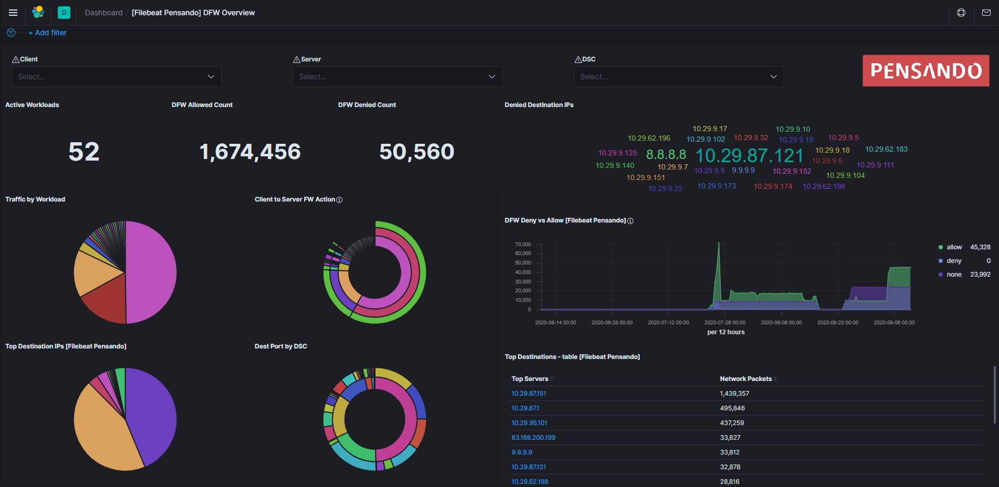

---
mapped_pages:
  - https://www.elastic.co/guide/en/beats/filebeat/current/filebeat-module-pensando.html
---

# pensando module [filebeat-module-pensando]

The `pensando` module parses distributed firewall logs created by the [Pensando](http://pensando.io/) distributed services card (DSC).

When you run the module, it performs a few tasks under the hood:

* Sets the default paths to the log files (but don’t worry, you can override the defaults)
* Makes sure each multiline log event gets sent as a single event
* Uses an {{es}} ingest pipeline to parse and process the log lines, shaping the data into a structure suitable for visualizing in Kibana
* Deploys dashboards for visualizing the log data

::::{tip}
Read the [quick start](/reference/filebeat/filebeat-installation-configuration.md) to learn how to configure and run modules.
::::


## Compatibility [_compatibility_30]

The Pensando module has been tested with 1.12.0-E-54 and later.


## Configure the module [configuring-pensando-module]

You can further refine the behavior of the `pensando` module by specifying [variable settings](#pensando-settings) in the `modules.d/pensando.yml` file, or overriding settings at the command line.

You must enable at least one fileset in the module. **Filesets are disabled by default.**

The following example shows how to set parameters in the `modules.d/pensando.yml` file to listen for firewall logs sent from the Pensando DSC(s) on port 5514 (default is 9001):

```yaml
- module: pensando
  access:
    enabled: true
    var.syslog_host: 0.0.0.0
    var.syslog_port: [9001]
```


### Variable settings [pensando-settings]

Each fileset has separate variable settings for configuring the behavior of the module. If you don’t specify variable settings, the `pensando` module uses the defaults.

For advanced use cases, you can also override input settings. See [Override input settings](/reference/filebeat/advanced-settings.md).

::::{tip}
When you specify a setting at the command line, remember to prefix the setting with the module name, for example, `pensando.dfw.var.paths` instead of `dfw.var.paths`.
::::


### `dfw` log fileset settings [_dfw_log_fileset_settings]

**`var.paths`**
:   An array of glob-based paths that specify where to look for the log files. All patterns supported by [Go Glob](https://golang.org/pkg/path/filepath/#Glob) are also supported here. For example, you can use wildcards to fetch all files from a predefined level of subdirectories: `/path/to/log/*/*.log`. This fetches all `.log` files from the subfolders of `/path/to/log`. It does not fetch log files from the `/path/to/log` folder itself. If this setting is left empty, Filebeat will choose log paths based on your operating system.


## Example dashboard [_example_dashboard_21]

This module comes with a sample dashboard. For example:

% TO DO: Use `:class: screenshot`



## Fields [_fields_43]

For a description of each field in the module, see the [exported fields](/reference/filebeat/exported-fields-pensando.md) section.
