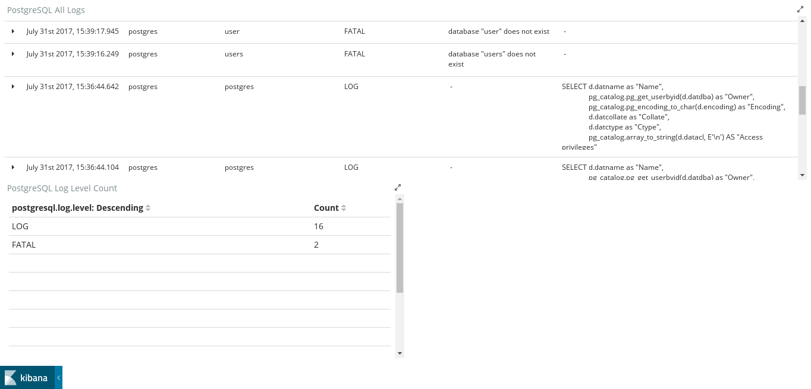
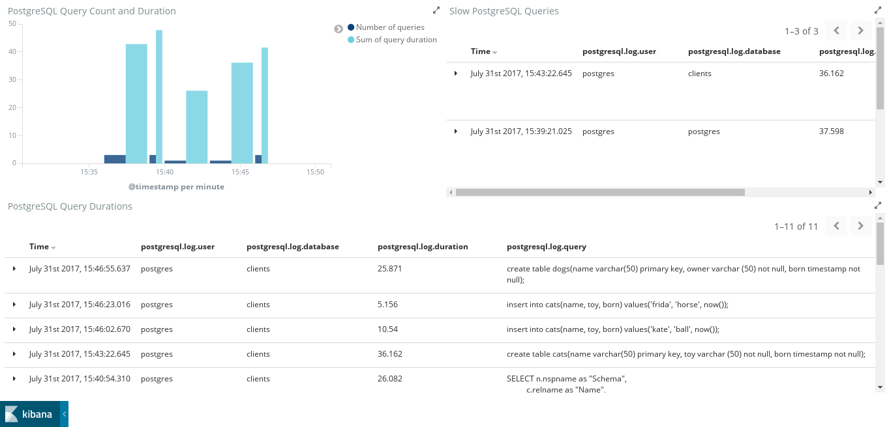

---
mapped_pages:
  - https://www.elastic.co/guide/en/beats/filebeat/current/filebeat-module-postgresql.html
applies_to:
  stack: ga
---

% This file is generated! See scripts/docs_collector.py

# PostgreSQL module [filebeat-module-postgresql]

:::::{admonition} Prefer to use {{agent}} for this use case?
Refer to the [Elastic Integrations documentation](integration-docs://reference/postgresql/index.md).

::::{dropdown} Learn more
{{agent}} is a single, unified way to add monitoring for logs, metrics, and other types of data to a host. It can also protect hosts from security threats, query data from operating systems, forward data from remote services or hardware, and more. Refer to the documentation for a detailed [comparison of {{beats}} and {{agent}}](docs-content://reference/fleet/index.md).

::::


:::::


The `postgresql` module  collects and parses logs created by [PostgreSQL](https://www.postgresql.org/).

When you run the module, it performs a few tasks under the hood:

* Sets the default paths to the log files (but don’t worry, you can override the defaults)
* Makes sure each multiline log event gets sent as a single event
* Uses an {{es}} ingest pipeline to parse and process the log lines, shaping the data into a structure suitable for visualizing in Kibana
* Deploys dashboards for visualizing the log data

::::{tip}
Read the [quick start](/reference/filebeat/filebeat-installation-configuration.md) to learn how to configure and run modules.
::::


## Compatibility [_compatibility_31]

This module comes in two flavours: a parser of log files based on Linux distribution defaults, and a CSV log parser, that you need to enable in database configuration.

The `postgresql` module using `.log` was tested with logs from versions 9.5 on Ubuntu, 9.6 on Debian, and finally 10.11, 11.4 and 12.2 on Arch Linux 9.3.

The `postgresql` module using `.csv` was tested using versions 11 and 13 (distro is not relevant here).


## Supported log formats [_supported_log_formats]

This module can collect any logs from PostgreSQL servers, but to be able to better analyze their contents and extract more information, they should be formatted in a determined way.

There are some settings to take into account for the log format.

Log lines should be preffixed with the timestamp in milliseconds, the process id, the user id and the database name. This uses to be the default in most distributions, and is translated to this setting in the configuration file:

```sh
log_line_prefix = '%m [%p] %q%u@%d '
```

PostgreSQL server can be configured to log statements and their durations and this module is able to collect this information. To be able to correlate each duration with their statements, they must be logged in the same line. This happens when the following options are used:

```sh
log_duration = 'on'
log_statement = 'none'
log_min_duration_statement = 0
```

Setting a zero value in `log_min_duration_statement` will log all statements executed by a client. You probably want to configure it to a higher value, so it logs only slower statements. This value is configured in milliseconds.

When using `log_statement` and `log_duration` together, statements and durations are logged in different lines, and Filebeat is not able to correlate both values, for this reason it is recommended to disable `log_statement`.

::::{note}
The PostgreSQL module of Metricbeat is also able to collect information about all statements executed in the server. You may chose which one is better for your needings. An important difference is that the Metricbeat module collects aggregated information when the statement is executed several times, but cannot know when each statement was executed. This information can be obtained from logs.
::::


Other logging options that you may consider to enable are the following ones:

```sh
log_checkpoints = 'on';
log_connections = 'on';
log_disconnections = 'on';
log_lock_waits = 'on';
```

Both `log_connections` and `log_disconnections` can cause a lot of events if you don’t have persistent connections, so enable with care.


## Using CSV logs [_using_csv_logs]

Since the PostgreSQL CSV log file is a well-defined format, there is almost no configuration to be done in Filebeat, just the filepath.

On the other hand, it’s necessary to configure postgresql to emit `.csv` logs. The recommended parameters are:

```sh
logging_collector = 'on';
log_destination = 'csvlog';
```


## Configure the module [configuring-postgresql-module]

You can further refine the behavior of the `postgresql` module by specifying [variable settings](#postgresql-settings) in the `modules.d/postgresql.yml` file, or overriding settings at the command line.

You must enable at least one fileset in the module. **Filesets are disabled by default.**

The following example shows how to set paths in the `modules.d/postgresql.yml` file to override the default paths for PostgreSQL logs:

```yaml
- module: postgresql
  log:
    enabled: true
    var.paths: ["/path/to/log/postgres/*.log*"]
```

To specify the same settings at the command line, you use:

```sh
-M "postgresql.log.var.paths=[/path/to/log/postgres/*.log*]"
```


### Variable settings [postgresql-settings]

Each fileset has separate variable settings for configuring the behavior of the module. If you don’t specify variable settings, the `postgresql` module uses the defaults.

For advanced use cases, you can also override input settings. See [Override input settings](/reference/filebeat/advanced-settings.md).

::::{tip}
When you specify a setting at the command line, remember to prefix the setting with the module name, for example, `postgresql.log.var.paths` instead of `log.var.paths`.
::::


### `log` fileset settings [_log_fileset_settings_10]

**`var.paths`**
:   An array of glob-based paths that specify where to look for the log files. All patterns supported by [Go Glob](https://golang.org/pkg/path/filepath/#Glob) are also supported here. For example, you can use wildcards to fetch all files from a predefined level of subdirectories: `/path/to/log/*/*.log`. This fetches all `.log` files from the subfolders of `/path/to/log`. It does not fetch log files from the `/path/to/log` folder itself. If this setting is left empty, Filebeat will choose log paths based on your operating system.


## Example dashboards [_example_dashboards_2]

This module comes with two sample dashboards.

The first dashboard is for regular logs.

% TO DO: Use `:class: screenshot`


The second one shows the slowlogs of PostgreSQL. If `log_min_duration_statement` is not used, this dashboard will show incomplete or no data.

% TO DO: Use `:class: screenshot`


## Fields [_fields]

For a description of each field in the module, see the [exported fields](/reference/filebeat/exported-fields-postgresql.md) section.
