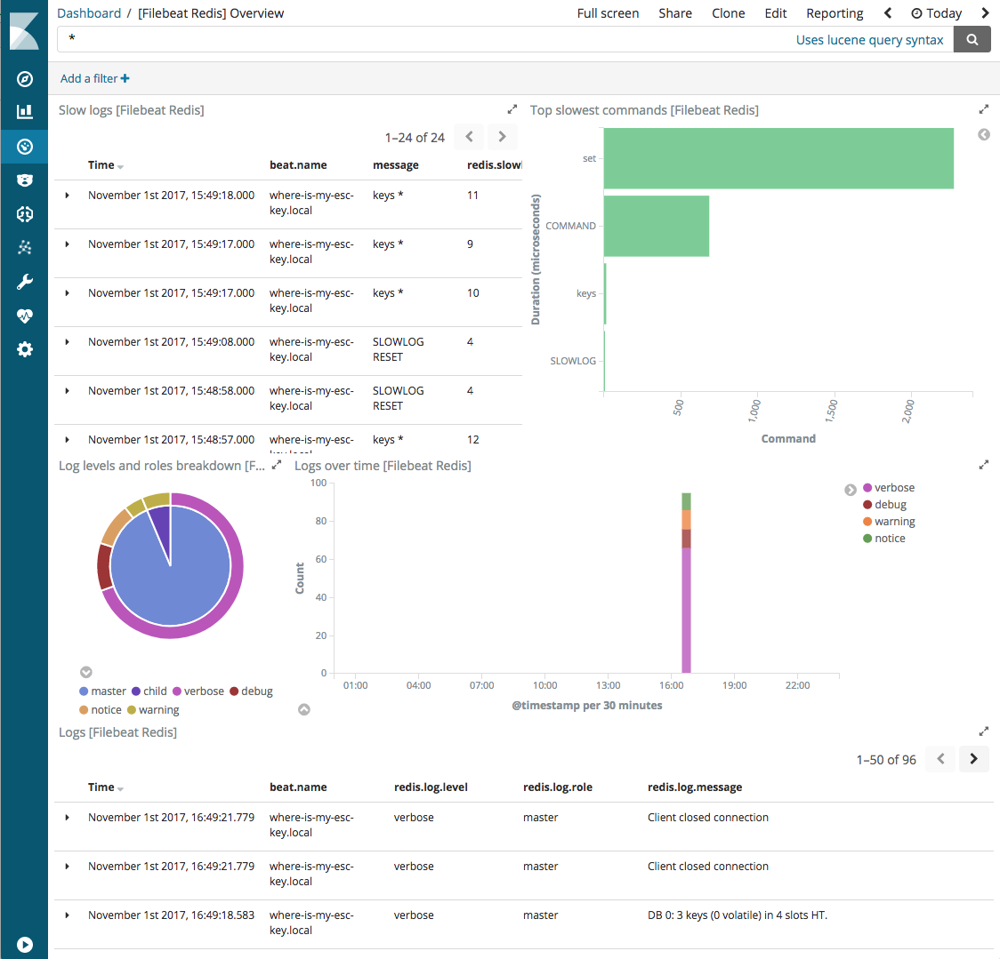

---
mapped_pages:
  - https://www.elastic.co/guide/en/beats/filebeat/current/filebeat-module-redis.html
---

% This file is generated! See scripts/docs_collector.py

# Redis module [filebeat-module-redis]

:::::{admonition} Prefer to use {{agent}} for this use case?
Refer to the [Elastic Integrations documentation](integration-docs://reference/redis/index.md).

::::{dropdown} Learn more
{{agent}} is a single, unified way to add monitoring for logs, metrics, and other types of data to a host. It can also protect hosts from security threats, query data from operating systems, forward data from remote services or hardware, and more. Refer to the documentation for a detailed [comparison of {{beats}} and {{agent}}](docs-content://reference/fleet/index.md).

::::


:::::


The `redis` module parses logs and slowlogs created by [Redis](https://redis.io/).

When you run the module, it performs a few tasks under the hood:

* Sets the default paths to the log files (but don’t worry, you can override the defaults)
* Makes sure each multiline log event gets sent as a single event
* Uses an {{es}} ingest pipeline to parse and process the log lines, shaping the data into a structure suitable for visualizing in Kibana
* Deploys dashboards for visualizing the log data

::::{tip}
Read the [quick start](/reference/filebeat/filebeat-installation-configuration.md) to learn how to configure and run modules.
::::


The `redis` module has two filesets:

* The `log` fileset collects and parses the logs that Redis writes to disk.
* The `slowlog` fileset connects to Redis via the network and retrieves the slow logs by using the `SLOWLOG` command.

For the `log` fileset, make sure the `logfile` option, from the Redis configuration file, is set to `redis-server.log`.

For the `slowlog` fileset, make sure the `slowlog-log-slower-than` option, from the Redis configuration file, is set to a lower value than the default one.


## Compatibility [_compatibility_33]

The Redis `log` fileset was tested with logs from Redis versions 1.2.6, 2.4.6, and 3.0.2, so we expect compatibility with any version 1.x, 2.x, or 3.x.

On Windows, the default paths assume that Redis was installed from the Chocolatey repository.

The Redis `slowlog` fileset was tested with Redis 3.0.2 and 2.4.6. We expect compatibility with any Redis version newer than 2.2.12, when the SLOWLOG command was added.


## Configure the module [configuring-redis-module]

You can further refine the behavior of the `redis` module by specifying [variable settings](#redis-settings) in the `modules.d/redis.yml` file, or overriding settings at the command line.

You must enable at least one fileset in the module. **Filesets are disabled by default.**

The following example shows how to set paths in the `modules.d/redis.yml` file to override the default paths for Redis logs. It also shows how to set the host and password to retrieve slow logs:

```yaml
- module: redis
  log:
    enabled: true
    var.paths: ["/path/to/log/redis/redis-server.log*"]
  slowlog:
    enabled: true
    var.hosts: ["localhost:6378"]
    var.password: "YOUR_PASSWORD"
```

To specify the same settings at the command line, you use:

```sh
-M "redis.log.var.paths=[/path/to/log/redis/redis-server.log*]" -M "redis.slowlog.var.hosts=[localhost:6378]" -M "redis.slowlog.var.password=[YOUR_PASSWORD]"
```


### Variable settings [redis-settings]

Each fileset has separate variable settings for configuring the behavior of the module. If you don’t specify variable settings, the `redis` module uses the defaults.

For advanced use cases, you can also override input settings. See [Override input settings](/reference/filebeat/advanced-settings.md).

::::{tip}
When you specify a setting at the command line, remember to prefix the setting with the module name, for example, `redis.log.var.paths` instead of `log.var.paths`.
::::


### `log` fileset settings [_log_fileset_settings_12]

**`var.paths`**
:   An array of glob-based paths that specify where to look for the log files. All patterns supported by [Go Glob](https://golang.org/pkg/path/filepath/#Glob) are also supported here. For example, you can use wildcards to fetch all files from a predefined level of subdirectories: `/path/to/log/*/*.log`. This fetches all `.log` files from the subfolders of `/path/to/log`. It does not fetch log files from the `/path/to/log` folder itself. If this setting is left empty, Filebeat will choose log paths based on your operating system.


### `slowlog` fileset settings [_slowlog_fileset_settings_3]

**`var.hosts`**
:   An array of hosts to which Filebeat should connect to retrieve the slow logs. If left empty, `localhost:6379` is assumed.

**`var.password`**
:   The password to use to connect to Redis, in case Redis authentication is enabled (the `requirepass` option in the Redis configuration).


## Example dashboard [_example_dashboard_22]

This module comes with a sample dashboard. For example:

% TO DO: Use `:class: screenshot`


## Fields [_fields]

For a description of each field in the module, see the [exported fields](/reference/filebeat/exported-fields-redis.md) section.
