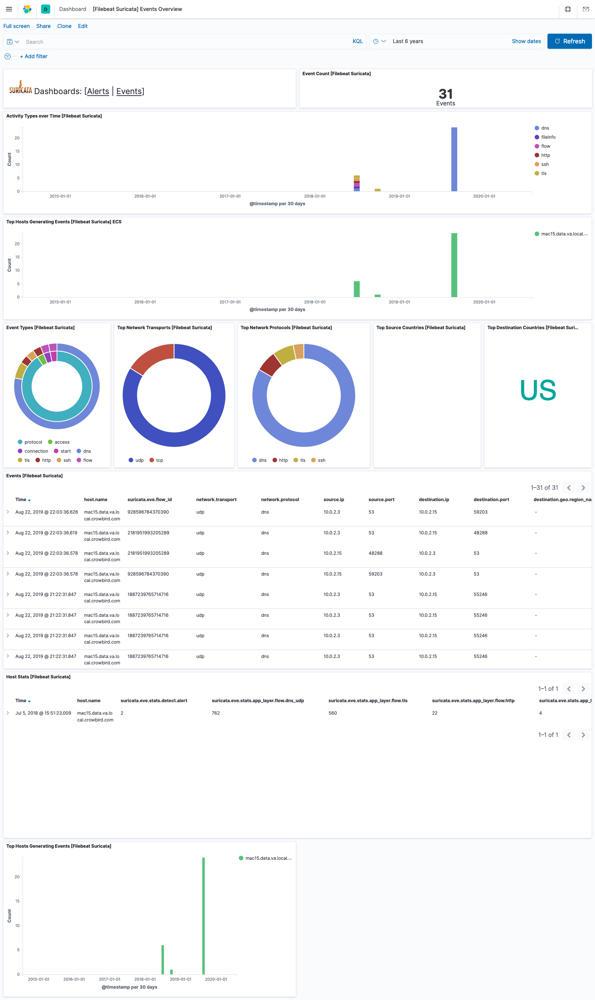
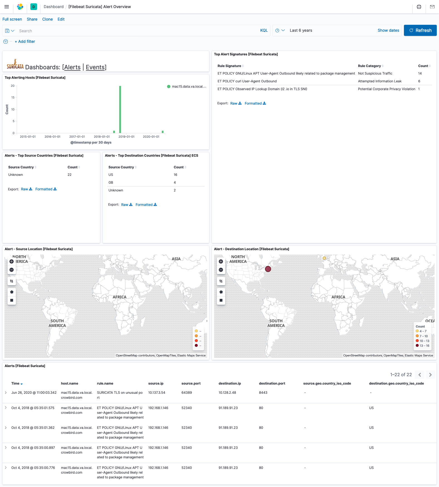

---
mapped_pages:
  - https://www.elastic.co/guide/en/beats/filebeat/current/filebeat-module-suricata.html
---

# Suricata module [filebeat-module-suricata]

:::::{admonition} Prefer to use {{agent}} for this use case?
Refer to the [Elastic Integrations documentation](integration-docs://reference/suricata/index.md).

::::{dropdown} Learn more
{{agent}} is a single, unified way to add monitoring for logs, metrics, and other types of data to a host. It can also protect hosts from security threats, query data from operating systems, forward data from remote services or hardware, and more. Refer to the documentation for a detailed [comparison of {{beats}} and {{agent}}](docs-content://reference/fleet/index.md).

::::


:::::


This is a module to the Suricata IDS/IPS/NSM log. It parses logs that are in the [ Suricata Eve JSON format](https://suricata.readthedocs.io/en/latest/output/eve/eve-json-format.html).

When you run the module, it performs a few tasks under the hood:

* Sets the default paths to the log files (but don’t worry, you can override the defaults)
* Makes sure each multiline log event gets sent as a single event
* Uses an {{es}} ingest pipeline to parse and process the log lines, shaping the data into a structure suitable for visualizing in Kibana
* Deploys dashboards for visualizing the log data

::::{tip}
Read the [quick start](/reference/filebeat/filebeat-installation-configuration.md) to learn how to configure and run modules.
::::


## Compatibility [_compatibility_36]

This module has been developed against Suricata v4.0.4, but is expected to work with other versions of Suricata.


## Configure the module [configuring-suricata-module]

You can further refine the behavior of the `suricata` module by specifying [variable settings](#suricata-settings) in the `modules.d/suricata.yml` file, or overriding settings at the command line.

You must enable at least one fileset in the module. **Filesets are disabled by default.**

This is an example of how to overwrite the default log file path.

```yaml
- module: suricata
  eve:
    enabled: true
    var.paths: ["/my/path/suricata.json"]
```


### Variable settings [suricata-settings]

Each fileset has separate variable settings for configuring the behavior of the module. If you don’t specify variable settings, the `suricata` module uses the defaults.

For advanced use cases, you can also override input settings. See [Override input settings](/reference/filebeat/advanced-settings.md).

::::{tip}
When you specify a setting at the command line, remember to prefix the setting with the module name, for example, `suricata.eve.var.paths` instead of `eve.var.paths`.
::::


### `eve` log fileset settings [_eve_log_fileset_settings]

**`var.paths`**
:   An array of glob-based paths that specify where to look for the log files. All patterns supported by [Go Glob](https://golang.org/pkg/path/filepath/#Glob) are also supported here. For example, you can use wildcards to fetch all files from a predefined level of subdirectories: `/path/to/log/*/*.log`. This fetches all `.log` files from the subfolders of `/path/to/log`. It does not fetch log files from the `/path/to/log` folder itself. If this setting is left empty, Filebeat will choose log paths based on your operating system.

**`var.tags`**
:   A list of tags to include in events. Including `forwarded` indicates that the events did not originate on this host and causes `host.name` to not be added to events. Defaults to `[suricata]`.

`var.internal_networks`
:   A list of CIDR ranges describing the IP addresses that you consider internal. This is used in determining the value of `network.direction`. The values can be either a CIDR value or one of the named ranges supported by the [`network`](/reference/filebeat/defining-processors.md#condition-network) condition. The default value is `[private]` which classifies RFC 1918 (IPv4) and RFC 4193 (IPv6) addresses as internal.


## Example dashboard [_example_dashboard_24]

This module comes with sample dashboards. For example:

% TO DO: Use `:class: screenshot`


% TO DO: Use `:class: screenshot`



## Fields [_fields_51]

For a description of each field in the module, see the [exported fields](/reference/filebeat/exported-fields-suricata.md) section.
