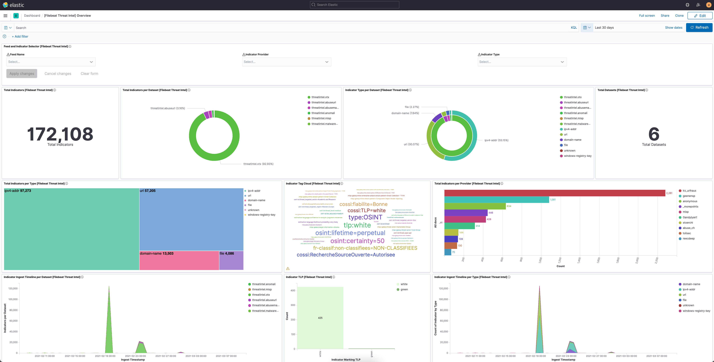
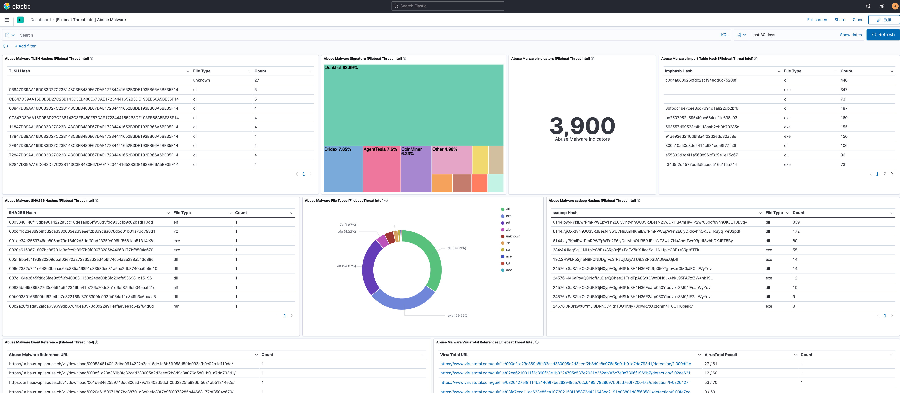
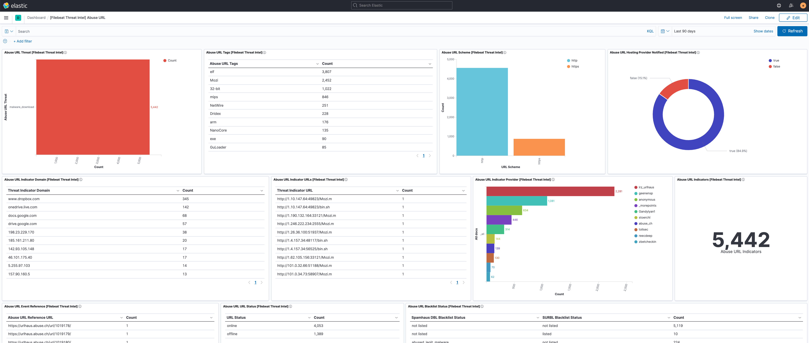
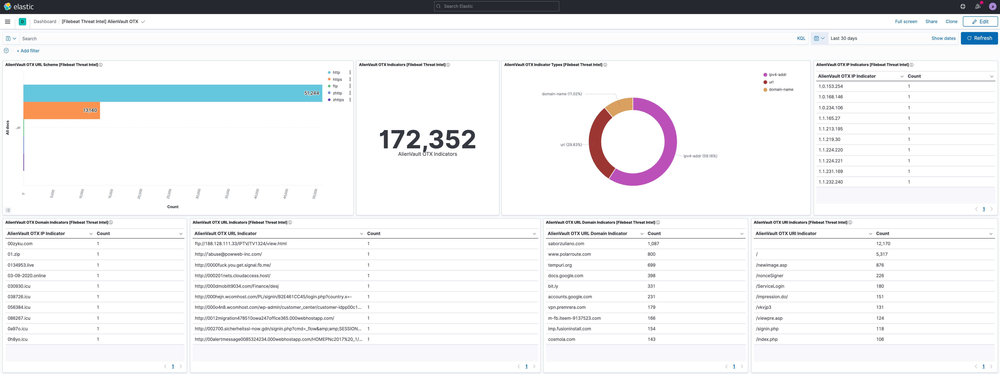
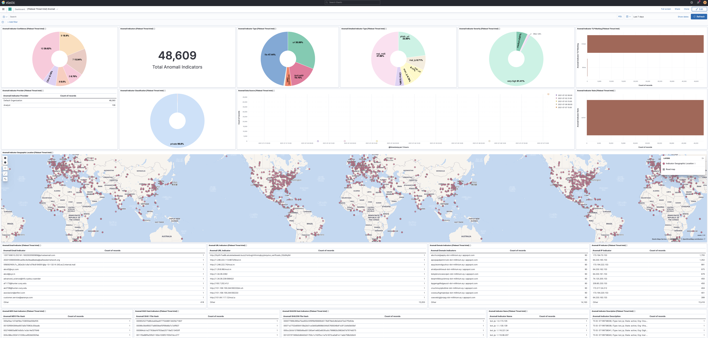
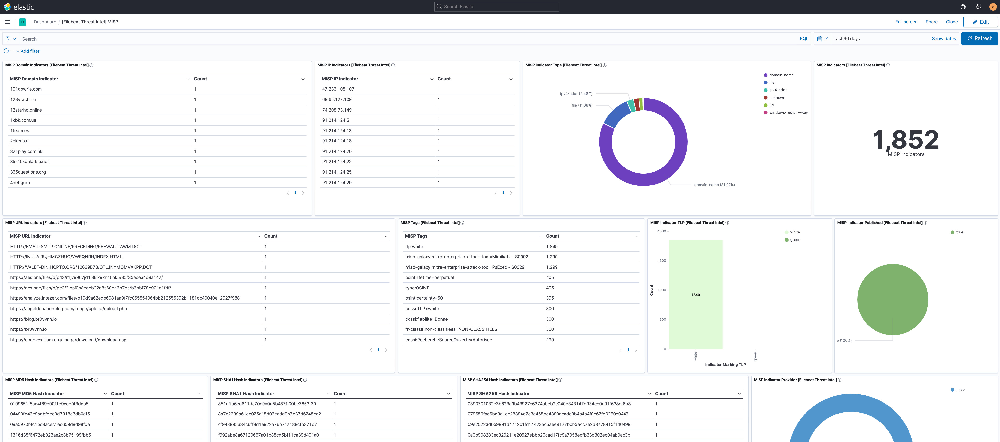
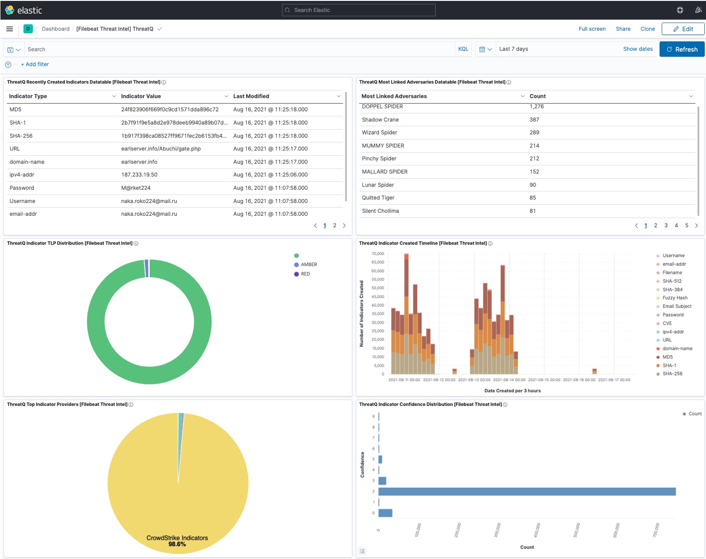

---
mapped_pages:
  - https://www.elastic.co/guide/en/beats/filebeat/current/filebeat-module-threatintel.html
---

# Threat Intel module [filebeat-module-threatintel]

:::::{admonition} Prefer to use {{agent}} for this use case?
Refer to the [Elastic Integrations documentation](integration-docs://reference/ti_abusech/index.md).

::::{dropdown} Learn more
{{agent}} is a single, unified way to add monitoring for logs, metrics, and other types of data to a host. It can also protect hosts from security threats, query data from operating systems, forward data from remote services or hardware, and more. Refer to the documentation for a detailed [comparison of {{beats}} and {{agent}}](docs-content://reference/fleet/index.md).

::::


:::::


This module ingests data from a collection of different threat intelligence sources. The ingested data is meant to be used with [Indicator Match rules](docs-content://solutions/security/detect-and-alert/create-detection-rule.md#create-indicator-rule), but is also compatible with other features like [Enrich Processors](elasticsearch://reference/enrich-processor/enrich-processor.md). The related threat intel attribute that is meant to be used for matching incoming source data is stored under the `threat.indicator.*` fields.

The available filesets are:

* [abuseurl](#abuseurl): Supports gathering URL entities from Abuse.ch.
* [abusemalware](#abusemalware): Supports gathering Malware/Payload entities from Abuse.ch.
* [misp](#misp): Supports gathering threat intel attributes from MISP (replaces MISP module).
* [malwarebazaar](#malwarebazaar): Supports gathering Malware/Payload entities from Malware Bazaar.
* [otx](#otx): Supports gathering threat intel attributes from AlientVault OTX.
* [anomali](#anomali): Supports gathering threat intel attributes from Anomali Limo.
* [anomalithreatstream](#anomalithreatstream): Supports gathering threat intel attributes from Anomali ThreatStream.
* [threatq](#threatq): Supports gathering threat intel attributes from ThreatQuotient.

::::{tip}
Read the [quick start](/reference/filebeat/filebeat-installation-configuration.md) to learn how to configure and run modules.
::::


### `abuseurl` fileset settings [abuseurl]

This fileset contacts the abuse.ch API and fetches all new malicious URLs found the last 60 minutes.

To configure the module, please utilize the default URL unless specified as the example below:

```yaml
- module: threatintel
  abuseurl:
    enabled: true
    var.input: httpjson
    var.url: https://urlhaus-api.abuse.ch/v1/urls/recent/
    var.interval: 60m
```

**`var.paths`**
:   An array of glob-based paths that specify where to look for the log files. All patterns supported by [Go Glob](https://golang.org/pkg/path/filepath/#Glob) are also supported here. For example, you can use wildcards to fetch all files from a predefined level of subdirectories: `/path/to/log/*/*.log`. This fetches all `.log` files from the subfolders of `/path/to/log`. It does not fetch log files from the `/path/to/log` folder itself. If this setting is left empty, Filebeat will choose log paths based on your operating system.

**`var.url`**
:   The URL of the API endpoint to connect with.

**`var.interval`**
:   How often the API is polled for updated information.

**`var.proxy_url`**
:   Optional URL to use as HTTP proxy.

Abuse.ch URL Threat Intel is mapped to the following ECS fields.

| URL Threat Intel Fields | ECS Fields |
| --- | --- |
| url | threat.indicator.url.full |
| date_added | @timestamp |
| host | threat.indicator.ip/domain |


### `abusemalware` fileset settings [abusemalware]

This fileset contacts the Abuse.ch API and fetches all new malicious hashes found the last 60 minutes.

To configure the module, please utilize the default URL unless specified as the example below:

```yaml
- module: threatintel
  abusemalware:
    enabled: true
    var.input: httpjson
    var.url: https://urlhaus-api.abuse.ch/v1/payloads/recent/
    var.interval: 60m
```

**`var.paths`**
:   An array of glob-based paths that specify where to look for the log files. All patterns supported by [Go Glob](https://golang.org/pkg/path/filepath/#Glob) are also supported here. For example, you can use wildcards to fetch all files from a predefined level of subdirectories: `/path/to/log/*/*.log`. This fetches all `.log` files from the subfolders of `/path/to/log`. It does not fetch log files from the `/path/to/log` folder itself. If this setting is left empty, Filebeat will choose log paths based on your operating system.

**`var.url`**
:   The URL of the API endpoint to connect with.

**`var.interval`**
:   How often the API is polled for updated information.

**`var.proxy_url`**
:   Optional URL to use as HTTP proxy.

Abuse.ch Malware Threat Intel is mapped to the following ECS fields.

| Malware Threat IntelFields | ECS Fields |
| --- | --- |
| md5_hash | threat.indicator.file.hash.md5 |
| sha256_hash | threat.indicator.file.hash.sha256 |
| file_size | threat.indicator.file.size |


### `malwarebazaar` fileset settings [malwarebazaar]

This fileset contacts the Malware Bazaar API and fetches all new malicious hashes found the last 10 minutes.

To configure the module, please utilize the default URL unless specified as the example below:

```yaml
- module: threatintel
  malwarebazaar:
    enabled: true
    var.input: httpjson
    var.url: https://mb-api.abuse.ch/api/v1/
    var.interval: 10m
```

**`var.paths`**
:   An array of glob-based paths that specify where to look for the log files. All patterns supported by [Go Glob](https://golang.org/pkg/path/filepath/#Glob) are also supported here. For example, you can use wildcards to fetch all files from a predefined level of subdirectories: `/path/to/log/*/*.log`. This fetches all `.log` files from the subfolders of `/path/to/log`. It does not fetch log files from the `/path/to/log` folder itself. If this setting is left empty, Filebeat will choose log paths based on your operating system.

**`var.url`**
:   The URL of the API endpoint to connect with.

**`var.interval`**
:   How often the API is polled for updated information.

**`var.proxy_url`**
:   Optional URL to use as HTTP proxy.

Malware Bazaar Threat Intel is mapped to the following ECS fields.

| Malware Threat IntelFields | ECS Fields |
| --- | --- |
| md5_hash | threat.indicator.file.hash.md5 |
| sha256_hash | threat.indicator.file.hash.sha256 |
| sha384_hash | threat.indicator.file.hash.sha384 |
| tlsh | threat.indicator.file.hash.tlsh |
| ssdeep | threat.indicator.file.hash.ssdeep |
| imphash | threat.indicator.file.pe.imphash |
| file_size | threat.indicator.file.size |
| file_name | threat.indicator.file.name |
| file_type_mime | threat.indicator.file.mime_type |
| file_type | threat.indicator.file.type |
| reporter | threat.indicator.provider |
| origin_country | threat.indicator.geo.country_iso_code |
| signature | threat.indicator.signature |
| code_sign.subject_cn | threat.indicator.file.x509.subject.common_name |
| code_sign.issuer_cn | threat.indicator.file.x509.issuer.common_name |
| code_sign.algorithm | threat.indicator.file.x509.public_key_algorithm |
| code_sign.valid_from | threat.indicator.file.x509.not_before |
| code_sign.valid_to | threat.indicator.file.x509.not_after |
| code_sign.serial_number | threat.indicator.file.x509.serial_number |


### `misp` fileset settings [misp]

This fileset communicates with a local or remote MISP server. This replaces the older MISP module.

The fileset configuration allows to set the polling interval, how far back it should look initially, and optionally any filters used to filter the results.

```yaml
- module: threatintel
  misp:
    enabled: true
    var.input: httpjson
    var.url: https://SERVER/events/restSearch
    var.api_token: xVfaM3DSt8QEwO2J1ix00V4ZHJs14nq5GMsHcK6Z
    var.first_interval: 24h
    var.interval: 60m
```

To configure the output with filters, use fields that already exist on the MISP server, and define either a single value or multiple. By adding a filter, only events that have attributes that match the filter will be returned.

The below filters are only examples, for a full list of all fields please reference the MISP fields located on the MISP server itself.

```yaml
- module: threatintel
  misp:
    enabled: true
    var.input: httpjson
    var.url: https://SERVER/events/restSearch
    var.api_token: xVfaM3DSt8QEwO2J1ix00V4ZHJs14nq5GMsHcK6Z
    var.filters:
      type: ["md5", "sha256", "url", "ip-src"]
      threat_level: 4
    var.first_interval: 24h
    var.interval: 60m
```

**`var.paths`**
:   An array of glob-based paths that specify where to look for the log files. All patterns supported by [Go Glob](https://golang.org/pkg/path/filepath/#Glob) are also supported here. For example, you can use wildcards to fetch all files from a predefined level of subdirectories: `/path/to/log/*/*.log`. This fetches all `.log` files from the subfolders of `/path/to/log`. It does not fetch log files from the `/path/to/log` folder itself. If this setting is left empty, Filebeat will choose log paths based on your operating system.

**`var.url`**
:   The URL of the API endpoint to connect with.

**`var.interval`**
:   How often the API is polled for updated information.

**`var.first_interval`**
:   How far back to search when retrieving events the first time Filebeat starts up. After the first interval has passed the module itself will use the timestamp from the last response as the filter when retrieving new events.

**`var.filters`**
:   Dictionary of filters to apply when retrieving new events from the MISP server, this field is optional and defaults to all events. A list of available options is located at [https://www.circl.lu/doc/misp/automation/#search](https://www.circl.lu/doc/misp/automation/#search)

**`var.proxy_url`**
:   Optional URL to use as HTTP proxy.

MISP Threat Intel is mapped to the following ECS fields.

| Malware Threat IntelFields | ECS Fields |
| --- | --- |
| misp.first_seen | threat.indicator.first_seen |
| misp.last_seen | threat.indicator.last_seen |
| misp.tag | tag |
| misp.value | threat.indicator.* |

`misp.value` is mapped to the appropriate field dependent on attribute type.


### `otx` fileset settings [otx]

To configure the module, please utilize the default URL unless specified as the example below:

```yaml
- module: threatintel
  otx:
    enabled: true
    var.input: httpjson
    var.url: https://otx.alienvault.com/api/v1/indicators/export
    var.api_token: 754dcaafbcb9740dc0d119e72d5eaad699cc4a5cdbc856fc6215883842ba8142
    var.first_interval: 24h
    var.lookback_range: 2h
    var.interval: 60m
```

To filter only on specific indicator types, this is an example of some possible filters that are supported:

```yaml
- module: threatintel
  otx:
    enabled: true
    var.input: httpjson
    var.url: https://otx.alienvault.com/api/v1/indicators/export
    var.types: "domain,IPv4,hostname,url,FileHash-SHA256"
    var.first_interval: 24h
    var.interval: 60m
```

**`var.paths`**
:   An array of glob-based paths that specify where to look for the log files. All patterns supported by [Go Glob](https://golang.org/pkg/path/filepath/#Glob) are also supported here. For example, you can use wildcards to fetch all files from a predefined level of subdirectories: `/path/to/log/*/*.log`. This fetches all `.log` files from the subfolders of `/path/to/log`. It does not fetch log files from the `/path/to/log` folder itself. If this setting is left empty, Filebeat will choose log paths based on your operating system.

**`var.url`**
:   The URL of the API endpoint to connect with.

**`var.api_token`**
:   The API key used to access OTX. This can be found on your [OTX API homepage](https://otx.alienvault.com/api).

**`var.interval`**
:   How often the API is polled for updated information.

**`var.first_interval`**
:   How far back to search when retrieving events the first time the Filebeat starts up. After the first interval has passed the module itself will use the timestamp from the last response as the filter when retrieving new events.

**`var.types`**
:   A comma delimited list of indicator types to include, defaults to all. A list of possible types to filter on can be found in the [AlientVault OTX documentation](https://cybersecurity.att.com/documentation/usm-appliance/otx/about-otx.htm).

**`var.proxy_url`**
:   Optional URL to use as HTTP proxy.

OTX Threat Intel is mapped to the following ECS fields.

| Malware Threat Intel  Fields | ECS Fields |
| --- | --- |
| otx.type | threat.indicator.type |
| otx.description | threat.indicator.description |
| otx.indicator | threat.indicator.* |

`otx.indicator` is mapped to the appropriate field dependent on attribute type.


### `anomali` fileset settings [anomali]

To configure the module please fill in the credentials, for Anomali Limo (the free Taxii service) these are usually default credentials found at the [Anomali Limo webpage](https://www.anomali.com/resources/limo) Anomali Limo offers multiple sources called collections. Each collection has a specific ID, which then fits into the url used in this configuration. A list of different collections can be found using the credentials at [Limo Collections](https://limo.anomali.com/api/v1/taxii2/feeds/collections/).

The example below uses the collection of ID 41 as can be seen in the URL.

```yaml
- module: threatintel
  anomali:
    enabled: true
    var.input: httpjson
    var.url: https://limo.anomali.com/api/v1/taxii2/feeds/collections/41/objects?match[type]=indicator
    var.username: guest
    var.password: guest
    var.interval: 60m
```

To filter on specific types, you can define `var.types` as a comma delimited list of object types. This defaults to "indicators".

```yaml
- module: threatintel
  anomali:
    enabled: true
    var.input: httpjson
    var.url: https://limo.anomali.com/api/v1/taxii2/feeds/collections/41/objects?match[type]=indicator
    var.types: "indicators,other"
    var.username: guest
    var.password: guest
    var.interval: 60m
```

**`var.paths`**
:   An array of glob-based paths that specify where to look for the log files. All patterns supported by [Go Glob](https://golang.org/pkg/path/filepath/#Glob) are also supported here. For example, you can use wildcards to fetch all files from a predefined level of subdirectories: `/path/to/log/*/*.log`. This fetches all `.log` files from the subfolders of `/path/to/log`. It does not fetch log files from the `/path/to/log` folder itself. If this setting is left empty, Filebeat will choose log paths based on your operating system.

**`var.url`**
:   The URL of the API endpoint to connect with. Limo offers multiple collections of threat intelligence.

**`var.username`**
:   Username used to access the API.

**`var.password`**
:   Password used to access the API.

**`var.interval`**
:   How often the API is polled for updated information.

**`var.types`**
:   A comma delimited list of indicator types to include, defaults to all. A list of possible types to filter on can be found on the [Stix 2.1 Object types](https://oasis-open.github.io/cti-documentation/stix/intro.html#stix-21-objects) page.

**`var.proxy_url`**
:   Optional URL to use as HTTP proxy.

Anomali Threat Intel is mapped to the following ECS fields.

| Malware Threat Intel Fields | ECS Fields |
| --- | --- |
| anomali.description | threat.indicator.description |
| anomali.created | threat.indicator.first_seen |
| anomali.modified | threat.indicator.last_seen |
| anomali.pattern | threat.indicator.* |
| anomali.labels | tags |

`anomali.pattern` is mapped to the appropriate field dependent on attribute type.


### `anomalithreatstream` fileset settings [anomalithreatstream]

To configure the ThreatStream integration you first need to define an output in the Anomali ThreatStream Integrator using the Elastic SDK provided by Anomali. It will deliver indicators via HTTP or HTTPS to a Filebeat instance running as a server.

Configure an Integrator output with the following settings:

* Indicator Filter: `*` (or use any desired filter).
* SDK Executable Command: `/path/to/python /path/to/anomali-sdk/main.py`. Adjust the paths to the python executable and the directory where the Elastic SDK has been unpacked.
* Metadata in JSON Format: `{"url": "https://filebeat:8080/", "server_certificate": "/path/to/cert.pem", "secret": "my secret"}`.

    * `url`: Use the host and port where Filebeat will be running, and `http` or `https` accordingly.
    * `server_certificate`: If using HTTPS, absolute path to the server certificate. Otherwise don’t set this field.
    * `secret`: A shared secret string to authenticate messages between the SDK and Filebeat.


Then configure the `anomalithreatstream` fileset in Filebeat accordingly:

```yaml
- module: threatintel
  anomalithreatstream:
    enabled: true
    var.input: http_endpoint
    var.listen_address: 0.0.0.0 # Listen on all interfaces.
    var.listen_port: 8080
    var.secret: 'my secret'
    var.ssl_certificate: path/to/server_ssl_cert.pem
    var.ssl_key: path/to/ssl_key.pem
```

**`var.listen_address`**
:   Local address to bind the HTTP server to. Use `0.0.0.0` to accept connections from all interfaces.

**`var.listen_port`**
:   Port number to use for the HTTP server.

**`var.secret`**
:   Shared secret between the SDK and Filebeat, used to authenticate messages.

**`var.ssl_certificate`**
:   Path to the public SSL certificate for the HTTPS server. If unset, Filebeat will use unsecure HTTP connections.

**`var.ssl_key`**
:   Path to the certificate’s private key.

Anomali ThreatStream fields are mapped to the following ECS fields:

| ThreatStream fields | ECS Fields |
| --- | --- |
| asn | threat.indicator.as.number |
| classification[[1]](#a) | threat.indicator.marking.tlp |
| confidence[[1]](#a) | threat.indicator.confidence |
| country | threat.indicator.geo.country_iso_code |
| date_first | threat.indicator.first_seen |
| date_last | threat.indicator.last_seen |
| detail | tags |
| domain | threat.indicator.url.domain |
| email | threat.indicator.email.address |
| itype[[1]](#a) | threat.indicator.type |
| lat | threat.indicator.geo.location.lat |
| lon | threat.indicator.geo.location.lon |
| md5 | threat.indicator.file.hash |
| org | threat.indicator.as.organization.name |
| severity[[1]](#a) | event.severity |
| source | threat.indicator.provider |
| srcip | threat.indicator.ip |
| url | threat.indicator.url.original |

$$$a$$$
[1]: Field is used to derive a value for the ECS field but its original value is kept under `threatintel.anomalithreatstream`.


## Dashboards [_dashboards_5]

This module comes with dashboards for the threat information feeds.

% TO DO: Use `:class: screenshot`


Overview of the information provided, and the health of, the Threat Intel module.

% TO DO: Use `:class: screenshot`


Overview of the information provided by the Abuse.ch Malware feed.

% TO DO: Use `:class: screenshot`


Overview of the information provided by the Abuse.ch URL feed.

% TO DO: Use `:class: screenshot`


Overview of the information provided by the AlienVault OTX feed.

% TO DO: Use `:class: screenshot`


Overview of the information provided by the Anomali Limo and Anomali ThreatStream feeds.

% TO DO: Use `:class: screenshot`


Overview of the information provided by the MISP feed.


### `threatq` fileset settings [threatq]

The `threatq` fileset fetches intelligence from the ThreatQuotient API.

The ThreatQ module requires you to set a valid URL, combination of Oauth2 credentials and the ID of the collection to retrieve indicators from. By default the indicators will be collected every 1 minute, and deduplication is handled by the API itself.

Sample configuration:

```yaml
- module: threatintel
  threatq:
    enabled: true
    var.input: httpjson
    var.host: https://testurl.threatq.com/
    var.token_url: https://testurl.threatq.com/api/token
    var.client_id: oauthclient
    var.client_secret: 123abcd
    var.interval: 1m
    var.data_collection_id: "fsd2f54fsg2sf"
```

**`var.url`**
:   The URL of the API endpoint to connect with.

**`var.client_id`**
:   The Oauth2 client ID to be used for authentication.

**`var.client_secret`**
:   The Oauth2 secret related to the client_id.

**`var.interval`**
:   How often the API is polled for updated information.

**`var.proxy_url`**
:   Optional URL to use as HTTP proxy.

**`var.http_client_timeout`**
:   Optional value to override the default HTTP timeout of 30 seconds.

ThreatQ fields are mapped to the following ECS fields:

| ThreatQ fields | ECS Fields |
| --- | --- |
| type.name | threat.indicator.type |
| description | threat.indicator.description |
| score | threat.indicator.confidence |
| value | threat.indicator.{url,ip,domain,file.hash} |
| sources | threat.indicator.provider |


## Dashboards [_dashboards_6]

This module comes with dashboards for the threat information feeds.

% TO DO: Use `:class: screenshot`


Overview of the information provided, and the health of, the Threat Intel module.

% TO DO: Use `:class: screenshot`


Overview of the information provided by the Abuse.ch Malware feed.

% TO DO: Use `:class: screenshot`


Overview of the information provided by the Abuse.ch URL feed.

% TO DO: Use `:class: screenshot`


Overview of the information provided by the AlienVault OTX feed.

% TO DO: Use `:class: screenshot`


Overview of the information provided by the Anomali Limo and Anomali ThreatStream feeds.

% TO DO: Use `:class: screenshot`


Overview of the information provided by the MISP feed.

% TO DO: Use `:class: screenshot`


Overview of the information provided by the ThreatQuotient feed.


## Fields [_fields_53]

For a description of each field in the module, see the [exported fields](/reference/filebeat/exported-fields-threatintel.md) section.

