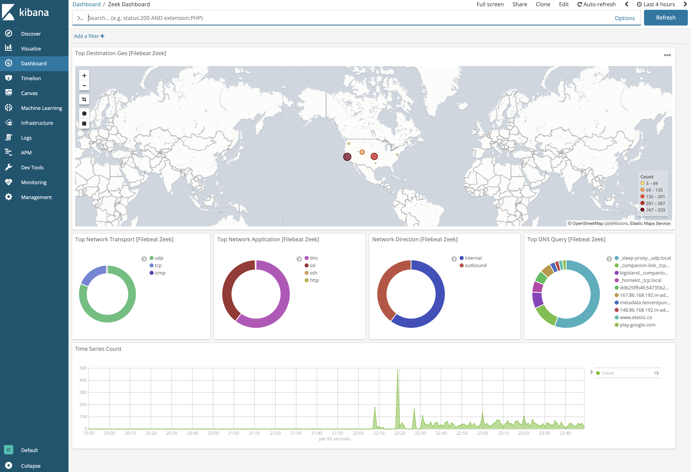

---
mapped_pages:
  - https://www.elastic.co/guide/en/beats/filebeat/current/filebeat-module-zeek.html
---

# Zeek (Bro) Module [filebeat-module-zeek]

:::::{admonition} Prefer to use {{agent}} for this use case?
Refer to the [Elastic Integrations documentation](integration-docs://reference/zeek/index.md).

::::{dropdown} Learn more
{{agent}} is a single, unified way to add monitoring for logs, metrics, and other types of data to a host. It can also protect hosts from security threats, query data from operating systems, forward data from remote services or hardware, and more. Refer to the documentation for a detailed [comparison of {{beats}} and {{agent}}](docs-content://reference/fleet/index.md).

::::

:::::

This is a module for [Zeek](https://zeek.org/), which used to be called Bro. It parses logs that are in the Zeek JSON format.

The Zeek SSL fileset will handle fields from these scripts if they are installed in Zeek.

* [JA3/JA3S Hashes](https://github.com/salesforce/ja3/tree/master/zeek)
* [SHA1 Certificate Hashes](https://github.com/rocknsm/rock-scripts/blob/1abcb137c3c0cb7bc1d54248d738255d2d6eb4ba/protocols/ssl/ssl-add-cert-hash.zeek)

::::{tip}
Read the [quick start](/reference/filebeat/filebeat-installation-configuration.md) to learn how to configure and run modules.
::::

## Compatibility [_compatibility_38]

This module has been developed against Zeek 2.6.1, but is expected to work with newer versions of Zeek.

Zeek requires a Unix-like platform, and it currently supports Linux, FreeBSD, and Mac OS X.

### `capture_loss` log fileset settings [_capture_loss_log_fileset_settings]

**`var.paths`**
:   An array of glob-based paths that specify where to look for the log files. All patterns supported by [Go Glob](https://golang.org/pkg/path/filepath/#Glob) are also supported here. For example, you can use wildcards to fetch all files from a predefined level of subdirectories: `/path/to/log/*/*.log`. This fetches all `.log` files from the subfolders of `/path/to/log`. It does not fetch log files from the `/path/to/log` folder itself. If this setting is left empty, Filebeat will choose log paths based on your operating system.

**`var.tags`**
:   A list of tags to include in events. Including `forwarded` indicates that the events did not originate on this host and causes `host.name` to not be added to events. Defaults to `[suricata]`.

### `connection` log fileset settings [_connection_log_fileset_settings]

**`var.paths`**
:   An array of glob-based paths that specify where to look for the log files. All patterns supported by [Go Glob](https://golang.org/pkg/path/filepath/#Glob) are also supported here. For example, you can use wildcards to fetch all files from a predefined level of subdirectories: `/path/to/log/*/*.log`. This fetches all `.log` files from the subfolders of `/path/to/log`. It does not fetch log files from the `/path/to/log` folder itself. If this setting is left empty, Filebeat will choose log paths based on your operating system.

**`var.tags`**
:   A list of tags to include in events. Including `forwarded` indicates that the events did not originate on this host and causes `host.name` to not be added to events. Defaults to `[suricata]`.

`var.internal_networks`
:   A list of CIDR ranges describing the IP addresses that you consider internal. This is used in determining the value of `network.direction`. The values can be either a CIDR value or one of the named ranges supported by the [`network`](/reference/filebeat/defining-processors.md#condition-network) condition. The default value is `[private]` which classifies RFC 1918 (IPv4) and RFC 4193 (IPv6) addresses as internal.

### `dce_rpc` log fileset settings [_dce_rpc_log_fileset_settings]

**`var.paths`**
:   An array of glob-based paths that specify where to look for the log files. All patterns supported by [Go Glob](https://golang.org/pkg/path/filepath/#Glob) are also supported here. For example, you can use wildcards to fetch all files from a predefined level of subdirectories: `/path/to/log/*/*.log`. This fetches all `.log` files from the subfolders of `/path/to/log`. It does not fetch log files from the `/path/to/log` folder itself. If this setting is left empty, Filebeat will choose log paths based on your operating system.

**`var.tags`**
:   A list of tags to include in events. Including `forwarded` indicates that the events did not originate on this host and causes `host.name` to not be added to events. Defaults to `[suricata]`.

`var.internal_networks`
:   A list of CIDR ranges describing the IP addresses that you consider internal. This is used in determining the value of `network.direction`. The values can be either a CIDR value or one of the named ranges supported by the [`network`](/reference/filebeat/defining-processors.md#condition-network) condition. The default value is `[private]` which classifies RFC 1918 (IPv4) and RFC 4193 (IPv6) addresses as internal.

### `dhcp` log fileset settings [_dhcp_log_fileset_settings]

**`var.paths`**
:   An array of glob-based paths that specify where to look for the log files. All patterns supported by [Go Glob](https://golang.org/pkg/path/filepath/#Glob) are also supported here. For example, you can use wildcards to fetch all files from a predefined level of subdirectories: `/path/to/log/*/*.log`. This fetches all `.log` files from the subfolders of `/path/to/log`. It does not fetch log files from the `/path/to/log` folder itself. If this setting is left empty, Filebeat will choose log paths based on your operating system.

**`var.tags`**
:   A list of tags to include in events. Including `forwarded` indicates that the events did not originate on this host and causes `host.name` to not be added to events. Defaults to `[suricata]`.

`var.internal_networks`
:   A list of CIDR ranges describing the IP addresses that you consider internal. This is used in determining the value of `network.direction`. The values can be either a CIDR value or one of the named ranges supported by the [`network`](/reference/filebeat/defining-processors.md#condition-network) condition. The default value is `[private]` which classifies RFC 1918 (IPv4) and RFC 4193 (IPv6) addresses as internal.

### `dnp3` log fileset settings [_dnp3_log_fileset_settings]

**`var.paths`**
:   An array of glob-based paths that specify where to look for the log files. All patterns supported by [Go Glob](https://golang.org/pkg/path/filepath/#Glob) are also supported here. For example, you can use wildcards to fetch all files from a predefined level of subdirectories: `/path/to/log/*/*.log`. This fetches all `.log` files from the subfolders of `/path/to/log`. It does not fetch log files from the `/path/to/log` folder itself. If this setting is left empty, Filebeat will choose log paths based on your operating system.

**`var.tags`**
:   A list of tags to include in events. Including `forwarded` indicates that the events did not originate on this host and causes `host.name` to not be added to events. Defaults to `[suricata]`.

`var.internal_networks`
:   A list of CIDR ranges describing the IP addresses that you consider internal. This is used in determining the value of `network.direction`. The values can be either a CIDR value or one of the named ranges supported by the [`network`](/reference/filebeat/defining-processors.md#condition-network) condition. The default value is `[private]` which classifies RFC 1918 (IPv4) and RFC 4193 (IPv6) addresses as internal.

### `dns` log fileset settings [_dns_log_fileset_settings]

**`var.paths`**
:   An array of glob-based paths that specify where to look for the log files. All patterns supported by [Go Glob](https://golang.org/pkg/path/filepath/#Glob) are also supported here. For example, you can use wildcards to fetch all files from a predefined level of subdirectories: `/path/to/log/*/*.log`. This fetches all `.log` files from the subfolders of `/path/to/log`. It does not fetch log files from the `/path/to/log` folder itself. If this setting is left empty, Filebeat will choose log paths based on your operating system.

**`var.tags`**
:   A list of tags to include in events. Including `forwarded` indicates that the events did not originate on this host and causes `host.name` to not be added to events. Defaults to `[suricata]`.

`var.internal_networks`
:   A list of CIDR ranges describing the IP addresses that you consider internal. This is used in determining the value of `network.direction`. The values can be either a CIDR value or one of the named ranges supported by the [`network`](/reference/filebeat/defining-processors.md#condition-network) condition. The default value is `[private]` which classifies RFC 1918 (IPv4) and RFC 4193 (IPv6) addresses as internal.

### `dpd` log fileset settings [_dpd_log_fileset_settings]

**`var.paths`**
:   An array of glob-based paths that specify where to look for the log files. All patterns supported by [Go Glob](https://golang.org/pkg/path/filepath/#Glob) are also supported here. For example, you can use wildcards to fetch all files from a predefined level of subdirectories: `/path/to/log/*/*.log`. This fetches all `.log` files from the subfolders of `/path/to/log`. It does not fetch log files from the `/path/to/log` folder itself. If this setting is left empty, Filebeat will choose log paths based on your operating system.

**`var.tags`**
:   A list of tags to include in events. Including `forwarded` indicates that the events did not originate on this host and causes `host.name` to not be added to events. Defaults to `[suricata]`.

`var.internal_networks`
:   A list of CIDR ranges describing the IP addresses that you consider internal. This is used in determining the value of `network.direction`. The values can be either a CIDR value or one of the named ranges supported by the [`network`](/reference/filebeat/defining-processors.md#condition-network) condition. The default value is `[private]` which classifies RFC 1918 (IPv4) and RFC 4193 (IPv6) addresses as internal.

### `files` log fileset settings [_files_log_fileset_settings]

**`var.paths`**
:   An array of glob-based paths that specify where to look for the log files. All patterns supported by [Go Glob](https://golang.org/pkg/path/filepath/#Glob) are also supported here. For example, you can use wildcards to fetch all files from a predefined level of subdirectories: `/path/to/log/*/*.log`. This fetches all `.log` files from the subfolders of `/path/to/log`. It does not fetch log files from the `/path/to/log` folder itself. If this setting is left empty, Filebeat will choose log paths based on your operating system.

**`var.tags`**
:   A list of tags to include in events. Including `forwarded` indicates that the events did not originate on this host and causes `host.name` to not be added to events. Defaults to `[suricata]`.

### `ftp` log fileset settings [_ftp_log_fileset_settings]

**`var.paths`**
:   An array of glob-based paths that specify where to look for the log files. All patterns supported by [Go Glob](https://golang.org/pkg/path/filepath/#Glob) are also supported here. For example, you can use wildcards to fetch all files from a predefined level of subdirectories: `/path/to/log/*/*.log`. This fetches all `.log` files from the subfolders of `/path/to/log`. It does not fetch log files from the `/path/to/log` folder itself. If this setting is left empty, Filebeat will choose log paths based on your operating system.

**`var.tags`**
:   A list of tags to include in events. Including `forwarded` indicates that the events did not originate on this host and causes `host.name` to not be added to events. Defaults to `[suricata]`.

`var.internal_networks`
:   A list of CIDR ranges describing the IP addresses that you consider internal. This is used in determining the value of `network.direction`. The values can be either a CIDR value or one of the named ranges supported by the [`network`](/reference/filebeat/defining-processors.md#condition-network) condition. The default value is `[private]` which classifies RFC 1918 (IPv4) and RFC 4193 (IPv6) addresses as internal.

### `files` log fileset settings [_files_log_fileset_settings_2]

**`var.paths`**
:   An array of glob-based paths that specify where to look for the log files. All patterns supported by [Go Glob](https://golang.org/pkg/path/filepath/#Glob) are also supported here. For example, you can use wildcards to fetch all files from a predefined level of subdirectories: `/path/to/log/*/*.log`. This fetches all `.log` files from the subfolders of `/path/to/log`. It does not fetch log files from the `/path/to/log` folder itself. If this setting is left empty, Filebeat will choose log paths based on your operating system.

**`var.tags`**
:   A list of tags to include in events. Including `forwarded` indicates that the events did not originate on this host and causes `host.name` to not be added to events. Defaults to `[suricata]`.

`var.internal_networks`
:   A list of CIDR ranges describing the IP addresses that you consider internal. This is used in determining the value of `network.direction`. The values can be either a CIDR value or one of the named ranges supported by the [`network`](/reference/filebeat/defining-processors.md#condition-network) condition. The default value is `[private]` which classifies RFC 1918 (IPv4) and RFC 4193 (IPv6) addresses as internal.

### `http` log fileset settings [_http_log_fileset_settings]

**`var.paths`**
:   An array of glob-based paths that specify where to look for the log files. All patterns supported by [Go Glob](https://golang.org/pkg/path/filepath/#Glob) are also supported here. For example, you can use wildcards to fetch all files from a predefined level of subdirectories: `/path/to/log/*/*.log`. This fetches all `.log` files from the subfolders of `/path/to/log`. It does not fetch log files from the `/path/to/log` folder itself. If this setting is left empty, Filebeat will choose log paths based on your operating system.

**`var.tags`**
:   A list of tags to include in events. Including `forwarded` indicates that the events did not originate on this host and causes `host.name` to not be added to events. Defaults to `[suricata]`.

`var.internal_networks`
:   A list of CIDR ranges describing the IP addresses that you consider internal. This is used in determining the value of `network.direction`. The values can be either a CIDR value or one of the named ranges supported by the [`network`](/reference/filebeat/defining-processors.md#condition-network) condition. The default value is `[private]` which classifies RFC 1918 (IPv4) and RFC 4193 (IPv6) addresses as internal.

### `intel` log fileset settings [_intel_log_fileset_settings]

**`var.paths`**
:   An array of glob-based paths that specify where to look for the log files. All patterns supported by [Go Glob](https://golang.org/pkg/path/filepath/#Glob) are also supported here. For example, you can use wildcards to fetch all files from a predefined level of subdirectories: `/path/to/log/*/*.log`. This fetches all `.log` files from the subfolders of `/path/to/log`. It does not fetch log files from the `/path/to/log` folder itself. If this setting is left empty, Filebeat will choose log paths based on your operating system.

**`var.tags`**
:   A list of tags to include in events. Including `forwarded` indicates that the events did not originate on this host and causes `host.name` to not be added to events. Defaults to `[suricata]`.

`var.internal_networks`
:   A list of CIDR ranges describing the IP addresses that you consider internal. This is used in determining the value of `network.direction`. The values can be either a CIDR value or one of the named ranges supported by the [`network`](/reference/filebeat/defining-processors.md#condition-network) condition. The default value is `[private]` which classifies RFC 1918 (IPv4) and RFC 4193 (IPv6) addresses as internal.

### `irc` log fileset settings [_irc_log_fileset_settings]

**`var.paths`**
:   An array of glob-based paths that specify where to look for the log files. All patterns supported by [Go Glob](https://golang.org/pkg/path/filepath/#Glob) are also supported here. For example, you can use wildcards to fetch all files from a predefined level of subdirectories: `/path/to/log/*/*.log`. This fetches all `.log` files from the subfolders of `/path/to/log`. It does not fetch log files from the `/path/to/log` folder itself. If this setting is left empty, Filebeat will choose log paths based on your operating system.

**`var.tags`**
:   A list of tags to include in events. Including `forwarded` indicates that the events did not originate on this host and causes `host.name` to not be added to events. Defaults to `[suricata]`.

`var.internal_networks`
:   A list of CIDR ranges describing the IP addresses that you consider internal. This is used in determining the value of `network.direction`. The values can be either a CIDR value or one of the named ranges supported by the [`network`](/reference/filebeat/defining-processors.md#condition-network) condition. The default value is `[private]` which classifies RFC 1918 (IPv4) and RFC 4193 (IPv6) addresses as internal.

### `kerberos` log fileset settings [_kerberos_log_fileset_settings]

**`var.paths`**
:   An array of glob-based paths that specify where to look for the log files. All patterns supported by [Go Glob](https://golang.org/pkg/path/filepath/#Glob) are also supported here. For example, you can use wildcards to fetch all files from a predefined level of subdirectories: `/path/to/log/*/*.log`. This fetches all `.log` files from the subfolders of `/path/to/log`. It does not fetch log files from the `/path/to/log` folder itself. If this setting is left empty, Filebeat will choose log paths based on your operating system.

**`var.tags`**
:   A list of tags to include in events. Including `forwarded` indicates that the events did not originate on this host and causes `host.name` to not be added to events. Defaults to `[suricata]`.

`var.internal_networks`
:   A list of CIDR ranges describing the IP addresses that you consider internal. This is used in determining the value of `network.direction`. The values can be either a CIDR value or one of the named ranges supported by the [`network`](/reference/filebeat/defining-processors.md#condition-network) condition. The default value is `[private]` which classifies RFC 1918 (IPv4) and RFC 4193 (IPv6) addresses as internal.

### `modbus` log fileset settings [_modbus_log_fileset_settings]

**`var.paths`**
:   An array of glob-based paths that specify where to look for the log files. All patterns supported by [Go Glob](https://golang.org/pkg/path/filepath/#Glob) are also supported here. For example, you can use wildcards to fetch all files from a predefined level of subdirectories: `/path/to/log/*/*.log`. This fetches all `.log` files from the subfolders of `/path/to/log`. It does not fetch log files from the `/path/to/log` folder itself. If this setting is left empty, Filebeat will choose log paths based on your operating system.

**`var.tags`**
:   A list of tags to include in events. Including `forwarded` indicates that the events did not originate on this host and causes `host.name` to not be added to events. Defaults to `[suricata]`.

`var.internal_networks`
:   A list of CIDR ranges describing the IP addresses that you consider internal. This is used in determining the value of `network.direction`. The values can be either a CIDR value or one of the named ranges supported by the [`network`](/reference/filebeat/defining-processors.md#condition-network) condition. The default value is `[private]` which classifies RFC 1918 (IPv4) and RFC 4193 (IPv6) addresses as internal.

### `mysql` log fileset settings [_mysql_log_fileset_settings]

**`var.paths`**
:   An array of glob-based paths that specify where to look for the log files. All patterns supported by [Go Glob](https://golang.org/pkg/path/filepath/#Glob) are also supported here. For example, you can use wildcards to fetch all files from a predefined level of subdirectories: `/path/to/log/*/*.log`. This fetches all `.log` files from the subfolders of `/path/to/log`. It does not fetch log files from the `/path/to/log` folder itself. If this setting is left empty, Filebeat will choose log paths based on your operating system.

**`var.tags`**
:   A list of tags to include in events. Including `forwarded` indicates that the events did not originate on this host and causes `host.name` to not be added to events. Defaults to `[suricata]`.

`var.internal_networks`
:   A list of CIDR ranges describing the IP addresses that you consider internal. This is used in determining the value of `network.direction`. The values can be either a CIDR value or one of the named ranges supported by the [`network`](/reference/filebeat/defining-processors.md#condition-network) condition. The default value is `[private]` which classifies RFC 1918 (IPv4) and RFC 4193 (IPv6) addresses as internal.

### `notice` log fileset settings [_notice_log_fileset_settings]

**`var.paths`**
:   An array of glob-based paths that specify where to look for the log files. All patterns supported by [Go Glob](https://golang.org/pkg/path/filepath/#Glob) are also supported here. For example, you can use wildcards to fetch all files from a predefined level of subdirectories: `/path/to/log/*/*.log`. This fetches all `.log` files from the subfolders of `/path/to/log`. It does not fetch log files from the `/path/to/log` folder itself. If this setting is left empty, Filebeat will choose log paths based on your operating system.

**`var.tags`**
:   A list of tags to include in events. Including `forwarded` indicates that the events did not originate on this host and causes `host.name` to not be added to events. Defaults to `[suricata]`.

`var.internal_networks`
:   A list of CIDR ranges describing the IP addresses that you consider internal. This is used in determining the value of `network.direction`. The values can be either a CIDR value or one of the named ranges supported by the [`network`](/reference/filebeat/defining-processors.md#condition-network) condition. The default value is `[private]` which classifies RFC 1918 (IPv4) and RFC 4193 (IPv6) addresses as internal.

### `ntls` log fileset settings [_ntls_log_fileset_settings]

**`var.paths`**
:   An array of glob-based paths that specify where to look for the log files. All patterns supported by [Go Glob](https://golang.org/pkg/path/filepath/#Glob) are also supported here. For example, you can use wildcards to fetch all files from a predefined level of subdirectories: `/path/to/log/*/*.log`. This fetches all `.log` files from the subfolders of `/path/to/log`. It does not fetch log files from the `/path/to/log` folder itself. If this setting is left empty, Filebeat will choose log paths based on your operating system.

**`var.tags`**
:   A list of tags to include in events. Including `forwarded` indicates that the events did not originate on this host and causes `host.name` to not be added to events. Defaults to `[suricata]`.

`var.internal_networks`
:   A list of CIDR ranges describing the IP addresses that you consider internal. This is used in determining the value of `network.direction`. The values can be either a CIDR value or one of the named ranges supported by the [`network`](/reference/filebeat/defining-processors.md#condition-network) condition. The default value is `[private]` which classifies RFC 1918 (IPv4) and RFC 4193 (IPv6) addresses as internal.

### `ntp` log fileset settings [_ntp_log_fileset_settings]

**`var.paths`**
:   An array of glob-based paths that specify where to look for the log files. All patterns supported by [Go Glob](https://golang.org/pkg/path/filepath/#Glob) are also supported here. For example, you can use wildcards to fetch all files from a predefined level of subdirectories: `/path/to/log/*/*.log`. This fetches all `.log` files from the subfolders of `/path/to/log`. It does not fetch log files from the `/path/to/log` folder itself. If this setting is left empty, Filebeat will choose log paths based on your operating system.

**`var.tags`**
:   A list of tags to include in events. Including `forwarded` indicates that the events did not originate on this host and causes `host.name` to not be added to events. Defaults to `[suricata]`.

`var.internal_networks`
:   A list of CIDR ranges describing the IP addresses that you consider internal. This is used in determining the value of `network.direction`. The values can be either a CIDR value or one of the named ranges supported by the [`network`](/reference/filebeat/defining-processors.md#condition-network) condition. The default value is `[private]` which classifies RFC 1918 (IPv4) and RFC 4193 (IPv6) addresses as internal.

### `ocsp` log fileset settings [_ocsp_log_fileset_settings]

**`var.paths`**
:   An array of glob-based paths that specify where to look for the log files. All patterns supported by [Go Glob](https://golang.org/pkg/path/filepath/#Glob) are also supported here. For example, you can use wildcards to fetch all files from a predefined level of subdirectories: `/path/to/log/*/*.log`. This fetches all `.log` files from the subfolders of `/path/to/log`. It does not fetch log files from the `/path/to/log` folder itself. If this setting is left empty, Filebeat will choose log paths based on your operating system.

**`var.tags`**
:   A list of tags to include in events. Including `forwarded` indicates that the events did not originate on this host and causes `host.name` to not be added to events. Defaults to `[suricata]`.

### `pe` log fileset settings [_pe_log_fileset_settings]

**`var.paths`**
:   An array of glob-based paths that specify where to look for the log files. All patterns supported by [Go Glob](https://golang.org/pkg/path/filepath/#Glob) are also supported here. For example, you can use wildcards to fetch all files from a predefined level of subdirectories: `/path/to/log/*/*.log`. This fetches all `.log` files from the subfolders of `/path/to/log`. It does not fetch log files from the `/path/to/log` folder itself. If this setting is left empty, Filebeat will choose log paths based on your operating system.

**`var.tags`**
:   A list of tags to include in events. Including `forwarded` indicates that the events did not originate on this host and causes `host.name` to not be added to events. Defaults to `[suricata]`.

### `radius` log fileset settings [_radius_log_fileset_settings]

**`var.paths`**
:   An array of glob-based paths that specify where to look for the log files. All patterns supported by [Go Glob](https://golang.org/pkg/path/filepath/#Glob) are also supported here. For example, you can use wildcards to fetch all files from a predefined level of subdirectories: `/path/to/log/*/*.log`. This fetches all `.log` files from the subfolders of `/path/to/log`. It does not fetch log files from the `/path/to/log` folder itself. If this setting is left empty, Filebeat will choose log paths based on your operating system.

**`var.tags`**
:   A list of tags to include in events. Including `forwarded` indicates that the events did not originate on this host and causes `host.name` to not be added to events. Defaults to `[suricata]`.

`var.internal_networks`
:   A list of CIDR ranges describing the IP addresses that you consider internal. This is used in determining the value of `network.direction`. The values can be either a CIDR value or one of the named ranges supported by the [`network`](/reference/filebeat/defining-processors.md#condition-network) condition. The default value is `[private]` which classifies RFC 1918 (IPv4) and RFC 4193 (IPv6) addresses as internal.

### `rdp` log fileset settings [_rdp_log_fileset_settings]

**`var.paths`**
:   An array of glob-based paths that specify where to look for the log files. All patterns supported by [Go Glob](https://golang.org/pkg/path/filepath/#Glob) are also supported here. For example, you can use wildcards to fetch all files from a predefined level of subdirectories: `/path/to/log/*/*.log`. This fetches all `.log` files from the subfolders of `/path/to/log`. It does not fetch log files from the `/path/to/log` folder itself. If this setting is left empty, Filebeat will choose log paths based on your operating system.

**`var.tags`**
:   A list of tags to include in events. Including `forwarded` indicates that the events did not originate on this host and causes `host.name` to not be added to events. Defaults to `[suricata]`.

`var.internal_networks`
:   A list of CIDR ranges describing the IP addresses that you consider internal. This is used in determining the value of `network.direction`. The values can be either a CIDR value or one of the named ranges supported by the [`network`](/reference/filebeat/defining-processors.md#condition-network) condition. The default value is `[private]` which classifies RFC 1918 (IPv4) and RFC 4193 (IPv6) addresses as internal.

### `rfb` log fileset settings [_rfb_log_fileset_settings]

**`var.paths`**
:   An array of glob-based paths that specify where to look for the log files. All patterns supported by [Go Glob](https://golang.org/pkg/path/filepath/#Glob) are also supported here. For example, you can use wildcards to fetch all files from a predefined level of subdirectories: `/path/to/log/*/*.log`. This fetches all `.log` files from the subfolders of `/path/to/log`. It does not fetch log files from the `/path/to/log` folder itself. If this setting is left empty, Filebeat will choose log paths based on your operating system.

**`var.tags`**
:   A list of tags to include in events. Including `forwarded` indicates that the events did not originate on this host and causes `host.name` to not be added to events. Defaults to `[suricata]`.

`var.internal_networks`
:   A list of CIDR ranges describing the IP addresses that you consider internal. This is used in determining the value of `network.direction`. The values can be either a CIDR value or one of the named ranges supported by the [`network`](/reference/filebeat/defining-processors.md#condition-network) condition. The default value is `[private]` which classifies RFC 1918 (IPv4) and RFC 4193 (IPv6) addresses as internal.

### `signature` log fileset settings [_signature_log_fileset_settings]

**`var.paths`**
:   An array of glob-based paths that specify where to look for the log files. All patterns supported by [Go Glob](https://golang.org/pkg/path/filepath/#Glob) are also supported here. For example, you can use wildcards to fetch all files from a predefined level of subdirectories: `/path/to/log/*/*.log`. This fetches all `.log` files from the subfolders of `/path/to/log`. It does not fetch log files from the `/path/to/log` folder itself. If this setting is left empty, Filebeat will choose log paths based on your operating system.

**`var.tags`**
:   A list of tags to include in events. Including `forwarded` indicates that the events did not originate on this host and causes `host.name` to not be added to events. Defaults to `[suricata]`.

`var.internal_networks`
:   A list of CIDR ranges describing the IP addresses that you consider internal. This is used in determining the value of `network.direction`. The values can be either a CIDR value or one of the named ranges supported by the [`network`](/reference/filebeat/defining-processors.md#condition-network) condition. The default value is `[private]` which classifies RFC 1918 (IPv4) and RFC 4193 (IPv6) addresses as internal.

### `sip` log fileset settings [_sip_log_fileset_settings]

**`var.paths`**
:   An array of glob-based paths that specify where to look for the log files. All patterns supported by [Go Glob](https://golang.org/pkg/path/filepath/#Glob) are also supported here. For example, you can use wildcards to fetch all files from a predefined level of subdirectories: `/path/to/log/*/*.log`. This fetches all `.log` files from the subfolders of `/path/to/log`. It does not fetch log files from the `/path/to/log` folder itself. If this setting is left empty, Filebeat will choose log paths based on your operating system.

**`var.tags`**
:   A list of tags to include in events. Including `forwarded` indicates that the events did not originate on this host and causes `host.name` to not be added to events. Defaults to `[suricata]`.

`var.internal_networks`
:   A list of CIDR ranges describing the IP addresses that you consider internal. This is used in determining the value of `network.direction`. The values can be either a CIDR value or one of the named ranges supported by the [`network`](/reference/filebeat/defining-processors.md#condition-network) condition. The default value is `[private]` which classifies RFC 1918 (IPv4) and RFC 4193 (IPv6) addresses as internal.

### `smb_cmd` log fileset settings [_smb_cmd_log_fileset_settings]

**`var.paths`**
:   An array of glob-based paths that specify where to look for the log files. All patterns supported by [Go Glob](https://golang.org/pkg/path/filepath/#Glob) are also supported here. For example, you can use wildcards to fetch all files from a predefined level of subdirectories: `/path/to/log/*/*.log`. This fetches all `.log` files from the subfolders of `/path/to/log`. It does not fetch log files from the `/path/to/log` folder itself. If this setting is left empty, Filebeat will choose log paths based on your operating system.

**`var.tags`**
:   A list of tags to include in events. Including `forwarded` indicates that the events did not originate on this host and causes `host.name` to not be added to events. Defaults to `[suricata]`.

`var.internal_networks`
:   A list of CIDR ranges describing the IP addresses that you consider internal. This is used in determining the value of `network.direction`. The values can be either a CIDR value or one of the named ranges supported by the [`network`](/reference/filebeat/defining-processors.md#condition-network) condition. The default value is `[private]` which classifies RFC 1918 (IPv4) and RFC 4193 (IPv6) addresses as internal.

### `smb_files` log fileset settings [_smb_files_log_fileset_settings]

**`var.paths`**
:   An array of glob-based paths that specify where to look for the log files. All patterns supported by [Go Glob](https://golang.org/pkg/path/filepath/#Glob) are also supported here. For example, you can use wildcards to fetch all files from a predefined level of subdirectories: `/path/to/log/*/*.log`. This fetches all `.log` files from the subfolders of `/path/to/log`. It does not fetch log files from the `/path/to/log` folder itself. If this setting is left empty, Filebeat will choose log paths based on your operating system.

**`var.tags`**
:   A list of tags to include in events. Including `forwarded` indicates that the events did not originate on this host and causes `host.name` to not be added to events. Defaults to `[suricata]`.

`var.internal_networks`
:   A list of CIDR ranges describing the IP addresses that you consider internal. This is used in determining the value of `network.direction`. The values can be either a CIDR value or one of the named ranges supported by the [`network`](/reference/filebeat/defining-processors.md#condition-network) condition. The default value is `[private]` which classifies RFC 1918 (IPv4) and RFC 4193 (IPv6) addresses as internal.

### `smb_mapping` log fileset settings [_smb_mapping_log_fileset_settings]

**`var.paths`**
:   An array of glob-based paths that specify where to look for the log files. All patterns supported by [Go Glob](https://golang.org/pkg/path/filepath/#Glob) are also supported here. For example, you can use wildcards to fetch all files from a predefined level of subdirectories: `/path/to/log/*/*.log`. This fetches all `.log` files from the subfolders of `/path/to/log`. It does not fetch log files from the `/path/to/log` folder itself. If this setting is left empty, Filebeat will choose log paths based on your operating system.

**`var.tags`**
:   A list of tags to include in events. Including `forwarded` indicates that the events did not originate on this host and causes `host.name` to not be added to events. Defaults to `[suricata]`.

`var.internal_networks`
:   A list of CIDR ranges describing the IP addresses that you consider internal. This is used in determining the value of `network.direction`. The values can be either a CIDR value or one of the named ranges supported by the [`network`](/reference/filebeat/defining-processors.md#condition-network) condition. The default value is `[private]` which classifies RFC 1918 (IPv4) and RFC 4193 (IPv6) addresses as internal.

### `smtp` log fileset settings [_smtp_log_fileset_settings]

**`var.paths`**
:   An array of glob-based paths that specify where to look for the log files. All patterns supported by [Go Glob](https://golang.org/pkg/path/filepath/#Glob) are also supported here. For example, you can use wildcards to fetch all files from a predefined level of subdirectories: `/path/to/log/*/*.log`. This fetches all `.log` files from the subfolders of `/path/to/log`. It does not fetch log files from the `/path/to/log` folder itself. If this setting is left empty, Filebeat will choose log paths based on your operating system.

**`var.tags`**
:   A list of tags to include in events. Including `forwarded` indicates that the events did not originate on this host and causes `host.name` to not be added to events. Defaults to `[suricata]`.

`var.internal_networks`
:   A list of CIDR ranges describing the IP addresses that you consider internal. This is used in determining the value of `network.direction`. The values can be either a CIDR value or one of the named ranges supported by the [`network`](/reference/filebeat/defining-processors.md#condition-network) condition. The default value is `[private]` which classifies RFC 1918 (IPv4) and RFC 4193 (IPv6) addresses as internal.

### `snmp` log fileset settings [_snmp_log_fileset_settings]

**`var.paths`**
:   An array of glob-based paths that specify where to look for the log files. All patterns supported by [Go Glob](https://golang.org/pkg/path/filepath/#Glob) are also supported here. For example, you can use wildcards to fetch all files from a predefined level of subdirectories: `/path/to/log/*/*.log`. This fetches all `.log` files from the subfolders of `/path/to/log`. It does not fetch log files from the `/path/to/log` folder itself. If this setting is left empty, Filebeat will choose log paths based on your operating system.

**`var.tags`**
:   A list of tags to include in events. Including `forwarded` indicates that the events did not originate on this host and causes `host.name` to not be added to events. Defaults to `[suricata]`.

`var.internal_networks`
:   A list of CIDR ranges describing the IP addresses that you consider internal. This is used in determining the value of `network.direction`. The values can be either a CIDR value or one of the named ranges supported by the [`network`](/reference/filebeat/defining-processors.md#condition-network) condition. The default value is `[private]` which classifies RFC 1918 (IPv4) and RFC 4193 (IPv6) addresses as internal.

### `socks` log fileset settings [_socks_log_fileset_settings]

**`var.paths`**
:   An array of glob-based paths that specify where to look for the log files. All patterns supported by [Go Glob](https://golang.org/pkg/path/filepath/#Glob) are also supported here. For example, you can use wildcards to fetch all files from a predefined level of subdirectories: `/path/to/log/*/*.log`. This fetches all `.log` files from the subfolders of `/path/to/log`. It does not fetch log files from the `/path/to/log` folder itself. If this setting is left empty, Filebeat will choose log paths based on your operating system.

**`var.tags`**
:   A list of tags to include in events. Including `forwarded` indicates that the events did not originate on this host and causes `host.name` to not be added to events. Defaults to `[suricata]`.

`var.internal_networks`
:   A list of CIDR ranges describing the IP addresses that you consider internal. This is used in determining the value of `network.direction`. The values can be either a CIDR value or one of the named ranges supported by the [`network`](/reference/filebeat/defining-processors.md#condition-network) condition. The default value is `[private]` which classifies RFC 1918 (IPv4) and RFC 4193 (IPv6) addresses as internal.

### `ssh` log fileset settings [_ssh_log_fileset_settings]

**`var.paths`**
:   An array of glob-based paths that specify where to look for the log files. All patterns supported by [Go Glob](https://golang.org/pkg/path/filepath/#Glob) are also supported here. For example, you can use wildcards to fetch all files from a predefined level of subdirectories: `/path/to/log/*/*.log`. This fetches all `.log` files from the subfolders of `/path/to/log`. It does not fetch log files from the `/path/to/log` folder itself. If this setting is left empty, Filebeat will choose log paths based on your operating system.

**`var.tags`**
:   A list of tags to include in events. Including `forwarded` indicates that the events did not originate on this host and causes `host.name` to not be added to events. Defaults to `[suricata]`.

`var.internal_networks`
:   A list of CIDR ranges describing the IP addresses that you consider internal. This is used in determining the value of `network.direction`. The values can be either a CIDR value or one of the named ranges supported by the [`network`](/reference/filebeat/defining-processors.md#condition-network) condition. The default value is `[private]` which classifies RFC 1918 (IPv4) and RFC 4193 (IPv6) addresses as internal.

### `ssl` log fileset settings [_ssl_log_fileset_settings]

**`var.paths`**
:   An array of glob-based paths that specify where to look for the log files. All patterns supported by [Go Glob](https://golang.org/pkg/path/filepath/#Glob) are also supported here. For example, you can use wildcards to fetch all files from a predefined level of subdirectories: `/path/to/log/*/*.log`. This fetches all `.log` files from the subfolders of `/path/to/log`. It does not fetch log files from the `/path/to/log` folder itself. If this setting is left empty, Filebeat will choose log paths based on your operating system.

**`var.tags`**
:   A list of tags to include in events. Including `forwarded` indicates that the events did not originate on this host and causes `host.name` to not be added to events. Defaults to `[suricata]`.

`var.internal_networks`
:   A list of CIDR ranges describing the IP addresses that you consider internal. This is used in determining the value of `network.direction`. The values can be either a CIDR value or one of the named ranges supported by the [`network`](/reference/filebeat/defining-processors.md#condition-network) condition. The default value is `[private]` which classifies RFC 1918 (IPv4) and RFC 4193 (IPv6) addresses as internal.

### `stats` log fileset settings [_stats_log_fileset_settings]

**`var.paths`**
:   An array of glob-based paths that specify where to look for the log files. All patterns supported by [Go Glob](https://golang.org/pkg/path/filepath/#Glob) are also supported here. For example, you can use wildcards to fetch all files from a predefined level of subdirectories: `/path/to/log/*/*.log`. This fetches all `.log` files from the subfolders of `/path/to/log`. It does not fetch log files from the `/path/to/log` folder itself. If this setting is left empty, Filebeat will choose log paths based on your operating system.

**`var.tags`**
:   A list of tags to include in events. Including `forwarded` indicates that the events did not originate on this host and causes `host.name` to not be added to events. Defaults to `[suricata]`.

### `syslog` log fileset settings [_syslog_log_fileset_settings]

**`var.paths`**
:   An array of glob-based paths that specify where to look for the log files. All patterns supported by [Go Glob](https://golang.org/pkg/path/filepath/#Glob) are also supported here. For example, you can use wildcards to fetch all files from a predefined level of subdirectories: `/path/to/log/*/*.log`. This fetches all `.log` files from the subfolders of `/path/to/log`. It does not fetch log files from the `/path/to/log` folder itself. If this setting is left empty, Filebeat will choose log paths based on your operating system.

**`var.tags`**
:   A list of tags to include in events. Including `forwarded` indicates that the events did not originate on this host and causes `host.name` to not be added to events. Defaults to `[suricata]`.

`var.internal_networks`
:   A list of CIDR ranges describing the IP addresses that you consider internal. This is used in determining the value of `network.direction`. The values can be either a CIDR value or one of the named ranges supported by the [`network`](/reference/filebeat/defining-processors.md#condition-network) condition. The default value is `[private]` which classifies RFC 1918 (IPv4) and RFC 4193 (IPv6) addresses as internal.

### `traceroute` log fileset settings [_traceroute_log_fileset_settings]

**`var.paths`**
:   An array of glob-based paths that specify where to look for the log files. All patterns supported by [Go Glob](https://golang.org/pkg/path/filepath/#Glob) are also supported here. For example, you can use wildcards to fetch all files from a predefined level of subdirectories: `/path/to/log/*/*.log`. This fetches all `.log` files from the subfolders of `/path/to/log`. It does not fetch log files from the `/path/to/log` folder itself. If this setting is left empty, Filebeat will choose log paths based on your operating system.

**`var.tags`**
:   A list of tags to include in events. Including `forwarded` indicates that the events did not originate on this host and causes `host.name` to not be added to events. Defaults to `[suricata]`.

`var.internal_networks`
:   A list of CIDR ranges describing the IP addresses that you consider internal. This is used in determining the value of `network.direction`. The values can be either a CIDR value or one of the named ranges supported by the [`network`](/reference/filebeat/defining-processors.md#condition-network) condition. The default value is `[private]` which classifies RFC 1918 (IPv4) and RFC 4193 (IPv6) addresses as internal.

### `tunnel` log fileset settings [_tunnel_log_fileset_settings]

**`var.paths`**
:   An array of glob-based paths that specify where to look for the log files. All patterns supported by [Go Glob](https://golang.org/pkg/path/filepath/#Glob) are also supported here. For example, you can use wildcards to fetch all files from a predefined level of subdirectories: `/path/to/log/*/*.log`. This fetches all `.log` files from the subfolders of `/path/to/log`. It does not fetch log files from the `/path/to/log` folder itself. If this setting is left empty, Filebeat will choose log paths based on your operating system.

**`var.tags`**
:   A list of tags to include in events. Including `forwarded` indicates that the events did not originate on this host and causes `host.name` to not be added to events. Defaults to `[suricata]`.

`var.internal_networks`
:   A list of CIDR ranges describing the IP addresses that you consider internal. This is used in determining the value of `network.direction`. The values can be either a CIDR value or one of the named ranges supported by the [`network`](/reference/filebeat/defining-processors.md#condition-network) condition. The default value is `[private]` which classifies RFC 1918 (IPv4) and RFC 4193 (IPv6) addresses as internal.

### `weird` log fileset settings [_weird_log_fileset_settings]

**`var.paths`**
:   An array of glob-based paths that specify where to look for the log files. All patterns supported by [Go Glob](https://golang.org/pkg/path/filepath/#Glob) are also supported here. For example, you can use wildcards to fetch all files from a predefined level of subdirectories: `/path/to/log/*/*.log`. This fetches all `.log` files from the subfolders of `/path/to/log`. It does not fetch log files from the `/path/to/log` folder itself. If this setting is left empty, Filebeat will choose log paths based on your operating system.

**`var.tags`**
:   A list of tags to include in events. Including `forwarded` indicates that the events did not originate on this host and causes `host.name` to not be added to events. Defaults to `[suricata]`.

`var.internal_networks`
:   A list of CIDR ranges describing the IP addresses that you consider internal. This is used in determining the value of `network.direction`. The values can be either a CIDR value or one of the named ranges supported by the [`network`](/reference/filebeat/defining-processors.md#condition-network) condition. The default value is `[private]` which classifies RFC 1918 (IPv4) and RFC 4193 (IPv6) addresses as internal.

### `x509` log fileset settings [_x509_log_fileset_settings]

**`var.paths`**
:   An array of glob-based paths that specify where to look for the log files. All patterns supported by [Go Glob](https://golang.org/pkg/path/filepath/#Glob) are also supported here. For example, you can use wildcards to fetch all files from a predefined level of subdirectories: `/path/to/log/*/*.log`. This fetches all `.log` files from the subfolders of `/path/to/log`. It does not fetch log files from the `/path/to/log` folder itself. If this setting is left empty, Filebeat will choose log paths based on your operating system.

**`var.tags`**
:   A list of tags to include in events. Including `forwarded` indicates that the events did not originate on this host and causes `host.name` to not be added to events. Defaults to `[suricata]`.

## Example dashboard [_example_dashboard_25]

This module comes with a sample dashboard. For example:

% TO DO: Use `:class: screenshot`

## Fields [_fields_55]

For a description of each field in the module, see the [exported fields](/reference/filebeat/exported-fields-zeek.md) section.

