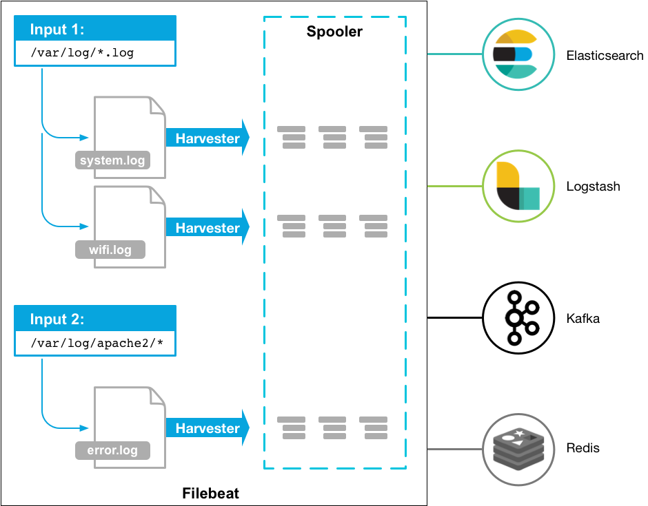

---
mapped_pages:
  - https://www.elastic.co/guide/en/beats/filebeat/current/filebeat-overview.html
  - https://www.elastic.co/guide/en/beats/filebeat/current/index.html
---

# Filebeat

Filebeat is a lightweight shipper for forwarding and centralizing log data. Installed as an agent on your servers, Filebeat monitors the log files or locations that you specify, collects log events, and forwards them either to [Elasticsearch](https://www.elastic.co/products/elasticsearch) or [Logstash](https://www.elastic.co/products/logstash) for indexing.

Here’s how Filebeat works: When you start Filebeat, it starts one or more inputs that look in the locations you’ve specified for log data. For each log that Filebeat locates, Filebeat starts a harvester. Each harvester reads a single log for new content and sends the new log data to libbeat, which aggregates the events and sends the aggregated data to the output that you’ve configured for Filebeat.

For more information about inputs and harvesters, see [*How Filebeat works*](/reference/filebeat/how-filebeat-works.md).

Filebeat is an Elastic [Beat](https://www.elastic.co/beats). It’s based on the `libbeat` framework. For more information, see the [Beats Platform Reference](/reference/index.md).

