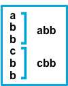
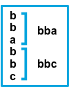
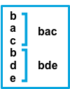
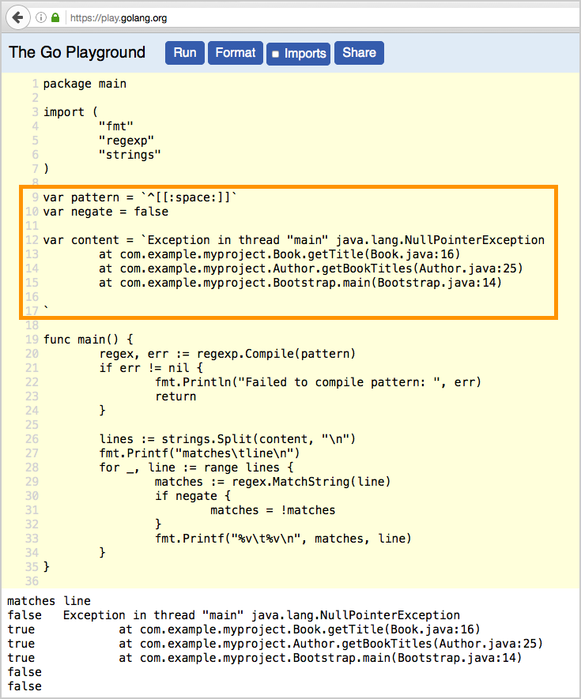

# Manage multiline messages [multiline-examples]


The files harvested by Filebeat may contain messages that span multiple lines of text. For example, multiline messages are common in files that contain Java stack traces. In order to correctly handle these multiline events, you need to configure `multiline` settings in the `filebeat.yml` file to specify which lines are part of a single event.

::::{important}
If you are sending multiline events to Logstash, use the options described here to handle multiline events before sending the event data to Logstash. Trying to implement multiline event handling in Logstash (for example, by using the Logstash multiline codec) may result in the mixing of streams and corrupted data.
::::


Also read [*Avoid YAML formatting problems*](/reference/filebeat/yaml-tips.md) and [Regular expression support](/reference/filebeat/regexp-support.md) to avoid common mistakes.


### Configuration options [multiline]

You can specify the following options in the `filebeat.inputs` section of the `filebeat.yml` config file to control how Filebeat deals with messages that span multiple lines.

The following example shows how to configure `filestream` input in Filebeat to handle a multiline message where the first line of the message begins with a bracket (`[`).

Please note that the example below only works with `filestream` input, and not with `log` input.

```yaml
parsers:
- multiline:
    type: pattern
    pattern: '^\['
    negate: true
    match: after
```

If you still use the deprecated `log` input, there is no need to use `parsers`.

```yaml
multiline.type: pattern
multiline.pattern: '^\['
multiline.negate: true
multiline.match: after
```

Filebeat takes all the lines that do not start with `[` and combines them with the previous line that does. For example, you could use this configuration to join the following lines of a multiline message into a single event:

```sh
[beat-logstash-some-name-832-2015.11.28] IndexNotFoundException[no such index]
    at org.elasticsearch.cluster.metadata.IndexNameExpressionResolver$WildcardExpressionResolver.resolve(IndexNameExpressionResolver.java:566)
    at org.elasticsearch.cluster.metadata.IndexNameExpressionResolver.concreteIndices(IndexNameExpressionResolver.java:133)
    at org.elasticsearch.cluster.metadata.IndexNameExpressionResolver.concreteIndices(IndexNameExpressionResolver.java:77)
    at org.elasticsearch.action.admin.indices.delete.TransportDeleteIndexAction.checkBlock(TransportDeleteIndexAction.java:75)
```

**`multiline.type`**
:   Defines which aggregation method to use. The default is `pattern`. The other options are `count` which lets you aggregate constant number of lines and `while_pattern` which aggregate lines by pattern without match option.

**`multiline.pattern`**
:   Specifies the regular expression pattern to match. Note that the regexp patterns supported by Filebeat differ somewhat from the patterns supported by Logstash. See [Regular expression support](/reference/filebeat/regexp-support.md) for a list of supported regexp patterns. Depending on how you configure other multiline options, lines that match the specified regular expression are considered either continuations of a previous line or the start of a new multiline event. You can set the `negate` option to negate the pattern.

**`multiline.negate`**
:   Defines whether the pattern is negated. The default is `false`.

**`multiline.match`**
:   Specifies how Filebeat combines matching lines into an event. The settings are `after` or `before`. The behavior of these settings depends on what you specify for `negate`:

    | Setting for `negate` | Setting for `match` | Result | Example `pattern: ^b` |
    | --- | --- | --- | --- |
    | `false` | `after` | Consecutive lines that match the pattern are appended to the previous line that doesn’t match. |  |
    | `false` | `before` | Consecutive lines that match the pattern are prepended to the next line that doesn’t match. |  |
    | `true` | `after` | Consecutive lines that don’t match the pattern are appended to the previous line that does match. |  |
    | `true` | `before` | Consecutive lines that don’t match the pattern are prepended to the next line that does match. |  |

    ::::{note}
    The `after` setting is equivalent to `previous` in [Logstash](logstash-docs-md://lsr/plugins-codecs-multiline.md), and `before` is equivalent to `next`.
    ::::


**`multiline.flush_pattern`**
:   Specifies a regular expression, in which the current multiline will be flushed from memory, ending the multiline-message. Work only with `pattern` type.

**`multiline.max_lines`**
:   The maximum number of lines that can be combined into one event. If the multiline message contains more than `max_lines`, any additional lines are discarded. The default is 500.

**`multiline.timeout`**
:   After the specified timeout, Filebeat sends the multiline event even if no new pattern is found to start a new event. The default is 5s.

**`multiline.count_lines`**
:   The number of lines to aggregate into a single event.

**`multiline.skip_newline`**
:   When set, multiline events are concatenated without a line separator.

## Examples of multiline configuration [_examples_of_multiline_configuration]

The examples in this section cover the following use cases:

* Combining a Java stack trace into a single event
* Combining C-style line continuations into a single event
* Combining multiple lines from time-stamped events


#### Java stack traces [_java_stack_traces]

Java stack traces consist of multiple lines, with each line after the initial line beginning with whitespace, as in this example:

```java
Exception in thread "main" java.lang.NullPointerException
        at com.example.myproject.Book.getTitle(Book.java:16)
        at com.example.myproject.Author.getBookTitles(Author.java:25)
        at com.example.myproject.Bootstrap.main(Bootstrap.java:14)
```

To consolidate these lines into a single event in Filebeat, use the following multiline configuration with `filestream`:

```yaml
parsers:
- multiline:
    type: pattern
    pattern: '^[[:space:]]'
    negate: false
    match: after
```

Using `log` input:

```yaml
multiline.type: pattern
multiline.pattern: '^[[:space:]]'
multiline.negate: false
multiline.match: after
```

This configuration merges any line that begins with whitespace up to the previous line.

Here’s a Java stack trace that presents a slightly more complex example:

```sh
Exception in thread "main" java.lang.IllegalStateException: A book has a null property
       at com.example.myproject.Author.getBookIds(Author.java:38)
       at com.example.myproject.Bootstrap.main(Bootstrap.java:14)
Caused by: java.lang.NullPointerException
       at com.example.myproject.Book.getId(Book.java:22)
       at com.example.myproject.Author.getBookIds(Author.java:35)
       ... 1 more
```

To consolidate these lines into a single event in Filebeat, use the following multiline configuration with `filestream`:

```yaml
parsers:
- multiline:
    type: pattern
    pattern: '^[[:space:]]+(at|\.{3})[[:space:]]+\b|^Caused by:'
    negate: false
    match: after
```

Using `log` input:

```yaml
multiline.type: pattern
multiline.pattern: '^[[:space:]]+(at|\.{3})[[:space:]]+\b|^Caused by:'
multiline.negate: false
multiline.match: after
```

In this example, the pattern matches the following lines:

* a line that begins with spaces followed by the word `at` or `...`
* a line that begins with the words `Caused by:`


#### Line continuations [_line_continuations]

Several programming languages use the backslash (`\`) character at the end of a line to denote that the line continues, as in this example:

```c
printf ("%10.10ld  \t %10.10ld \t %s\
  %f", w, x, y, z );
```

To consolidate these lines into a single event in Filebeat, use the following multiline configuration with `filestream`:

```yaml
parsers:
- multiline:
    type: pattern
    pattern: '\\$'
    negate: false
    match: before
```

Using `log` input:

```yaml
multiline.type: pattern
multiline.pattern: '\\$'
multiline.negate: false
multiline.match: before
```

This configuration merges any line that ends with the `\` character with the line that follows.


#### Timestamps [_timestamps]

Activity logs from services such as Elasticsearch typically begin with a timestamp, followed by information on the specific activity, as in this example:

```shell
[2015-08-24 11:49:14,389][INFO ][env                      ] [Letha] using [1] data paths, mounts [[/
(/dev/disk1)]], net usable_space [34.5gb], net total_space [118.9gb], types [hfs]
```

To consolidate these lines into a single event in Filebeat, use the following multiline configuration with `filestream`:

```yaml
parsers:
- multiline:
    type: pattern
    pattern: '^\[[0-9]{4}-[0-9]{2}-[0-9]{2}'
    negate: true
    match: after
```

Using `log` input:

```yaml
multiline.type: pattern
multiline.pattern: '^\[[0-9]{4}-[0-9]{2}-[0-9]{2}'
multiline.negate: true
multiline.match: after
```

This configuration uses the `negate: true` and `match: after` settings to specify that any line that does not match the specified pattern belongs to the previous line.


#### Application events [_application_events]

Sometimes your application logs contain events, that begin and end with custom markers, such as the following example:

```shell
[2015-08-24 11:49:14,389] Start new event
[2015-08-24 11:49:14,395] Content of processing something
[2015-08-24 11:49:14,399] End event
```

To consolidate this as a single event in Filebeat, use the following multiline configuration with `filestream`:

```yaml
parsers:
- multiline:
    type: pattern
    pattern: 'Start new event'
    negate: true
    match: after
    flush_pattern: 'End event'
```

Using `log` input:

```yaml
multiline.type: pattern
multiline.pattern: 'Start new event'
multiline.negate: true
multiline.match: after
multiline.flush_pattern: 'End event'
```

The `flush_pattern` option, specifies a regex at which the current multiline will be flushed. If you think of the `pattern` option specifying the beginning of an event, the `flush_pattern` option will specify the end or last line of the event.

::::{note}
This example will not work correctly if start/end log blocks are mixed with non-multiline logs, or if different start/end log blocks overlap with each other. For instance, `Some other log` log lines in the following example will be merged into a *single* multiline document because they neither match `multiline.pattern` nor `multiline.flush_pattern`, and `multiline.negate` is set to `true`.
::::


```shell
[2015-08-24 11:49:14,389] Start new event
[2015-08-24 11:49:14,395] Content of processing something
[2015-08-24 11:49:14,399] End event
[2015-08-24 11:50:14,389] Some other log
[2015-08-24 11:50:14,395] Some other log
[2015-08-24 11:50:14,399] Some other log
[2015-08-24 11:51:14,389] Start new event
[2015-08-24 11:51:14,395] Content of processing something
[2015-08-24 11:51:14,399] End event
```


## Test your regexp pattern for multiline [_test_your_regexp_pattern_for_multiline]

To make it easier for you to test the regexp patterns in your multiline config, we’ve created a [Go Playground](https://play.golang.org/p/uAd5XHxscu). You can simply plug in the regexp pattern along with the `multiline.negate` setting that you plan to use, and paste a sample message between the content backticks (` `). Then click Run, and you’ll see which lines in the message match your specified configuration. For example:




