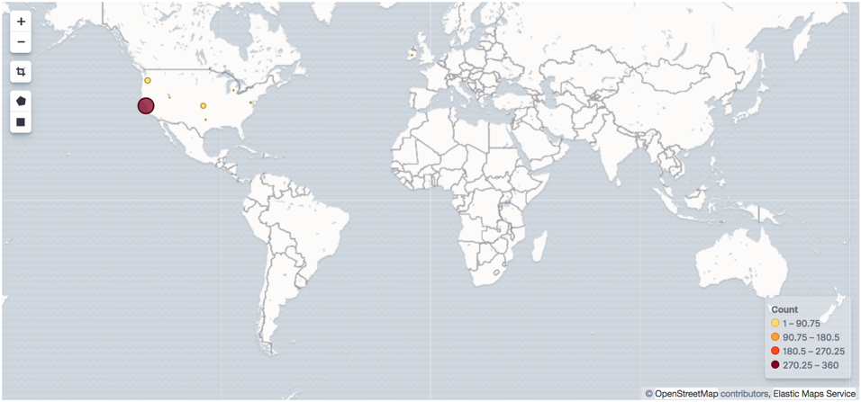

---
mapped_pages:
  - https://www.elastic.co/guide/en/beats/heartbeat/current/heartbeat-geoip.html
---

# Enrich events with geoIP information [heartbeat-geoip]

You can use Heartbeat along with the [GeoIP Processor](elasticsearch://reference/enrich-processor/geoip-processor.md) in {{es}} to export geographic location information based on IP addresses. Then you can use this information to visualize the location of IP addresses on a map in {{kib}}.

The `geoip` processor adds information about the geographical location of IP addresses, based on data from the Maxmind GeoLite2 City Database. Because the processor uses a geoIP database that’s installed on {{es}}, you don’t need to install a geoIP database on the machines running Heartbeat.

::::{note}
If your use case involves using {{ls}}, you can use the [GeoIP filter](logstash-docs-md://lsr/plugins-filters-geoip.md) available in {{ls}} instead of using the `geoip` processor. However, using the `geoip` processor is the simplest approach when you don’t require the additional processing power of {{ls}}.
::::


## Configure the `geoip` processor [heartbeat-configuring-geoip]

To configure Heartbeat and the `geoip` processor:

1. Define an ingest pipeline that uses one or more `geoip` processors to add location information to the event. For example, you can use the Console in {{kib}} to create the following pipeline:

    ```console
    PUT _ingest/pipeline/geoip-info
    {
      "description": "Add geoip info",
      "processors": [
        {
          "geoip": {
            "field": "client.ip",
            "target_field": "client.geo",
            "ignore_missing": true
          }
        },
        {
          "geoip": {
            "database_file": "GeoLite2-ASN.mmdb",
            "field": "client.ip",
            "target_field": "client.as",
            "properties": [
              "asn",
              "organization_name"
            ],
            "ignore_missing": true
          }
        },
        {
          "geoip": {
            "field": "source.ip",
            "target_field": "source.geo",
            "ignore_missing": true
          }
        },
        {
          "geoip": {
            "database_file": "GeoLite2-ASN.mmdb",
            "field": "source.ip",
            "target_field": "source.as",
            "properties": [
              "asn",
              "organization_name"
            ],
            "ignore_missing": true
          }
        },
        {
          "geoip": {
            "field": "destination.ip",
            "target_field": "destination.geo",
            "ignore_missing": true
          }
        },
        {
          "geoip": {
            "database_file": "GeoLite2-ASN.mmdb",
            "field": "destination.ip",
            "target_field": "destination.as",
            "properties": [
              "asn",
              "organization_name"
            ],
            "ignore_missing": true
          }
        },
        {
          "geoip": {
            "field": "server.ip",
            "target_field": "server.geo",
            "ignore_missing": true
          }
        },
        {
          "geoip": {
            "database_file": "GeoLite2-ASN.mmdb",
            "field": "server.ip",
            "target_field": "server.as",
            "properties": [
              "asn",
              "organization_name"
            ],
            "ignore_missing": true
          }
        },
        {
          "geoip": {
            "field": "host.ip",
            "target_field": "host.geo",
            "ignore_missing": true
          }
        },
        {
          "rename": {
            "field": "server.as.asn",
            "target_field": "server.as.number",
            "ignore_missing": true
          }
        },
        {
          "rename": {
            "field": "server.as.organization_name",
            "target_field": "server.as.organization.name",
            "ignore_missing": true
          }
        },
        {
          "rename": {
            "field": "client.as.asn",
            "target_field": "client.as.number",
            "ignore_missing": true
          }
        },
        {
          "rename": {
            "field": "client.as.organization_name",
            "target_field": "client.as.organization.name",
            "ignore_missing": true
          }
        },
        {
          "rename": {
            "field": "source.as.asn",
            "target_field": "source.as.number",
            "ignore_missing": true
          }
        },
        {
          "rename": {
            "field": "source.as.organization_name",
            "target_field": "source.as.organization.name",
            "ignore_missing": true
          }
        },
        {
          "rename": {
            "field": "destination.as.asn",
            "target_field": "destination.as.number",
            "ignore_missing": true
          }
        },
        {
          "rename": {
            "field": "destination.as.organization_name",
            "target_field": "destination.as.organization.name",
            "ignore_missing": true
          }
        }
      ]
    }
    ```

    In this example, the pipeline ID is `geoip-info`. `field` specifies the field that contains the IP address to use for the geographical lookup, and `target_field` is the field that will hold the geographical information. `"ignore_missing": true` configures the pipeline to continue processing when it encounters an event that doesn’t have the specified field.

    See [GeoIP Processor](elasticsearch://reference/enrich-processor/geoip-processor.md) for more options.

    To learn more about adding host information to an event, see [add_host_metadata](/reference/heartbeat/add-host-metadata.md).

2. In the Heartbeat config file, configure the {{es}} output to use the pipeline. Specify the pipeline ID in the `pipeline` option under `output.elasticsearch`. For example:

    ```yaml
    output.elasticsearch:
      hosts: ["localhost:9200"]
      pipeline: geoip-info
    ```

3. Run Heartbeat. Remember to use `sudo` if the config file is owned by root.

    ```sh
    ./heartbeat -e
    ```

    If the lookups succeed, the events are enriched with `geo_point` fields, such as `client.geo.location` and `host.geo.location`, that you can use to populate visualizations in {{kib}}.


If you add a field that’s not already defined as a `geo_point` in the index template, add a mapping so the field gets indexed correctly.


## Visualize locations [heartbeat-visualizing-location]

To visualize the location of IP addresses, you can create a new [coordinate map](docs-content://explore-analyze/visualize/maps.md) in {{kib}} and select the location field, for example `client.geo.location` or `host.geo.location`, as the Geohash.

% TO DO: Use `:class: screenshot`


