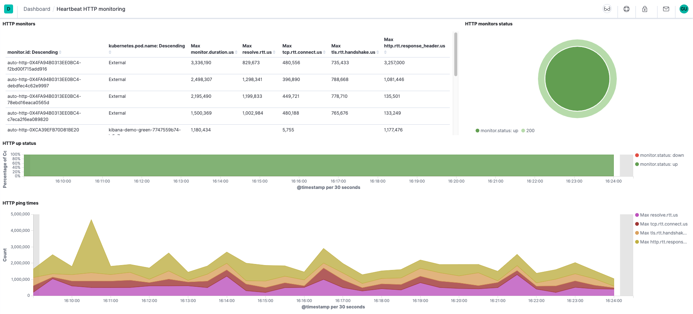

# Heartbeat quick start: installation and configuration [heartbeat-installation-configuration]


This guide describes how to get started quickly collecting uptime data about your hosts. You’ll learn how to:

* install Heartbeat
* specify the protocols to monitor
* send uptime data to {{es}}
* visualize the uptime data in {{kib}}

% TO DO: Use `:class: screenshot`



## Before you begin [_before_you_begin]

You need {{es}} for storing and searching your data, and {{kib}} for visualizing and managing it.

:::::::{tab-set}

::::::{tab-item} Elasticsearch Service
To get started quickly, spin up a deployment of our [hosted {{ess}}](https://www.elastic.co/cloud/elasticsearch-service). The {{ess}} is available on AWS, GCP, and Azure. [Try it out for free](https://cloud.elastic.co/registration?page=docs&placement=docs-body).
::::::

::::::{tab-item} Self-managed
To install and run {{es}} and {{kib}}, see [Installing the {{stack}}](docs-content://deploy-manage/deploy/self-managed/installing-elasticsearch.md).
::::::

:::::::

## Step 1: Install Heartbeat [installation]

Unlike most Beats, which you install on edge nodes, you typically install Heartbeat as part of a monitoring service that runs on a separate machine and possibly even outside of the network where the services that you want to monitor are running.

To download and install Heartbeat, use the commands that work with your system:

:::::::{tab-set}

::::::{tab-item} DEB
```shell subs=true
curl -L -O https://artifacts.elastic.co/downloads/beats/heartbeat/heartbeat-{{stack-version}}-amd64.deb
sudo dpkg -i heartbeat-{{stack-version}}-amd64.deb
```
::::::

::::::{tab-item} RPM
```shell subs=true
curl -L -O https://artifacts.elastic.co/downloads/beats/heartbeat/heartbeat-{{stack-version}}-x86_64.rpm
sudo rpm -vi heartbeat-{{stack-version}}-x86_64.rpm
```
::::::

::::::{tab-item} MacOS
```shell subs=true
curl -L -O https://artifacts.elastic.co/downloads/beats/heartbeat/heartbeat-{{stack-version}}-darwin-x86_64.tar.gz
tar xzvf heartbeat-{{stack-version}}-darwin-x86_64.tar.gz
```
::::::

::::::{tab-item} Linux
```shell subs=true
curl -L -O https://artifacts.elastic.co/downloads/beats/heartbeat/heartbeat-{{stack-version}}-linux-x86_64.tar.gz
tar xzvf heartbeat-{{stack-version}}-linux-x86_64.tar.gz
```
::::::

::::::{tab-item} Windows
1. Download the [Heartbeat Windows zip file](https://artifacts.elastic.co/downloads/beats/heartbeat/heartbeat-{{stack-version}}-windows-x86_64.zip).

2. Extract the contents of the zip file into `C:\Program Files`.

3. Rename the `heartbeat-[version]-windows-x86_64` directory to `Heartbeat`.

4. Open a PowerShell prompt as an Administrator (right-click the PowerShell icon and select *Run As Administrator*).

5. From the PowerShell prompt, run the following commands to install Heartbeat as a Windows service:

  ```shell subs=true
  PS > cd 'C:\Program Files\Heartbeat'
  PS C:\Program Files\Heartbeat> .\install-service-heartbeat.ps1
  ```

:::{note}
If script execution is disabled on your system, you need to set the execution policy for the current session to allow the script to run. For example: `PowerShell.exe -ExecutionPolicy UnRestricted -File .\install-service-heartbeat.ps1`.
:::
::::::
:::::::

The commands shown are for AMD platforms, but ARM packages are also available. Refer to the [download page](https://www.elastic.co/downloads/beats/heartbeat) for the full list of available packages.


### Other installation options [other-installation-options]

* [APT or YUM](/reference/heartbeat/setup-repositories.md)
* [Download page](https://www.elastic.co/downloads/beats/heartbeat)
* [Docker](/reference/heartbeat/running-on-docker.md)


## Step 2: Connect to the {{stack}} [set-connection]

Connections to {{es}} and {{kib}} are required to set up Heartbeat.

Set the connection information in `heartbeat.yml`. To locate this configuration file, see [Directory layout](/reference/heartbeat/directory-layout.md).

:::::::{tab-set}

::::::{tab-item} Elasticsearch Service
Specify the [cloud.id](/reference/heartbeat/configure-cloud-id.md) of your {{ess}}, and set [cloud.auth](/reference/heartbeat/configure-cloud-id.md) to a user who is authorized to set up Heartbeat. For example:

```yaml
cloud.id: "staging:dXMtZWFzdC0xLmF3cy5mb3VuZC5pbyRjZWM2ZjI2MWE3NGJmMjRjZTMzYmI4ODExYjg0Mjk0ZiRjNmMyY2E2ZDA0MjI0OWFmMGNjN2Q3YTllOTYyNTc0Mw=="
cloud.auth: "heartbeat_setup:YOUR_PASSWORD" <1>
```

1. This examples shows a hard-coded password, but you should store sensitive values in the [secrets keystore](/reference/heartbeat/keystore.md).
::::::

::::::{tab-item} Self-managed
1. Set the host and port where Heartbeat can find the {{es}} installation, and set the username and password of a user who is authorized to set up Heartbeat. For example:

    ```yaml
    output.elasticsearch:
      hosts: ["https://myEShost:9200"]
      username: "heartbeat_internal"
      password: "YOUR_PASSWORD" <1>
      ssl:
        enabled: true
        ca_trusted_fingerprint: "b9a10bbe64ee9826abeda6546fc988c8bf798b41957c33d05db736716513dc9c" <2>
    ```

    1. This example shows a hard-coded password, but you should store sensitive values in the [secrets keystore](/reference/heartbeat/keystore.md).
    2. This example shows a hard-coded fingerprint, but you should store sensitive values in the [secrets keystore](/reference/heartbeat/keystore.md). The fingerprint is a HEX encoded SHA-256 of a CA certificate, when you start {{es}} for the first time, security features such as network encryption (TLS) for {{es}} are enabled by default. If you are using the self-signed certificate generated by {{es}} when it is started for the first time, you will need to add its fingerprint here. The fingerprint is printed on {{es}} start up logs, or you can refer to [connect clients to {{es}} documentation](docs-content://deploy-manage/security/security-certificates-keys.md#_connect_clients_to_es_5) for other options on retrieving it. If you are providing your own SSL certificate to {{es}} refer to [Heartbeat documentation on how to setup SSL](/reference/heartbeat/configuration-ssl.md#ssl-client-config).

2. If you plan to use our pre-built {{kib}} dashboards, configure the {{kib}} endpoint. Skip this step if {{kib}} is running on the same host as {{es}}.

    ```yaml
      setup.kibana:
        host: "mykibanahost:5601" <1>
        username: "my_kibana_user" <2> <3>
        password: "YOUR_PASSWORD"
    ```

    1. The hostname and port of the machine where {{kib}} is running, for example, `mykibanahost:5601`. If you specify a path after the port number, include the scheme and port: `http://mykibanahost:5601/path`.
    2. The `username` and `password` settings for {{kib}} are optional. If you don’t specify credentials for {{kib}}, Heartbeat uses the `username` and `password` specified for the {{es}} output.
    3. To use the pre-built {{kib}} dashboards, this user must be authorized to view dashboards or have the `kibana_admin` [built-in role](elasticsearch://reference/elasticsearch/roles.md).
::::::

:::::::
To learn more about required roles and privileges, see [*Grant users access to secured resources*](/reference/heartbeat/feature-roles.md).

::::{note}
You can send data to other [outputs](/reference/heartbeat/configuring-output.md), such as {{ls}}, but that requires additional configuration and setup.
::::


## Step 3: Configure Heartbeat monitors [configuration]

Heartbeat provides monitors to check the status of hosts at set intervals. Heartbeat currently provides monitors for ICMP, TCP, and HTTP (see [*Heartbeat overview*](/reference/heartbeat/index.md) for more about these monitors).

You configure each monitor individually. In `heartbeat.yml`, specify the list of monitors that you want to enable. Each item in the list begins with a dash (-). The following example configures Heartbeat to use three monitors: an `icmp` monitor, a `tcp` monitor, and an `http` monitor.

```yaml
heartbeat.monitors:
- type: icmp
  schedule: '*/5 * * * * * *' <1>
  hosts: ["myhost"]
  id: my-icmp-service
  name: My ICMP Service
- type: tcp
  schedule: '@every 5s' <2>
  hosts: ["myhost:12345"]
  mode: any <3>
  id: my-tcp-service
- type: http
  schedule: '@every 5s'
  urls: ["http://example.net"]
  service.name: apm-service-name <4>
  id: my-http-service
  name: My HTTP Service
```

1. The `icmp` monitor is scheduled to run exactly every 5 seconds (10:00:00, 10:00:05, and so on). The `schedule` option uses a cron-like syntax based on [this `cronexpr` implementation](https://github.com/gorhill/cronexpr#implementation).
2. The `tcp` monitor is set to run every 5 seconds from the time when Heartbeat was started. Heartbeat adds the `@every` keyword to the syntax provided by the `cronexpr` package.
3. The `mode` specifies whether to ping one IP (`any`) or all resolvable IPs
4. The `service.name` field can be used to integrate heartbeat with elastic APM via the Uptime UI.


::::{tip}
To test your configuration file, change to the directory where the Heartbeat binary is installed, and run Heartbeat in the foreground with the following options specified: `./heartbeat test config -e`. Make sure your config files are in the path expected by Heartbeat (see [Directory layout](/reference/heartbeat/directory-layout.md)), or use the `-c` flag to specify the path to the config file.
::::


For more information about configuring Heartbeat, also see:

* [Configure Heartbeat](/reference/heartbeat/configuring-howto-heartbeat.md)
* [Config file format](/reference/libbeat/config-file-format.md)
* [`heartbeat.reference.yml`](/reference/heartbeat/heartbeat-reference-yml.md): This reference configuration file shows all non-deprecated options. You’ll find it in the same location as `heartbeat.yml`.


## Step 4: Configure the Heartbeat location [configurelocation]

Heartbeat can be deployed in multiple locations so that you can detect differences in availability and response times across those locations. Configure the Heartbeat location to allow {{kib}} to display location-specific information on Uptime maps and perform Uptime anomaly detection based on location.

To configure the location of a Heartbeat instance, modify the `add_observer_metadata` processor in `heartbeat.yml`.  The following example specifies the `geo.name` of the `add_observer_metadata` processor as `us-east-1a`:

```yaml
# ============================ Processors ============================

processors:
  - add_observer_metadata:
      # Optional, but recommended geo settings for the location Heartbeat is running in
      geo: <1>
        # Token describing this location
        name: us-east-1a <2>
        # Lat, Lon "
        #location: "37.926868, -78.024902" <3>
```

1. Uncomment the `geo` setting.
2. Uncomment `name` and assign the name of the location of the Heartbeat server.
3. Optionally uncomment `location` and assign the latitude and longitude.


::::{tip}
To test your configuration file, change to the directory where the Heartbeat binary is installed, and run Heartbeat in the foreground with the following options specified: `./heartbeat test config -e`. Make sure your config files are in the path expected by Heartbeat (see [Directory layout](/reference/heartbeat/directory-layout.md)), or use the `-c` flag to specify the path to the config file.
::::


For more information about configuring Heartbeat, also see:

* [Configure Heartbeat](/reference/heartbeat/configuring-howto-heartbeat.md)
* [Config file format](/reference/libbeat/config-file-format.md)
* [`heartbeat.reference.yml`](/reference/heartbeat/heartbeat-reference-yml.md): This reference configuration file shows all non-deprecated options. You’ll find it in the same location as `heartbeat.yml`.


## Step 5: Set up assets [setup-assets]

Heartbeat comes with predefined assets for parsing, indexing, and visualizing your data. To load these assets:

1. Make sure the user specified in `heartbeat.yml` is [authorized to set up Heartbeat](/reference/heartbeat/privileges-to-setup-beats.md).
2. From the installation directory, run:

    :::::::{tab-set}

    ::::::{tab-item} DEB
    ```sh
    heartbeat setup -e
    ```
    ::::::

    ::::::{tab-item} RPM
    ```sh
    heartbeat setup -e
    ```
    ::::::

    ::::::{tab-item} MacOS
    ```sh
    ./heartbeat setup -e
    ```
    ::::::

    ::::::{tab-item} Linux
    ```sh
    ./heartbeat setup -e
    ```
    ::::::

    ::::::{tab-item} Windows
    ```sh
    PS > .\heartbeat.exe setup -e
    ```
    ::::::

    ::::::{tab-item} DEB
    ```sh
    sudo service heartbeat-elastic start
    ```

    ::::{note}
    If you use an `init.d` script to start Heartbeat, you can’t specify command line flags (see [Command reference](/reference/heartbeat/command-line-options.md)). To specify flags, start Heartbeat in the foreground.
    ::::


    Also see [Heartbeat and systemd](/reference/heartbeat/running-with-systemd.md).
    ::::::

    ::::::{tab-item} RPM
    ```sh
    sudo service heartbeat-elastic start
    ```

    ::::{note}
    If you use an `init.d` script to start Heartbeat, you can’t specify command line flags (see [Command reference](/reference/heartbeat/command-line-options.md)). To specify flags, start Heartbeat in the foreground.
    ::::


    Also see [Heartbeat and systemd](/reference/heartbeat/running-with-systemd.md).
    ::::::

    ::::::{tab-item} MacOS
    ```sh
    sudo chown root heartbeat.yml <1>
    sudo ./heartbeat -e
    ```

    1. You’ll be running Heartbeat as root, so you need to change ownership of the configuration file, or run Heartbeat with `--strict.perms=false` specified. See [Config File Ownership and Permissions](/reference/libbeat/config-file-permissions.md).
    ::::::

    ::::::{tab-item} Linux
    ```sh
    sudo chown root heartbeat.yml <1>
    sudo ./heartbeat -e
    ```

    1. You’ll be running Heartbeat as root, so you need to change ownership of the configuration file, or run Heartbeat with `--strict.perms=false` specified. See [Config File Ownership and Permissions](/reference/libbeat/config-file-permissions.md).
    ::::::

    ::::::{tab-item} Windows
    ```sh
    PS C:\Program Files\heartbeat> Start-Service heartbeat
    ```

    By default, Windows log files are stored in `C:\ProgramData\heartbeat\Logs`.
    ::::::
    :::::::

Heartbeat is now ready to check the status of your services and send events to your defined output.


## Step 7: View your data in {{kib}} [view-data]

Heartbeat comes with pre-built {{kib}} dashboards and UIs for visualizing the status of your services. The dashboards are available in the [uptime-contrib](https://github.com/elastic/uptime-contrib) GitHub repository.

If you loaded the dashboards earlier, open them now.

To open the dashboards:

1. Launch {{kib}}:

    :::::::{tab-set}
    ::::::{tab-item} Elasticsearch Service
    1. [Log in](https://cloud.elastic.co/) to your {{ecloud}} account.
    2. Navigate to the {{kib}} endpoint in your deployment.
    ::::::
    ::::::{tab-item} Self-managed
    Point your browser to [http://localhost:5601](http://localhost:5601), replacing `localhost` with the name of the {{kib}} host.
    ::::::
    :::::::

2. In the side navigation, click **Discover**. To see Heartbeat data, make sure the predefined `heartbeat-*` data view is selected.

    ::::{tip}
    If you don’t see data in {{kib}}, try changing the time filter to a larger range. By default, {{kib}} shows the last 15 minutes.
    ::::

3. In the side navigation, click **Dashboard**, then select the dashboard that you want to open.

The dashboards are provided as examples. We recommend that you [customize](docs-content://explore-analyze/dashboards.md) them to meet your needs.


## What’s next? [_whats_next]

Now that you have your uptime data streaming into {{es}}, learn how to unify your logs, metrics, uptime, and application performance data.

1. Ingest data from other sources by installing and configuring other Elastic {{beats}}:

    | Elastic {{beats}} | To capture |
    | --- | --- |
    | [{{metricbeat}}](/reference/metricbeat/metricbeat-installation-configuration.md) | Infrastructure metrics |
    | [{{filebeat}}](/reference/filebeat/filebeat-installation-configuration.md) | Logs |
    | [{{winlogbeat}}](/reference/winlogbeat/winlogbeat-installation-configuration.md) | Windows event logs |
    | [APM](docs-content://solutions/observability/apm/index.md) | Application performance metrics |
    | [{{auditbeat}}](/reference/auditbeat/auditbeat-installation-configuration.md) | Audit events |

2. Use the Observability apps in {{kib}} to search across all your data:

    | Elastic apps | Use to |
    | --- | --- |
    | [{{metrics-app}}](docs-content://solutions/observability/infra-and-hosts/analyze-infrastructure-host-metrics.md) | Explore metrics about systems and services across your ecosystem |
    | [{{logs-app}}](docs-content://solutions/observability/logs/explore-logs.md) | Tail related log data in real time |
    | [{{uptime-app}}](docs-content://solutions/observability/synthetics/index.md#monitoring-uptime) | Monitor availability issues across your apps and services |
    | [APM app](docs-content://solutions/observability/apm/overviews.md) | Monitor application performance |
    | [{{siem-app}}](docs-content://solutions/security.md) | Analyze security events |


