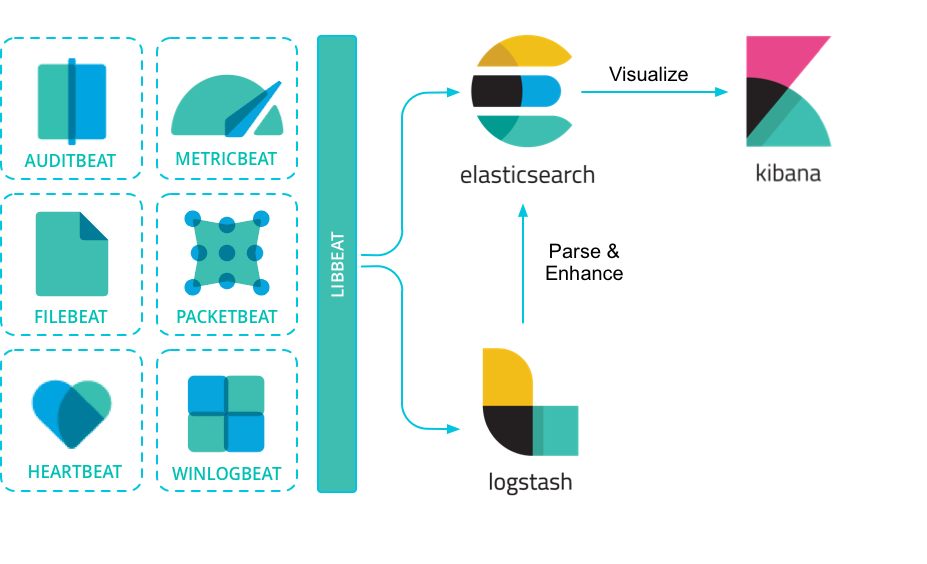

---
mapped_pages:
  - https://www.elastic.co/guide/en/beats/libbeat/current/index.html
  - https://www.elastic.co/guide/en/beats/libbeat/current/beats-reference.html
  - https://www.elastic.co/guide/en/beats/libbeat/current/getting-started.html
  - https://www.elastic.co/guide/en/serverless/current/elasticsearch-ingest-data-through-beats.html
---

# Beats [beats-reference]

{{beats}} are open source data shippers that you install as agents on your servers to send operational data to [{{es}}](https://www.elastic.co/products/elasticsearch). Elastic provides {{beats}} for capturing:

Audit data
:   [Auditbeat](https://www.elastic.co/products/beats/auditbeat)

Log files and journals
:   [Filebeat](https://www.elastic.co/products/beats/filebeat)

Availability
:   [Heartbeat](https://www.elastic.co/products/beats/heartbeat)

Metrics
:   [Metricbeat](https://www.elastic.co/products/beats/metricbeat)

Network traffic
:   [Packetbeat](https://www.elastic.co/products/beats/packetbeat)

Windows event logs
:   [Winlogbeat](https://www.elastic.co/products/beats/winlogbeat)

{{beats}} can send data directly to {{es}} or via [{{ls}}](https://www.elastic.co/products/logstash), where you can further process and enhance the data, before visualizing it in [{{kib}}](https://www.elastic.co/products/logstash).

Want to get up and running quickly with infrastructure metrics monitoring and centralized log analytics? Try out the {{metrics-app}} and the {{logs-app}} in {{kib}}. For more details, see [Analyze metrics](docs-content://solutions/observability/infra-and-hosts/analyze-infrastructure-host-metrics.md) and [Monitor logs](docs-content://solutions/observability/logs/explore-logs.md).

## Need to capture other kinds of data? [_need_to_capture_other_kinds_of_data]

If you have a specific use case to solve, we encourage you to create a [community Beat](/reference/libbeat/community-beats.md). We’ve created an infrastructure to simplify the process. The *libbeat* library, written entirely in Go, offers the API that all Beats use to ship data to Elasticsearch, configure the input options, implement logging, and more. To learn how to create a new Beat, see [Contribute to Beats](../extend/index.md).
