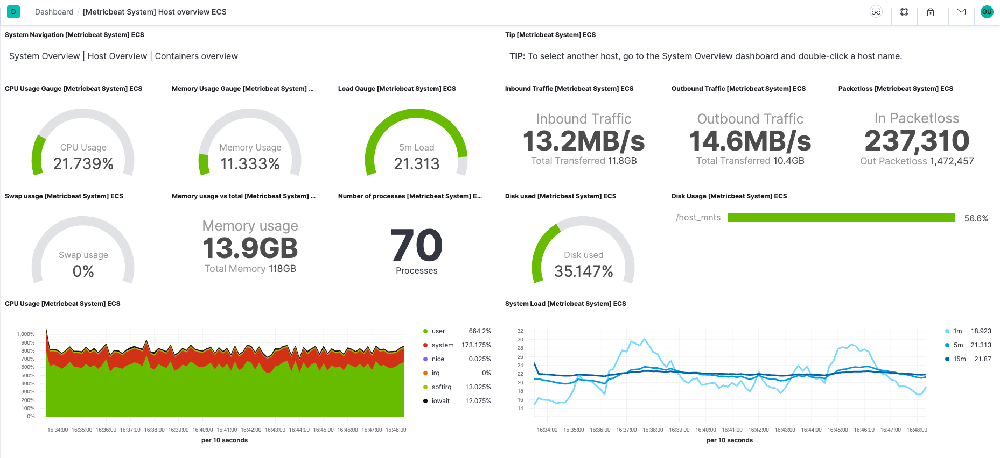

# Metricbeat quick start: installation and configuration [metricbeat-installation-configuration]


Metricbeat helps you monitor your servers and the services they host by collecting metrics from the operating system and services.

This guide describes how to get started quickly with metrics collection. You’ll learn how to:

* install Metricbeat on each system you want to monitor
* specify the metrics you want to collect
* send the metrics to {{es}}
* visualize the metrics data in {{kib}}

% TO DO: Use `:class: screenshot`



## Before you begin [_before_you_begin]

You need {{es}} for storing and searching your data, and {{kib}} for visualizing and managing it.

:::::::{tab-set}

::::::{tab-item} Elasticsearch Service
To get started quickly, spin up a deployment of our [hosted {{ess}}](https://www.elastic.co/cloud/elasticsearch-service). The {{ess}} is available on AWS, GCP, and Azure. [Try it out for free](https://cloud.elastic.co/registration?page=docs&placement=docs-body).
::::::

::::::{tab-item} Self-managed
To install and run {{es}} and {{kib}}, see [Installing the {{stack}}](docs-content://deploy-manage/deploy/self-managed/installing-elasticsearch.md).
::::::

:::::::

## Step 1: Install Metricbeat [install]

Install Metricbeat as close as possible to the service you want to monitor. For example, if you have four servers with MySQL running, it’s recommended that you run Metricbeat on each server. This allows Metricbeat to access your service from localhost and does not cause any additional network traffic or prevent Metricbeat from collecting metrics when there are network problems. Metrics from multiple Metricbeat instances will be combined on the Elasticsearch server.

To download and install Metricbeat, use the commands that work with your system:

:::::::{tab-set}

::::::{tab-item} DEB
```shell subs=true
curl -L -O https://artifacts.elastic.co/downloads/beats/metricbeat/metricbeat-{{stack-version}}-amd64.deb
sudo dpkg -i metricbeat-{{stack-version}}-amd64.deb
```
::::::

::::::{tab-item} RPM
```shell subs=true
curl -L -O https://artifacts.elastic.co/downloads/beats/metricbeat/metricbeat-{{stack-version}}-x86_64.rpm
sudo rpm -vi metricbeat-{{stack-version}}-x86_64.rpm
```
::::::

::::::{tab-item} MacOS
```shell subs=true
curl -L -O https://artifacts.elastic.co/downloads/beats/metricbeat/metricbeat-{{stack-version}}-darwin-x86_64.tar.gz
tar xzvf metricbeat-{{stack-version}}-darwin-x86_64.tar.gz
```
::::::

::::::{tab-item} Linux
```shell subs=true
curl -L -O https://artifacts.elastic.co/downloads/beats/metricbeat/metricbeat-{{stack-version}}-linux-x86_64.tar.gz
tar xzvf metricbeat-{{stack-version}}-linux-x86_64.tar.gz
```
::::::

::::::{tab-item} Windows
1. Download the [Metricbeat Windows zip file](https://artifacts.elastic.co/downloads/beats/metricbeat/metricbeat-{{stack-version}}-windows-x86_64.zip).

2. Extract the contents of the zip file into `C:\Program Files`.

3. Rename the `metricbeat-[version]-windows-x86_64` directory to `Metricbeat`.

4. Open a PowerShell prompt as an Administrator (right-click the PowerShell icon and select *Run As Administrator*).

5. From the PowerShell prompt, run the following commands to install Metricbeat as a Windows service:

  ```shell subs=true
  PS > cd 'C:\Program Files\Metricbeat'
  PS C:\Program Files\Metricbeat> .\install-service-metricbeat.ps1
  ```

:::{note}
If script execution is disabled on your system, you need to set the execution policy for the current session to allow the script to run. For example: `PowerShell.exe -ExecutionPolicy UnRestricted -File .\install-service-metricbeat.ps1`.
:::
::::::

:::::::
The commands shown are for AMD platforms, but ARM packages are also available. Refer to the [download page](https://www.elastic.co/downloads/beats/metricbeat) for the full list of available packages.


### Other installation options [other-installation-options]

* [APT or YUM](/reference/metricbeat/setup-repositories.md)
* [Download page](https://www.elastic.co/downloads/beats/metricbeat)
* [Docker](/reference/metricbeat/running-on-docker.md)
* [Kubernetes](/reference/metricbeat/running-on-kubernetes.md)
* [Cloud Foundry](/reference/metricbeat/running-on-cloudfoundry.md)


## Step 2: Connect to the {{stack}} [set-connection]

Connections to {{es}} and {{kib}} are required to set up Metricbeat.

Set the connection information in `metricbeat.yml`. To locate this configuration file, see [Directory layout](/reference/metricbeat/directory-layout.md).

:::::::{tab-set}

::::::{tab-item} Elasticsearch Service
Specify the [cloud.id](/reference/metricbeat/configure-cloud-id.md) of your {{ess}}, and set [cloud.auth](/reference/metricbeat/configure-cloud-id.md) to a user who is authorized to set up Metricbeat. For example:

```yaml
cloud.id: "staging:dXMtZWFzdC0xLmF3cy5mb3VuZC5pbyRjZWM2ZjI2MWE3NGJmMjRjZTMzYmI4ODExYjg0Mjk0ZiRjNmMyY2E2ZDA0MjI0OWFmMGNjN2Q3YTllOTYyNTc0Mw=="
cloud.auth: "metricbeat_setup:YOUR_PASSWORD" <1>
```

1. This examples shows a hard-coded password, but you should store sensitive values in the [secrets keystore](/reference/metricbeat/keystore.md).
::::::

::::::{tab-item} Self-managed
1. Set the host and port where Metricbeat can find the {{es}} installation, and set the username and password of a user who is authorized to set up Metricbeat. For example:

    ```yaml
    output.elasticsearch:
      hosts: ["https://myEShost:9200"]
      username: "metricbeat_internal"
      password: "YOUR_PASSWORD" <1>
      ssl:
        enabled: true
        ca_trusted_fingerprint: "b9a10bbe64ee9826abeda6546fc988c8bf798b41957c33d05db736716513dc9c" <2>
    ```

    1. This example shows a hard-coded password, but you should store sensitive values in the [secrets keystore](/reference/metricbeat/keystore.md).
    2. This example shows a hard-coded fingerprint, but you should store sensitive values in the [secrets keystore](/reference/metricbeat/keystore.md). The fingerprint is a HEX encoded SHA-256 of a CA certificate, when you start {{es}} for the first time, security features such as network encryption (TLS) for {{es}} are enabled by default. If you are using the self-signed certificate generated by {{es}} when it is started for the first time, you will need to add its fingerprint here. The fingerprint is printed on {{es}} start up logs, or you can refer to [connect clients to {{es}} documentation](docs-content://deploy-manage/security/security-certificates-keys.md#_connect_clients_to_es_5) for other options on retrieving it. If you are providing your own SSL certificate to {{es}} refer to [Metricbeat documentation on how to setup SSL](/reference/metricbeat/configuration-ssl.md#ssl-client-config).

2. If you plan to use our pre-built {{kib}} dashboards, configure the {{kib}} endpoint. Skip this step if {{kib}} is running on the same host as {{es}}.

    ```yaml
      setup.kibana:
        host: "mykibanahost:5601" <1>
        username: "my_kibana_user" <2> <3>
        password: "YOUR_PASSWORD"
    ```

    1. The hostname and port of the machine where {{kib}} is running, for example, `mykibanahost:5601`. If you specify a path after the port number, include the scheme and port: `http://mykibanahost:5601/path`.
    2. The `username` and `password` settings for {{kib}} are optional. If you don’t specify credentials for {{kib}}, Metricbeat uses the `username` and `password` specified for the {{es}} output.
    3. To use the pre-built {{kib}} dashboards, this user must be authorized to view dashboards or have the `kibana_admin` [built-in role](elasticsearch://reference/elasticsearch/roles.md).
::::::

:::::::
To learn more about required roles and privileges, see [*Grant users access to secured resources*](/reference/metricbeat/feature-roles.md).

::::{note}
You can send data to other [outputs](/reference/metricbeat/configuring-output.md), such as {{ls}}, but that requires additional configuration and setup.
::::


## Step 3: Enable and configure metrics collection modules [enable-modules]

Metricbeat uses modules to collect metrics. Each module defines the basic logic for collecting data from a specific service, such as Redis or MySQL. A module consists of metricsets that fetch and structure the data. Read [*How Metricbeat works*](/reference/metricbeat/how-metricbeat-works.md) to learn more.

1. Identify the modules you need to enable. To see the list of available [modules](/reference/metricbeat/metricbeat-modules.md), run:

    :::::::{tab-set}

    ::::::{tab-item} DEB
    ```sh
    metricbeat modules list
    ```
    ::::::

    ::::::{tab-item} RPM
    ```sh
    metricbeat modules list
    ```
    ::::::

    ::::::{tab-item} MacOS
    ```sh
    ./metricbeat modules list
    ```
    ::::::

    ::::::{tab-item} Linux
    ```sh
    ./metricbeat modules list
    ```
    ::::::

    ::::::{tab-item} Windows
    ```sh
    PS > .\metricbeat.exe modules list
    ```
    ::::::

    ::::::{tab-item} DEB
    ```sh
    metricbeat modules enable nginx
    ```
    ::::::

    ::::::{tab-item} RPM
    ```sh
    metricbeat modules enable nginx
    ```
    ::::::

    ::::::{tab-item} MacOS
    ```sh
    ./metricbeat modules enable nginx
    ```
    ::::::

    ::::::{tab-item} Linux
    ```sh
    ./metricbeat modules enable nginx
    ```
    ::::::

    ::::::{tab-item} Windows
    ```sh
    PS > .\metricbeat.exe modules enable nginx
    ```
    ::::::

    ::::::{tab-item} DEB
    ```sh
    metricbeat setup -e
    ```
    ::::::

    ::::::{tab-item} RPM
    ```sh
    metricbeat setup -e
    ```
    ::::::

    ::::::{tab-item} MacOS
    ```sh
    ./metricbeat setup -e
    ```
    ::::::

    ::::::{tab-item} Linux
    ```sh
    ./metricbeat setup -e
    ```
    ::::::

    ::::::{tab-item} Windows
    ```sh
    PS > .\metricbeat.exe setup -e
    ```
    ::::::

    ::::::{tab-item} DEB
    ```sh
    sudo service metricbeat start
    ```

    ::::{note}
    If you use an `init.d` script to start Metricbeat, you can’t specify command line flags (see [Command reference](/reference/metricbeat/command-line-options.md)). To specify flags, start Metricbeat in the foreground.
    ::::


    Also see [Metricbeat and systemd](/reference/metricbeat/running-with-systemd.md).
    ::::::

    ::::::{tab-item} RPM
    ```sh
    sudo service metricbeat start
    ```

    ::::{note}
    If you use an `init.d` script to start Metricbeat, you can’t specify command line flags (see [Command reference](/reference/metricbeat/command-line-options.md)). To specify flags, start Metricbeat in the foreground.
    ::::


    Also see [Metricbeat and systemd](/reference/metricbeat/running-with-systemd.md).
    ::::::

    ::::::{tab-item} MacOS
    ```sh
    sudo chown root metricbeat.yml <1>
    sudo chown root modules.d/nginx.yml <1>
    sudo ./metricbeat -e
    ```

    1. You’ll be running Metricbeat as root, so you need to change ownership of the configuration file and any configurations enabled in the `modules.d` directory, or run Metricbeat with `--strict.perms=false` specified. See [Config File Ownership and Permissions](/reference/libbeat/config-file-permissions.md).
    ::::::

    ::::::{tab-item} Linux
    ```sh
    sudo chown root metricbeat.yml <1>
    sudo chown root modules.d/nginx.yml <1>
    sudo ./metricbeat -e
    ```

    1. You’ll be running Metricbeat as root, so you need to change ownership of the configuration file and any configurations enabled in the `modules.d` directory, or run Metricbeat with `--strict.perms=false` specified. See [Config File Ownership and Permissions](/reference/libbeat/config-file-permissions.md).
    ::::::

    ::::::{tab-item} Windows
    ```sh
    PS C:\Program Files\metricbeat> Start-Service metricbeat
    ```

    By default, Windows log files are stored in `C:\ProgramData\metricbeat\Logs`.

    ::::{note}
    On Windows, statistics about system load and swap usage are currently not captured
    ::::
    ::::::
    :::::::

Metricbeat should begin streaming metrics to {{es}}.


## Step 6: View your data in {{kib}} [view-data]

Metricbeat comes with pre-built {{kib}} dashboards and UIs for visualizing log data. You loaded the dashboards earlier when you ran the `setup` command.

To open the dashboards:

1. Launch {{kib}}:

    :::::::{tab-set}
    ::::::{tab-item} Elasticsearch Service
    1. [Log in](https://cloud.elastic.co/) to your {{ecloud}} account.
    2. Navigate to the {{kib}} endpoint in your deployment.
    ::::::
    ::::::{tab-item} Self-managed
    Point your browser to [http://localhost:5601](http://localhost:5601), replacing `localhost` with the name of the {{kib}} host.
    ::::::
    :::::::

2. In the side navigation, click **Discover**. To see Metricbeat data, make sure the predefined `metricbeat-*` data view is selected.

    ::::{tip}
    If you don’t see data in {{kib}}, try changing the time filter to a larger range. By default, {{kib}} shows the last 15 minutes.
    ::::

3. In the side navigation, click **Dashboard**, then select the dashboard that you want to open.

The dashboards are provided as examples. We recommend that you [customize](docs-content://explore-analyze/dashboards.md) them to meet your needs.


## What’s next? [_whats_next]

Now that you have your infrastructure metrics streaming into {{es}}, learn how to unify your logs, metrics, uptime, and application performance data.

1. Ingest data from other sources by installing and configuring other Elastic {{beats}}:

    | Elastic {{beats}} | To capture |
    | --- | --- |
    | [{{filebeat}}](/reference/filebeat/filebeat-installation-configuration.md) | Logs |
    | [{{winlogbeat}}](/reference/winlogbeat/winlogbeat-installation-configuration.md) | Windows event logs |
    | [{{heartbeat}}](/reference/heartbeat/heartbeat-installation-configuration.md) | Uptime information |
    | [APM](docs-content://solutions/observability/apm/index.md) | Application performance metrics |
    | [{{auditbeat}}](/reference/auditbeat/auditbeat-installation-configuration.md) | Audit events |

2. Use the Observability apps in {{kib}} to search across all your data:

    | Elastic apps | Use to |
    | --- | --- |
    | [{{metrics-app}}](docs-content://solutions/observability/infra-and-hosts/analyze-infrastructure-host-metrics.md) | Explore metrics about systems and services across your ecosystem |
    | [{{logs-app}}](docs-content://solutions/observability/logs/explore-logs.md) | Tail related log data in real time |
    | [{{uptime-app}}](docs-content://solutions/observability/synthetics/index.md#monitoring-uptime) | Monitor availability issues across your apps and services |
    | [APM app](docs-content://solutions/observability/apm/overviews.md) | Monitor application performance |
    | [{{siem-app}}](docs-content://solutions/security.md) | Analyze security events |


