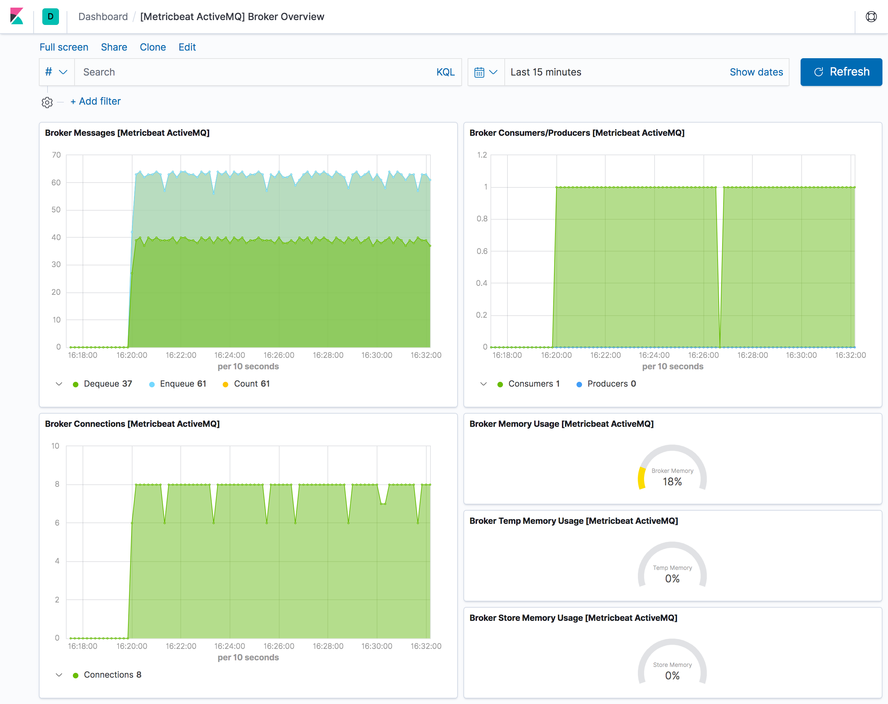

---
mapped_pages:
  - https://www.elastic.co/guide/en/beats/metricbeat/current/metricbeat-metricset-activemq-broker.html
---

# ActiveMQ broker metricset [metricbeat-metricset-activemq-broker]

This is the `broker` metricset of the ActiveMQ module.

The metricset provides metrics describing the monitored ActiveMQ broker, especially connected consumers, producers, memory usage, active connections and exchanged messages.

To collect data, the module communicates with a Jolokia HTTP/REST endpoint that exposes the JMX metrics over HTTP/REST/JSON (JMX key: `org.apache.activemq:brokerName=*,type=Broker`).

The broker metricset comes with a predefined dashboard:



This is a default metricset. If the host module is unconfigured, this metricset is enabled by default.

## Fields [_fields_4]

For a description of each field in the metricset, see the [exported fields](/reference/metricbeat/exported-fields-activemq.md) section.

Here is an example document generated by this metricset:

```json
{
    "@timestamp": "2019-11-19T13:14:17.425Z",
    "@metadata": {
        "beat": "metricbeat",
        "type": "_doc",
        "version": "8.0.0"
    },
    "event": {
        "duration": 100756657,
        "dataset": "activemq.broker",
        "module": "activemq"
    },
    "metricset": {
        "name": "broker",
        "period": 5000
    },
    "service": {
        "address": "localhost:33051",
        "type": "activemq"
    },
    "activemq": {
        "broker": {
            "mbean": "org.apache.activemq:brokerName=localhost,type=Broker",
            "memory": {
                "store": {
                    "pct": 0
                },
                "temp": {
                    "pct": 0
                },
                "broker": {
                    "pct": 0
                }
            },
            "messages": {
                "dequeue": {
                    "count": 0
                },
                "enqueue": {
                    "count": 1
                },
                "count": 0
            },
            "producers": {
                "count": 0
            },
            "connections": {
                "count": 0
            },
            "consumers": {
                "count": 0
            },
            "name": "localhost"
        }
    },
    "ecs": {
        "version": "1.2.0"
    },
    "host": {
        "name": "macbook.local"
    },
    "agent": {
        "hostname": "macbook.local",
        "id": "8d20f9a9-b24d-419b-97e6-bcccfb64679c",
        "version": "8.0.0",
        "type": "metricbeat",
        "ephemeral_id": "aa9fb858-9b48-4028-a5e6-d46d83982572"
    }
}
```


