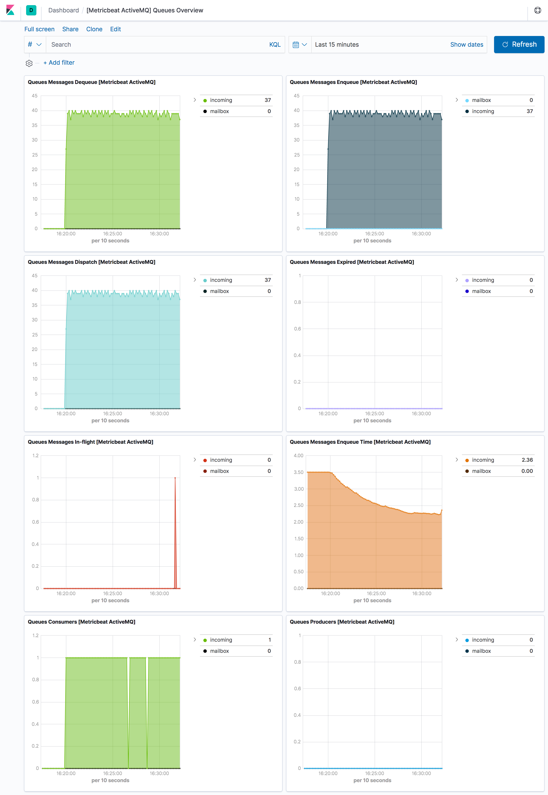

---
mapped_pages:
  - https://www.elastic.co/guide/en/beats/metricbeat/current/metricbeat-metricset-activemq-queue.html
---

# ActiveMQ queue metricset [metricbeat-metricset-activemq-queue]

This is the `queue` metricset of the ActiveMQ module.

The metricset provides metrics describing the available ActiveMQ queues, especially exchanged messages (enqueued, dequeued, expired, in-flight), connected consumers, producers and its current length.

To collect data, the module communicates with a Jolokia HTTP/REST endpoint that exposes the JMX metrics over HTTP/REST/JSON (JMX key: `org.apache.activemq:brokerName=localhost,destinationName=sample_queue,destinationType=Queue,type=Broker`).

The queue metricset comes with a predefined dashboard:



This is a default metricset. If the host module is unconfigured, this metricset is enabled by default.

## Fields [_fields_5]

For a description of each field in the metricset, see the [exported fields](/reference/metricbeat/exported-fields-activemq.md) section.

Here is an example document generated by this metricset:

```json
{
    "@timestamp": "2019-11-19T13:13:56.283Z",
    "@metadata": {
        "beat": "metricbeat",
        "type": "_doc",
        "version": "8.0.0"
    },
    "metricset": {
        "name": "queue",
        "period": 5000
    },
    "ecs": {
        "version": "1.2.0"
    },
    "host": {
        "name": "macbook.local"
    },
    "agent": {
        "ephemeral_id": "e830f069-d442-498c-af73-6b02fa8b0f90",
        "hostname": "macbook.local",
        "id": "8d20f9a9-b24d-419b-97e6-bcccfb64679c",
        "version": "8.0.0",
        "type": "metricbeat"
    },
    "service": {
        "type": "activemq",
        "address": "localhost:33049"
    },
    "activemq": {
        "queue": {
            "producers": {
                "count": 0
            },
            "name": "sample_queue",
            "memory": {
                "broker": {
                    "pct": 0
                }
            },
            "size": 2,
            "consumers": {
                "count": 0
            },
            "mbean": "org.apache.activemq:brokerName=localhost,destinationName=sample_queue,destinationType=Queue,type=Broker",
            "messages": {
                "size": {
                    "avg": 1037
                },
                "expired": {
                    "count": 0
                },
                "dequeue": {
                    "count": 0
                },
                "inflight": {
                    "count": 0
                },
                "dispatch": {
                    "count": 0
                },
                "enqueue": {
                    "time": {
                        "avg": 0,
                        "min": 0,
                        "max": 0
                    },
                    "count": 2
                }
            }
        }
    },
    "event": {
        "dataset": "activemq.queue",
        "module": "activemq",
        "duration": 16081129
    }
}
```


