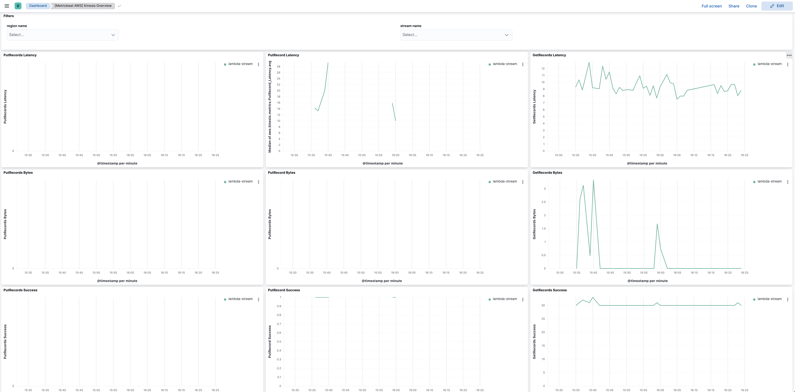

---
mapped_pages:
  - https://www.elastic.co/guide/en/beats/metricbeat/current/metricbeat-metricset-aws-kinesis.html
---

# AWS kinesis metricset [metricbeat-metricset-aws-kinesis]

::::{warning}
This functionality is in beta and is subject to change. The design and code is less mature than official GA features and is being provided as-is with no warranties. Beta features are not subject to the support SLA of official GA features.
::::


Amazon Kinesis Data Streams sends data points to CloudWatch for monitoring purpose, such as to track shard usage, monitor incoming bytes and outgoing bytes. These metrics are automatically collected and pushed to CloudWatch every minute. There are two different levels of monitoring metrics:

* **Basic(stream-level)**: Stream-level data is sent automatically every minute at no charge.
* **Enhanced(shard-level)**: Shard-level data is sent every minute for an additional cost. To get this level of data, you must specifically enable it for the stream using the [EnableEnhancedMonitoring](https://docs.aws.amazon.com/kinesis/latest/APIReference/API_EnableEnhancedMonitoring.html) operation.


## AWS Permissions [_aws_permissions_7]

Some specific AWS permissions are required for IAM user to collect AWS EBS metrics.

```
ec2:DescribeRegions
cloudwatch:GetMetricData
cloudwatch:ListMetrics
tag:getResources
sts:GetCallerIdentity
iam:ListAccountAliases
```


## Dashboard [_dashboard_8]

The kinesis metricset comes with a predefined dashboard. For example:




## Configuration example [_configuration_example_7]

```yaml
- module: aws
  period: 1m
  metricsets:
    - kinesis
  # This module uses the aws cloudwatch metricset, all
  # the options for this metricset are also available here.
```

This is a default metricset. If the host module is unconfigured, this metricset is enabled by default.

## Fields [_fields_17]

For a description of each field in the metricset, see the [exported fields](/reference/metricbeat/exported-fields-aws.md) section.

Here is an example document generated by this metricset:

```json
{
    "@timestamp": "2017-10-12T08:05:34.853Z",
    "aws": {
        "cloudwatch": {
            "namespace": "AWS/Kinesis"
        },
        "dimensions": {
            "StreamName": "fb-test"
        },
        "kinesis": {
            "metrics": {
                "GetRecords_Bytes": {
                    "avg": 0
                },
                "GetRecords_IteratorAgeMilliseconds": {
                    "avg": 0
                },
                "GetRecords_Latency": {
                    "avg": 9.46
                },
                "GetRecords_Records": {
                    "sum": 0
                },
                "GetRecords_Success": {
                    "sum": 150
                },
                "ReadProvisionedThroughputExceeded": {
                    "avg": 0
                }
            }
        }
    },
    "cloud": {
        "account": {
            "id": "428152502467",
            "name": "elastic-beats"
        },
        "provider": "aws",
        "region": "us-west-1"
    },
    "event": {
        "dataset": "aws.kinesis",
        "duration": 115000,
        "module": "aws"
    },
    "metricset": {
        "name": "kinesis",
        "period": 10000
    },
    "service": {
        "type": "aws"
    }
}
```


