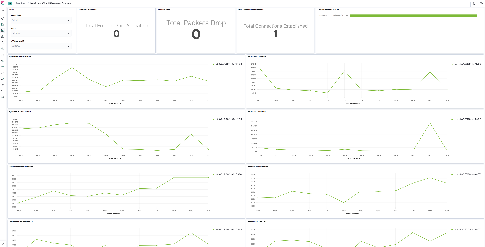

---
mapped_pages:
  - https://www.elastic.co/guide/en/beats/metricbeat/current/metricbeat-metricset-aws-natgateway.html
---

# AWS natgateway metricset [metricbeat-metricset-aws-natgateway]

::::{warning}
This functionality is in beta and is subject to change. The design and code is less mature than official GA features and is being provided as-is with no warranties. Beta features are not subject to the support SLA of official GA features.
::::


The natgateway metricset of aws module allows users to monitor NAT gateway services. NAT gateway metric data can be used to monitor and troubleshoot NAT gateways and the data is provided at 1-minute intervals to CloudWatch. Users can use these metrics to gain a better perspective on how the web application or service is performing.


## AWS Permissions [_aws_permissions_9]

Some specific AWS permissions are required for IAM user to collect usage metrics.

```
ec2:DescribeRegions
cloudwatch:GetMetricData
cloudwatch:ListMetrics
tag:getResources
sts:GetCallerIdentity
iam:ListAccountAliases
```


## Dashboard [_dashboard_10]

The aws natgateway metricset comes with a predefined dashboard. For example:




## Configuration example [_configuration_example_9]

```yaml
- module: aws
  period: 1m
  metricsets:
    - natgateway
  # This module uses the aws cloudwatch metricset, all
  # the options for this metricset are also available here.
```


## Metrics and Dimensions for NAT gateway [_metrics_and_dimensions_for_nat_gateway]

Metrics:

| Metric Name | Statistic Method | Description |
| --- | --- | --- |
| ActiveConnectionCount | Max | The total number of concurrent active TCP connections through the NAT gateway. |
| BytesInFromDestination | Sum | The number of bytes received by the NAT gateway from the destination. |
| BytesInFromSource | Sum | The number of bytes received by the NAT gateway from clients in your VPC. |
| BytesOutToDestination | Sum | The number of bytes sent out through the NAT gateway to the destination. |
| BytesOutToSource | Sum | The number of bytes sent through the NAT gateway to the clients in your VPC. |
| ConnectionAttemptCount | Sum | The number of connection attempts made through the NAT gateway. |
| ConnectionEstablishedCount | Sum | The number of connections established through the NAT gateway. |
| ErrorPortAllocation | Sum | The number of times the NAT gateway could not allocate a source port. |
| IdleTimeoutCount | Sum | The number of connections that transitioned from the active state to the idle state. |
| PacketsDropCount | Sum | The number of packets dropped by the NAT gateway. |
| PacketsInFromDestination | Sum | The number of packets received by the NAT gateway from the destination. |
| PacketsInFromSource | Sum | The number of packets received by the NAT gateway from clients in your VPC. |
| PacketsOutToDestination | Sum | The number of packets sent out through the NAT gateway to the destination. |
| PacketsOutToSource | Sum | The number of packets sent through the NAT gateway to the clients in your VPC. |

Dimensions:

| Dimension Name | Description |
| --- | --- |
| NatGatewayId | Filter the metric data by the NAT gateway ID. |

Please see [NAT Gateway CloudWatch Metrics](https://docs.aws.amazon.com/vpc/latest/userguide/vpc-nat-gateway-cloudwatch.html) for more details.

This is a default metricset. If the host module is unconfigured, this metricset is enabled by default.

## Fields [_fields_19]

For a description of each field in the metricset, see the [exported fields](/reference/metricbeat/exported-fields-aws.md) section.

Here is an example document generated by this metricset:

```json
{
    "@timestamp": "2017-10-12T08:05:34.853Z",
    "aws": {
        "cloudwatch": {
            "namespace": "AWS/NATGateway"
        },
        "dimensions": {
            "NatGatewayId": "nat-0a5cb7b9807908cc0"
        },
        "natgateway": {
            "metrics": {
                "ActiveConnectionCount": {
                    "max": 0
                },
                "BytesInFromDestination": {
                    "sum": 0
                },
                "BytesInFromSource": {
                    "sum": 0
                },
                "BytesOutToDestination": {
                    "sum": 0
                },
                "BytesOutToSource": {
                    "sum": 0
                },
                "ConnectionAttemptCount": {
                    "sum": 0
                },
                "ConnectionEstablishedCount": {
                    "sum": 0
                },
                "ErrorPortAllocation": {
                    "sum": 0
                },
                "PacketsDropCount": {
                    "sum": 0
                },
                "PacketsInFromDestination": {
                    "sum": 0
                },
                "PacketsInFromSource": {
                    "sum": 0
                },
                "PacketsOutToDestination": {
                    "sum": 0
                },
                "PacketsOutToSource": {
                    "sum": 0
                }
            }
        }
    },
    "cloud": {
        "account": {
            "id": "627959692251",
            "name": "elastic-test"
        },
        "provider": "aws",
        "region": "us-west-2"
    },
    "event": {
        "dataset": "aws.natgateway",
        "duration": 115000,
        "module": "aws"
    },
    "metricset": {
        "name": "natgateway",
        "period": 10000
    },
    "service": {
        "type": "aws"
    }
}
```


