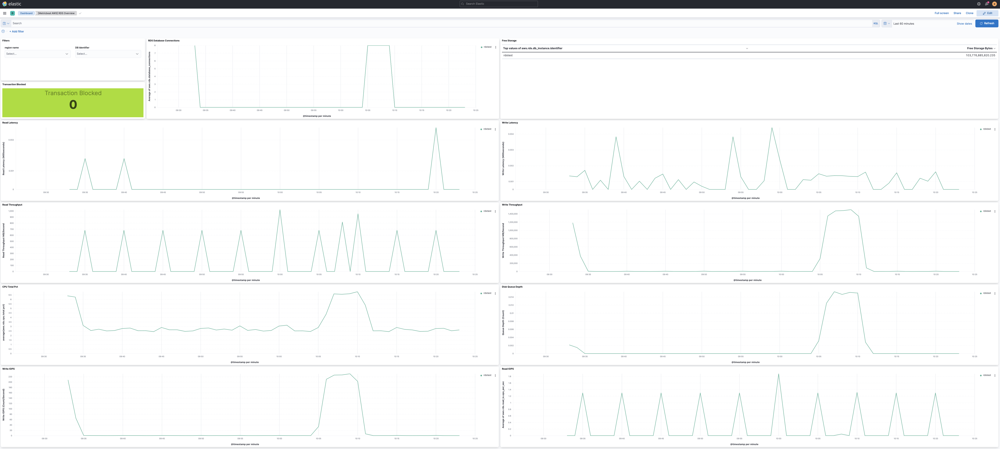

---
mapped_pages:
  - https://www.elastic.co/guide/en/beats/metricbeat/current/metricbeat-metricset-aws-rds.html
---

# AWS rds metricset [metricbeat-metricset-aws-rds]

The rds metricset of aws module allows you to monitor your AWS RDS service. `rds` metricset fetches a set of metrics from [Amazon RDS](https://docs.aws.amazon.com/AmazonRDS/latest/UserGuide/MonitoringOverview.html) and [Amazon Aurora DB](https://docs.aws.amazon.com/AmazonRDS/latest/AuroraUserGuide/Aurora.Monitoring.html). with Amazon RDS, users can monitor network throughput, I/O for read, write, and/or metadata operations, client connections, and burst credit balances for their DB instances. Amazon RDS sends metrics and dimensions to Amazon CloudWatch every minute. Amazon Aurora provides a variety of Amazon CloudWatch metrics that users can use to monitor health and performance of their Aurora DB cluster. This metricset by default collects all tags from AWS RDS.


## AWS Permissions [_aws_permissions_10]

Some specific AWS permissions are required for IAM user to collect AWS RDS metrics.

```
cloudwatch:GetMetricData
ec2:DescribeRegions
rds:DescribeDBInstances
rds:ListTagsForResource
sts:GetCallerIdentity
iam:ListAccountAliases
```


## Dashboard [_dashboard_11]

The aws rds metricset comes with a predefined dashboard.




## Configuration example [_configuration_example_10]

```yaml
- module: aws
  period: 60s
  metricsets:
    - rds
  access_key_id: '<access_key_id>'
  secret_access_key: '<secret_access_key>'
  session_token: '<session_token>'
```

This is a default metricset. If the host module is unconfigured, this metricset is enabled by default.

## Fields [_fields_20]

For a description of each field in the metricset, see the [exported fields](/reference/metricbeat/exported-fields-aws.md) section.

Here is an example document generated by this metricset:

```json
{
    "@timestamp": "2017-10-12T08:05:34.853Z",
    "aws": {
        "cloudwatch": {
            "namespace": "AWS/RDS"
        },
        "dimensions": {
            "DatabaseClass": "db.r5.large"
        },
        "rds": {
            "aurora_bin_log_replica_lag": 0,
            "aurora_replica": {
                "lag": {
                    "ms": 19.9485
                },
                "lag_max": {
                    "ms": 21.318500518798828
                },
                "lag_min": {
                    "ms": 21.318500518798828
                }
            },
            "aurora_volume_left_total": {
                "bytes": 70007366615040
            },
            "cache_hit_ratio": {
                "buffer": 100,
                "result_set": 0
            },
            "cpu": {
                "total": {
                    "pct": 0.06552109062928828
                }
            },
            "database_connections": 0,
            "deadlocks": 0,
            "engine_uptime": {
                "sec": 33121208
            },
            "free_local_storage": {
                "bytes": 27275925504
            },
            "freeable_memory": {
                "bytes": 4604928000
            },
            "latency": {
                "commit": 3.2349916666666667,
                "ddl": 0,
                "delete": 0,
                "dml": 0.09888333333333334,
                "insert": 0.09888333333333334,
                "read": 0,
                "select": 0.2432811228126595,
                "update": 0,
                "write": 0.0005787267919438727
            },
            "login_failures": 0,
            "queries": 7.862475898034027,
            "throughput": {
                "commit": 0.24950762724254,
                "ddl": 0,
                "delete": 0,
                "dml": 0.24950762724254,
                "insert": 0.24950762724254,
                "network": 1.3985171580449323,
                "network_receive": 0.6992585790224661,
                "network_transmit": 0.6992585790224661,
                "select": 2.9299395125804084,
                "update": 0
            },
            "transactions": {
                "active": 0,
                "blocked": 0
            }
        }
    },
    "cloud": {
        "account": {
            "id": "428152502467",
            "name": "elastic-beats"
        },
        "provider": "aws",
        "region": "eu-west-1"
    },
    "event": {
        "dataset": "aws.rds",
        "duration": 115000,
        "module": "aws"
    },
    "metricset": {
        "name": "rds",
        "period": 10000
    },
    "service": {
        "type": "aws"
    }
}
```


