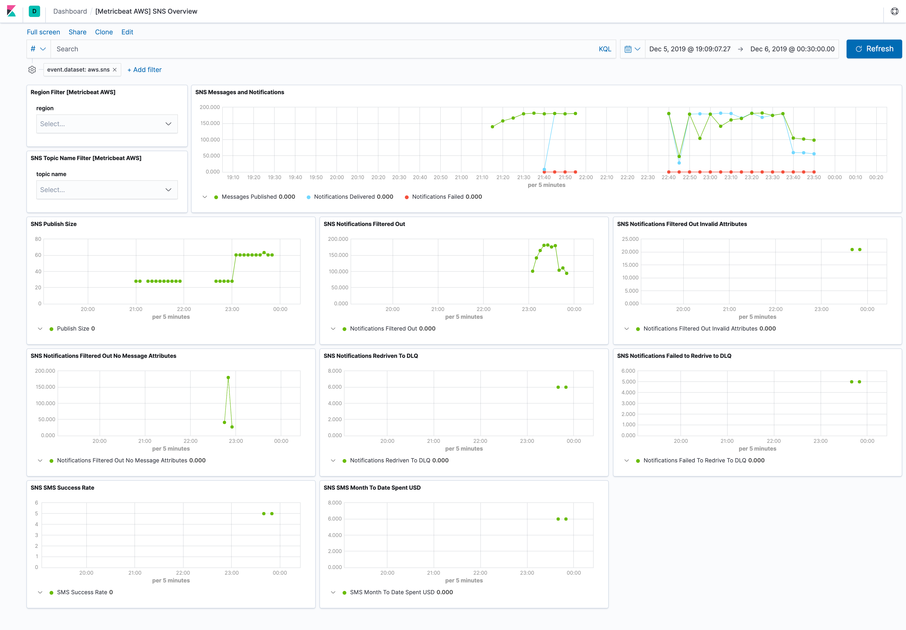

---
mapped_pages:
  - https://www.elastic.co/guide/en/beats/metricbeat/current/metricbeat-metricset-aws-sns.html
---

# AWS sns metricset [metricbeat-metricset-aws-sns]

::::{warning}
This functionality is in beta and is subject to change. The design and code is less mature than official GA features and is being provided as-is with no warranties. Beta features are not subject to the support SLA of official GA features.
::::


The `sns` metricset of aws module allows you to monitor your AWS SNS topic. `sns` metricset fetches a set of values from [Amazon SNS Metrics](https://docs.aws.amazon.com/sns/latest/dg/sns-monitoring-using-cloudwatch.html#SNS_ViewMetrics). CloudWatch metrics for Amazon SNS topics are automatically collected and pushed to CloudWatch every five minutes.


## AWS Permissions [_aws_permissions_13]

Some specific AWS permissions are required for IAM user to collect AWS SNS metrics.

```
cloudwatch:GetMetricData
cloudwatch:ListMetrics
ec2:DescribeRegions
sns:ListTopics
sts:GetCallerIdentity
iam:ListAccountAliases
```


## Dashboard [_dashboard_14]

The `aws sns` metricset comes with a predefined dashboard. For example:




## Configuration example [_configuration_example_13]

```yaml
- module: aws
  period: 300s
  metricsets:
    - sns
  # This module uses the aws cloudwatch metricset, all
  # the options for this metricset are also available here.
```


## Metrics [_metrics_6]

Please see more details for each metric in [CloudWatch SNS Metrics](https://docs.aws.amazon.com/sns/latest/dg/sns-monitoring-using-cloudwatch.html#SNS_ViewMetrics).

|     |     |
| --- | --- |
| Metric Name | Statistic Method |
| NumberOfMessagesPublished | Sum |
| NumberOfNotificationsDelivered | Sum |
| NumberOfNotificationsFailed | Sum |
| NumberOfNotificationsFilteredOut | Sum |
| NumberOfNotificationsFilteredOut-InvalidAttributes | Sum |
| NumberOfNotificationsFilteredOut-NoMessageAttributes | Sum |
| NumberOfNotificationsRedrivenToDlq | Sum |
| NumberOfNotificationsFailedToRedriveToDlq | Sum |
| PublishSize | Average |
| SMSMonthToDateSpentUSD | Sum |
| SMSSuccessRate | Average |

This is a default metricset. If the host module is unconfigured, this metricset is enabled by default.

## Fields [_fields_23]

For a description of each field in the metricset, see the [exported fields](/reference/metricbeat/exported-fields-aws.md) section.

Here is an example document generated by this metricset:

```json
{
    "@timestamp": "2017-10-12T08:05:34.853Z",
    "aws": {
        "cloudwatch": {
            "namespace": "AWS/SNS"
        },
        "dimensions": {
            "TopicName": "test-sns-ks"
        },
        "sns": {
            "metrics": {
                "NumberOfMessagesPublished": {
                    "sum": 1
                },
                "NumberOfNotificationsFailed": {
                    "sum": 1
                },
                "PublishSize": {
                    "avg": 5
                }
            }
        },
        "tags": {
            "created-by": "ks"
        }
    },
    "cloud": {
        "account": {
            "id": "428152502467",
            "name": "elastic-beats"
        },
        "provider": "aws",
        "region": "us-east-1"
    },
    "event": {
        "dataset": "aws.sns",
        "duration": 115000,
        "module": "aws"
    },
    "metricset": {
        "name": "sns",
        "period": 10000
    },
    "service": {
        "type": "aws"
    }
}
```


