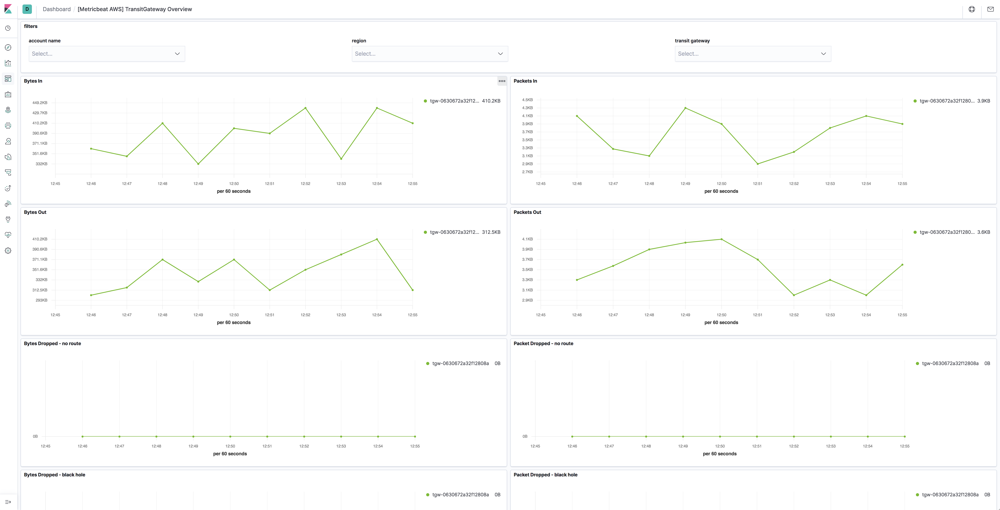

---
mapped_pages:
  - https://www.elastic.co/guide/en/beats/metricbeat/current/metricbeat-metricset-aws-transitgateway.html
---

# AWS transitgateway metricset [metricbeat-metricset-aws-transitgateway]

::::{warning}
This functionality is in beta and is subject to change. The design and code is less mature than official GA features and is being provided as-is with no warranties. Beta features are not subject to the support SLA of official GA features.
::::


The transitgateway metricset of aws module allows users to monitor transit gateway. Transit gateway metrics are sent to CloudWatch by VPC only when requests are flowing through the gateway. If there are requests flowing through the transit gateway, Amazon VPC measures and sends its metrics in 1-minute intervals. Users can use these metrics to gain a better perspective on how the web application or service is performing.


## AWS Permissions [_aws_permissions_15]

Some specific AWS permissions are required for IAM user to collect usage metrics.

```
ec2:DescribeRegions
cloudwatch:GetMetricData
cloudwatch:ListMetrics
tag:getResources
sts:GetCallerIdentity
iam:ListAccountAliases
```


## Dashboard [_dashboard_16]

The aws transitgateway metricset comes with a predefined dashboard. For example:




## Configuration example [_configuration_example_15]

```yaml
- module: aws
  period: 1m
  metricsets:
    - transitgateway
  # This module uses the aws cloudwatch metricset, all
  # the options for this metricset are also available here.
```


## Metrics and Dimensions for Transit gateway [_metrics_and_dimensions_for_transit_gateway]

Metrics:

| Metric Name | Statistic Method | Description |
| --- | --- | --- |
| BytesIn | Sum | The number of bytes received by the transit gateway. |
| BytesOut | Sum | The number of bytes sent from the transit gateway. |
| PacketsIn | Sum | The number of packets received by the transit gateway. |
| PacketsOut | Sum | The number of packets sent by the transit gateway. |
| PacketDropCountBlackhole | Sum | The number of packets dropped because they matched a blackhole route. |
| PacketDropCountNoRoute | Sum | The number of packets dropped because they did not match a route. |

Dimensions:

| Dimension Name | Description |
| --- | --- |
| TransitGateway | Filters the metric data by transit gateway. |

Please see [Transit Gateway Metrics](https://docs.aws.amazon.com/vpc/latest/tgw/transit-gateway-cloudwatch-metrics.html) for more details.

This is a default metricset. If the host module is unconfigured, this metricset is enabled by default.

## Fields [_fields_25]

For a description of each field in the metricset, see the [exported fields](/reference/metricbeat/exported-fields-aws.md) section.

Here is an example document generated by this metricset:

```json
{
    "@timestamp": "2017-10-12T08:05:34.853Z",
    "aws": {
        "cloudwatch": {
            "namespace": "AWS/TransitGateway"
        },
        "dimensions": {
            "TransitGateway": "tgw-0630672a32f12808a"
        },
        "transitgateway": {
            "metrics": {
                "BytesIn": {
                    "sum": 0
                },
                "BytesOut": {
                    "sum": 0
                },
                "PacketDropCountBlackhole": {
                    "sum": 0
                },
                "PacketDropCountNoRoute": {
                    "sum": 0
                },
                "PacketsIn": {
                    "sum": 0
                },
                "PacketsOut": {
                    "sum": 0
                }
            }
        }
    },
    "cloud": {
        "account": {
            "id": "428152502467",
            "name": "elastic-beats"
        },
        "provider": "aws",
        "region": "us-west-2"
    },
    "event": {
        "dataset": "aws.transitgateway",
        "duration": 115000,
        "module": "aws"
    },
    "metricset": {
        "name": "transitgateway",
        "period": 10000
    },
    "service": {
        "type": "aws"
    }
}
```


