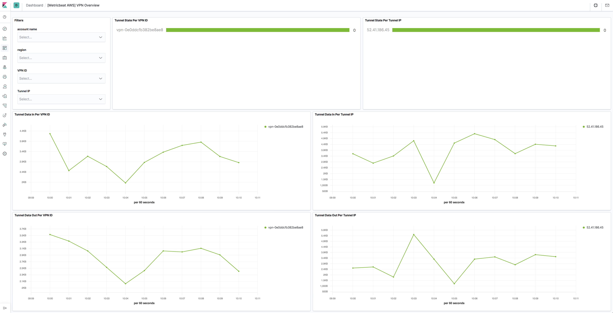

---
mapped_pages:
  - https://www.elastic.co/guide/en/beats/metricbeat/current/metricbeat-metricset-aws-vpn.html
---

# AWS vpn metricset [metricbeat-metricset-aws-vpn]

::::{warning}
This functionality is in beta and is subject to change. The design and code is less mature than official GA features and is being provided as-is with no warranties. Beta features are not subject to the support SLA of official GA features.
::::


The vpn metricset of aws module allows users to monitor VPN tunnels. VPN metric data is automatically sent to CloudWatch as it becomes available. Users can use these metrics to gain a better perspective on how the web application or service is performing.


## AWS Permissions [_aws_permissions_17]

Some specific AWS permissions are required for IAM user to collect usage metrics.

```
ec2:DescribeRegions
cloudwatch:GetMetricData
cloudwatch:ListMetrics
tag:getResources
sts:GetCallerIdentity
iam:ListAccountAliases
```


## Dashboard [_dashboard_18]

The aws vpn metricset comes with a predefined dashboard. For example:




## Configuration example [_configuration_example_17]

```yaml
- module: aws
  period: 1m
  metricsets:
    - vpn
  # This module uses the aws cloudwatch metricset, all
  # the options for this metricset are also available here.
```


## Metrics and Dimensions for VPN [_metrics_and_dimensions_for_vpn]

Metrics:

|     |     |     |
| --- | --- | --- |
| Metric Name | Statistic Method | Description |
| TunnelState | Max | The state of the tunnel. For static VPNs, 0 indicates DOWN and 1 indicates UP. For BGP VPNs, 1 indicates ESTABLISHED and 0 is used for all other states. |
| TunnelDataIn | Sum | The bytes received through the VPN tunnel. |
| TunnelDataOut | Sum | The bytes sent through the VPN tunnel. |

Dimensions:

|     |     |
| --- | --- |
| Dimension Name | Description |
| VpnId | Filters the metric data by the Site-to-Site VPN connection ID. |
| TunnelIpAddress | Filters the metric data by the IP address of the tunnel for the virtual private gateway. |

Please see [VPN Tunnel CloudWatch Metrics](https://docs.aws.amazon.com/vpn/latest/s2svpn/monitoring-cloudwatch-vpn.html) for more details.

This is a default metricset. If the host module is unconfigured, this metricset is enabled by default.

## Fields [_fields_27]

For a description of each field in the metricset, see the [exported fields](/reference/metricbeat/exported-fields-aws.md) section.

Here is an example document generated by this metricset:

```json
{
    "@timestamp": "2017-10-12T08:05:34.853Z",
    "aws": {
        "cloudwatch": {
            "namespace": "AWS/VPN"
        },
        "dimensions": {
            "TunnelIpAddress": "52.41.186.45"
        },
        "vpn": {
            "metrics": {
                "TunnelDataIn": {
                    "sum": 0
                },
                "TunnelDataOut": {
                    "sum": 0
                },
                "TunnelState": {
                    "avg": 0
                }
            }
        }
    },
    "cloud": {
        "account": {
            "id": "428152502467",
            "name": "elastic-beats"
        },
        "provider": "aws",
        "region": "us-west-2"
    },
    "event": {
        "dataset": "aws.vpn",
        "duration": 115000,
        "module": "aws"
    },
    "metricset": {
        "name": "vpn",
        "period": 10000
    },
    "service": {
        "type": "aws"
    }
}
```


