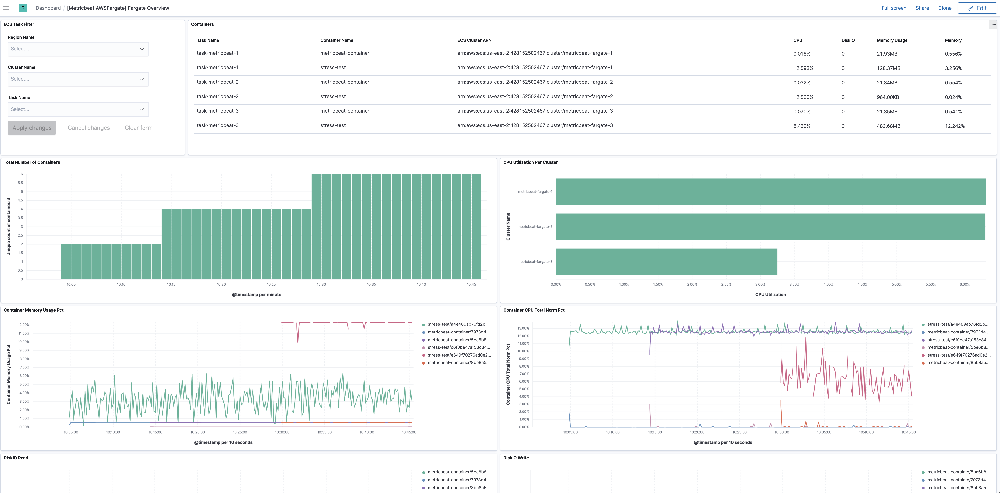

---
mapped_pages:
  - https://www.elastic.co/guide/en/beats/metricbeat/current/metricbeat-metricset-awsfargate-task_stats.html
---

# AWS Fargate task_stats metricset [metricbeat-metricset-awsfargate-task_stats]

::::{warning}
This functionality is in beta and is subject to change. The design and code is less mature than official GA features and is being provided as-is with no warranties. Beta features are not subject to the support SLA of official GA features.
::::


The `task_stats` metricset in `awsfargate` module allows users to monitor containers inside the same AWS Fargate task. It fetches runtime CPU metrics, disk I/O metrics, memory metrics, network metrics and container metadata from both endpoint `${ECS_CONTAINER_METADATA_URI_V4}/task/stats` and `${ECS_CONTAINER_METADATA_URI_V4}/task`.


## Configuration Example [_configuration_example_18]

This metricset should be ran as a sidecar inside the same AWS Fargate task definition, and the default configuration file should work.

```yaml
- module: awsfargate
  period: 10s
  metricsets:
    - task_stats
```


## Setup Metricbeat Using AWS Fargate [_setup_metricbeat_using_aws_fargate]

This section is to provide users an AWS native way of configuring Fargate task definition to run application containers and Metricbeat container using AWS CloudFormation.


### Store Elastic Cloud Credentials into AWS Secret Manager [_store_elastic_cloud_credentials_into_aws_secret_manager]

If users are using Elastic Cloud, it’s recommended to store cloud id and cloud auth into AWS secret manager. Here are the AWS CLI example:

Create secret ELASTIC_CLOUD_AUTH:

```
aws --region us-east-1 secretsmanager create-secret --name ELASTIC_CLOUD_AUTH --secret-string XXX
```

Create secret ELASTIC_CLOUD_ID:

```
aws --region us-east-1 secretsmanager create-secret --name ELASTIC_CLOUD_ID --secret-string YYYY
```


### AWS CloudFormation Template Example [_aws_cloudformation_template_example]

Here is an example of AWS CloudFormation template for testing purpose only. Please replace this with actual applications. This template shows how to define a new cluster, how to create a task definition with multiple containers(including Metricbeat), and how to start the service.

```yaml
AWSTemplateFormatVersion: "2010-09-09"
Parameters:
  SubnetID:
    Type: String
  CloudIDArn:
    Type: String
  CloudAuthArn:
    Type: String
  ClusterName:
    Type: String
  RoleName:
    Type: String
  TaskName:
    Type: String
  ServiceName:
    Type: String
  LogGroupName:
    Type: String
Resources:
  Cluster:
    Type: AWS::ECS::Cluster
    Properties:
      ClusterName: !Ref ClusterName
      ClusterSettings:
        - Name: containerInsights
          Value: enabled
  LogGroup:
    Type: AWS::Logs::LogGroup
    Properties:
      LogGroupName: !Ref LogGroupName
  ExecutionRole:
    Type: AWS::IAM::Role
    Properties:
      RoleName: !Ref RoleName
      AssumeRolePolicyDocument:
        Statement:
          - Effect: Allow
            Principal:
              Service: ecs-tasks.amazonaws.com
            Action: sts:AssumeRole
      ManagedPolicyArns:
        - arn:aws:iam::aws:policy/service-role/AmazonECSTaskExecutionRolePolicy
      Policies:
        - PolicyName: !Sub 'EcsTaskExecutionRole-${AWS::StackName}'
          PolicyDocument:
            Version: 2012-10-17
            Statement:
              - Effect: Allow
                Action:
                  - secretsmanager:GetSecretValue
                Resource:
                  - !Ref CloudIDArn
                  - !Ref CloudAuthArn
  TaskDefinition:
    Type: AWS::ECS::TaskDefinition
    Properties:
      Family: !Ref TaskName
      Cpu: 256
      Memory: 512
      NetworkMode: awsvpc
      ExecutionRoleArn: !Ref ExecutionRole
      ContainerDefinitions:
        - Name: metricbeat-container
          Image: docker.elastic.co/beats/metricbeat:8.0.0-SNAPSHOT
          Secrets:
            - Name: ELASTIC_CLOUD_ID
              ValueFrom: !Ref CloudIDArn
            - Name: ELASTIC_CLOUD_AUTH
              ValueFrom: !Ref CloudAuthArn
          LogConfiguration:
            LogDriver: awslogs
            Options:
              awslogs-region: !Ref AWS::Region
              awslogs-group: !Ref LogGroup
              awslogs-stream-prefix: ecs
          EntryPoint:
            - sh
            - -c
          Command:
            - ./metricbeat setup -E cloud.id=$ELASTIC_CLOUD_ID -E cloud.auth=$ELASTIC_CLOUD_AUTH && ./metricbeat modules disable system && ./metricbeat modules enable awsfargate && ./metricbeat -e -E cloud.id=$ELASTIC_CLOUD_ID -E cloud.auth=$ELASTIC_CLOUD_AUTH
        - Name: stress-test
          Image: containerstack/alpine-stress
          Essential: false
          DependsOn:
            - ContainerName: metricbeat-container
              Condition: START
          EntryPoint:
            - sh
            - -c
          Command:
            - stress --cpu 8 --io 4 --vm 2 --vm-bytes 128M --timeout 6000s
      RequiresCompatibilities:
        - EC2
        - FARGATE
  Service:
    Type: AWS::ECS::Service
    Properties:
      ServiceName: !Ref ServiceName
      Cluster: !Ref Cluster
      TaskDefinition: !Ref TaskDefinition
      DesiredCount: 1
      LaunchType: FARGATE
      NetworkConfiguration:
        AwsvpcConfiguration:
          AssignPublicIp: ENABLED
          Subnets:
            - !Ref SubnetID
```


### Create CloudFormation Stack [_create_cloudformation_stack]

When copying the CloudFormation template, please make sure the Metricbeat container image is the correct version. Once the template is saved locally into `clouformation.yml`, AWS CLI can be used to create a stack using one command:

```
aws --region us-east-1 cloudformation create-stack --stack-name <your-stack-name> --template-body file://./cloudformation.yml --capabilities CAPABILITY_NAMED_IAM --parameters ParameterKey=SubnetID,ParameterValue=<subnet-id> ParameterKey=CloudAuthArn,ParameterValue=<cloud-auth-arn> ParameterKey=CloudIDArn,ParameterValue=<cloud-id-arn> ParameterKey=ClusterName,ParameterValue=<cluster-name> ParameterKey=RoleName,ParameterValue=<role-name> ParameterKey=TaskName,ParameterValue=<task-name> ParameterKey=ServiceName,ParameterValue=<service-name> ParameterKey=LogGroupName,ParameterValue=<log-group-name>
```

Make sure to replace `<subnet-id>` with your own subnet in this command. Please go to Services → VPC → Subnets to find subnet ID to use. You can also add several more containers under the TaskDefinition section.


### Delete CloudFormation Stack [_delete_cloudformation_stack]

Here is the AWS CLI to delete a stack including the cluster, task definition and all containers:

```
aws --region us-east-1 cloudformation delete-stack --stack-name <your-stack-name>
```


## Dashboard [_dashboard_19]

The task_stats metricset comes with a predefined dashboard. For example:



This is a default metricset. If the host module is unconfigured, this metricset is enabled by default.

## Fields [_fields_28]

For a description of each field in the metricset, see the [exported fields](/reference/metricbeat/exported-fields-awsfargate.md) section.

Here is an example document generated by this metricset:

```json
{
    "@timestamp": "2017-10-12T08:05:34.853Z",
    "awsfargate": {
        "task_stats": {
            "cluster_name": "default",
            "cpu": {
                "core": null,
                "kernel": {
                    "norm": {
                        "pct": 0
                    },
                    "pct": 0,
                    "ticks": 1520000000
                },
                "system": {
                    "norm": {
                        "pct": 1
                    },
                    "pct": 2,
                    "ticks": 1420180000000
                },
                "total": {
                    "norm": {
                        "pct": 0.2
                    },
                    "pct": 0.4
                },
                "user": {
                    "norm": {
                        "pct": 0
                    },
                    "pct": 0,
                    "ticks": 490000000
                }
            },
            "diskio": {
                "read": {
                    "bytes": 3452928,
                    "ops": 118,
                    "queued": 0,
                    "rate": 0,
                    "service_time": 0,
                    "wait_time": 0
                },
                "reads": 0,
                "summary": {
                    "bytes": 3452928,
                    "ops": 118,
                    "queued": 0,
                    "rate": 0,
                    "service_time": 0,
                    "wait_time": 0
                },
                "total": 0,
                "write": {
                    "bytes": 0,
                    "ops": 0,
                    "queued": 0,
                    "rate": 0,
                    "service_time": 0,
                    "wait_time": 0
                },
                "writes": 0
            },
            "identifier": "query-metadata/1234",
            "memory": {
                "fail": {
                    "count": 0
                },
                "limit": 0,
                "rss": {
                    "pct": 0.0010557805807105247,
                    "total": 4157440
                },
                "stats": {
                    "active_anon": 4157440,
                    "active_file": 4497408,
                    "cache": 6000640,
                    "dirty": 16384,
                    "hierarchical_memory_limit": 2147483648,
                    "hierarchical_memsw_limit": 9223372036854772000,
                    "inactive_anon": 0,
                    "inactive_file": 1503232,
                    "mapped_file": 2183168,
                    "pgfault": 6668,
                    "pgmajfault": 52,
                    "pgpgin": 5925,
                    "pgpgout": 3445,
                    "rss": 4157440,
                    "rss_huge": 0,
                    "total_active_anon": 4157440,
                    "total_active_file": 4497408,
                    "total_cache": 600064,
                    "total_dirty": 16384,
                    "total_inactive_anon": 0,
                    "total_inactive_file": 4497408,
                    "total_mapped_file": 2183168,
                    "total_pgfault": 6668,
                    "total_pgmajfault": 52,
                    "total_pgpgin": 5925,
                    "total_pgpgout": 3445,
                    "total_rss": 4157440,
                    "total_rss_huge": 0,
                    "total_unevictable": 0,
                    "total_writeback": 0,
                    "unevictable": 0,
                    "writeback": 0
                },
                "usage": {
                    "max": 15294464,
                    "total": 12349440
                }
            },
            "network": {
                "eth0": {
                    "inbound": {
                        "bytes": 137315578,
                        "dropped": 0,
                        "errors": 0,
                        "packets": 94338
                    },
                    "outbound": {
                        "bytes": 1086811,
                        "dropped": 0,
                        "errors": 0,
                        "packets": 25857
                    }
                }
            },
            "task_desired_status": "RUNNING",
            "task_known_status": "ACTIVATING",
            "task_name": "query-metadata-1"
        }
    },
    "cloud": {
        "region": "us-west-2"
    },
    "container": {
        "id": "1234",
        "image": {
            "name": "mreferre/eksutils"
        },
        "labels": {
            "com_amazonaws_ecs_cluster": "arn:aws:ecs:us-west-2:111122223333:cluster/default",
            "com_amazonaws_ecs_container-name": "query-metadata",
            "com_amazonaws_ecs_task-arn": "arn:aws:ecs:us-west-2:111122223333:task/default/febee046097849aba589d4435207c04a",
            "com_amazonaws_ecs_task-definition-family": "query-metadata",
            "com_amazonaws_ecs_task-definition-version": "7"
        },
        "name": "query-metadata"
    },
    "service": {
        "type": "awsfargate"
    }
}
```


