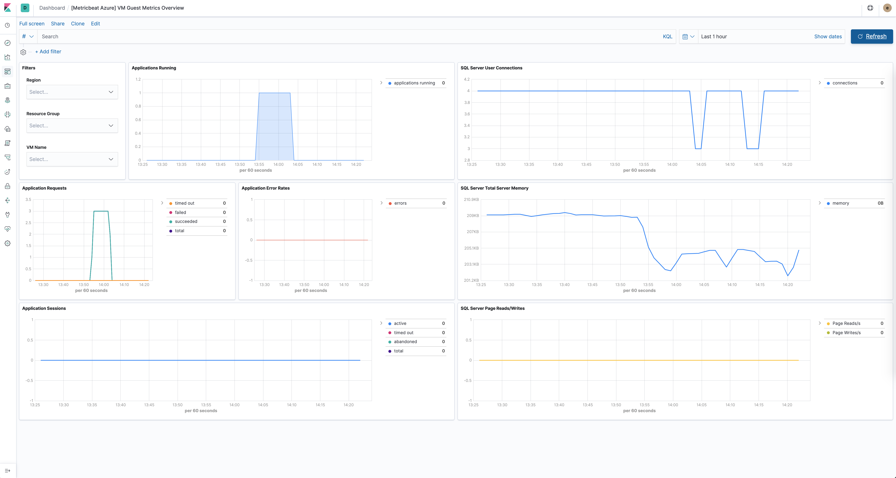

---
mapped_pages:
  - https://www.elastic.co/guide/en/beats/metricbeat/current/metricbeat-metricset-azure-compute_vm.html
---

# Azure compute_vm metricset [metricbeat-metricset-azure-compute_vm]

This is the compute_vm metricset of the module azure.

This metricset allows users to retrieve all metrics from specified virtual machines.


## Metricset-specific configuration notes [_metricset_specific_configuration_notes_4]

`refresh_list_interval`
:   Resources will be retrieved at each fetch call (`period` interval), this means a number of Azure REST calls will be executed each time. This will be helpful if the azure users will be adding/removing resources that could match the configuration options so they will not added/removed to the list. To reduce on the number of API calls we are executing to retrieve the resources each time, users can configure this setting and make sure the list or resources will not be refreshed as often. This is also beneficial for performance and rate/ cost reasons ([https://docs.microsoft.com/en-us/azure/azure-resource-manager/resource-manager-request-limits](https://docs.microsoft.com/en-us/azure/azure-resource-manager/resource-manager-request-limits)).

`resources`
:   This will contain all options for identifying resources and configuring the desired metrics


### Config options to identify resources [_config_options_to_identify_resources_4]

`resource_id`
:   (*[]string*) The fully qualified ID’s of the resource, including the resource name and resource type. Has the format `/subscriptions/{{guid}}/resourceGroups/{{resource-group-name}}/providers/{{resource-provider-namespace}}/{resource-type}/{{resource-name}}`. Should return a list of resources.

`resource_group`
:   (*[]string*) This option will select all virtual machines inside the resource group.

If none of the options are entered then all virtual machine inside the subscription are taken in account. For each metric the primary aggregation assigned will be retrieved. A default non configurable timegrain of 5 min is set so users are advised to configure an interval of 300s or  a multiply of it.

To populate the VM Guest Metrics Overview dashboard, users will have to enable the Virtual Machine Guest namespace for the monitored resources. More on sending guest OS metrics to Azure Monitor here [https://docs.microsoft.com/en-us/azure/azure-monitor/platform/collect-custom-metrics-guestos-resource-manager-vm](https://docs.microsoft.com/en-us/azure/azure-monitor/platform/collect-custom-metrics-guestos-resource-manager-vm).



## Fields [_fields_32]

For a description of each field in the metricset, see the [exported fields](/reference/metricbeat/exported-fields-azure.md) section.

Here is an example document generated by this metricset:

```json
{
    "@timestamp": "2017-10-12T08:05:34.853Z",
    "azure": {
        "compute_vm": {
            "cpu_credits_consumed": {
                "avg": 0.02
            },
            "cpu_credits_remaining": {
                "avg": 288
            },
            "disk_read_bytes": {
                "total": 3886082.75
            },
            "disk_read_operations_per_sec": {
                "avg": 0.0665
            },
            "disk_write_bytes": {
                "total": 14418893.74
            },
            "disk_write_operations_per_sec": {
                "avg": 1.636
            },
            "inbound_flows": {
                "avg": 97.2
            },
            "inbound_flows_maximum_creation_rate": {
                "avg": 264
            },
            "network_in": {
                "total": 1157992
            },
            "network_in_total": {
                "total": 1211091
            },
            "network_out": {
                "total": 1908414
            },
            "network_out_total": {
                "total": 2340880
            },
            "os_disk_bandwidth_consumed_percentage": {
                "avg": 0
            },
            "os_disk_iops_consumed_percentage": {
                "avg": 0
            },
            "os_disk_max_burst_bandwidth": {
                "avg": 170000000
            },
            "os_disk_max_burst_iops": {
                "avg": 3500
            },
            "os_disk_queue_depth": {
                "avg": 0
            },
            "os_disk_read_bytes_per_sec": {
                "avg": 12953.607
            },
            "os_disk_read_operations_per_sec": {
                "avg": 0.133
            },
            "os_disk_target_bandwidth": {
                "avg": 100000000
            },
            "os_disk_target_iops": {
                "avg": 500
            },
            "os_disk_used_burst_bps_credits_percentage": {
                "avg": 2
            },
            "os_disk_used_burst_io_credits_percentage": {
                "avg": 0
            },
            "os_disk_write_bytes_per_sec": {
                "avg": 48062.975
            },
            "os_disk_write_operations_per_sec": {
                "avg": 3.272
            },
            "outbound_flows": {
                "avg": 97.2
            },
            "outbound_flows_maximum_creation_rate": {
                "avg": 264
            },
            "percentage_cpu": {
                "avg": 2.548
            },
            "premium_os_disk_cache_read_hit": {
                "avg": 100
            },
            "premium_os_disk_cache_read_miss": {
                "avg": 0
            },
            "vm_cached_bandwidth_consumed_percentage": {
                "avg": 0
            },
            "vm_cached_iops_consumed_percentage": {
                "avg": 0
            },
            "vm_uncached_bandwidth_consumed_percentage": {
                "avg": 0
            },
            "vm_uncached_iops_consumed_percentage": {
                "avg": 0
            }
        },
        "namespace": "Microsoft.Compute/virtualMachines",
        "resource": {
            "group": "obs-test",
            "id": "/subscriptions/7657426d-c4c3-44ac-88a2-3b2cd59e6dba/resourceGroups/obs-test/providers/Microsoft.Compute/virtualMachines/perfmon-test",
            "name": "perfmon-test",
            "type": "Microsoft.Compute/virtualMachines"
        },
        "subscription_id": "7657426d-c4c3-44ac-88a2-3b2cd59e6dba",
        "timegrain": "PT5M"
    },
    "cloud": {
        "account": {
            "id": "7657426d-c4c3-44ac-88a2-3b2cd59e6dba"
        },
        "instance": {
            "id": "23d5541a-ad41-4bef-b217-1d992c51ae07",
            "name": "perfmon-test"
        },
        "machine": {
            "type": "Standard_B1ms"
        },
        "provider": "azure",
        "region": "westeurope"
    },
    "event": {
        "dataset": "azure.compute_vm",
        "duration": 115000,
        "module": "azure"
    },
    "host": {
        "cpu": {
            "usage": 0.02548
        },
        "disk": {
            "read": {
                "bytes": 3886082.75
            },
            "write": {
                "bytes": 14418893.74
            }
        },
        "id": "23d5541a-ad41-4bef-b217-1d992c51ae07",
        "name": "perfmon-test",
        "network": {
            "egress": {
                "bytes": 2340880,
                "packets": 1908414
            },
            "ingress": {
                "bytes": 1211091,
                "packets": 1157992
            }
        }
    },
    "metricset": {
        "name": "compute_vm",
        "period": 10000
    },
    "service": {
        "type": "azure"
    }
}
```


