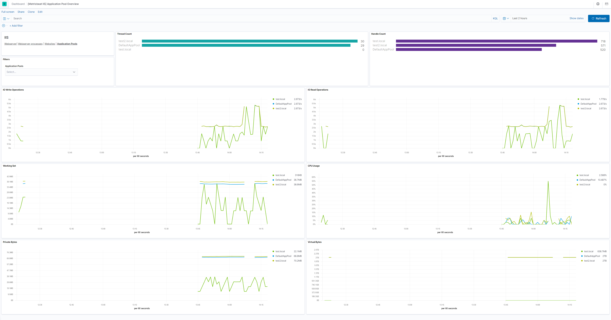

---
mapped_pages:
  - https://www.elastic.co/guide/en/beats/metricbeat/current/metricbeat-metricset-iis-application_pool.html
---

# IIS application_pool metricset [metricbeat-metricset-iis-application_pool]

This is the application_pool metricset of the module iis.

This metricset allows users to retrieve relevant metrics for the application pools running on IIS.

Metric values are divided in several groups:

The `process` object contains System/Process counters like the the overall server and CPU usage for the IIS Worker Process and memory (currently used and available memory for the IIS Worker Process).

The `net_clr` object which returns ASP.NET error rate counter values. Users can specify the application pools they would like to monitor using the configuration option `application_pool.name`, else, all application pools are considered.


### Dashboard [_dashboard_27]



## Fields [_fields_117]

For a description of each field in the metricset, see the [exported fields](/reference/metricbeat/exported-fields-iis.md) section.

Here is an example document generated by this metricset:

```json
{
    "@timestamp": "2017-10-12T08:05:34.853Z",
    "event": {
        "dataset": "iis.application_pool",
        "duration": 115000,
        "module": "iis"
    },
    "iis": {
        "application_pool": {
            "name": "test.local",
            "net_clr": {
                "total_exceptions_thrown": 0,
                "finallys_per_sec": 0,
                "exceptions_thrown_per_sec": 0,
                "locks_and_threads": {
                    "current_queue_length": 0,
                    "contention_rate_per_sec": 0
                },
                "memory": {
                    "gen_2_heap_size": 0,
                    "large_object_heap_size": 0,
                    "gen_1_heap_size": 0,
                    "gen_1_collections": 0,
                    "gen_0_heap_size": 0,
                    "bytes_in_all_heaps": 0,
                    "total_committed_bytes": 0,
                    "gen_0_collections": 0,
                    "gen_2_collections": 0,
                    "allocated_bytes_per_sec": 0,
                    "time_in_gc_perc": 0
                },
                "filters_per_sec": 0,
                "throw_to_catch_depth_per_sec": 0
            },
            "process": {
                "handle_count": 532,
                "private_byte": 35258368,
                "thread_count": 29,
                "virtual_bytes": 667226112,
                "working_set": 36044800
            }
        }
    },
    "metricset": {
        "name": "application_pool",
        "period": 10000
    },
    "process": {
        "pid": 748
    },
    "service": {
        "type": "iis"
    }
}
```


