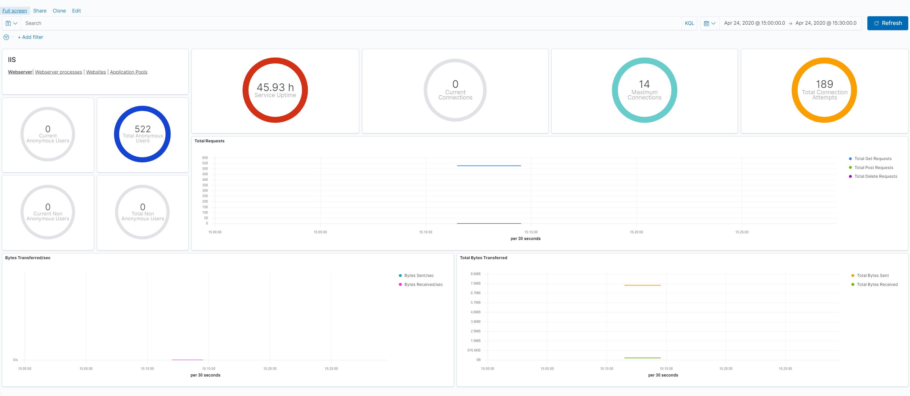
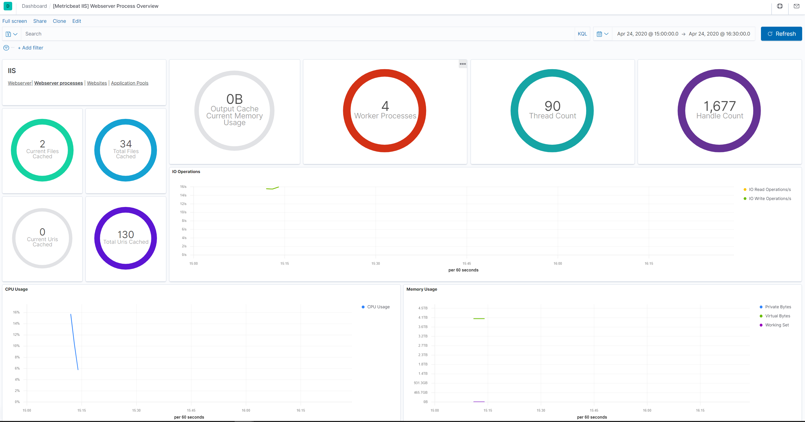

---
mapped_pages:
  - https://www.elastic.co/guide/en/beats/metricbeat/current/metricbeat-metricset-iis-webserver.html
---

# IIS webserver metricset [metricbeat-metricset-iis-webserver]

This is the webserver metricset of the module iis.

This metricset allows users to retrieve relevant metrics from IIS.

Metric values are divided in several groups:

The `process` object contains System/Process counters like the the overall server and CPU usage for the IIS Worker Processes and memory (currently used and available memory for the IIS Worker Processes).

The `network` object contains the IIS Performance counters like: Web Service: Bytes Received/Sec (helpful to track to identify potential spikes in traffic), Web Service: Bytes Sent/Sec (helpful to track to identify potential spikes in traffic), Web Service: Current Connections (through experience with their apps app, users can identify what is a normal value for this) and others.

The `cache` object contains metrics from the user mode cache and output cache.

The `asp_net` and `asp_net_application` contain asp.net related performance counter values.


### Dashboard [_dashboard_28]





This is a default metricset. If the host module is unconfigured, this metricset is enabled by default.

## Fields [_fields_118]

For a description of each field in the metricset, see the [exported fields](/reference/metricbeat/exported-fields-iis.md) section.

Here is an example document generated by this metricset:

```json
{
    "@timestamp": "2017-10-12T08:05:34.853Z",
    "event": {
        "dataset": "iis.webserver",
        "duration": 115000,
        "module": "iis"
    },
    "iis": {
        "webserver": {
            "asp_net": {
                "application_restarts": 0,
                "request_wait_time": 0
            },
            "asp_net_application": {
                "pipeline_instance_count": 3,
                "requests_executing": 0,
                "requests_in_application_queue": 0
            },
            "cache": {
                "current_file_cache_memory_usage": 696,
                "current_files_cached": 2,
                "current_uris_cached": 0,
                "file_cache_hits": 1,
                "file_cache_misses": 7,
                "maximum_file_cache_memory_usage": 696,
                "output_cache_current_items": 0,
                "output_cache_current_memory_usage": 0,
                "output_cache_total_hits": 0,
                "output_cache_total_misses": 8,
                "total_files_cached": 2,
                "total_uris_cached": 1,
                "uri_cache_hits": 0,
                "uri_cache_misses": 8
            },
            "network": {
                "current_anonymous_users": 0,
                "current_connections": 0,
                "current_nonanonymous_users": 0,
                "maximum_connections": 3,
                "service_uptime": 343447,
                "total_anonymous_users": 6,
                "total_bytes_received": 2715,
                "total_bytes_sent": 89432,
                "total_connection_attempts": 4,
                "total_delete_requests": 0,
                "total_get_requests": 6,
                "total_nonanonymous_users": 0,
                "total_post_requests": 0
            }
        }
    },
    "metricset": {
        "name": "webserver",
        "period": 10000
    },
    "service": {
        "type": "iis"
    }
}
```


