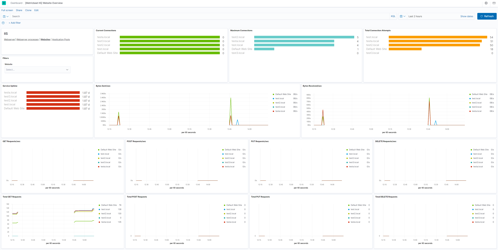

---
mapped_pages:
  - https://www.elastic.co/guide/en/beats/metricbeat/current/metricbeat-metricset-iis-website.html
---

# IIS website metricset [metricbeat-metricset-iis-website]

This is the website metricset of the module iis.

This metricset allows users to retrieve relevant metrics for the websites running on IIS.

The metrics contain the IIS Performance counter values like: Web Service: Bytes Received/Sec (helpful to track to identify potential spikes in traffic), Web Service: Bytes Sent/Sec (helpful to track to identify potential spikes in traffic), Web Service: Current Connections (through experience with their apps app, users can identify what is a normal value for this) and others.


### Dashboard [_dashboard_29]



This is a default metricset. If the host module is unconfigured, this metricset is enabled by default.

## Fields [_fields_119]

For a description of each field in the metricset, see the [exported fields](/reference/metricbeat/exported-fields-iis.md) section.

Here is an example document generated by this metricset:

```json
{
    "@timestamp": "2017-10-12T08:05:34.853Z",
    "event": {
        "dataset": "iis.website",
        "duration": 115000,
        "module": "iis"
    },
    "iis": {
        "website": {
            "network": {
                "bytes_sent_per_sec": 0,
                "maximum_connections": 1,
                "total_post_requests": 0,
                "post_requests_per_sec": 0,
                "total_connection_attempts": 1,
                "service_uptime": 114161,
                "get_requests_per_sec": 0,
                "total_put_requests": 0,
                "current_connections": 0,
                "total_delete_requests": 0,
                "bytes_received_per_sec": 0,
                "put_requests_per_sec": 0,
                "total_bytes_sent": 944,
                "total_get_requests": 1,
                "delete_requests_per_sec": 0
            },
            "name": "Default Web Site"
        }
    },
    "metricset": {
        "name": "website",
        "period": 10000
    },
    "service": {
        "type": "iis"
    }
}
```


