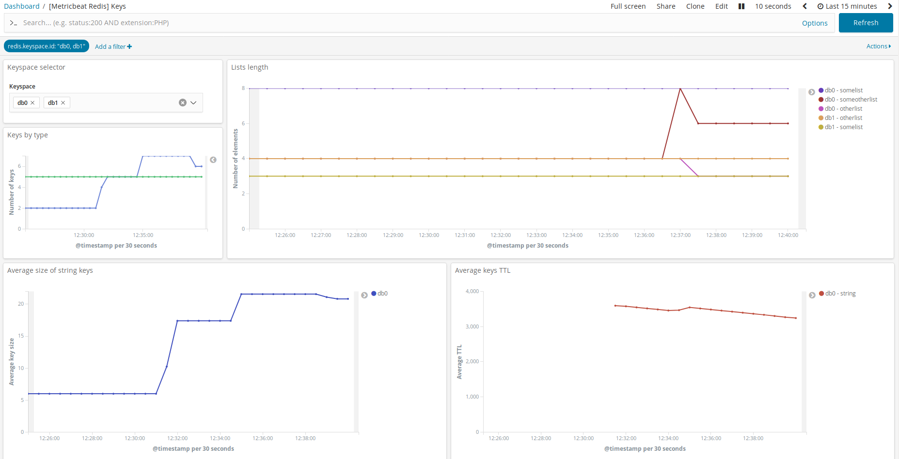

---
mapped_pages:
  - https://www.elastic.co/guide/en/beats/metricbeat/current/metricbeat-metricset-redis-key.html
---

# Redis key metricset [metricbeat-metricset-redis-key]

The Redis `key` metricset collects information about Redis keys.

For each key matching one of the configured patterns, an event is sent to Elasticsearch with information about this key, what includes the type, its length when available, and its ttl.

Patterns are configured as a list containing these fields:

* `pattern` (required): pattern for key names, as accepted by the Redis `KEYS` or `SCAN` commands.
* `limit` (optional): safeguard when using patterns with wildcards to avoid collecting too many keys (Default: 0, no limit)
* `keyspace` (optional): Identifier of the database to use to look for the keys (Default: 0)

For example the following configuration will collect information about all keys whose name starts with `pipeline-*`, with a limit of 20 keys.

```yaml
- module: redis
  metricsets: ['key']
  key.patterns:
    - pattern: 'pipeline-*'
      limit: 20
```


## Dashboard [_dashboard_39]

The Redis key metricset comes with a predefined dashboard. For example:



## Fields [_fields_219]

For a description of each field in the metricset, see the [exported fields](/reference/metricbeat/exported-fields-redis.md) section.

Here is an example document generated by this metricset:

```json
{
    "@timestamp": "2017-10-12T08:05:34.853Z",
    "agent": {
        "hostname": "host.example.com",
        "name": "host.example.com"
    },
    "event": {
        "dataset": "redis.key",
        "duration": 115000,
        "module": "redis"
    },
    "metricset": {
        "name": "key"
    },
    "redis": {
        "key": {
            "expire": {
                "ttl": 360
            },
            "id": "0:foo",
            "length": 3,
            "name": "foo",
            "type": "string"
        },
        "keyspace": {
            "id": "db0"
        }
    },
    "service": {
        "address": "127.0.0.1:6379",
        "type": "redis"
    }
}
```


